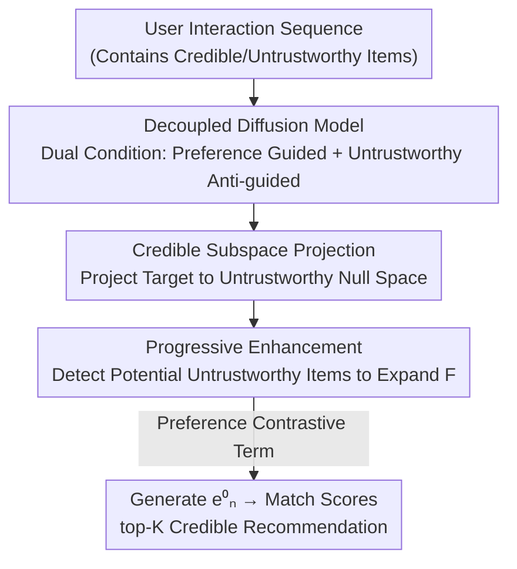

# Steering Diffusion Models Towards Credible Content Recommendation

**Conference**: ICLR 2026  
**OpenReview**: [https://openreview.net/forum?id=gcT2BCGcZJ](https://openreview.net/forum?id=gcT2BCGcZJ)  
**Code**: None  
**Area**: Recommender Systems / Diffusion Models / Credible Content Recommendation  
**Keywords**: Diffusion Recommendation, Content Credibility, Information Disentanglement, Null Space Projection, Sequential Recommendation

## TL;DR
Addressing the issue of diffusion models recommending untrustworthy content like fake news or misinformation, this paper proposes Disco: a "decoupled diffusion model" that separates user preference signals from untrustworthy signals. It suppresses untrustworthy content by projecting the diffusion target into the null space of untrustworthy features and progressively detects potential untrustworthy items to complete this null space under label scarcity, achieving higher recommendation accuracy and credibility across three real-world datasets.

## Background & Motivation

**Background**: Diffusion Models (DM), with their strong capability to model complex distributions, have been widely used in sequential recommendation. The mainstream paradigm is "noise addition - denoising": a Transformer/GRU encodes the first $n-1$ items of a user's history into a preference condition $c$, treating the $n$-th target item's embedding as the diffusion target. It performs forward diffusion and conditional reverse denoising to generate an item embedding reflecting user preferences, then performs top-K recommendation via matching scores.

**Limitations of Prior Work**: This paradigm focuses solely on recommendation accuracy, completely ignoring the **credibility** of the recommended content. In scenarios like news recommendation, DMs may propagate fake news or medical misinformation based on user history—a real-world lesson learned from news systems amplifying "fake cures" or conspiracy theories during the pandemic. Recommending untrustworthy content not only harms user experience but also causes significant social harm.

**Key Challenge**: The authors identify two root causes through theoretical and empirical analysis: (1) **Untrustworthy conditions**: User histories contain untrustworthy items, polluting the preference representation used as a generation condition; (2) **Untrustworthy diffusion targets**: The target item itself is untrustworthy. Simply deleting all untrustworthy items is infeasible: these items still hide the user’s true interests (e.g., reading fake sports news implies an interest in sports), and full deletion severely drops accuracy. Thus, the first challenge is **mitigating the impact of untrustworthy content without sacrificing accuracy**.

**Goal + Key Insight**: An alternative path is to strip the "untrustworthy" part of an item while retaining the preference part. However, this requires extensive credibility labels for supervision, which are scarce in reality. Thus, the second challenge is **handling both known and unknown untrustworthy content under label scarcity**. The authors' insight: instead of using an external disentanglement network (high computational overhead), use the diffusion model itself as a disentangler. By redesigning the diffusion objective function, the DM can naturally separate these two signals during training.

**Core Idea**: Use a dual-channel diffusion objective that "encourages preference signal guidance and suppresses untrustworthy signal guidance" to achieve disentanglement. Add a null space projection to squeeze out untrustworthy components from target items and use progressive detection to complete the null space with unlabeled data.

## Method

### Overall Architecture

Disco aims to achieve recommendation that is both "accurate and credible." It modifies the standard DM paradigm in three ways: replacing the single condition with **dual conditions** (preference/untrustworthy), adding a **null space projection** to the diffusion target, and using **progressive enhancement** to complete the untrustworthy feature library when labels are scarce. Finally, a preference contrastive term is added to maintain accuracy.

The data flow is: each item embedding in the interaction sequence is split by two content learners into a preference vector $e^{pre}$ and an untrustworthy vector $e^{unc}$. These are aggregated into a preference condition $c^{pre}$ and an untrustworthy condition $c^{unc}$. The decoupled diffusion model uses the former to guide and the latter to "anti-guide" the denoising process. Simultaneously, the target item embedding is projected into the null space of the untrustworthy feature matrix to obtain a "credible diffusion target." This matrix is expanded via progressive detection of potential untrustworthy items. During training, a preference contrastive term is introduced to model negative preferences. At inference, only $c^{pre}$ guides generation, ensuring the output remains untrustworthy-free even if the user history contains such items.

### Key Designs

**1. Decoupled Diffusion Model: Separating Preference and Untrustworthy Signals via the Objective Function**

This targets the "polluted generation condition" problem without deleting items. Disco uses two MLP content learners to extract $e^{pre}=\mathrm{MLP}_{pre}(e)$ and $e^{unc}=\mathrm{MLP}_{unc}(e)$ from each item embedding. Conditions are constructed: $c^{pre}$ (using Transformer for temporal dependencies) and $c^{unc}$ (using mean pooling, as credibility lacks temporal dependency). The core is the rewritten diffusion objective: **minimize** the variational lower bound for $c^{pre}$ and **maximize** it for $c^{unc}$:

$$\theta^* = \arg\min_\theta \; \mathbb{E}_q\!\left[-\log\tfrac{p_\theta(e_n^{0:T}\mid c^{pre})}{q(e_n^{1:T}\mid e_n^0)}\right] - \mathbb{E}_q\!\left[-\log\tfrac{p_\theta(e_n^{0:T}\mid c^{unc})}{q(e_n^{1:T}\mid e_n^0)}\right].$$

This encourages the model to "follow preferences" and penalizes "following untrustworthy signals." A key detail: the target must be the original $e_n$, not $e_n^{pre}$ or $e_n^{unc}$—otherwise, the condition and target fall into the same space, losing the disentanglement direction. The authors use a cosine loss $S(\cdot,\cdot)=(1-\cos(\cdot,\cdot))^2$ instead of MSE for numerical stability while maintaining optimization directions.

**2. Credible Subspace Projection (CSP): Squeezing Untrustworthy Components into Null Space**

Decoupling solves the condition side, but the last item (diffusion target) itself might be untrustworthy. This design projects the target into the null space of untrustworthy features. Specifically, $e^{unc}$ of known untrustworthy items are stacked into matrix $F\in\mathbb{R}^{|I_{unc}|\times d}$. SVD on $F^\top$ yields $\{U,\Lambda,V\}$. Columns of $U$ are orthogonal bases. By removing the submatrix $U_1$ corresponding to high singular values and retaining $U_2$ (containing minimal untrustworthy info), the target is projected onto the null space spanned by $U_2$:

$$\tilde{e}_n = e_n U_2 U_2^\top.$$

To avoid losing useful information, a residual average is used: $\tilde{e}_n = (\tilde{e}_n + e_n)/2$. This "credible diffusion target" replaces the original in the loss function.

**3. Progressive Enhancement (PERS): Mining Potential Untrustworthy Items under Label Scarcity**

CSP relies on the untrustworthy set $I_{unc}$, which is often incomplete. PERS utilizes the fact that untrustworthy content often shares features (e.g., sensationalist titles) to detect unlabeled items:

$$\mathrm{UD}(i) = \frac{1}{|I_{unc}|}\sum_{i'\in I_{unc}} \cos(e_i^{unc}, e_{i'}^{unc}).$$

Since model estimates are inaccurate early in training, the selection ratio increases linearly from 0 to a maximum $\gamma$ over $m$ iterations: $\mathrm{ratio}(j)=\min(\gamma,\frac{j}{m}\gamma)$. This curriculum strategy ensures the null space becomes more complete as the model improves.

**4. Preference Contrastive (PC): Recovering Accuracy Pushed by Credibility Constraints**

The final loss adds a "preference contrastive term" to pull the generated results closer to positive targets and further from sampled negative items $e_{neg}$:

$$L_{Disco} = \underbrace{S(\tilde{e}_n^0, f_\theta(\tilde{e}_n^t, c^{pre},t)) - S(\tilde{e}_n^0, f_\theta(\tilde{e}_n^t, c^{unc},t))}_{\text{Content Disentanglement}} + w\underbrace{\big(S(\tilde{e}_n^0, f_\theta(\tilde{e}_n^t, c^{pre},t)) - S(e_{neg}^0, f_\theta(e_{neg}^t, c^{pre},t))\big)}_{\text{Preference Contrast}},$$

where $w$ controls the weight. PC is a direct reason why Disco outperforms other DM methods in terms of accuracy.

### Loss & Training

The objective $L_{Disco}$ is optimized using AdamW. Inference follows the standard DDPM formulation with DDIM acceleration, using **only** $c^{pre}$ to guide generation from Gaussian noise. Top-K items are selected via $\hat{y}_i = e_n^0\cdot e_i^\top$. Key hyperparameters: $w\in\{0.5, \dots, 5\}$, $\gamma\in\{0.1, \dots, 0.5\}$, $m=10000$. Experiments assume only 20% labeling to simulate real-world scarcity.

## Key Experimental Results

### Main Results

Evaluated on PolitiFact, GossipCop, and MHMisinfo. Metrics include HR@K, NDCG@K, CR@K (Credibility Rate), and HC@K (Hybrid of HR and CR). Disco achieved SOTA across all datasets and metrics.

| Dataset | Metric | Disco | Next Best | Method |
|--------|------|-------|------|----------|
| PolitiFact | HR@5 | **0.2678** | 0.2606 | DiffuRec |
| PolitiFact | CR@5 | **0.9823** | 0.9335 | PRISM |
| PolitiFact | HC@5 | **0.3466** | 0.3334 | DiffuRec |
| GossipCop | HR@5 | **0.5236** | 0.4969 | PreferDiff |
| GossipCop | CR@5 | **0.9277** | 0.8986 | HDInt |
| GossipCop | HC@5 | **0.4918** | 0.4523 | PreferDiff |
| MHMisinfo | HR@5 | **0.2215** | 0.1974 | PreferDiff |
| MHMisinfo | CR@5 | **0.9305** | 0.9002 | DreamRec |
| MHMisinfo | HC@5 | **0.3000** | 0.2713 | PreferDiff |

Observations: DM methods (DiffuRec/PreferDiff) are strong in accuracy but low in CR. Credible recommendation methods (Rec4Mit/PRISM) fail under label scarcity (20%). Disco wins on both ends.

### Ablation Study

PolitiFact / GossipCop / MHMisinfo HC@5 results:

| Config | PolitiFact HC@5 | GossipCop HC@5 | MHMisinfo HC@5 | Note |
|------|-----------------|----------------|----------------|------|
| Disco (Full) | 0.3455 | 0.4918 | 0.3000 | Full model |
| w/o Dis | 0.3033 | 0.4783 | 0.2650 | Most significant drop |
| w/o CSP | 0.3331 | 0.4860 | 0.2942 | Credible Subspace Projection |
| w/o PERS | 0.3393 | 0.4876 | 0.2877 | Progressive Enhancement |
| w/o PC | 0.3413 | 0.4651 | — | Preference Contrastive |

### Key Findings

- **Disentanglement (Dis) is fundamental**: Removing it causes massive drops in both accuracy and CR, proving the dual-channel objective is the foundation.
- **Preference Contrast (PC) manages accuracy**: Significant drop on GossipCop without PC validates its role in accuracy recovery.
- **CSP and PERS are complementary**: CSP handles "target credibility," while PERS completes the feature library under scarcity.
- Diffusion targets cannot be replaced by $e_n^{pre}/e_n^{unc}$: Performance deteriorates if conditions and targets share the same space.

## Highlights & Insights

- **Objective Function as Disentangler**: Using "min preference ELBO, max untrustworthy ELBO" to separate information without external modules is elegant and efficient.
- **Null Space Projection with Residuals**: SVD removes untrustworthy-heavy bases, and the residual connection prevents useful information from being projected away.
- **Curriculum Selection Ratio**: Linear ramping of the inclusion of pseudo-labels mitigates noise from early-stage model inaccuracy.
- Cosine loss instead of MSE is a critical engineering detail helping training stability.

## Limitations & Future Work

- Task is simplified to "reducing untrustworthy exposure," and testing assumes full labels for evaluation—not always true in deployment.
- Limited datasets (three), with two from the same FakeNewsNet repository. MHMisinfo lacks video metadata, relying on text descriptions.
- The assumption that "untrustworthy content shares features" might fail against sophisticated misinformation.
- The method is tied to sequential recommendation; adaptation to non-sequential/graph scenarios is not discussed.

## Related Work & Insights

- **vs DreamRec / DiffuRec / PreferDiff**: These use single-channel diffusion focused only on accuracy. Disco's dual-channel disentanglement allows it to excel in CR where they cannot.
- **vs Rec4Mit / HDInt / PRISM**: These assume full labels and fail when labels are scarce. Disco’s progressive enhancement is specifically designed for the "partial label" scenario, which is its core practical advantage.

## Rating
- Novelty: ⭐⭐⭐⭐⭐ First DM for credible recommendation under label scarcity; combination of disentangled objectives and null space projection is novel.
- Experimental Thoroughness: ⭐⭐⭐⭐ Three datasets, four baseline types, six ablation variants; some cross-source dataset diversity is lacking.
- Writing Quality: ⭐⭐⭐⭐ Clear motivation-challenge-method chain and complete derivations.
- Value: ⭐⭐⭐⭐⭐ Directly addresses social harm (misinformation) with a win-win approach for accuracy and credibility.<!-- RELATED:START -->

## Related Papers

- [\[ICLR 2026\] Discrete Diffusion for Bundle Construction](discrete_diffusion_for_bundle_construction.md)
- [\[ICLR 2026\] iFusion: Integrating Dynamic Interest Streams via Diffusion Model for Click-Through Rate Prediction](ifusion_integrating_dynamic_interest_streams_via_diffusion_model_for_click-throu.md)
- [\[ICLR 2026\] Adaptive Regularization for Large-Scale Sparse Feature Embedding Models](adaptive_regularization_for_large-scale_sparse_feature_embedding_models.md)
- [\[ICLR 2026\] RPM: Reasoning-Level Personalization for Black-Box Large Language Models](rpm_reasoning-level_personalization_for_black-box_large_language_models.md)
- [\[ICLR 2026\] CollectiveKV: Decoupling and Sharing Collaborative Information in Sequential Recommendation](collectivekv_decoupling_and_sharing_collaborative_information_in_sequential_reco.md)

<!-- RELATED:END -->
