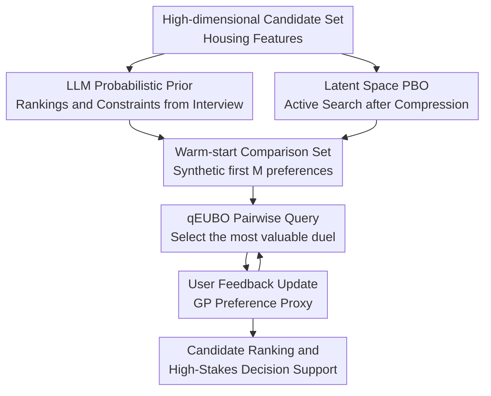

# Supporting High-Stakes Decision Making Through Interactive Preference Elicitation in the Latent Space

**Conference**: ICLR 2026  
**OpenReview**: [https://openreview.net/forum?id=ra7CSHcVCv](https://openreview.net/forum?id=ra7CSHcVCv)  
**Code**: Not provided  
**Area**: Recommender Systems / Interactive Preference Elicitation / Decision Support  
**Keywords**: Preference Elicitation, Decision Support, Preferential Bayesian Optimization, Latent Space Optimization, LLM Priors  

## TL;DR
This paper addresses high-stakes, low-frequency, and sparse-feedback decision-making scenarios such as apartment hunting. It combines LLM preference priors obtained from user interviews, Autoencoder latent space compression, and Preferential Bayesian Optimization (PBO). By learning user utility functions with fewer pairwise comparisons, it achieves higher ranking accuracy on real housing data compared to vanilla PBO.

## Background & Motivation
**Background**: In high-frequency scenarios like e-commerce, music, and short videos, recommender systems typically rely on large volumes of clicks, dwell time, ratings, or purchase behaviors to estimate user preferences. Users engage in continuous trial-and-error, and systems learn collaborative patterns through massive interactions. Thus, traditional collaborative filtering, sequential recommendation, and bandit methods are highly applicable.

**Limitations of Prior Work**: High-stakes decisions such as renting an apartment, buying a car, selecting financial products, or job hunting do not follow this pattern. Users typically compare only a small number of candidates seriously. Once a decision is made, no feedback is provided to the system for a long time. Furthermore, each candidate is determined by continuous and heterogeneous features such as price, area, commute, noise, floor, and community quality, making it difficult for users to define their preferences as an explicit scoring function.

**Key Challenge**: These tasks simultaneously require "asking fewer questions" and "learning complex preferences." Conventional recommendation methods lack sufficient historical data, while asking users to fill out weights directly is overly rigid. While standard Preferential Bayesian Optimization (PBO) is suited for learning black-box preferences through pairwise comparisons, it is prone to the curse of dimensionality in high-dimensional continuous feature spaces and often wastes precious query iterations due to inaccurate cold-start priors.

**Goal**: The authors aim to construct a real-time interactive preference elicitation system. It first extracts acceptable constraints and preference rankings through natural language interviews using an LLM, then actively selects the most informative candidate pairs for comparison within a low-dimensional latent space of housing features. Finally, it derives a user utility proxy model that can rank both existing and future housing options.

**Key Insight**: The paper observes that while candidates in high-stakes decisions have high-dimensional raw features, many of these features are strongly correlated (e.g., area, room count, price, and building quality are not independent). By first using an Autoencoder to learn a low-dimensional representation that preserves the primary structure and then performing PBO in this latent space, the optimization problem becomes smaller and more stable. Additionally, LLMs are more proficient at extracting relative importance and constraints from dialogue rather than reliably generating precise numerical weights, making LLMs an ideal source for warm-start priors.

**Core Idea**: Use LLM interviews to generate probabilistic preference priors, employ an Autoencoder to compress high-dimensional candidates into a low-dimensional latent space, and utilize PBO to actively select pairwise comparisons, thereby efficiently learning user utility functions under sparse interaction.

## Method

### Overall Architecture
The system input consists of a set of recommendable candidates $I=\{x_1,\ldots,x_{|I|}\}$, high-dimensional features for each candidate $x\in X\subset\mathbb{R}^d$, and a user who can only express preferences through pairwise comparisons. The output is not a single recommendation result but a user utility proxy $\hat{u}$ capable of ranking candidates and updating when new candidates appear.

The overall workflow consists of three stages: first, training an Autoencoder to obtain an encoder $g_\theta:X\to Z$ and a decoder $h_\theta:Z\to X$; second, conducting an LLM interview to obtain feature importance rankings and acceptable bounds, converting this into warm-start comparison data; and finally, running PBO in the latent space, selecting one pair of candidates per round for user comparison to update the GP preference model.

### Key Designs
**1. Latent Space PBO: Compressing High-dimensional Preference Search into an Interactive Low-dimensional Space**

Standard PBO selects two candidates $(x,x')$ directly from the raw feature space for comparison. The problem is that housing features include continuous values, geographic distances, building attributes, and facility features. As dimensionality increases, the acquisition function must find the most valuable duel in $X^2$, creating a vast search space where the model may prematurely commit to a local region with sparse feedback.

This paper first trains an Autoencoder on the candidate set $I$, using the encoder $g_\theta$ to map raw features to low-dimensional latent variables $z=g_\theta(x)$, and then learns the latent utility $\hat{u}:Z\to\mathbb{R}$. User preferences for raw candidates are modeled as comparisons in the latent space: if $\hat{u}(g_\theta(x))\ge \hat{u}(g_\theta(x'))$, the model considers $x$ superior to $x'$. The key is not to make the housing "abstract" but to allow PBO to perform active exploration on a low-dimensional manifold that preserves the primary structure, reducing interference from non-essential dimensions during query selection.

**2. LLM Probabilistic Prior: Letting Natural Language Interviews Do What They Do Best**

Cold start is the most expensive phase in interactive preference elicitation because incorrect early questions waste the user's budget. The paper employs an LLM as a domain interviewer to collect acceptable bounds (e.g., minimum area, minimum rooms, maximum rent, maximum distance to city center) and requires the LLM to output a strict importance ranking of all features.

The authors do not rely on the LLM's direct weight estimates, which are often overconfident and translate ambiguous linguistic preferences into incorrect numerical values. Instead, they use the LLM-generated ranking $\pi$ to define the shape of a probability distribution, sampling weights in conjunction with the empirical variance $s_i^2$ from the data:

$$
w_i \sim \mathcal{N}\left(0, \frac{s_i^2}{\max_j s_j^2}\cdot \frac{1}{r_i}\right),
$$

where a smaller $r_i$ indicates higher importance. After sampling, weights are constrained to $w\in[-1,1]^d$ and $\|w\|_1=1$. This design aligns "LLM's strength in relative importance comparison" with "the Bayesian model's need for uncertainty": the prior is not a rigid point estimate but a set of stochastic warm-start preferences.

**3. Warm-start Comparison Set: Filling Early Gaps with Synthetic Preferences**

After obtaining the weights $w$, the system defines a linear utility $u_{lin}(x)=w^\top x$ and randomly samples $M$ pairs of houses, using this linear utility to automatically determine the winner in each pair. Each synthetic feedback $(x_k,x'_k,y_k)$ is then encoded into latent space observations $(g_\theta(x_k),g_\theta(x'_k),y_k)$ to form the warm-start dataset $D$.

This step ensures that before the real user experiences comparison fatigue, the model already has a general direction. It does not assume the linear utility is the ground truth but treats it as a "better-than-blank starting point." As real feedback arrives, the GP preference model corrects this prior; thus, the conservatism of the probabilistic LLM prior is more critical than a direct weight prior.

**4. qEUBO Pairwise Query: Asking Questions that Improve Final Ranking Quality**

During the interaction phase, the model treats user choices $x\succ x'$ as evidence of latent utility differences, modeled via a probit likelihood:

$$
Pr(x \succ x') = \Phi\left(\frac{\hat{u}(z)-\hat{u}(z')}{\sigma}\right),
$$

where $\sigma$ accounts for both user preference inconsistency and AE reconstruction error. Since the probit likelihood is non-conjugate with the GP prior, Laplace approximation is used for posterior updates.

Query selection utilizes qEUBO (expected utility of the best option). Intuitively, the system does not just look for uncertain pairs but for pairs that "are most likely to help discover high-utility candidates after comparison":

$$
qEUBO_k(z,z')=\mathbb{E}_k[\max\{\hat{u}(z),\hat{u}(z')\}].
$$

The optimized latent points $(z_k,z'_k)$ are passed through the decoder to recover candidates for display to the user for a binary choice. If the candidate set expands in the future, the paper provides a continual AE improvement scheme: after training a new AE, historical feedback is decoded to the original space and then re-embedded using the new encoder.

## Key Experimental Results

### Main Results
The paper primarily evaluates the system on Madrid housing data from Idealista18. The dataset contain 94,815 listings, from which 12 attributes were selected (e.g., price, area, rooms, distance to center, cadastral quality). A Munich rental dataset (~1,500 listings) was used for cross-validation.

User feedback was simulated in two ways: one using LLM-simulated personas (e.g., family, student, professional) and another using statistical linear utility profiles combined with Bradley-Terry noise. Each evaluation used $M=5$ warm-start comparisons and $N=25$ real query budgets on a test set of 50 random houses.

| Method | Simulated User | Prior | Pairwise Acc. | NDCG@10 | Runtime/iter |
|------|----------|------|---------------|---------|--------------|
| PBO | LLM | Static | 0.539 ± 0.014 | 0.622 ± 0.026 | 518 ± 10 ms |
| PBO | Statistical | Static | 0.510 ± 0.017 | 0.658 ± 0.037 | 304 ± 12 ms |
| PBO + AE | LLM | Prob. Elicit | 0.613 ± 0.024 | 0.706 ± 0.034 | 876 ± 216 ms |
| PBO + AE | LLM | Static | 0.605 ± 0.024 | 0.685 ± 0.033 | 723 ± 99 ms |
| PBO + AE | Statistical | Static | 0.556 ± 0.025 | 0.584 ± 0.037 | 465 ± 84 ms |

Under LLM user simulation, the proposed PBO+AE+Probabilistic LLM prior achieved a final Pairwise Accuracy of 0.613 and an NDCG@10 of 0.706, improving roughly 13.7% and 13.5% over vanilla PBO, respectively. The computational trade-off is an additional ~358 ms per iteration, which remains acceptable for interactive applications. Diversity metrics showed that PBO+AE did not significantly collapse the decoder output into a few similar candidates.

### Ablation Study
The most critical ablation focused on the prior generation method. Three PBO+AE initializations were compared: fixed static prior, LLM direct weight point estimation, and LLM ranking-driven probabilistic prior. The results showed that direct weight estimation performed the worst, while the probabilistic prior was the best, confirming that LLMs are better at providing relative rankings and constraints rather than precise utility weights.

| Configuration | Pairwise Acc. | NDCG@10 | Notes |
|------|---------------|---------|------|
| PBO + AE + Direct Elicit | 0.488 ± 0.024 | 0.573 ± 0.036 | Weights are overconfident; significant early performance drop |
| PBO + AE + Prob. Elicit | 0.613 ± 0.024 | 0.706 ± 0.034 | Most stable; highest final accuracy and ranking quality |
| PBO + AE + Static | 0.605 ± 0.024 | 0.685 ± 0.033 | Strong, but likely due to profile overlap with most personas |
| Munich: PBO + AE + Prob. Elicit | 0.569 ± 0.037 | 0.651 ± 0.038 | Trends hold on smaller city datasets |
| Open-source LLM: PBO + AE + Prob. Elicit | 0.573 ± 0.026 | 0.615 ± 0.037 | Performance drops with gpt-oss-120b but still beats vanilla PBO |

### Key Findings
- The AE latent space effectively mitigates sample efficiency issues in high-dimensional PBO. Vanilla PBO showed performance dips in statistical simulations, likely due to local overfitting and premature exploitation in high-dimensional space.
- The value of the LLM prior lies not in "providing correct weights" but in translating interview constraints and relative importance into an uncertainty-friendly initialization. Direct Elicit was significantly weaker than Prob. Elicit.
- Trends were consistent across datasets of different sizes, though pairwise accuracy was slightly lower on the smaller Munich dataset, indicating that data scale and feature quality still impact performance.
- Warm-starting is superior to cold-starting. PBO+AE without the LLM prior plateaued quickly and ultimately underperformed the proposed method.

## Highlights & Insights
- The division of labor is logical: LLM is used for the "interview and prior" phase (language understanding and relative preference extraction), while Bayesian Optimization handles posterior updates and active queries.
- Using an AE latent space to support PBO is highly suitable for continuous multi-attribute recommendation tasks. It is not just for visualization but for shrinking the search space of the acquisition function.
- The superiority of probabilistic priors over direct weights suggests that in "LLM + Decision Systems," one should not treat language model outputs as deterministic facts. Modeling them as distributions is inherently safer.
- While houses are the case study, the pattern is transferable to car purchasing, career selection, insurance planning, and medical screening—any scenario where features are numerous, feedback is expensive, and preferences are not easily articulated.

## Limitations & Future Work
- Users in the experiments were simulated via LLM personas and statistical profiles, which do not fully represent human behavior (e.g., hesitation, influence by presentation, or changing minds).
- Potential for bias in housing features. Safety scores, noise levels, and neighborhood characteristics may serve as proxies for socio-economic structures, potentially amplifying residential segregation if optimized directly.
- AE reconstruction error is approximated as constant noise $\sigma$, which may vary across different regions of the feature space. Heteroscedastic preference noise could be a future improvement.
- The system currently handles single-user preferences. Group decision-making involves conflict negotiation, fairness in weighting, and veto constraints.
- Real-user studies are needed to confirm the generalization of the LLM prior beyond the personas and default priors used in simulation.

## Related Work & Insights
- **vs. Traditional RS**: While traditional systems rely on massive interaction history, this work addresses low-frequency decisions where history is absent. It excels at online learning with few comparisons but has a heavier per-iteration computational cost.
- **vs. Conversational Preference Elicitation**: Purely conversational methods are suited for discrete preference spaces. This work uses LLM for the preamble but switches to PBO for active selection, making it better for continuous multi-feature candidates.
- **vs. High-dimensional PBO**: Unlike methods using random projections or subspace search, this paper uses an AE to learn non-linear low-dimensional representations for qEUBO optimization.
- **vs. LLM-based Decision Support**: Instead of letting LLMs construct utility functions directly, this work highlights that uncertainty modeling and real feedback updates remain crucial when users cannot clearly state their preferences.

## Rating
- Novelty: ⭐⭐⭐⭐☆ The combination of LLM priors, AE latent space, and PBO is natural yet comprehensive. The probabilistic prior design is particularly insightful.
- Experimental Thoroughness: ⭐⭐⭐⭐☆ Includes two city datasets, two types of user simulations, and various prior ablations, though real-user trials are absent.
- Writing Quality: ⭐⭐⭐⭐☆ Problem definitions and algorithm flows are clear, with appendix derivations for latent space likelihood approximations.
- Value: ⭐⭐⭐⭐☆ A highly valuable reference for high-stakes recommendation scenarios, serving as a strong baseline or prototype for interactive decision support systems.

<!-- RELATED:START -->

## Related Papers

- [\[ACL 2026\] Decisive: Guiding User Decisions with Optimal Preference Elicitation from Unstructured Documents](../../ACL2026/recommender/decisive_guiding_user_decisions_with_optimal_preference_elicitation_from_unstruc.md)
- [\[AAAI 2026\] Evaluating LLMs for Police Decision-Making: A Framework Based on Police Action Scenarios](../../AAAI2026/recommender/evaluating_llms_for_police_decision-making_a_framework_based_on_police_action_sc.md)
- [\[ICML 2025\] Adaptive Elicitation of Latent Information Using Natural Language](../../ICML2025/recommender/adaptive_elicitation_of_latent_information_using_natural_language.md)
- [\[ICLR 2026\] Reinforced Latent Reasoning for LLM-based Recommendation](reinforced_latent_reasoning_for_llm-based_recommendation.md)
- [\[ICLR 2026\] In Agents We Trust, but Who Do Agents Trust? Latent Source Preferences Steer LLM Generations](in_agents_we_trust_but_who_do_agents_trust_latent_source_preferences_steer_llm_g.md)

<!-- RELATED:END -->
