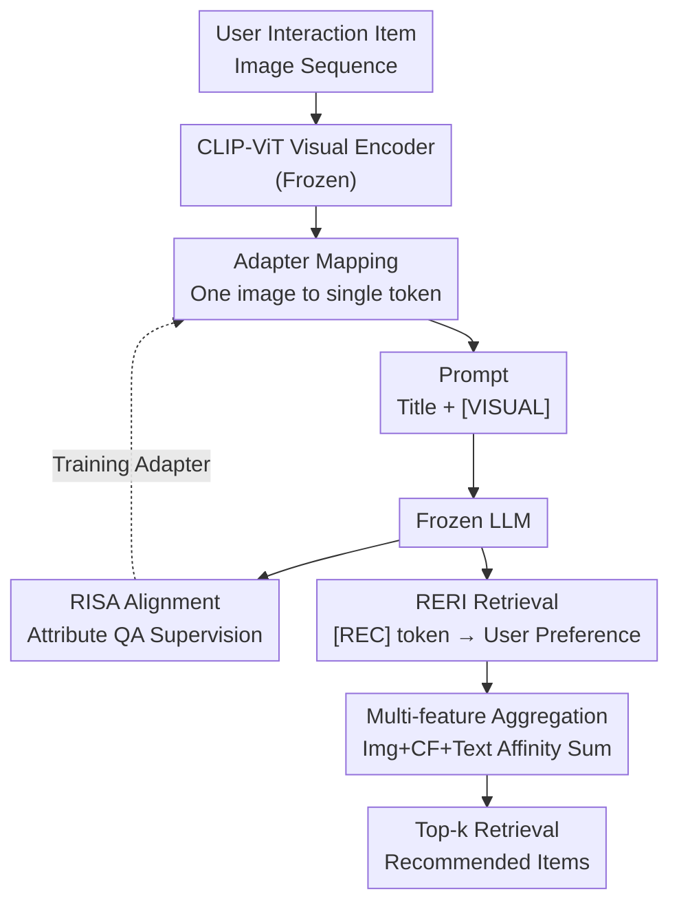

# Token-Efficient Item Representation via Images for LLM Recommender Systems

**Conference**: ICLR 2026  
**arXiv**: [2503.06238](https://arxiv.org/abs/2503.06238)  
**Code**: [https://github.com/rlqja1107/torch-I-LLMRec](https://github.com/rlqja1107/torch-I-LLMRec)  
**Area**: LLM NLP / Recommender Systems  
**Keywords**: LLM Recommender Systems, Image Representation, Token Efficiency, Multimodal Alignment, Retrieval-based Recommendation

## TL;DR
The authors propose I-LLMRec, which utilizes item images instead of lengthy text descriptions to represent item semantics in recommendation systems. Through the RISA alignment module and RERI retrieval module, the framework represents an item with only a single token while preserving rich semantics. It achieves an approximate 2.93x inference speedup and outperforms text-description-based methods in recommendation performance.

## Background & Motivation

**Background**: LLM-based recommendation systems require converting item interaction histories into natural language inputs. Existing methods fall into two categories: Attribute-Based (e.g., brand + category, concise but with limited semantics) and Description-Based (e.g., full product descriptions, semantically rich but with massive token overhead).

**Limitations of Prior Work**: A **fundamental trade-off between efficiency and effectiveness** exists. Attribute-based methods use fewer tokens but lose fine-grained semantics, leading to a performance drop of over 13%. Description-based methods provide rich semantics but use a high volume of tokens (averaging 160 tokens/item), increasing LLM inference time by over 2.5x, with complexity growing quadratically with the user interaction sequence length.

**Key Challenge**: As long as items are represented by natural language, the contradiction of "richer semantic representation → longer inputs → lower efficiency" is unavoidable.

**Goal**: How to drastically reduce token consumption while retaining rich item semantics?

**Key Insight**: By measuring via the CLIP model, the authors discovered **significant information overlap between product images and text descriptions** in e-commerce datasets (similarity is approx. 0.31 for Amazon Sport/Art, higher than the 0.26 for carefully annotated pairs in the COCO dataset). This suggests that images can carry most of a description's semantics using very few tokens.

**Core Idea**: Use a single image token to replace lengthy text descriptions for representing recommended items, bridging the gap between visual and linguistic spaces via a specialized recommendation-oriented alignment strategy.

## Method

### Overall Architecture
I-LLMRec resolves the dilemma between "rich item semantics" and "minimal input tokens." The input consists of an image sequence of items the user has interacted with, while the output is the next item to recommend. It completely detaches items from text descriptions: each item's image is processed by a frozen CLIP-ViT visual encoder to obtain features, which are then compressed into a single token by a learnable **adapter** and inserted into the prompt. This sequence is fed into a parameter-frozen LLM. Since visual features do not naturally reside in the language space, the **RISA** module uses recommendation-related attribute QA to train the adapter, enabling it to encode preference vectors that the LLM can interpret. Finally, instead of LLM title generation, the **RERI** module reformulates recommendation as a retrieval task: the LLM outputs a `[REC]` token at the end to represent user preference, calculating affinity scores with item visual features in a shared space to retrieve Top-k items. This retrieval framework also allows for plug-and-play **multi-feature aggregation** of non-image features (CF, text) before ranking. Only the adapter and several projectors are trained; the LLM remains frozen.

### Key Designs

**1. Image-to-LLM Mapping: Compressing one product image into one token**

The slowness of description-based methods stems from an average of 160 tokens per item. This approach bypasses text: for each item $i$ in user interactions, features $v_i = V(\mathbf{I}_i) \in \mathbb{R}^{d_v}$ are extracted via a frozen CLIP encoder, then mapped to the LLM's word embedding dimension via a learnable adapter network $M: \mathbb{R}^{d_v} \rightarrow \mathbb{R}^d$. The item enters the LLM via a prompt like `Title: ITEM_TITLE, Visual Representation: [VISUAL]`, where the `[VISUAL]` placeholder is replaced by the adapted visual feature. This reduces item representation from 160 tokens to 1, significantly shrinking sequence modeling complexity from the quadratic growth of $O((|f(\mathbf{D}_i)||\mathcal{S}_u|)^2 d)$. Approx. 10 tokens for the title are retained as basic textual anchors to prevent losing literal identity.

**2. Recommendation-oriented Image-to-LLM Semantic Alignment (RISA): Helping the LLM "see" preference signals**

Single-token mapping solves efficiency, but general vision-language alignment (e.g., UniMP's pre-trained alignment) is unaware of recommendation-specific priorities. RISA trains the adapter using the recommendation task itself: by constructing "Input-Target" data where the input is a prompt with image features plus a question about the next item's attributes (e.g., "What brand might the user consume next?"), and the target is the correct answer. Attributes include brand, category, title, and description, with 5 templates per type (20 total), randomly sampled during training for diversity. The objective is for the LLM to autoregressively generate the correct answer given visual inputs:

$$\mathcal{L}_{\text{RISA}} = \max_M \sum_{k=1}^{|y|} \log(P_{\theta,M}(y_k|x, y_{<k}))$$

Since only the adapter $M$ is updated while the LLM remains frozen, this forces the adapter to encode images into linguistic space vectors capable of "answering recommendation questions." Ablation shows this is the core performance driver—removing RISA drops Sport Hit@5 from 0.432 to 0.395.

**3. Retrieval-based Recommendation via Image features (RERI): Converting "Generation" to "Retrieval"**

Direct title generation by an LLM cannot guarantee the item exists in the pool, and extending the vocabulary for item tokens does not scale. RERI uses retrieval: an instruction prompt guides the LLM to generate a `[REC]` token, using its last-layer hidden state $h(\text{[REC]})$ as the user preference representation. Projectors then map the user representation and item visual features into a shared space. The affinity score

$$r_{u,i}^{\text{Img}} = o_u^{\text{Img}} \circledast o_i^{\text{Img}}$$

measures preference and is trained using binary cross-entropy loss. Recommendations are naturally restricted to the actual item pool, and retrieval complexity does not explode with the number of items.

**4. Multi-feature Type Extension: Combining ID and Text with Images**

Image features are not exhaustive—they excel for cold-start items, but Collaborative Filtering (CF) signals are often stronger for popular items, and text provides extra semantics. RERI supports this extension: for each feature type, a pair of independent projectors $(F_u^*, F_i^*)$ calculates an affinity score. At inference, scores are summed for Top-k retrieval:

$$rec_u^k = \text{Top-k}(r_{u,i}^{\text{Img}} + r_{u,i}^{\text{CF}} + r_{u,i}^{\text{Text}})$$

CF features originate from SASRec ID embeddings, and text features from descriptions. This plug-and-play stacking allows modalities to complement each other.

### Loss & Training
Total training objective: $\mathcal{L}_{final} = \mathcal{L}_{\text{RISA}} + \mathcal{L}_{\text{RERI}}^{\text{Img}} + \mathcal{L}_{\text{RERI}}^{\text{CF}} + \mathcal{L}_{\text{RERI}}^{\text{Text}}$

All loss weights are fixed at 1. LLM parameters are frozen; only the adapter $M$ and six projectors are trained. Inference sums affinity scores from all three feature types.

## Key Experimental Results

### Main Results
Comparison of CF and LLM models on four Amazon datasets (Sports, Grocery, Art, Phone):

| Method | Type | Sport Hit@5 | Sport NDCG@5 | Art Hit@5 | Phone Hit@5 |
|------|------|-------------|--------------|-----------|-------------|
| SASRec | CF | 0.3841 | 0.3129 | 0.5374 | 0.4366 |
| TALLRec | Attribute LLM | 0.3801 | 0.2938 | 0.5663 | 0.4986 |
| A-LLMRec | CF+LLM | 0.4070 | 0.3352 | 0.5681 | 0.4502 |
| TRSR | Description LLM | 0.4302 | 0.3375 | 0.5841 | 0.5148 |
| UniMP | Image LLM | 0.4030 | 0.3364 | 0.5315 | 0.4427 |
| **I-LLMRec** | **Image LLM** | **0.4570** | **0.3711** | **0.5883** | **0.5156** |

I-LLMRec outperforms TRSR (description-based) across nearly all datasets and metrics while maintaining a 2.93x faster inference speed.

### Ablation Study

| Configuration | Sport Hit@5 | Sport NDCG@5 | Description |
|------|-------------|--------------|------|
| RERI (Img only) | 0.3953 | 0.3043 | Retrieval only, no alignment |
| +RISA | 0.4316 | 0.3403 | 9.2% gain with alignment |
| RISA+RERI (Img+CF) | 0.4491 | 0.3630 | Further gain via multi-feature |
| Full model (Img+CF+Text) | 0.4570 | 0.3711 | Complete three-feature model |

### Key Findings
- **RISA module is a core contribution**: Removing RISA drops Hit@5 from 0.432 to 0.395, proving recommendation-specific alignment is vital.
- **Image + Description is not significantly better than Image alone** (I-LLMRec+D ≈ I-LLMRec), confirming high information overlap.
- **Cold/Hot item complementarity**: Image features perform better on cold-start items, while CF is stronger for popular items; they are complementary.
- **Context window robustness**: When the window shrinks to 256 tokens, TRSR performance collapses, while I-LLMRec remains unaffected.
- **Noise robustness**: Images naturally avoid noise common in text descriptions, such as HTML tags.

## Highlights & Insights
- **Inverse utilization of information overlap**: While previous studies viewed multimodal overlap as an obstacle, this paper utilizes it for "representing more with less"—using 1 image token to replace 160 text tokens.
- **Single-token representation**: Each item uses just 1 image token to carry rich semantics, reducing the relationship between complexity and sequence length from quadratic to near-linear.
- **Retrieval-based framework**: The RERI design allows easy extension to any feature type by adding projector pairs. This plug-and-play design is transferable to other multimodal retrieval scenarios.
- **Recommendation-oriented alignment**: RISA avoids general alignment in favor of recommendation-specific QA templates. This task-specific strategy can be generalized to other vertical domains.

## Limitations & Future Work
- **Dependency on image quality**: System performance suffers when images are missing or of poor quality.
- **Dataset limitations**: Only validated on Amazon e-commerce datasets; effectiveness in domains with sparse visual info (e.g., books, music) is unknown.
- **Fixed visual encoder**: Uses frozen CLIP-ViT; end-to-end fine-tuning was not explored.
- **Simple score aggregation**: Multi-feature inference uses simple summation; complex fusion strategies (e.g., attention-based) were not explored.

## Related Work & Insights
- **vs TALLRec**: TALLRec uses attributes+titles for LoRA tuning; efficient but semantically lacking. I-LLMRec uses images to bridge the semantic gap while staying efficient.
- **vs TRSR**: TRSR summarizes descriptions for smaller models; rich but token-heavy and noise-sensitive. I-LLMRec bypasses text description issues entirely.
- **vs UniMP**: UniMP uses images but relies on general alignment; it underperforms compared to RISA's specialized recommendation alignment.

## Rating
- Novelty: ⭐⭐⭐⭐ Clever perspective shift, though image-text replacement is not entirely new in VLMs.
- Experimental Thoroughness: ⭐⭐⭐⭐⭐ Four datasets, multi-dimensional analysis, rich ablations, and cold/hot item groupings.
- Writing Quality: ⭐⭐⭐⭐ Clear logic, intuitive motivation diagrams, and solid trade-off analysis.
- Value: ⭐⭐⭐⭐ Significant for LLM recommendation efficiency; 2.93x speedup with performance gains is a practical improvement.

<!-- RELATED:START -->

## Related Papers

- [\[ICLR 2026\] Rank-GRPO: Training LLM-based Conversational Recommender Systems with Reinforcement Learning](rank-grpo_training_llm-based_conversational_recommender_systems_with_reinforceme.md)
- [\[ICLR 2026\] Continual Low-Rank Adapters for LLM-based Generative Recommender Systems](continual_low-rank_adapters_for_llm-based_generative_recommender_systems.md)
- [\[ACL 2025\] CoVE: Compressed Vocabulary Expansion Makes Better LLM-based Recommender Systems](../../ACL2025/recommender/cove_compressed_vocabulary_expansion_makes_better_llm-based_recommender_systems.md)
- [\[AAAI 2026\] RecToM: A Benchmark for Evaluating Machine Theory of Mind in LLM-based Conversational Recommender Systems](../../AAAI2026/recommender/rectom_a_benchmark_for_evaluating_machine_theory_of_mind_in_llm-based_conversati.md)
- [\[ICLR 2026\] Catalog-Native LLM: Speaking Item-ID dialect with Less Entanglement for Recommendation](catalog-native_llm_speaking_item-id_dialect_with_less_entanglement_for_recommend.md)

<!-- RELATED:END -->
