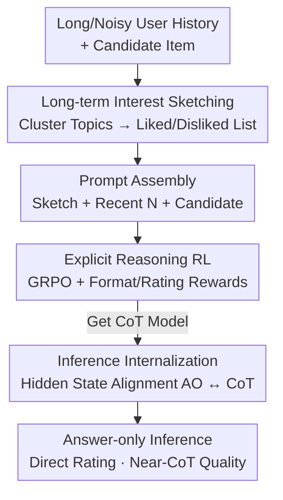

# Token-Efficient Long-Term Interest Sketching and Internalized Reasoning for LLM-based Recommendation

**Conference**: ICLR 2026  
**OpenReview**: [https://openreview.net/forum?id=NVrXCKaEjM](https://openreview.net/forum?id=NVrXCKaEjM)  
**Code**: https://github.com/TommyDzh/SIREN  
**Area**: Recommender Systems / LLM Reasoning  
**Keywords**: LLM Recommendation, Rating Prediction, Long-term Interest Compression, Internalized Reasoning, GRPO

## TL;DR
This paper proposes SIREN, which uses "long-term interest sketches" to compress hundreds of user histories into a short sequence of "liked/disliked semantic topics" for LLMs. It employs a "two-stage training" process: first, learning explicit CoT reasoning via RL, and second, internalizing this reasoning into model parameters through hidden state alignment. This maintains CoT-level accuracy under answer-only decoding, reducing input tokens by 48.7% and inference latency by over 100× compared to CoT.

## Background & Motivation

**Background**: Applying LLMs to rating prediction in recommendation systems is a burgeoning trend. By providing an LLM with a user's interaction history and candidate item descriptions, the model can infer preferences and output a predicted score. Compared to traditional ID-centric recommenders, LLMs leverage rich item semantics to mitigate cold-start issues, enhance generalization, and provide explainable recommendations. Chain-of-Thought (CoT) reasoning has been shown to further improve the accuracy of such predictions.

**Limitations of Prior Work**: Deploying LLMs in real-world recommendation systems faces two bottlenecks. First, real-world user histories are both long and noisy—hundreds of interactions can occur within days, filled with redundancy. Feeding raw history directly into an LLM often leads to "more is less" scenarios due to limited long-context capabilities and cumulative noise (as shown in Fig.1(a), MAE increases when history grows from 10 to 50 items). Conversely, naive truncation to the most recent items loses long-term interests. Second, while CoT is accurate, its decoder-only architecture requires auto-regressive generation of long reasoning chains, making per-sample latency over 100× higher than answer-only decoding, which is unsustainable for production.

**Key Challenge**: There are simultaneous trade-offs between "information volume vs. token budget" and "accuracy vs. latency." The goal is to retain long-term preferences while saving tokens, and to achieve CoT-level accuracy without the associated decoding latency. Existing works either summarize user profiles (which still requires processing long histories and adds computation) or use distillation/speculative decoding/latent reasoning (which still generates intermediate tokens). None address both issues simultaneously and cleanly.

**Goal**: (1) Design a token-efficient, noise-resistant user representation that preserves long-term signals; (2) Enable the model to maintain CoT-level reasoning quality under answer-only decoding (outputting only the final rating with zero reasoning tokens).

**Key Insight**: The authors make two critical observations. First, stable user preferences can be highly compressed using "corpus-level semantic topics"—clustering hundreds of histories into a few "liked/disliked topics" naturally filters out noise. Second, regardless of answer-only or CoT decoding, the final rating is determined by the hidden state at the `<answer>` token. Therefore, aligning the answer-only hidden state with the CoT hidden state should lead to consistent predictions without needing to actually output CoT tokens.

**Core Idea**: Use "semantic topic sketches" instead of raw history to solve token and noise issues, and use "hidden state alignment" to internalize CoT reasoning into the parameters, allowing answer-only decoding to gain CoT-level accuracy for free.

## Method

### Overall Architecture
SIREN addresses two deployment hurdles for LLM rating prediction: long noisy history and explicit reasoning latency. The overall workflow consists of two integrated tracks: first, **Long-term Interest Sketching**, which encodes and clusters item descriptions into $K$ fixed semantic topics, then aggregates each user's history into a concise list of "liked/disliked" topics to form a compact prompt; second, **Inference Internalization**, which uses rule-based RL (GRPO) to teach the model explicit CoT reasoning on sketch prompts in the first stage, followed by hidden state alignment in the second stage to compress this reasoning into parameters.

### Key Designs

**1. Long-term Interest Sketching: Compressing History into Liked/Disliked Lists via Corpus-level Topics**

This step addresses the pain point where raw history is long and noisy while truncation loses long-term signals. The key decision is to **discover topics once at the corpus level** rather than per-user, as user history length varies greatly, making per-user clustering unstable and incomparable. Specifically, a text encoder encodes item descriptions into embeddings $e(i)=\text{Enc}(d(i))$, and K-means is performed on the entire item set $I$ to obtain $K$ topic centers $\{\mu_k\}$. Each item is assigned a topic label $c_i=\arg\min_k \|e(i)-\mu_k\|_2^2$. For each cluster, the $M$ descriptions closest to the center are fed to an LLM to generate a concise topic name $\tau_k$.

Once topics are established, user history $H_u$ is aggregated into a sketch. For the $k$-th topic, the user's average rating is calculated as $\bar r_{u,k}=\frac{1}{|H_u(k)|}\sum r_{ui}$, and a threshold $\theta$ is used to split topics into liked and disliked sets: $T_u^+=\{\tau_k:\bar r_{u,k}\ge\theta\}$ and $T_u^-=\{\tau_k:0<\bar r_{u,k}<\theta\}$. The sketch is $S_u=(T_u^+,T_u^-)$. Finally, the sketch, the $N$ most recent interactions $H_u^{(N)}$, and the candidate description $d(i)$ are linearized into a prompt $\pi_u(i)=\Phi(S_u,H_u^{(N)},d(i))$. This way, the sketch captures long-term preferences while recent interactions capture short-term context, resulting in an informative yet compact prompt.

**2. Explicit Reasoning RL: Learning Reasoning via Rule-based Rewards without CoT Labels**

Since recommendation lacks ready-made CoT annotations, supervised learning is not feasible. This paper uses GRPO to optimize reasoning quality on sketch prompts, with rewards constructed purely by rules. The reward consists of two parts: a **format reward** $s_{format}$, which forces the model to write reasoning inside `<think>...</think>` and the final rating inside `<answer>...</answer>` ($+1$ for correct format, $-1$ otherwise); and a **rating regression reward** $s_{rate}$, which linearly maps the prediction error to $[-2,2]$. The total per-sample reward is:

$$R(\hat r_{ui},r_{ui})=s_{format}+\underbrace{\left(2-\frac{4}{E_{max}}|\hat r_{ui}-r_{ui}|\right)}_{s_{rate}},$$

where $E_{max}=b-a$ is the maximum possible error in the rating range. $s_{rate}$ decreases linearly with absolute error. This allows the model to explore reasoning paths that improve accuracy without any human labels, providing a high-quality CoT teacher for the next stage.

**3. Hidden State Alignment Internalization: Achieving CoT Accuracy with Answer-only Decoding**

The second stage addresses latency. The core observation is that the final prediction depends on the hidden state at the query token $q$ for `<answer>`. By aligning the hidden state of $q$ under answer-only (AO) decoding with its state under CoT decoding, the two predictions will match without generating CoT tokens. Let $h^l_{AO}(q)$ and $h^l_{CoT}(q)$ denote the hidden states of layer $l$ for "prompt only" and "prompt+CoT" respectively. The alignment loss uses layer-wise cosine distance:

$$\mathcal{L}_{align}=\frac{1}{L}\sum_{l=1}^{L}\Big(1-\cos\big(\text{sg}[h^l_{CoT}(q)],\,h^l_{AO}(q)\big)\Big),$$

where $\text{sg}[\cdot]$ is the stop-gradient. This is implemented by adding LoRA only to the key/value projection matrices of each attention layer. This strategy is supported by **Theorem 1 (KV Adaptation Equivalence)**: under first-order linearization of attention and FFN, there exist low-rank updates $(\Delta W_K^l, \Delta W_V^l)$ such that the updated AO hidden state exactly equals the CoT hidden state. During inference, the model can calculate hidden states at `<answer>` close to explicit reasoning without generating any CoT tokens.

### Loss & Training
A two-stage training approach based on Qwen3-4B is used: Stage 1 utilizes GRPO (via the VERL framework) to learn explicit CoT reasoning using the reward in Eq (11). Stage 2 freezes the CoT teacher and trains LoRA adapters for KV projections using the alignment loss $\mathcal{L}_{align}$ in Eq (12). BGE-M3 is used as the text encoder, with $K=20$ topics and $M=100$ descriptions per topic for name generation. The threshold $\theta$ is set to 4. Recent history length $N$ is 30 for Books and 10 for Movies.

## Key Experimental Results

### Main Results
Datasets include Books and Movies from Amazon Reviews 2023, using 5-core filtering and leave-last-out splitting. Metrics are MAE and RMSE (lower is better), averaged over three seeds.

| Dataset | Metric | SIREN | Prev. SOTA (Exp3RT/MF) | Gain |
|--------|------|-------|----------|------|
| Books | MAE | **0.3510** | 0.4001 (Exp3RT) | -12.45% |
| Books | RMSE | **0.6887** | 0.7259 (MF) | -8.99% vs Exp3RT |
| Movies | MAE | **0.7603** | 0.7995 (LLM4Rate-Qwen3) | Significant |
| Movies | RMSE | **1.2924** | 1.3060 (MF) | Best |

SIREN ranks first across all datasets and metrics. The paper notes that while LLM-based methods generally outperform traditional baselines in MAE (benefiting from item semantics), they sometimes lose in RMSE to MF due to positive-sample bias. SIREN's RL-CoT and internalization make it more robust on sparse low-score samples.

**Efficiency (Fig.3)**: SIREN-AO (answer-only) generates 1 token per sample with a latency of ~0.013s; SIREN-CoT takes 238 tokens / 2.22s; EXP3RT 160 tokens / 1.26s; LLM4Rate 524 tokens / 4.84s. SIREN-AO achieves over 100× acceleration relative to CoT methods.

### Ablation Study

Comparison of user modeling strategies (RQ3, Books MAE, under answer-only fine-tuning):

| Configuration | Books MAE | Books RMSE | Description |
|------|---------|------|------|
| Recent History | 0.3547 | 0.7131 | Only recent N items |
| +Sketch (Ours) | **0.3536** | **0.7114** | Add long-term sketch (Best/Runner-up) |
| +More History | 0.3535 | 0.7153 | Add raw history: MAE drops slightly but RMSE worsens |
| +Profile | 0.3563 | 0.7244 | LLM-generated profile (Worse than Recent Only) |

Comparison of internalization strategies (RQ4, initialized from Stage-1 GRPO-CoT, Books MAE; Redline GRPO-CoT = 0.3521):

| Configuration | Books MAE | Movies MAE | Description |
|------|---------|------|------|
| CE | 0.3521 | 0.7832 | Cross-Entropy fine-tuning |
| KD | 0.3530 | 0.7995 | Logit Distillation |
| KD+CE | 0.3527 | 0.7653 | Joint Distillation |
| HA+CE | 0.3525 | 0.7767 | Hidden Alignment + CE |
| **HA (Ours)** | **0.3503** | **0.7603** | Hidden State Alignment (Closest to/beats teacher) |

LoRA target modules (Table 4): Among KV, all-linear, QKV, QV, and FFN, KV achieved the best MAE (0.3503) on Books, confirming the motivation of the KV Adaptation Equivalence.

### Key Findings
- The benefits of long-term interest sketching are two-fold: token efficiency and noise resistance. While raw history improves MAE, it can degrade RMSE; sketches improve both. LLM-generated profiles underperformed, suggesting naive summarization misses critical preferences.
- HA (Hidden Alignment) actually **outperformed** the GRPO-CoT teacher on Books. The authors speculate that aligning hidden states transfers reasoning structure while avoiding the noise and variance inherent in explicit token generation. HA+CE performed worse, as token-level CE pulls the model toward fitting labels at the expense of the CoT-induced latent structure.
- Applying LoRA only to KV projections is optimal, consistent with Theorem 1.

## Highlights & Insights
- The **two-stage compression** (corpus-level topics followed by user aggregation) is clever: it replaces unstable per-user clustering with fixed corpus topics, providing noise resistance and interpretable "liked/disliked" lists.
- **Inference Internalization (AO "stealing" CoT accuracy)** is the most striking contribution. By focusing on the `<answer>` hidden state, it turns the decision of "whether to generate reasoning tokens" into a training-time internalization, bypassing all speed-up methods that require token generation.
- **Theorem 1 provides engineering guidance** for LoRA, justifying the focus on key/value projections rather than blindly tuning all linear layers.
- The hybrid approach of "Sketch + Recent History" (Long-term + Short-term) is generalizable to other long-sequence tasks, using topics for long-term memory and raw windows for short-term context.

## Limitations & Future Work
- Evaluation was limited to Books and Movies categories in Amazon Reviews with relatively small test sets (e.g., 2,629 for Movies); cross-domain and industrial-scale long-tail scenario generalization is unverified.
- The theoretical guarantee for hidden state alignment relies on first-order linearization; in real non-linear networks, the equivalence is an approximation, and alignment quality might vary by depth or task.
- Sketching depends on hyperparameters (topic count $K=20$, threshold $\theta=4$) which may be sensitive to different datasets. Niche interests might be swallowed by large clusters.
- The task is limited to rating prediction (regression). Applicability to generative recommendation tasks like next-item prediction or ranking remains to be explored.

## Related Work & Insights
- **vs. Truncation Methods (e.g., Tsai et al., Lyu et al.)**: These lose long-term signals; SIREN uses corpus-level sketches to preserve long-term info efficiently and robustly.
- **vs. LLM Profiling (e.g., EXP3RT/Kim et al.)**: These utilize LLMs to summarize history, which is computationally expensive and potentially less effective than simple clustering.
- **vs. CoT Acceleration (Distillation / Speculative Decoding / Latent Reasoning)**: These still require intermediate token generation; SIREN achieves zero-CoT-token inference via internalization.
- **vs. Knowledge Distillation (KD)**: While KD matches output distributions, HA aligns latent structures, shown experimentally to be superior.

## Rating
- Novelty: ⭐⭐⭐⭐⭐ "Hidden state alignment for CoT internalization" and "corpus-level topic sketching" address real deployment pains with theoretical backing.
- Experimental Thoroughness: ⭐⭐⭐⭐ Solid ablation studies, though limited to two small datasets.
- Writing Quality: ⭐⭐⭐⭐⭐ Clear chain of logic from motivation to theory and experiment; intuitive figures.
- Value: ⭐⭐⭐⭐⭐ Significant reduction in tokens and latency while improving accuracy; high industrial deployment value.

<!-- RELATED:START -->

## Related Papers

- [\[ICLR 2026\] Reinforced Latent Reasoning for LLM-based Recommendation](reinforced_latent_reasoning_for_llm-based_recommendation.md)
- [\[ICLR 2026\] Token-Efficient Item Representation via Images for LLM Recommender Systems](token-efficient_item_representation_via_images_for_llm_recommender_systems.md)
- [\[ACL 2026\] From Recall to Forgetting: Benchmarking Long-Term Memory for Personalized Agents](../../ACL2026/recommender/from_recall_to_forgetting_benchmarking_long-term_memory_for_personalized_agents.md)
- [\[ICLR 2026\] More Than What Was Chosen: LLM-based Explainable Recommendation Beyond Noisy User Preferences](more_than_what_was_chosen_llm-based_explainable_recommendation_beyond_noisy_user.md)
- [\[AAAI 2026\] Length-Adaptive Interest Network for Balancing Long and Short Sequence Modeling in CTR Prediction](../../AAAI2026/recommender/length-adaptive_interest_network_for_balancing_long_and_short_sequence_modeling_.md)

<!-- RELATED:END -->
