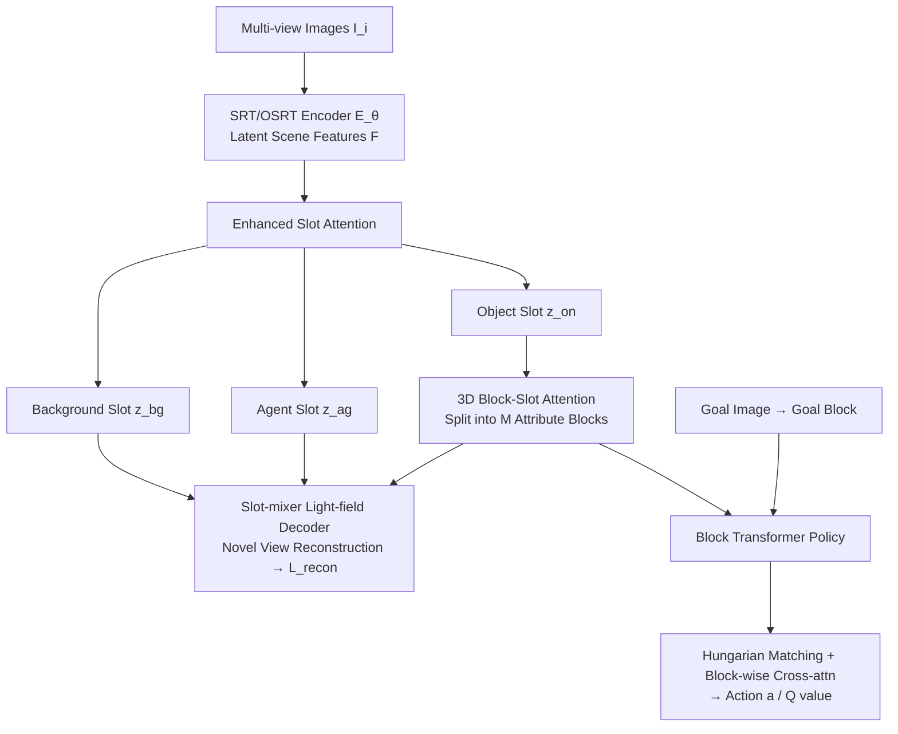

# 3D-aware Disentangled Representation for Compositional Reinforcement Learning

**Conference**: ICLR 2026  
**OpenReview**: [https://openreview.net/forum?id=GE0IFoDx8a](https://openreview.net/forum?id=GE0IFoDx8a)  
**Code**: To be confirmed  
**Area**: Reinforcement Learning / Object-Centric Representation  
**Keywords**: object-centric representation, 3D disentanglement, block-slot attention, goal-conditioned RL, compositional generalization  

## TL;DR
This work extends the structured decomposition of "object attributes $\rightarrow$ discrete blocks" from 2D to 3D multi-view space. By utilizing a policy network with block-level cross-attention for goal-conditioned reinforcement learning, it enables a robot to stably push objects to target positions even under unseen attribute combinations and novel viewpoints.

## Background & Motivation
**Background**: In visual reinforcement learning, object-centric representation (OCR) is a recognized tool for enhancing efficiency—decomposing an image into individual object slots, each carrying attributes like color, shape, size, and position. This allows policies to reason at the object level, providing better sample efficiency and generalization than raw pixels. SysBinder further splits each slot into several "blocks," each tied to a specific attribute type, achieving unsupervised attribute-level decomposition.

**Limitations of Prior Work**: Most existing methods operate in 2D single-view space, leading to two major issues. First is the **lack of 3D perception**—slot attention based on single 2D feature maps or UV grids cannot reliably infer depth, occlusion, multi-view consistency, or complete 3D poses, failing when occlusions or viewpoint changes occur. Second is **imprecise object description**—unsupervised slots often correspond to clusters in 2D feature maps (a patch of color or texture) and do not guarantee that each slot represents an independent physical object, leading to ambiguous attribute manipulability.

**Key Challenge**: Object configurations and camera poses are entangled in 2D projections. Achieving clean object-centric decomposition in 3D requires decoupling "intrinsic object attributes" from the "viewpoint," which single-view representations inherently fail to do.

**Goal**: To construct a **viewpoint-invariant 3D structured representation** that stably decomposes object shape, color, size, and 3D position into fixed blocks, allowing the policy to directly consume this decomposed representation for generalization in goal-conditioned manipulation tasks across new attribute combinations and novel viewpoints.

**Core Idea**: `[3D + Structured Decomposition]` Uses a multi-view Transformer (SRT/OSRT) to lift the scene into a 3D light-field representation to resolve viewpoint entanglement, followed by block-slot attention on object slots for attribute-level decomposition. Finally, a `[Block-level Goal Matching]` block transformer policy is employed—performing Hungarian matching based on semantic attributes first, then block-level cross-attention—to compress the search space for goal-conditioned planning.

## Method

### Overall Architecture
The method consists of two stages: first, **pre-train a 3D block-slot encoder** to learn a viewpoint-invariant, attribute-decomposable scene representation; second, **train a block transformer policy** to feed this structured representation into goal-conditioned RL. The encoder uses an SRT/OSRT multi-view Transformer to aggregate images into latent scene features. An enhanced slot attention mechanism separates the scene into background, agent, and object slots. Object slots are further split into attribute blocks. A slot-mixer light-field decoder reconstructs images at arbitrary query viewpoints (novel view synthesis) for training. During the policy stage, the pre-trained encoder extracts block representations for the current and goal states, outputting actions and Q-values after block-level matching and cross-attention.

### Key Designs

**1. Explicit division of Background/Foreground/Agent: Reserving slots for "What can move".** Standard slot attention treats all slots as a permutation-invariant set. However, in RL, it is crucial to distinguish between the "robot arm" (active element) and the "targets" (passive elements) to learn intuitive physics. Ours avoids complete permutation invariance by **fixing indices for the background slot $z_{bg}$ and agent slot $z_{ag}$**, treating the remainder as permutation-invariant object slots $\{z_{on}\}_{n=1}^{N-2}$. Training is supervised via background masks $m^{gt}_{bg}$ and agent masks $m^{gt}_{ag}$ provided by the simulator (or foundation models), with the loss measuring the pixel difference between attention-weighted regions and ground truth regions: $L_{bg}=\sum_{(u,v)\in\Omega}\|w_{bg}(u,v)\hat{I}(u,v)-m^{gt}_{bg}(u,v)I(u,v)\|^2_2$, and similarly for $L_{ag}$. The total loss $L_{total}=L_{recon}+\lambda_{bg}L_{bg}+\lambda_{ag}L_{ag}$ combines reconstruction and mask constraints to stabilize policy training.

**2. 3D block-slot attention: Attribute decomposition on 3D objects.** Since objects share concepts like shape/size/color/position while the background and agent do not, block-slot attention is applied only to object slots. Specifically, each object slot $z_n\in\mathbb{R}^{D_{slot}}$ is partitioned into $M$ attribute blocks $\{z_{n,m}\in\mathbb{R}^{D_{block}}\}$ ($D_{slot}=MD_{block}$). Update vectors $u_n$ are similarly split, with each block updated by an independent GRU and MLP: $z_{n,m}=\mathrm{GRU}_{\phi_m}(z_{n,m},u_{n,m})$ and $z_{n,m}\mathrel{+}=\mathrm{MLP}_{\phi_m}(\mathrm{LN}(z_{n,m}))$. Each block performs dot-product attention against a **concept memory** $C_m\in\mathbb{R}^{K\times d}$ ($K$ learnable prototype vectors), acting as a soft information bottleneck that forces blocks to retrieve discrete prototypes belonging to that attribute.

**3. Block transformer policy: Semantic matching followed by block-level cross-attention.** A core challenge in goal-conditioned RL is correctly pairing current and goal objects, especially when they share colors. Ours **ignores position and performs Hungarian matching using semantic attributes** to pair current object $z^s_{on}$ with goal object $z^g_{on'}$, followed by cross-attention at the block level: $H_n=\mathrm{CrossAttn}(z^s_{on},z^g_{on'})$, then pooling $h_n=\mathrm{PoolAttn}(H_n)$. This allows the policy to "focus on attributes" to determine which object to manipulate and where to move it. Finally, all object features, agent slots, and the current action $a_t$ are processed via self-attention $P=\mathrm{SelfAttn}([h_1,\dots,h_{N-2},z^s_{ag},z^g_{bg},a_t])$ to output actions and Q-values.

## Key Experimental Results

### Main Results
Representation Quality (novel-view synthesis PSNR + FG-ARI + DCI metrics):

| Dataset | Method | PSNR | FG-ARI | D | C | I |
|---|---|---|---|---|---|---|
| Clevr3D | OSRT | 31.57 | 0.365 | 0.140 | 0.083 | 0.452 |
| Clevr3D | **Ours** | 31.11 | **0.942** | **0.867** | **0.789** | **0.844** |
| IsaacGym3D | OSRT | 27.35 | 0.321 | 0.403 | 0.222 | 0.769 |
| IsaacGym3D | **Ours** | 26.55 | **0.619** | **0.659** | **0.550** | **0.938** |

PSNR is comparable to OSRT, but FG-ARI (object decomposition) and DCI (disentanglement/completeness/informativeness) are significantly higher, indicating that block decomposition adds structure without sacrificing reconstruction quality.

Goal-conditioned RL Success Rate (IsaacGym Tabletop Pushing, 2 Objects):

| Rep. + Policy | ID | CG | CG (Same Color) | OOD |
|---|---|---|---|---|
| DLPv2 + EIT | 0.984 | 0.747 | 0.388 | 0.422 |
| OSRT + EIT | 0.980 | 0.758 | 0.414 | 0.700 |
| Ours + EIT | 0.984 | 0.773 | 0.682 | 0.582 |
| **Ours + BT** | 0.967 | **0.895** | **0.837** | **0.828** |

While performance is saturated on ID, Ours + BT significantly outperforms baselines in generalization scenarios—improving "Same Color" combinations from ~0.4 to **0.837** and OOD colors from 0.42/0.70 to **0.828**.

### Ablation Study
Viewpoint Generalization (Train on Front/Left/Right, Test on unseen and single views):

| Setting | ID | CG | CG (Same Color) | OOD |
|---|---|---|---|---|
| DLPv2+EIT, ID Multi-View | 0.984 | 0.747 | 0.388 | 0.422 |
| DLPv2+EIT, OOD Multi-View | 0.059 | 0.056 | 0.046 | 0.078 |
| **Ours+BT, ID Multi-View** | 0.967 | 0.895 | 0.837 | 0.828 |
| **Ours+BT, OOD Multi-View** | 0.948 | 0.877 | 0.818 | 0.865 |

The 2D baseline collapses to ~0.05 when viewpoints change (due to over-fitting per-view positional encodings), while Ours maintains performance. Even with single-view testing, only slight drops occur.

### Key Findings
- **Structure drives generalization**: Ours+EIT vs. OSRT+EIT shows improvement in CG (Same Color), proving block decomposition's effectiveness; switching to the BT policy yields a further jump to 0.837.
- **3D Perception = Viewpoint Invariance**: Negligible degradation on out-of-distribution viewpoints highlights the fundamental advantage over 2D methods.
- **Single-view sufficiency**: Generalization persists during single-view inference, proving 3D attributes can be inferred from a single image.

## Highlights & Insights
- **First stable migration of SysBinder's block decomposition to 3D**: Previously, attribute-level blocks only worked on static 2D images; combining them with light-field decoders for 3D multi-view and dynamic interactions is a significant advancement.
- **Semantic matching before block cross-attention is a clever inductive bias**: Decoupling position during Hungarian matching in the attribute space solves the confusion between similar objects and improves interpretability.
- **Explicit role division is practical**: Reserving specific slots for the agent aligns with the causal structure of robotics tasks and stabilizes RL.

## Limitations & Future Work
- **Rigid matching assumption**: Current static matching (one-to-one between current and goal) may fail in many-to-one or dynamic correspondence scenarios.
- **Dependency on mask supervision**: Background/agent decomposition requires simulator masks or foundation model detections; real-world mask quality remains a factor.
- **Task complexity**: Validation was limited to tabletop pushing with two objects and specific attributes; scalability to complex real-world scenes remains to be seen.

## Related Work & Insights
- **3D Object-Centric Learning**: OSRT and COLF use light-field decoders for static scenes; NeRF-based methods (e.g., uORF) use rendering losses. This work differentiates itself by providing highly structured latent representations for dynamic physical reasoning.
- **Structured OCR**: Combines SysBinder’s block-slot design with 3D light-fields to fill the gap in multi-view reasoning.
- **Object-Centric RL**: Addresses the failure of previous methods (POCR, ECRL, PaLM-E) in handling unseen attribute combinations through block-level matching.

## Rating
- **Novelty**: ⭐⭐⭐⭐ Combines block-slot decomposition with 3D multi-view and structured matching policy.
- **Experimental Thoroughness**: ⭐⭐⭐⭐ Comprehensive validation across representation quality, RL success, and viewpoint generalization.
- **Writing Quality**: ⭐⭐⭐⭐ Clear motivation and methodology; intuitive comparisons between object-wise and block-wise approaches.
- **Value**: ⭐⭐⭐⭐ Significant improvements in compositional and viewpoint generalization for OCR-RL.

<!-- RELATED:START -->

## Related Papers

- [\[ICLR 2026\] In-Context Compositional Q-Learning for Offline Reinforcement Learning](in-context_compositional_q-learning_for_offline_reinforcement_learning.md)
- [\[ICLR 2026\] Stackelberg Coupling of Online Representation Learning and Reinforcement Learning](stackelberg_coupling_of_online_representation_learning_and_reinforcement_learnin.md)
- [\[ICLR 2026\] ARM-FM: Automated Reward Machines via Foundation Models for Compositional Reinforcement Learning](arm-fm_automated_reward_machines_via_foundation_models_for_compositional_reinfor.md)
- [\[ICML 2026\] Decoupling Skeleton and Flesh: Efficient Multimodal Table Reasoning with Disentangled Alignment and Structure-aware Guidance](../../ICML2026/reinforcement_learning/decoupling_skeleton_and_flesh_efficient_multimodal_table_reasoning_with_disentan.md)
- [\[ICML 2026\] Compositional Transduction with Latent Analogies for Offline Goal-Conditioned Reinforcement Learning](../../ICML2026/reinforcement_learning/compositional_transduction_with_latent_analogies_for_offline_goal-conditioned_re.md)

<!-- RELATED:END -->
