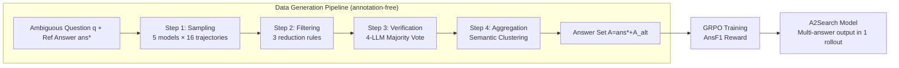

# A$^2$Search: Ambiguity-Aware Question Answering with Reinforcement Learning

**Conference**: ICLR 2026  
**OpenReview**: [https://openreview.net/forum?id=3CPzUWIoNf](https://openreview.net/forum?id=3CPzUWIoNf)  
**Code**: [https://github.com/zfj1998/A2Search](https://github.com/zfj1998/A2Search)  
**Area**: Reinforcement Learning / Agent Search / Open-Domain Question Answering  
**Keywords**: Ambiguous QA, Reinforcement Learning, GRPO, Multi-hop QA, Annotation-free, AnsF1 Reward  

## TL;DR
A$^2$Search proposes an **annotation-free** automatic pipeline to mine multiple valid answers for "ambiguous questions" from existing QA data. By employing a multi-answer friendly AnsF1 reward for GRPO reinforcement learning, a 7B model outperforms strong 32B baselines in multi-hop QA with only a single rollout.

## Background & Motivation
**Background**: Under the LLM + search tools + RL paradigm, agent search models like Search-R1, ReSearch, and AFM have made rapid progress in open-domain QA, achieving strong performance through multi-step reasoning, active retrieval, and evidence integration.

**Limitations of Prior Work**: Almost all QA benchmarks assume a "single correct answer per question." However, reality differs—especially in multi-hop questions, where different reasoning chains can legitimately lead to different conclusions. The authors' analysis reveals that **27.6%** of samples in the MuSiQue training set actually contain multiple valid answers. Current RL pipelines only reward the labeled reference answer, penalizing other evidence-supported alternative answers as errors.

**Key Challenge**: This "single-answer assumption" results in **incorrect reward signals**, where the model is penalized for providing a valid alternative answer. This systematically underestimates model capabilities and forces models to adhere to a single reasoning path. Existing ambiguity solutions (AmbigQA, ASQA) rely on expensive manual re-annotation and are largely restricted to single-hop questions, making them difficult to scale to multi-hop datasets like HotpotQA or MuSiQue.

**Goal**: To build an end-to-end, zero-annotation training framework that enables models to **perceive ambiguity** and **provide multiple valid answers simultaneously** when supported by evidence.

**Core Idea**: `[Automatic Multi-answer Mining + Multi-answer Friendly Reward]` — Instead of manual annotation, the framework leverages existing strong search models to sample trajectories and uses LLMs for evidence verification to automatically uncover "alternative correct answers." The reward is shifted from "single answer matching" to AnsF1 (measuring answer set coverage), allowing RL to naturally embrace ambiguity.

## Method

### Overall Architecture
A$^2$Search consists of two stages: first, a **four-step automatic pipeline** mines alternative answers for ambiguous questions, expanding training data from "single answer" to an "answer set" $A=\{ans^*, A_{alt}\}$. Second, **GRPO + AnsF1 reward** is used for end-to-end RL, training the model to output multiple answers based on evidence during multi-step reasoning and tool invocation.

### Key Designs

**1. Evidence-driven four-step answer mining: Automatically uncovering alternative valid answers**
The pipeline aims to automatically produce a set of alternative answers $A_{alt}$ for a given question $q$ and reference $ans^*$, where each answer is semantically distinct from others and the reference, and independently verified. **Step 1: Sampling** uses 5 pre-trained search models (ReSearch-7B/32B, Search-R1-7B/14B/32B) to generate 16 trajectories $\tau=(a_1,o_1,\dots,a_T)$ per question, involving reasoning, tool use, and answering. This generated ~3.99 million trajectories from 49,938 questions. **Step 2: Filtering** applies three heuristic rules: discarding answers semantically equivalent to the reference, removing cases where a model failed to find the reference in all 16 attempts (indicating inability to solve the task), and deduplicating identical answers. This left 5.2% (208k) of trajectories. **Step 3: Verification** is critical; 4 closed-source LLMs (Claude 3.5/3.7 Sonnet, o3, o4-mini) vote on whether there is sufficient evidence to support an answer:

$$\text{Verify}(q,\tau,\hat{ans})=\begin{cases}1,& \frac{1}{K}\sum_{k=1}^{K}z_k\geq\eta\\0,& \text{otherwise}\end{cases}$$

With a threshold $\eta=3$ (at least 3 out of 4 votes), manual audit showed 96% consistency. Finally, 19,529 trajectories remained. **Step 4: Aggregation** uses an LLM to cluster semantically equivalent but lexically different answers (e.g., "NDZ" vs "Nkosazana Dlamini-Zuma") and keeps one representative per cluster. The pipeline serves as an "annotation factory" using closed-source models, avoiding manual labor and identifying multiple answers for 19.0% of the questions.

**2. AnsF1 Reward: Accommodating multiple correct answers in a single scalar**
Traditional EM rewards cannot represent "answer sets," so the authors designed an answer-level F1 score. Let the model produce $preds$ answers, hitting $hits$ reference answers out of $refs$ total valid answers: $\text{Precision}=hits/preds$, $\text{Recall}=hits/refs$, and $\text{AnsF1}=2\cdot\frac{\text{Precision}\cdot\text{Recall}}{\text{Precision}+\text{Recall}}$. The full reward is:

$$R(q,\hat{ans})=\begin{cases}0,& \text{Invalid Format}\\0.1,& \text{Valid format but hits}=0\\1-\alpha(1-\text{AnsF1}),& \text{Valid format and hits}>0\end{cases}$$

Valid format requires at least one successful tool call, reasoning blocks, and exactly one parsable answer block. **Covering more answers increases recall (higher score), while guessing incorrectly increases the denominator of precision (lower score)**, balancing precision and recall. $\alpha=0.4$ controls the reward gap between "correct format but wrong answer" and "partially correct."

**3. GRPO + Tool-interactive rollout: Integrating multi-step search into policy optimization**
The RL algorithm uses GRPO, which estimates the baseline from $G$ rollouts per group without a separate critic:

$$\mathcal{J}(\theta)=\mathbb{E}\left[\frac{1}{G}\sum_{i=1}^{G}\min\left(\frac{\pi_\theta(y_i|x)}{\pi_{\theta_{old}}(y_i|x)}A_i,\ \text{clip}\left(\frac{\pi_\theta(y_i|x)}{\pi_{\theta_{old}}(y_i|x)},1-\epsilon,1+\epsilon\right)A_i\right)\right]$$

$A_i$ is the group-relative advantage. Following recent practices, the KL penalty is omitted. Rollouts involve iterative interaction with search tools; tokens returned by tools are masked during the policy loss calculation to ensure gradients only update content produced by the model itself.

## Key Experimental Results

### Main Results (Four multi-hop benchmarks, Exact Match, AnsF1/Recall)

| Model | Scale | Macro-Avg AnsF1@1 | Macro-Avg @3 (AnsF1/Recall) |
|------|------|------|------|
| Search-R1 | 3B | 32.2 | 33.1 / 36.5 |
| AFM-MHQ | 3B | 35.5 | 37.4 / 46.6 |
| SinSearch (No multi-answer) | 3B | 35.8 | 37.7 / 43.2 |
| **A$^2$Search** | **3B** | **43.1** | **44.9** |
| ReSearch | 32B | 46.2 | — |
| **A$^2$Search** | **7B** | **48.4** | — |

- A$^2$Search-7B achieves 48.4% AnsF1@1 (62.7% under LMJudge) with a **single greedy rollout**, **outperforming the 32B ReSearch (46.2% / 60.7%)** and significantly surpassing ReSearch-7B (39.3% / 53.6%).
- The 3B version reaches 43.1%, beating most larger baselines, highlighting the efficiency of the training paradigm.

### Ablation Study

| Dimension | Setting / Result |
|------|------|
| Verification Threshold $\eta$ | $\eta=3$: 96% human consistency, retains 9.4% trajectories (best precision/coverage trade-off). |
| Reward Coefficient $\alpha$ | 0.4 (controls reward gap). |
| Data Scale | 19.0% of questions gained alternative answers, totaling 19,529 verified trajectories. |
| Avg Answers per Question | A$^2$Search-7B: 1.51, 3B: 1.23 (answers based on evidence, not random guessing). |

### Key Findings
1. **One rollout beats three**: A$^2$Search's recall in a single greedy rollout matches or exceeds the @3 performance of baselines, significantly reducing inference costs.
2. **SinSearch proves data value**: Training with the same settings but only single answers (SinSearch) results in significantly lower performance, proving gains come from multi-answer mining.
3. **AbgSearch proves generalization**: Models trained specifically on AmbigQA fail on other datasets; A$^2$Search, which never saw AmbigQA data, outperforms these specialty models on AmbigQA.
4. **Training Stability**: AnsF1 and Recall rise steadily without collapse; the framework generalizes across Qwen2.5-Base and Llama series.

## Highlights & Insights
- **Targeting incorrect reward signals**: While others focus on model architecture or algorithms, this work identifies a "flaw in the reward signal" caused by the single-answer assumption in benchmarks—a root cause often overlooked.
- **Automated "Annotation Factory"**: Combining trajectory sampling and evidence verification (96% consistency) automates the identification of alternative answers at scale for multi-hop tasks.
- **AnsF1 Reward as a masterstroke**: A single scalar simultaneously encourages multiple valid answers while penalizing hallucinations, allowing GRPO to learn multi-answer behavior without structural changes.

## Limitations & Future Work
- **Reliance on closed-source LLM verifiers**: High costs and limited reproducibility due to dependency on Claude 3.5/3.7 and OpenAI o-series models.
- **Corpus-dependent evidence**: The validity of alternative answers depends on the 2018 Wikipedia dump; outdated or biased info in the corpus might be reinforced as "correct."
- **Focus on multi-answer ambiguity**: Focuses on "multiple valid answers" rather than "unclear reference" ambiguity (which requires asking clarifying questions).
- **Evaluation Bias**: Scores still partially depend on LMJudge (Qwen2.5-32B), which may introduce its own stability issues.

## Related Work & Insights
- **Search-enhanced RL Agents** (Search-R1, ReSearch, AFM): This work builds on them by reusing their trajectories for data mining and setting them as the benchmarks to beat.
- **Ambiguous QA datasets** (AmbigQA, ASQA): These rely on manual annotation for single-hop questions; A$^2$Search differentiates itself through zero-annotation scalability to multi-hop tasks.
- **Insight**: When RL training plateaus, one should re-examine **whether the reward signal accurately maps to the true objective**. "Standard answers" in benchmarks can themselves be sources of noise.

## Rating
- **Novelty**: ⭐⭐⭐⭐ — Precise identification of reward distortion in benchmarks, paired with an elegant mining + AnsF1 solution.
- **Experimental Thoroughness**: ⭐⭐⭐⭐⭐ — 8 benchmarks, multiple model scales (3B/7B), strong baselines (SinSearch/AbgSearch), and detailed ablations.
- **Writing Quality**: ⭐⭐⭐⭐ — Motivations are clear (the 27.6% statistic in Figure 1 is compelling), and the pipeline/reward design is well-documented.
- **Value**: ⭐⭐⭐⭐⭐ — 7B model surpassing 32B baselines, zero-annotation scalability, and open-source models/data/weights.

## Related Papers

- [\[ICLR 2026\] QuRL: Rubrics As Judge For Open-Ended Question Answering](qurl_rubrics_as_judge_for_open-ended_question_answering.md)
- [\[CVPR 2026\] ReAG: Reasoning-Augmented Generation for Knowledge-based Visual Question Answering](../../CVPR2026/reinforcement_learning/reag_reasoning-augmented_generation_for_knowledge-based_visual_question_answerin.md)
- [\[ICLR 2026\] REA-RL: Reflection-Aware Online Reinforcement Learning for Efficient Reasoning](rea-rl_reflection-aware_online_reinforcement_learning_for_efficient_reasoning.md)
- [\[ICLR 2026\] Erase to Improve: Erasable Reinforcement Learning for Search-Augmented LLMs](erase_to_improve_erasable_reinforcement_learning_for_search-augmented_llms.md)
- [\[ICLR 2026\] QuestA: Expanding Reasoning Capacity in LLMs via Question Augmentation](questa_expanding_reasoning_capacity_in_llms_via_question_augmentation.md)

<!-- RELATED:END -->

<!-- RELATED:START -->

## Related Papers

- [\[ICLR 2026\] QuRL: Rubrics As Judge For Open-Ended Question Answering](qurl_rubrics_as_judge_for_open-ended_question_answering.md)
- [\[ICLR 2026\] REA-RL: Reflection-Aware Online Reinforcement Learning for Efficient Reasoning](rea-rl_reflection-aware_online_reinforcement_learning_for_efficient_reasoning.md)
- [\[CVPR 2026\] ReAG: Reasoning-Augmented Generation for Knowledge-based Visual Question Answering](../../CVPR2026/reinforcement_learning/reag_reasoning-augmented_generation_for_knowledge-based_visual_question_answerin.md)
- [\[ICLR 2026\] Erase to Improve: Erasable Reinforcement Learning for Search-Augmented LLMs](erase_to_improve_erasable_reinforcement_learning_for_search-augmented_llms.md)
- [\[ICLR 2026\] Information Gain-based Policy Optimization: A Simple and Effective Approach for Multi-Turn Search Agents](information_gain-based_policy_optimization_a_simple_and_effective_approach_for_m.md)

<!-- RELATED:END -->
