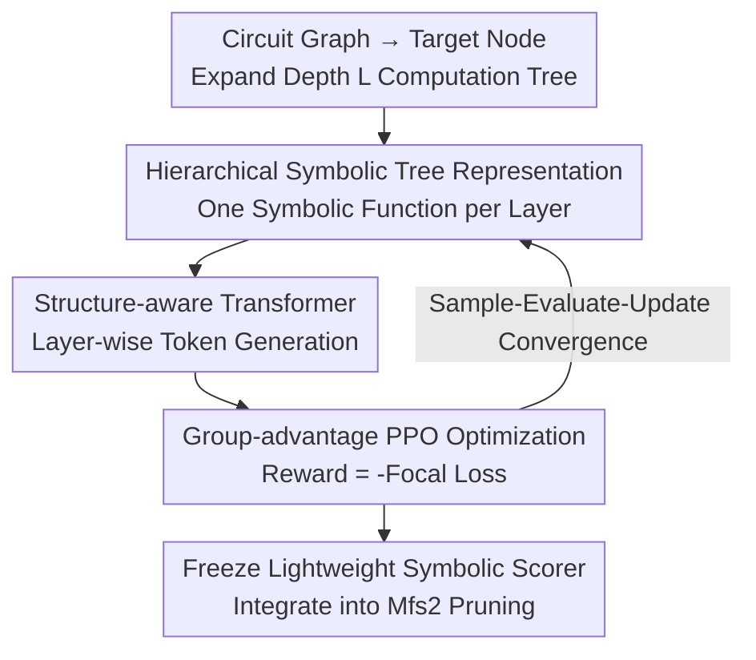

# A Hierarchical Circuit Symbolic Discovery Framework for Efficient Logic Optimization

**Conference**: ICLR2026  
**OpenReview**: [https://openreview.net/forum?id=YaXSEbRrHP](https://openreview.net/forum?id=YaXSEbRrHP)  
**Code**: https://github.com/MIRALab-USTC/HIS  
**Area**: Reinforcement Learning / Symbolic Discovery / Logic Optimization (EDA)  
**Keywords**: Logic Optimization, Symbolic Regression, Hierarchical Symbolic Tree, PPO, Interpretable GNN Distillation

## TL;DR
HIS utilizes a "hierarchical symbolic tree" to distill the layer-wise message passing of GNNs into a lightweight, interpretable symbolic scoring function. It "generates" this tree end-to-end using a structure-aware Transformer and group-advantage PPO to accurately and rapidly identify invalid transformations in logic optimization (LO) for chip design. Compared to state-of-the-art (SOTA) GNN inference, it is approximately 296× faster. When integrated into the Mfs2 heuristic, it reduces average runtime by 27.22% while further reducing circuit size by 6.95%.

## Background & Motivation
**Background**: Logic Optimization (LO) is a core stage in the chip front-end EDA flow, aiming to reduce the size and depth of circuits (modeled as directed acyclic graphs) while maintaining functional equivalence. The industry relies on heuristics such as Mfs2, Resub, and Rewrite to approximate solutions for this NP-hard problem by attempting transformations on subgraphs rooted at each node.

**Limitations of Prior Work**: Heuristics like Mfs2 are slow because many node-level transformations are **invalid**—they do not result in circuit reduction. Recently, "pruning frameworks" have been proposed to use a scoring function to predict and skip invalid transformations. These functions follow two paths, both with significant drawbacks: (1) Manually designed lightweight mathematical expressions (e.g., Effisyn) are fast but fail to capture structural information, leading to poor optimization quality. (2) Carefully designed GNNs (e.g., COG) capture structural information with high recall but suffer from **prohibitive inference costs and black-box nature**. In pure-CPU industrial deployment environments, the complex architecture and large parameters of GNNs are nearly unusable, and low interpretability hinders engineer trust.

**Key Challenge**: The scoring function is pulled by three conflicting goals: **accuracy (high recall), speed (CPU deployability), and interpretability**. GNNs provide accuracy but lack speed and interpretability; manual expressions provide speed and interpretability but lack accuracy. These two paths have been mutually exclusive.

**Goal**: To directly learn a symbolic scoring function that achieves all three goals—capturing multi-layer structural information like a GNN while remaining lightweight and transparent like a mathematical expression.

**Key Insight**: The authors observe that the strong representational power of GNNs stems from **layer-wise message passing**, where each layer aggregates information from neighbors to converge local structures into global representations. They propose writing "each layer's aggregation" as a symbolic function and stacking them to replicate GNN hierarchical aggregation using a symbolic tree.

**Core Idea**: Replace the GNN scorer with a **hierarchical symbolic tree** (one symbolic aggregation function per layer, mimicking GNN message passing). This tree is searched end-to-end using a **structure-aware Transformer + group-advantage PPO** without intermediate labels.

## Method

### Overall Architecture
HIS addresses the problem of outputting a score for each node in a circuit graph to prune invalid transformations in Mfs2. The process consists of three steps: First, the target node's subgraph is expanded into a **computation tree** $T^L_{v_0}$ of depth $L$ (set to $L=2$ to align with a 2-layer GNN), providing 5-dimensional structural features. Second, a **hierarchical symbolic tree** performs layer-wise aggregation on this computation tree, outputting a score at the root. Third, this symbolic tree is generated layer-by-layer by $L$ **structure-aware Transformer policies** and optimized using **PPO** based on node classification rewards. After training, the learned symbolic function is frozen as a lightweight scorer and integrated into the Mfs2 pruning framework.

### Key Designs

**1. Hierarchical Symbolic Tree Representation: Converting GNN Message Passing into a Readable Tree**

This is the core design addressing the "accurate but expensive black-box" issue of GNNs. Instead of feeding features into a single global symbolic function, the authors mimic the GNN's hierarchical structure. The symbolic tree is divided into $L$ layers: each node at layer $i$ of the computation tree uses the corresponding symbolic function $F_i$ to aggregate neighbor information and update features, converging layer-by-layer toward the root. Formally, the aggregation is:

$$\hat{H}_{v_{i-1}} = F_i(\hat{H}_{v_i}, H_{v_{i-1}}) \ (i>0), \qquad \text{score} = F_0(\hat{H}_{v_0})\ (i=0),$$

where updated features $\hat{H}_{v_i}$ and original features $H_{v_{i-1}}$ are fed into $F_i$ to produce the next level's features. Each $F_i$ is a symbolic tree where leaves are features or constants and internal nodes are operators. The library is intentionally small: mathematical operators $\{+, -, \times, \div, \log, \exp\}$, constants $\{0.1, 0.2, 0.5\}$, and four **aggregation operators** $\{\min, \max, \text{mean}, \text{sum}\}$. These aggregation operators map features from layer $i$ to $i-1$ ($\mathbb{R}^{n_i} \to \mathbb{R}^{n_{i-1}}$) based on adjacency, acting as the AGGREGATE function in GNNs. The updated feature dimension is $d=10$. This retains structural awareness while remaining extremely lightweight.

**2. Structure-aware Transformer: Serializing Tree Generation with Parent/Sibling Information**

To search for the symbolic tree, it is represented as a **prefix traversal sequence** $\tau=\{\tau_1, \dots, \tau_n\}$. Generation becomes sequence modeling: $p_\theta(\tau)=\prod_i p_\theta(\tau_i \mid \tau_{<i})$. An encoder-only Transformer policy $\pi_{\theta_i}$ is assigned to each layer. To capture **tree-structure dependencies** often missed by standard linear Transformers, the authors introduce **tree-aware embedding aggregation**. When generating token $\tau^i_k$, the model locates its **parent** $\tau^i_{p_k}$ and **sibling** $\tau^i_{s_k}$, encodes them as $\beta_p, \beta_s$, and uses the **mean** of their embeddings as the representation for the current token before the softmax layer. Explicitly injecting topology into sequence generation significantly improves recall.

**3. Group-advantage PPO: Optimizing Non-differentiable Trees via Critic-free RL**

Since the symbolic tree is non-differentiable with respect to $\theta$, the authors use reinforcement learning. The Transformer serves as the policy, sampled tokens as actions, and the full sequence as an episode. Rewards are given only upon sequence completion. To optimize, they sample a group of $m$ symbolic expressions per episode and use the PPO clipping objective:

$$J(\theta)=\mathbb{E}_{\tau}\Big[\min\big(\tfrac{p_\theta(\tau)}{p_{\theta_{old}}(\tau)}A_{\theta_{old}}(\tau),\ \text{clip}(\tfrac{p_\theta(\tau)}{p_{\theta_{old}}(\tau)},1-\epsilon,1+\epsilon)A_{\theta_{old}}(\tau)\big)\Big].$$

Crucially, they **do not train a critic network**. Instead, they use group-relative normalization (similar to GRPO), defining advantage as the standardized reward relative to the **group mean**: $A_\theta(\tau)=\frac{r(\tau)-\bar r}{\sigma_r}$. The reward itself is the negative **focal loss** of node classification: $r(\tau)=-\frac{1}{n}\sum_i [\alpha y_i(1-\hat y_i)^\gamma\log\hat y_i+(1-\alpha)(1-y_i)\hat y_i^\gamma\log(1-\hat y_i)]$, where $\hat y_i = \tau(T^L_{v_i})$. Focal loss addresses the imbalance between valid and invalid nodes.

### Loss & Training
The reward is measured by focal loss for classification quality, with $\alpha$ handling class imbalance. Advantages are calculated via group standardization (critic-free). The policy is updated using the PPO clipped objective. Training data $D=\{(T^L_{v_i}, y_i)\}$ is constructed by traversing all nodes in circuit graphs. Features are 5D, computation tree depth $L=2$, and updated feature dimension $d=10$. The backend LO framework is ABC, with Mfs2 as the target heuristic.

## Key Experimental Results

### Main Results
Evaluations were conducted on EPFL (20 circuits, up to 214k nodes) and IWLS (21 circuits) benchmarks using cross-benchmark generalization. Top 50% prediction recall (precision among predicted positive nodes):

| Circuit | COG (GNN) | CMO | Effisyn | Random | HIS (Ours) |
| :--- | :--- | :--- | :--- | :--- | :--- |
| Hyp | 0.87 | 0.79 | 0.18 | 0.50 | 0.82 |
| Square | 0.81 | 0.94 | 0.04 | 0.48 | 0.94 |
| Multiplier | 0.82 | 0.87 | 0.13 | 0.44 | **0.94** |
| DesPerf | 0.81 | 0.79 | 0.28 | 0.50 | 0.83 |
| Ethernet | 0.55 | 0.59 | 0.88 | 0.47 | **0.99** |
| Conmax | 0.75 | 0.73 | 0.05 | 0.50 | 0.75 |

Ours achieves $>80\%$ recall on most circuits, outperforming black-box GNNs (COG) and symbolic baselines (CMO). In online runtime, HIS-Mfs2 achieves comparable quality while speeding up by an average of 11.96% to 22.91% over baselines.

End-to-end QoR integration into Mfs2 (at $k=50\%$, average runtime reduced by 40.27%, size/level degradation only ~0.38%; up to 3.1× speedup on Hyp):

| Setup | Avg. Size/Level Improvement | Avg. Runtime Improvement |
| :--- | :--- | :--- |
| HIS-Mfs2 ($k=50\%$) | −0.38% | **40.27%** |
| 2HIS-Mfs2 ($k=40\%$, high quality) | 7.43% | 7.82% |
| 2HIS-Mfs2 ($k=30\%$, high speed) | 6.95% | **27.22%** |

Running HIS-Mfs2 twice (2HIS-Mfs2) yields circuits that are both smaller and faster than the default Mfs2.

### Ablation Study

| Config | Hyp | Multiplier | Square | DesPerf | Ethernet | Conmax | Note |
| :--- | :--- | :--- | :--- | :--- | :--- | :--- | :--- |
| HIS (Full) | 0.82 | 0.94 | 0.94 | 0.83 | 0.99 | 0.75 | Full Model |
| w/o hierarchical | 0.81 | 0.91 | 0.74 | 0.77 | 0.81 | 0.72 | Whole tree, no layers |
| w/o group optimization | 0.88 | 0.89 | 0.90 | **0.51** | 0.87 | 0.74 | No group advantage |
| w/o tree aggregation | 0.81 | **0.51** | 0.94 | 0.79 | 0.91 | 0.75 | No parent/sibling embedding |

### Key Findings
- **Hierarchical representation is crucial**: Removing layers (learning one global tree) dropped recall on Square (0.94 to 0.74) and Ethernet (0.99 to 0.81), proving layer-wise aggregation mimics GNN structural awareness.
- **Tree-aware aggregation is vital for complex structures**: Performance on Multiplier halved (0.51) without parent/sibling embeddings.
- **Group advantage stabilizes training**: Advantage based on group normalization is critical for generalization, as seen in DesPerf's drop to 0.51 without it.
- **Extremely fast inference**: On pure CPU, ours is ~296× faster than SOTA GNN (COG) on EPFL and ~254× faster on IWLS, matching the latency of manual lightweight baselines.

## Highlights & Insights
- **Layer-wise decomposition of GNNs**: Instead of distilling a global expression post-hoc, aligning the symbolic tree layers with GNN message-passing layers allows the model to learn structural awareness end-to-end.
- **Structural symbolic library**: Including $\{\min, \max, \text{mean}, \text{sum}\}$ operators allows the symbolic function to aggregate across neighbors, making it significantly more powerful than traditional four-arithmetic-operation symbolic regression.
- **Critic-free Group PPO**: In symbolic regression where episodes are short and sampling is cheap, using group-normalized rewards instead of a critic network (similar to GRPO) saves computation and stabilizes the search.
- **Industrial feasibility**: 296× speedup, CPU compatibility, and white-box readability meet the strict requirements for ML adoption in EDA tools.

## Limitations & Future Work
- **Fixed depth $L=2$**: The effect of deeper structures (larger receptive fields) on symbolic search space complexity was not fully explored.
- **Generalization robustness**: While cross-benchmark tests were performed, stability across extremely large-scale or diverse circuit styles requires more systematic verification.
- **Heuristic coverage**: Only Mfs2 was tested. Integration with Resub/Rewrite remains to be confirmed.
- **Operator selection**: The symbolic library and constants are manually set; automating this selection could improve performance.

## Related Work & Insights
- **vs. COG (GNN Scorer)**: COG has high recall but is slow and black-box; HIS distills it into a tree 296× faster with comparable recall.
- **vs. Effisyn (Manual formulas)**: Effisyn is fast but misses structure; HIS adds structural awareness through aggregation operators and hierarchy.
- **vs. CMO (Graph-enhanced symbolic)**: HIS outperforms CMO by explicitly modeling tree topology via the structure-aware Transformer.
- **vs. Post-hoc GNN distilling (Cranmer et al.)**: Ours is end-to-end and does not require intermediate GNN labels.

## Rating
- Novelty: ⭐⭐⭐⭐⭐ (Hierarchical symbolic alignment + tree-aware Transformer + group PPO is a clean, original combination).
- Experimental Thoroughness: ⭐⭐⭐⭐ (Solid benchmarks and QoR metrics, though limited to one heuristic).
- Writing Quality: ⭐⭐⭐⭐ (Logical flow and clear methodology).
- Value: ⭐⭐⭐⭐⭐ (Addresses the critical "GNN is too slow for EDA" problem with a deployment-ready solution).

<!-- RELATED:START -->

## Related Papers

- [\[ICLR 2026\] EGG-SR: Embedding Symbolic Equivalence into Symbolic Regression via Equality Graph](egg-sr_embedding_symbolic_equivalence_into_symbolic_regression_via_equality_grap.md)
- [\[ICLR 2026\] Direct Preference Optimization for Primitive-Enabled Hierarchical RL: A Bilevel Approach](direct_preference_optimization_for_primitive-enabled_hierarchical_rl_a_bilevel_a.md)
- [\[ICLR 2026\] AutoQD: Automatic Discovery of Diverse Behaviors with Quality-Diversity Optimization](autoqd_automatic_discovery_of_diverse_behaviors_with_quality-diversity_optimizat.md)
- [\[AAAI 2026\] DeepProofLog: Efficient Proving in Deep Stochastic Logic Programs](../../AAAI2026/reinforcement_learning/deepprooflog_efficient_proving_in_deep_stochastic_logic_programs.md)
- [\[ICLR 2026\] Parameter-Efficient Reinforcement Learning using Prefix Optimization](parameter-efficient_reinforcement_learning_using_prefix_optimization.md)

<!-- RELATED:END -->

## Related Papers

- [\[ICLR 2026\] EGG-SR: Embedding Symbolic Equivalence into Symbolic Regression via Equality Graph](egg-sr_embedding_symbolic_equivalence_into_symbolic_regression_via_equality_grap.md)
- [\[ICLR 2026\] AutoQD: Automatic Discovery of Diverse Behaviors with Quality-Diversity Optimization](autoqd_automatic_discovery_of_diverse_behaviors_with_quality-diversity_optimizat.md)
- [\[AAAI 2026\] DeepProofLog: Efficient Proving in Deep Stochastic Logic Programs](../../AAAI2026/reinforcement_learning/deepprooflog_efficient_proving_in_deep_stochastic_logic_programs.md)
- [\[ICLR 2026\] Parameter-Efficient Reinforcement Learning using Prefix Optimization](parameter-efficient_reinforcement_learning_using_prefix_optimization.md)
- [\[ICLR 2026\] FAPO: Flawed-Aware Policy Optimization for Efficient and Reliable Reasoning](fapo_flawed-aware_policy_optimization_for_efficient_and_reliable_reasoning.md)

<!-- RELATED:END -->
