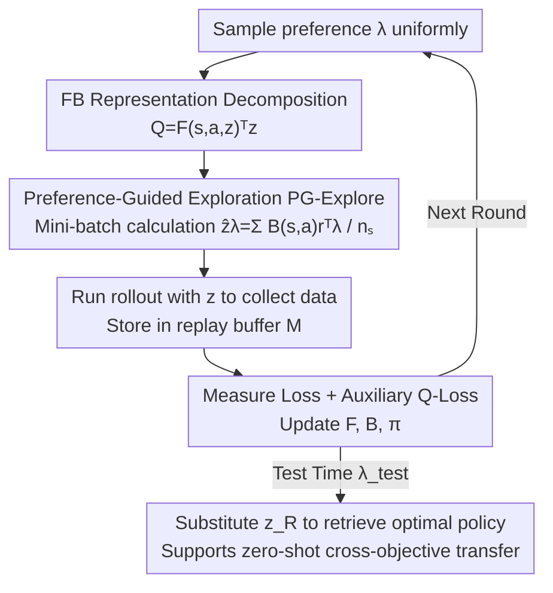

# A Reward-Free Viewpoint on Multi-Objective Reinforcement Learning

**Conference**: ICLR 2026  
**OpenReview**: [https://openreview.net/forum?id=IwiwmY3Mzz](https://openreview.net/forum?id=IwiwmY3Mzz)  
**Code**: https://rl-bandits-lab.github.io/MORL-FB/  
**Area**: Reinforcement Learning / Multi-Objective RL  
**Keywords**: Multi-Objective Reinforcement Learning, Reward-Free Reinforcement Learning, Forward-Backward Representation, Preference-Guided Exploration, Auxiliary Tasks

## TL;DR
This paper introduces the Forward-Backward (FB) framework from Reward-Free Reinforcement Learning (RFRL) into Multi-Objective Reinforcement Learning (MORL) for the first time. It proposes MORL-FB, which utilizes preference-guided exploration to construct latent vectors $z$ relevant to MORL tasks and incorporates an auxiliary Q-loss. This approach enables a preference-conditioned policy to significantly outperform SOTA methods like PD-MORL and Q-Pensieve on MO-Gymnasium with higher sample efficiency.

## Background & Motivation
**Background**: Many decision-making tasks require simultaneous optimization of multiple conflicting objectives—such as balancing energy efficiency and speed in robot control. The mainstream scalable approach in MORL is training a **preference-conditioned policy network** $\pi(s, \lambda)$. This involves linearly weighting a $d$-dimensional reward vector into a scalar reward $\lambda^\top R(s,a)$ based on user preferences $\lambda$, optimizing over a batch of sampled preferences during training, and using the corresponding policy for a given $\lambda$ at test time. Since test preferences $\lambda_{\text{test}}$ are unknown during training, the goal is to learn a set of policies covering the entire Pareto front.

**Limitations of Prior Work**: Under linear scalarization, MORL essentially only needs to learn the optimal policies for "linear combinations of known objectives," restricting knowledge sharing to this narrow reward subspace. When the number of objectives $d$ increases (e.g., Humanoid5d), methods like PD-MORL and Q-Pensieve show significant performance drops, lacking sufficient generalization and sample efficiency.

**Key Challenge**: An independently developed line of work—Reward-Free Reinforcement Learning (RFRL)—addresses a highly similar problem: learning optimal policies for **arbitrary** reward functions without seeing reward signals during exploration. Theoretically, MORL is a special case of RFRL (where RFRL does not restrict rewards to be weighted sums of predefined objectives). However, prior work has not explicitly used RFRL methods to solve MORL.

**Goal**: Can RFRL "empower" MORL? By treating "learning optimal policies for arbitrary rewards" as an **auxiliary task** for MORL, more effective knowledge sharing can be achieved via a broader reward spectrum, thereby accelerating MORL.

**Key Insight**: Directly applying SOTA RFRL algorithms (like Forward-Backward, FB) to MORL yields poor results—purely reward-free exploration fails to prioritize states crucial for optimizing "preference-weighted rewards," leading to suboptimal policies for MORL. The authors observed that the issue lies in the **distribution of sampled latent vectors $z$** during FB training. The original FB samples $z$ from a standard normal distribution $\mathcal{N}(0, I_{d_z})$, which deviates significantly from the $z_R$ induced by real MORL rewards.

**Core Idea**: Use preference-weighted rewards to "guide" the sampling of $z$ (PG-Explore), focusing training on latent space regions relevant to MORL test rewards, and supplement this with an auxiliary Q-loss that directly utilizes observed reward vectors—this is MORL-FB.

## Method

### Overall Architecture
MORL-FB is built upon the Forward-Backward (FB) representation. FB decomposes the Q-value of an optimal policy under a scalar reward $R$ into the inner product of two networks: the forward representation $F_\theta(s,a,z_R)$ and the backward representation $B_\omega(s,a)$,

$$Q(s,a,z_R) = F_\theta(s,a,z_R)^\top z_R,$$

where $z_R \in \mathbb{R}^{d_z}$ is a $d_z$-dimensional latent vector encoding the optimal policy for the current reward function. Given a reward $R$, the latent vector is calculated as the weighted expectation of the backward representation over the reward:

$$z_R = \mathbb{E}_{(s,a)\sim \mathcal{D}}\big[B_\omega(s,a) R(s,a)\big],$$

The corresponding greedy policy is $\pi(s, z_R) = \arg\max_a F_\theta(s,a,z_R)^\top z_R$. The advantage of this mechanism is that at **test time**, one only needs to replace $R(s,a)$ with the preference-weighted reward $\lambda^\top R(s,a)$, compute $z_R$, and retrieve the optimal policy for preference $\lambda$ zero-shot without retraining.

The challenge lies in **training**: since test preferences are unknown, $z$ cannot be computed directly. A batch of $z$ must be sampled to train $F_\theta, B_\omega, \pi$. The three key modifications in MORL-FB concern how $z$ is sampled and what signals are used for training—preference-guided construction of $\hat z_\lambda$ (PG-Explore), treating it as an auxiliary task via mini-batch sampling, and adding an auxiliary Q-loss. The training loop (Algorithm 1) involves: sampling a preference $\lambda$ uniformly $\rightarrow$ computing $z$ via PG-Explore $\rightarrow$ running rollouts to collect data $\rightarrow$ sampling $n_s$ transitions from the buffer $\rightarrow$ updating FB networks and the policy.

### Key Designs

**1. FB Representation as a MORL Vehicle: Encoding "Reward Functions" into "Policies" via $z$**

MORL-FB does not directly learn a mapping from "preference to policy." Instead, it uses FB to decompose the optimal Q-value of any scalar reward $R$ into $F_\theta(s,a,z_R)^\top z_R$ and compresses reward information into the latent vector $z_R = \mathbb{E}[B_\omega(s,a)R(s,a)]$. This step is fundamental: since $z_R$ is a linear function of the reward, substituting $R$ with $\lambda^\top R$ at test time immediately yields $z_{\lambda}$, allowing zero-shot retrieval of the policy for that preference. It naturally supports cases where the reward dimension changes without retraining—this is the basis for cross-objective transfer. Unlike traditional MORL, which feeds preferences directly as conditional inputs, FB decouples "environment knowledge ($F, B$)" from "reward/preference information ($z$)," where the latter drives generalization.

**2. Preference-Guided Exploration (PG-Explore): Aligning Training $z$ with MORL Test Rewards**

This is the core innovation addressing the issue of "sampling the wrong $z$." A naive approach would be to use $z_\lambda = \mathbb{E}[B_\omega(s,a)\lambda^\top R(s,a)]$. However, moving $\lambda$ outside the expectation yields:

$$z_\lambda = \underbrace{\big(\mathbb{E}[B_\omega(s,a) R(s,a)^\top]\big)}_{=:H}\,\lambda,$$

This implies that regardless of $\lambda$, $z_\lambda$ remains in the subspace spanned by the $d$ **preference-independent** column vectors of the $d_z \times d$ matrix $H$. Since $d$ is usually much smaller than $d_z$, the coverage of $\{z_\lambda\}_{\lambda \in \Lambda}$ in $\mathbb{R}^{d_z}$ is extremely limited, severely restricting exploration. Early in training, $F$ and $B$ can easily get "locked" into an inappropriate set of $z$. The original FB uses $\mathcal{N}(0, I_{d_z})$, which provides broad coverage but is too distant from the $z_R$ induced by real MORL rewards (Figure 5 shows the former is unimodal while the latter is multimodal), resulting in poor sample efficiency.

PG-Explore solves this by sampling a mini-batch $\mathcal{D}$ of $n_s$ transitions from the replay buffer and constructing:

$$\hat z_\lambda = \frac{1}{n_s}\sum_{(s,a,r,s')\in \mathcal{D}} B_\omega(s,a)\, r^\top \lambda.$$

Due to sampling noise across batches, $\hat z_\lambda$ is no longer confined to the low-dimensional subspace of $H$, but spreads into a richer distribution around $z_\lambda$. This provides more diverse exploration than $z_\lambda$ while staying closer to the rewards encountered during MORL testing compared to standard normal sampling (validated in Figure 1 on Deep Sea Treasure).

**3. Treating PG-Explore Stochasticity as an Auxiliary Task and Adding Auxiliary Q-Loss**

The "one $\lambda$, multiple $\hat z_\lambda$" mechanism of PG-Explore serves as an auxiliary task: the agent learns not just one policy for $z_\lambda$, but a family of neighboring policies. This provides richer learning signals, consistent with the principle in deep RL that auxiliary objectives not perfectly aligned with the main goal can accelerate learning. FB networks are trained using the standard measure loss $L_M(F_\theta, B_\omega; z_\lambda)$, minimizing the Bellman residual on the successor measure.

However, the original FB uses "pseudo-rewards" and ignores the actual reward vectors observed in MORL. To address this, the paper adds an **auxiliary Q-loss** using observed preference-weighted rewards $\lambda^\top r$:

$$L_Q(F_\theta; z_\lambda) = \mathbb{E}_{(s,a,r,s')\sim \mathcal{D}}\Big[\big(F_\theta(s,a,z_\lambda)^\top z_\lambda - (\lambda^\top r + \gamma \bar F_{\bar\theta}(s', \pi(s',z_\lambda), z_\lambda)^\top z_\lambda)\big)^2\Big].$$

This provides the real reward vector as extra supervision to the FB representation, helping $F$ and $B$ learn representations better aligned with the MORL reward structure. Ablations show positive contributions to both Utility (UT) and Hypervolume (HV).

### Loss & Training
The total training objective is the measure loss (to learn successor measures and stabilize FB) + auxiliary Q-loss (to provide extra TD supervision via observed rewards). In each round, preference $\lambda$ is sampled uniformly, $z$ is computed via PG-Explore and normalized as $z \leftarrow \sqrt{d_z}\, z / \|z\|_2$. Data is collected via rollouts, and $n_s$ transitions are sampled from the buffer to update networks. All tasks are run for 3M environment steps across 5 seeds. The backward representation of FB can be state-dependent or state-action-dependent; the state-dependent version is primarily used.

## Key Experimental Results

### Main Results
Evaluated on continuous control tasks in MO-Gymnasium (Multi-objective MuJoCo, including Walker2d / Halfcheetah2d / Ant3d / Hopper3d / Humanoid2d / Humanoid5d, up to 5 objectives) using three metrics:

| Metric | Definition | MORL-FB Performance |
|------|------|--------------|
| Utility (UT) | $\mathbb{E}_\lambda[\sum_t \lambda^\top r_t]$, scalarized total reward under uniform preference | Best or near-best on all tasks |
| Hypervolume (HV) | $d$-dimensional Lebesgue measure of the returns relative to reference $u_{\text{ref}}$ | Best or near-best on all tasks |
| Episodic Dominance (ED) | $\mathbb{E}_\lambda[\mathbb{1}\{\lambda^\top g(\tau_{\text{ALG}}) \ge \lambda^\top g(\tau_{\text{MORL-FB}})\}]$ | All baselines consistently < 0.5 against MORL-FB |

Key Observation: ED(ALG, MORL-FB) is below 0.5 across the board, indicating MORL-FB outperforms all baselines (including PD-MORL and Q-Pensieve) across most preferences. Performance gaps are particularly noticeable in high-dimensional tasks (Ant3d, Humanoid5d). In aggregate metrics (median / mean / IQM), MORL-FB achieves the highest IQM by a large margin. Notably, ED(FB, MORL-FB) is nearly 0, proving PG-Explore solves the sample efficiency issues of vanilla FB in MORL.

### Ablation Study (Ant3d)

| Configuration | Impact |
|------|------|
| Full MORL-FB | Optimal UT/HV |
| w/o PG-Explore (reverted to $\mathcal{N}(0,I)$ sampling) | Significant drop in UT/HV; confirms preference-guided exploration is the primary Gain |
| w/o Auxiliary Q-Loss | Drops in UT/HV; indicates real reward supervision aids FB representations |

### Key Findings
- **PG-Explore is the primary contributor**: Reverting to normal sampling leads to the most significant performance drop. t-SNE visualizations (Humanoid2d) show that vanilla FB's $z$ distribution is unimodal, while MORL-FB's is multimodal—implying a richer latent representation covering diverse objectives.
- **Strong Preference Generalization**: When trained on a small subset of preferences (one-hot basis + uniform), PD-MORL and Q-Pensieve performance collapses, whereas MORL-FB remains stable—validating the generalization benefits of decoupling environment knowledge from reward information.
- **Zero-Shot Cross-Objective Transfer**: After training on Hopper2d, the model was tested on Hopper3d/4d (with new reward terms like "jump height" or "z-velocity"). Vanilla FB failed completely, while MORL-FB transferred effectively—a unique capability of FB's reward encoding.

## Highlights & Insights
- **Bridging Independent Fields**: Identifies MORL as a special case of RFRL and systematically adapts an SOTA RFRL algorithm (FB) for MORL. This "perspective shift" is arguably more impactful than the specific techniques.
- **Elegant Diagnosis with PG-Explore**: The derivation $z_\lambda = H\lambda$ clearly identifies why direct usage of $z_\lambda$ traps exploration in a $d$-dimensional subspace. Solving this with mini-batch sampling is a textbook example of "identifying the pathology before prescribing the cure."
- **Practical Benefits of Decoupling**: Decoupling environment knowledge ($F, B$) from preferences ($z$) allows adding new objectives without retraining. This is highly valuable in real-world systems where reward specifications evolve.

## Limitations & Future Work
- **Reliance on Linear Scalarization**: The work assumes linear preferences $f_\lambda(r)=\lambda^\top r$. Success under non-linear utility or risk-sensitive preferences has not been verified.
- **Scalability of FB Representation**: The stability of latent dimension $d_z$ and measure loss in higher-dimensional states or larger objective sets (>5) is untested.
- **Modest Gain from Auxiliary Q-Loss**: Ablations show its contribution is smaller than PG-Explore. There is a lack of systematic analysis on when to enable it or how to weight it; batch size $n_s$ for $\hat z_\lambda$ sensitivity was only briefly explored.

## Related Work & Insights
- **vs Preference-Conditioned MORL (PD-MORL / Q-Pensieve / CAPQL / Envelope-Q)**: These methods learn a policy network directly conditioned on preferences, coupling reward and environment knowledge. MORL-FB decouples them and uses RFRL auxiliary tasks to broaden the reward spectrum.
- **vs Vanilla Forward-Backward RFRL (Touati et al., 2023)**: Vanilla FB performs poorly in MORL due to normal sampling and pseudo-reward training. MORL-FB aligns the $z$ distribution with MORL test rewards via PG-Explore and auxiliary Q-loss.
- **vs Multi-Policy MORL (PG-MORL / GPI-LS / GPI-PD / SFOLS)**: These maintain a set of policies. MORL-FB uses a single FB representation with preference-conditioned retrieval, offering better parameter sharing and native zero-shot transfer.

## Rating
- Novelty: ⭐⭐⭐⭐⭐ First systematic integration of RFRL/FB into MORL; original perspective shift.
- Experimental Thoroughness: ⭐⭐⭐⭐ Comprehensive coverage of MO-Gymnasium, ablations, and transfer, though limited to 5 objectives.
- Writing Quality: ⭐⭐⭐⭐⭐ Clear derivation; effective diagnosis of the $z_\lambda=H\lambda$ issue.
- Value: ⭐⭐⭐⭐ Zero-shot transfer is highly practical for evolving reward specifications.

<!-- RELATED:START -->

## Related Papers

- [\[ICLR 2026\] BoreaRL: A Multi-Objective Reinforcement Learning Environment for Climate-Adaptive Boreal Forest Management](borearl_a_multi-objective_reinforcement_learning_environment_for_climate-adaptiv.md)
- [\[ICLR 2026\] RLP: Reinforcement as a Pretraining Objective](rlp_reinforcement_as_a_pretraining_objective.md)
- [\[ICLR 2026\] Robust Multi-Objective Controlled Decoding of Large Language Models](robust_multi-objective_controlled_decoding_of_large_language_models.md)
- [\[ICLR 2026\] AMPED: Adaptive Multi-objective Projection for balancing Exploration and skill Diversification](amped_adaptive_multi-objective_projection_for_balancing_exploration_and_skill_di.md)
- [\[ICML 2026\] From Reward-Free Representations to Preferences: Rethinking Offline Preference-Based Reinforcement Learning](../../ICML2026/reinforcement_learning/from_reward-free_representations_to_preferences_rethinking_offline_preference-ba.md)

<!-- RELATED:END -->
