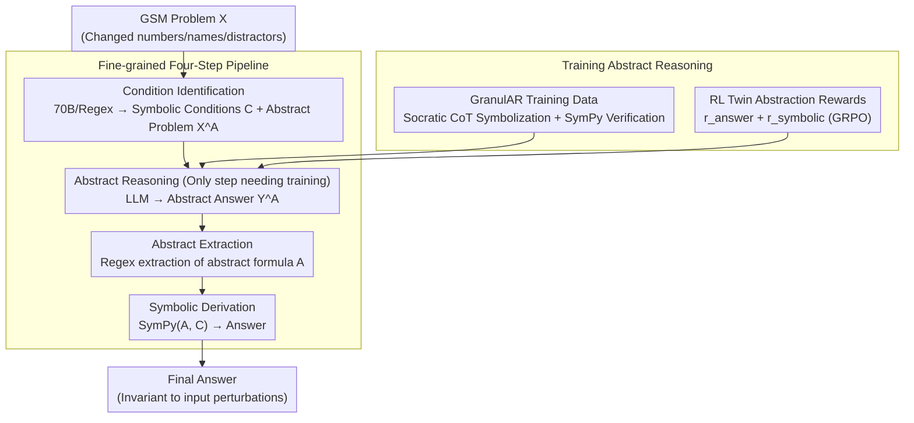

# AbstRaL: Augmenting LLMs' Reasoning by Reinforcing Abstract Thinking

**Conference**: ICLR 2026  
**arXiv**: [2506.07751](https://arxiv.org/abs/2506.07751)  
**Code**: Available  
**Area**: Reinforcement Learning  
**Keywords**: abstract reasoning, reinforcement-learning, GSM robustness, symbolic reasoning, distribution shift

## TL;DR
The authors propose AbstRaL, which utilizes Reinforcement Learning (RL) to teach LLMs mathematical abstraction—replacing specific numbers/names with symbolic variables and extracting general formulas. These abstractions are then processed by a symbolic solver to derive answers. AbstRaL almost entirely eliminates performance degradation caused by distribution shifts on GSM perturbation benchmarks and shows implicit improvements in OOD mathematical and general reasoning tasks.

## Background & Motivation
**Background**: LLMs perform well on elementary mathematics like GSM, but their performance drops significantly when faced with distribution shifts (e.g., changing numbers, changing human names, or inserting distractor conditions), exposing a lack of reasoning robustness.

**Limitations of Prior Work**: Common methods for improving robustness involve synthesizing more instantiated variants to augment training data, which is computationally expensive and yields limited returns. Other methods explore abstract reasoning (e.g., CoA, AoT), but these either rely on in-context learning (poor performance) or SFT (producing unfaithful abstractions).

**Key Challenge**: The autoregressive objective of SFT forces the model to learn the specific context of each training instance, which hinders the acquisition of abstract thinking that generalizes across instances. A training paradigm is needed that focuses the model on abstract structures rather than surface-level context.

**Goal**: How can LLMs be taught to construct faithful mathematical abstractions, making reasoning invariant to changes in input context?

**Key Insight**: Instead of data augmentation, the authors directly teach the "abstraction" skill—converting problems to variables $\to$ performing symbolic reasoning $\to$ using a solver for answers. RL is used rather than just SFT to guarantee the faithfulness of the abstraction.

**Core Idea**: Teach LLMs to "think abstractly" using RL combined with fine-grained abstraction rewards, transforming specific reasoning problems into symbolic formulas for resolution.

## Method

### Overall Architecture
AbstRaL aims to resolve the reasoning collapse that occurs when LLMs encounter shifted numbers, names, or distractors. The core premise is that models conflate "surface context" with "reasoning structure." The approach requires the model to first abstract the problem into a set of symbolic formulas, which are then handled by a deterministic symbolic solver; as long as the abstraction is correct, input variations do not affect the result.

To facilitate learning this abstraction, AbstRaL decomposes the process of "inferring abstraction $\mathcal{A}$ from problem $\mathcal{X}$" into a four-step pipeline $\mathcal{X}\to\mathcal{X}^{\mathcal{A}}\to\mathcal{Y}^{\mathcal{A}}\to\mathcal{A}$: first, **Condition Identification** parses values/entities into symbolic conditions to obtain the abstract problem $\mathcal{X}^{\mathcal{A}}$; then, **Abstract Reasoning** has the LLM write a symbolic abstract answer $\mathcal{Y}^{\mathcal{A}}$ with CoT; next, **Abstract Extraction** uses regex to isolate the abstract formulas $\mathcal{A}$; finally, **Symbolic Derivation** uses SymPy to compute the answer from the formulas and conditions. Only the second step, "Abstract Reasoning," requires training; the GranulAR data and RL rewards are designed to optimize this specific step.

### Key Designs

**1. Fine-grained Four-Step Pipeline: Decomposing Abstraction into Learnable Sub-tasks**

Directly asking an LLM to output a context-free abstraction $\mathcal{A}$ from an original problem $\mathcal{X}$ is difficult, as it deviates significantly from the natural language patterns seen during pre-training. AbstRaL breaks this into $\mathcal{X}\to\mathcal{X}^{\mathcal{A}}\to\mathcal{Y}^{\mathcal{A}}\to\mathcal{A}$, making each step closer to existing model capabilities. Condition identification and abstract extraction are handled by a 70B model via few-shot prompting and regex scripts (requiring no training), while symbolic derivation uses SymPy (deterministic, zero error). The model only needs to learn "Abstract Reasoning," which maintains a CoT format (see Design 2), further lowering the difficulty. Robustness is a byproduct: the solver deterministically derives the answer from symbolic formulas; regardless of how numbers or names change, the formula structure remains constant.

**2. GranulAR Training Data: Disguising Abstract Reasoning as Familiar CoT**

While "Abstract Reasoning" is the only step being trained, the format is still distant from the pre-training distribution. The authors modify existing Socratic CoT data by retaining the "decompose sub-problems $\to$ step-by-step CoT solution" structure but replacing specific values in the reasoning chain with abstract symbols (input variables as `in0`, derived results as `out0`, marked with brackets and double angle brackets). This rewriting is performed by Llama-3.3-70B as an oracle. Each rewrite is validated via SymPy; if the rewritten formula fails to produce the correct answer, the sample is discarded. This ensures training samples follow the familiar "CoT + Step-by-step" format, simply substituting numbers for symbols.

**3. RL Twin Abstraction Rewards: Enforcing Faithful Abstraction without Trained Reward Models**

SFT alone is insufficient, as the autoregressive objective may lead the model to memorize specific contexts, causing abstractions to drift during testing. AbstRaL applies RL using GRPO on top of SFT with rewards that do not require an additional reward model.

The first is the **Answer Correctness Reward** $r_{answer}(\tilde{\mathcal{A}},\mathcal{C},\text{Ans})$: the generated abstraction $\tilde{\mathcal{A}}$ and gold conditions $\mathcal{C}$ are passed to SymPy. A correct answer yields $r_{correct}$, otherwise 0. This provides a coarse-grained signal. The second is the **Symbolic Distance Reward** $r_{symbolic}$, which addresses the sparsity of the first: both $\tilde{\mathcal{A}}$ and the gold abstraction $\mathcal{A}$ are tokenized into symbolic sequences to calculate a normalized edit distance:

$$r_{symbolic}(\tilde{\mathcal{A}},\mathcal{A})=r_{max}\cdot\left(1-\frac{\text{EditDistance}(\tilde{\mathcal{A}},\mathcal{A})}{\max_{a\in\{\tilde{\mathcal{A}},\mathcal{A}\}}\text{Len}(a)}\right)$$

Even if the final answer is incorrect, a higher score is given if the abstraction is "closer to correct," providing fine-grained gradients to accelerate convergence.

### Mechanism
Consider an addition problem involving the numbers 12 and 2. **Condition Identification** parses them as $in0=12, in1=2$ and generates the abstract problem $\mathcal{X}^{\mathcal{A}}$ by replacing "12" and "2" with `[in0]` and `[in1]`. The trained LLM performs **Abstract Reasoning**, writing a symbolic derivation like `<<out0 = in0 + in1>>`. **Abstract Extraction** pulls the formula from the brackets to get $\mathcal{A}$: `out0 = in0 + in1`. Finally, **Symbolic Derivation** substitutes the conditions into $\mathcal{A}$ via SymPy to calculate 14. If the numbers 12 and 2 were changed or distractors were added, the formula structure in step three would remain the same, and the solver would still yield the correct result.

### Loss & Training
Two-stage training: First, SFT on the GranulAR dataset using the causal language modeling loss. Second, RL via GRPO with the reward $r_{answer} + r_{symbolic}$. Training data is constructed by rewriting Socratic GSM8K via Llama-3.3-70B. Evaluations were conducted across Qwen2.5, Llama3, and Mathstral series (0.5B–7B).

## Key Experimental Results

### Main Results (GSM Robustness)

| Method | GSM-Symbolic Vary Both | Δ↓ | GSM-Plus Distract | Original |
|------|----------------------|---|-------------------|----------|
| CoT-8S (Qwen-0.5B) | 34.0 | 10.6 | 22.7 | 42.4 |
| CoT-RL | 32.3 | 7.77 | 15.2 | 38.0 |
| SyReLM | 36.8 | 5.54 | 21.1 | 41.5 |
| **AbstRaL** | **44.6** | **-1.27** | **25.3** | **46.3** |

### Key Findings
- **Δ < 0**: AbstRaL's performance on variants is actually *higher* than on the original problems, suggesting that abstraction not only eliminates distribution shifts but also improves base reasoning.
- On Qwen2.5-Math-7B, AbstRaL significantly enhances robustness, with the largest gains observed on GSM-Plus Distract, as abstraction naturally ignores irrelevant conditions.
- SFT-only (no RL) often produces unfaithful abstractions that do not align with the problem. RL effectively corrects this through reward signals.
- OOD Transfer: AbstRaL shows zero-shot improvements on AIME (math competitions) and BBH (general reasoning), indicating that abstract thinking generalizes across domains.

## Highlights & Insights
- **Abstraction is more efficient than instantiation** for improving reasoning robustness. Instead of synthesizing massive variants, the model is taught general patterns. Analogy: Instead of teaching a model more addition problems, one teaches it the concept of "addition."
- **RL's unique value in abstraction learning**: While SFT is hindered by the autoregressive goal of learning surface-level context, RL rewards focus exclusively on structural correctness.
- **Fine-grained signals from Symbolic Distance**: Rather than a binary "right/wrong" reward, this Tells the model "how close" it is to the correct abstraction, accelerating convergence.

## Limitations & Future Work
- Validated primarily on GSM (elementary math); abstraction for complex mathematics (e.g., geometry, proofs) may be significantly harder.
- Condition identification relies on few-shot prompting of a 70B model; the ability of smaller models to perform this autonomously is under-explored.
- SymPy coverage for non-equation problems (e.g., combinatorics, probability) is limited.
- Training data quality depends on the oracle LLM's rewriting capabilities.

## Related Work & Insights
- **vs CoA / AoT (Abstraction Methods)**: These rely on in-context learning, which yields poor results. AbstRaL outperforms them by using SFT+RL training.
- **vs Data Augmentation Strategies**: Synthesizing instances requires high computational cost. AbstRaL is more efficient by learning abstractions from the same training set.
- **vs CoT-RL (Standard RL)**: Standard CoT-RL on GSM does not learn abstraction and shows limited robustness gains. Abstraction is the key differentiator for AbstRaL.

## Rating
- Novelty: ⭐⭐⭐⭐⭐ The concept of teaching models abstraction over instantiation is highly original.
- Experimental Thoroughness: ⭐⭐⭐⭐⭐ Covers multiple models, scales, two robustness benchmarks, OOD transfer, and detailed ablation studies.
- Writing Quality: ⭐⭐⭐⭐⭐ Clear motivation and intuitive framework diagrams.
- Value: ⭐⭐⭐⭐⭐ Provides a new paradigm for reasoning robustness; the transferability of abstract thinking is particularly valuable.

<!-- RELATED:START -->

## Related Papers

- [\[ICLR 2026\] Reasoning Boosts Opinion Alignment in LLMs](reasoning_boosts_opinion_alignment_in_llms.md)
- [\[ICLR 2026\] Thinking on the Fly: Test-Time Reasoning Enhancement via Latent Thought Policy Optimization](thinking_on_the_fly_test-time_reasoning_enhancement_via_latent_thought_policy_op.md)
- [\[ICLR 2026\] QuestA: Expanding Reasoning Capacity in LLMs via Question Augmentation](questa_expanding_reasoning_capacity_in_llms_via_question_augmentation.md)
- [\[ICLR 2026\] Parallel-R1: Towards Parallel Thinking via Reinforcement Learning](parallel-r1_towards_parallel_thinking_via_reinforcement_learning.md)
- [\[ICLR 2026\] RL Squeezes, SFT Expands: A Comparative Study of Reasoning LLMs](rl_squeezes_sft_expands_a_comparative_study_of_reasoning_llms.md)

<!-- RELATED:END -->
