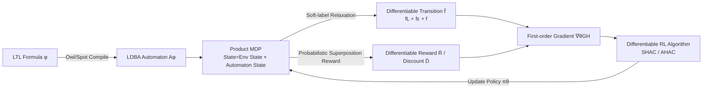

# Accelerated Learning with Linear Temporal Logic using Differentiable Simulation

**Conference**: ICLR 2026  
**OpenReview**: [https://openreview.net/forum?id=zbdhhlIy8o](https://openreview.net/forum?id=zbdhhlIy8o)  
**Code**: To be confirmed  
**Area**: Reinforcement Learning / Formal Methods / Differentiable Simulation  
**Keywords**: Linear Temporal Logic (LTL), Differentiable Simulation, Safe Reinforcement Learning, Sparse Rewards, Büchi Automaton, Soft Labels  

## TL;DR
This paper bridges the gap between Linear Temporal Logic (LTL) specifications and differentiable physics simulators for the first time. By applying "soft-label" relaxation to the discrete transitions of the automaton, the authors derive rewards and state representations that are differentiable with respect to states and actions. This allows first-order gradient algorithms (SHAC/AHAC) to learn efficiently directly from formal specifications, doubling the training speed and returns compared to discrete baselines on contact-rich continuous control tasks.

## Background & Motivation
**Background**: To ensure RL controllers satisfy safety and reliability constraints in the real world, common practices include Constrained MDPs (keeping cumulative costs within a budget) or state avoidance (avoiding dangerous states/actions).

**Limitations of Prior Work**: Constrained MDPs rely on additive cost functions, but assigning meaningful scalar costs to various hazards is inherently difficult. State avoidance tends to learn overly conservative policies and cannot express "trajectory-level" temporal requirements (e.g., visit A then B, always avoid C, visit D infinitely often). While formal languages like LTL provide "correct-by-construction" goals with built-in automaton memory suitable for long-horizon tasks, their rewards are **extremely sparse**. Agents often explore large state spaces blindly before receiving the first non-zero reward, and heuristic reward shaping for LTL can destroy goal correctness and mislead exploration.

**Key Challenge**: LTL provides **correct but unlearnable** (sparse, discrete, non-differentiable) goals, while differentiable simulators provide low-variance first-order gradients but require continuous differentiable rewards—the two are naturally incompatible.

**Goal**: To accelerate learning of long-horizon temporal tasks using gradients from differentiable simulators **without sacrificing the correctness and expressivity of LTL**.

**Key Insight**: **[Soft-label relaxation]** By replacing the hard-threshold truth values of atomic propositions with sigmoid probabilities, the "deterministic automaton indicator vector" is replaced by a "probabilistic superposition state" across all automaton states. This transforms LDBA label transitions, $\epsilon$-transitions, rewards, and discounts into differentiable tensor operations. Simultaneously, a tunable upper bound is provided for the gap between discrete and differentiable returns, ensuring the relaxed objective still approximates the true satisfaction probability.

## Method

### Overall Architecture
The method chains "LTL specification → LDBA automaton → Product MDP → Differentiable reward" into an end-to-end differentiable pipeline. First, LTL formulas are compiled into Limit-Deterministic Büchi Automata (LDBA) using Owl/Spot, which are then combined with a differentiable MDP to form a Product MDP (using automaton states as memory modes). The key modification lies in softening all discrete components in the Product MDP into probabilistic operations, making the return of the entire trajectory differentiable with respect to actions. Finally, any differentiable RL algorithm (e.g., SHAC) is used for training with first-order gradients.

### Key Designs

**1. Soft Labels for Atomic Propositions: Replacing hard thresholds with differentiable CDFs.** Atomic propositions in LTL take the form $a := \text{' group } g(s)>0 \text{'}$, which are originally binary hard decisions, making the reward non-differentiable with respect to the state. This paper relaxes them into the **probability** of the proposition being true using a sigmoid (or any differentiable cumulative distribution function $h$): $\Pr(a\in L(s)) = h(g(s)) = \frac{1}{1+\exp(-g(s))}$. The probability of a complete label $l$ (a combination of proposition values) is the product of individual proposition probabilities: $\Pr(L(s)=l)=\prod_{a\in l}\Pr(a\in L(s))\prod_{a\notin l}(1-\Pr(a\in L(s)))$. This step is the source of differentiability—it turns the discrete event of "which automaton transition was triggered" into a probabilistic distribution with gradients.

**2. Differentiable Automaton Transitions under Probabilistic Superposition.** With soft labels, the automaton no longer resides in a single deterministic state but in a **probabilistic superposition** $\boldsymbol{q}$ (where each component $q_q$ is the probability of being in automaton state $q$). Label-triggered transitions are updated as $f_L(\langle s,\boldsymbol{q}\rangle)=\boldsymbol{q}'$, where $q'_{q'}=\sum_q q_q \sum_{l\in L_{q,q'}}\Pr(L(s)=l)$, essentially a differentiable matrix multiplication. The non-deterministic $\epsilon$-transitions ( $\epsilon$-actions) unique to LDBA are similarly softened into probabilities $\boldsymbol{q}_\varepsilon$: $f_\varepsilon$ sums the probabilities of "reaching $q'$ via a valid $\epsilon$-transition" and "attempting to leave $q'$ but staying due to no corresponding $\epsilon$-transition." The final complete transition $\bar f(\langle s,\boldsymbol q\rangle,\langle a,\boldsymbol q_\varepsilon\rangle)=\langle f(s,a),\, f_L(s,f_\varepsilon(\boldsymbol q,\boldsymbol q_\varepsilon))\rangle$ is fully differentiable with respect to $s,\boldsymbol q,a,\boldsymbol q_\varepsilon$.

**3. Probabilistically Weighted Differentiable Reward and Discount.** Following the Büchi condition-based reward/discount design by Bozkurt et al., the hard judgment of "whether in an accepting state" is replaced by probabilistic summation: $\bar R(\langle s,\boldsymbol q\rangle)=(1-\beta)\sum_{q\in B}q_q$, $\bar D(\boldsymbol q)=\beta\sum_{q\in B}q_q+\gamma\sum_{q\notin B}q_q$, where $B$ is the set of accepting states and $\beta$ is the accepting state discount satisfying $\lim_{\gamma\to 1^-}\frac{1-\gamma}{1-\beta}=0$. This makes the return $G_H(\sigma)$ differentiable with respect to policy parameters, allowing for low-variance first-order gradient estimates $\nabla^1_\theta J(\theta)=\mathbb{E}_\sigma[\nabla_\theta G_H(\sigma)]$, avoiding high-variance zero-order estimates and gradient explosion/vanishing issues of BPTT over long horizons.

**4. Tunable Error Upper Bound for Discrete and Differentiable Returns.** Soft labeling can cause the objective to deviate from true LTL semantics. Theorem 2 provides a worst-case upper bound for this gap: Let $\varsigma$ be the tolerance at the proposition signal boundary and $p=h(\varsigma)$, then $|G_{\text{disc}}(\sigma)-G_{\text{diff}}(\sigma)| < \frac{1}{1+\frac{1-\beta}{(1-h(\varsigma))^{|A|}}}$. Since the discrete return itself converges to the true satisfaction probability as $\gamma\to 1$ (Theorem 1), this bound also applies to the true satisfaction probability. Intuitively, increasing $\varsigma$ (steeper sigmoid) can shrink the gap to be arbitrarily small, providing a tunable knob for "**differentiability vs. correctness**."

## Key Experimental Results

### Main Results
On the dFlex differentiable physics simulator, 4 contact-rich continuous control tasks were evaluated. Returns are proxies for LTL satisfaction probability (0~1), averaged over 5 seeds at 100M steps:

| Environment | State/Action Dim | Differentiable RL (SHAC/AHAC, $\partial$RL) | Non-differentiable RL (PPO/SAC, $\not\partial$RL) |
|------|------|------|------|
| CartPole | 5 / 1 | Converged to Pr>0.8 within 20M steps | SAC failed on all seeds; PPO failed on one seed and had no meaningful reward at 100M steps |
| Hopper | 10 / 3 | Pr>0.8 within 20M steps | PPO required 100M steps to converge; SAC stuck in local optima for one seed |
| Cheetah | 17 / 6 | Reached optimal Pr>0.9 | PPO still suboptimal at 100M steps; SAC consistently stuck in poor local optima |
| Ant | 37 / 8 | Fast convergence to near-optimal | Only converged to suboptimal policies |

Overall: $\partial$RL outperformed others in maximum return and convergence speed, achieving approximately twice the return of discrete baselines.

### Ablation Study

| Ablation Setup | Result |
|------|------|
| SHAC/AHAC + **Discrete** LTL Reward | Performance dropped significantly, worse than PPO/SAC in most cases; failed to learn reasonable policies in high-dim Cheetah/Ant → Proves gains come from **differentiable rewards**, not just the algorithm. |
| All Algorithms + **Simple** LTL formula | All algorithms learned optimal policies (Pr>0.9) → Proves poor performance of $\not\partial$RL stems from **inability to handle complex LTL formulas**, not environmental difficulty. |
| Generalization to Reward Machines (Cheetah TASK1/TASK2) | Differentiating RM using this method with SHAC significantly outperformed all discrete RM baselines from Icarte et al. |

### Key Findings
- **Sparsity is the Bottleneck**: The automaton for the CartPole safety spec has 3 states and 64 transitions per state, but only 1 gives a reward. Even in low dimensions, this sparsity makes $\not\partial$RL struggle, while gradient information allows $\partial$RL to locate high-reward regions directly.
- **Softening is more than De-sparsifying**: Differentiable LTL smooths the "abrupt/plateau" curves of discrete returns. More importantly, it provides low-variance first-order gradients, which are crucial in parameter regions where gradient magnitudes are very small.
- **Framework Agnostic**: The method differentiates the automaton itself, so co-safe LTL, LTLf, and Reward Machines can be applied without modification.

## Highlights & Insights
- **Bridging the "Last Mile"**: While LTL+RL and differentiable simulation developed separately, this paper uses soft labels to turn the discrete memory structure of an automaton into differentiable tensors—a conceptually clean bridge.
- **Differentiable with Theoretical Guarantees**: This is not simple reward shaping; it provides a tunable upper bound for the gap between discrete and differentiable returns linked to the true satisfaction probability, balancing "learnability" and "correctness."
- **Markovian and Compatible**: Unlike STL methods that rely on non-Markovian robustness and require BPTT, this method constructs Markovian differentiable transitions, naturally supporting long horizons and any $\partial$RL algorithm.

## Limitations & Future Work
- **Dependency on Differentiable Simulators**: The method requires a differentiable transition function $f$ (e.g., dFlex), making it not directly applicable to real-world or black-box environments that cannot be modeled differentiably.
- **Softness Bias Requires Tuning**: The error bound is determined by $\varsigma$, $|A|$, and $\beta$. Being too soft sacrifices correctness, while being too hard leads back to sparsity. The optimal setting may change with the task.
- **Scalability of Automaton and Propositions**: The cost of label probability products $\prod_{a}\!\Pr$ and state superposition matrix multiplications grows with the number of atomic propositions $|A|$ and automaton states. Scalability under massive specifications has not been fully stress-tested.
- **Simulation-only Evaluation**: Experiments are limited to simulated continuous control; sim-to-real performance and behavior under stochastic disturbances on real robots remain to be verified.

## Related Work & Insights
- **LTL+RL Taxonomy**: From model-based reachability reduction (Fu & Topcu) to model-free Reward Machines (Icarte et al.) for co-safe LTL/LTLf, and finally LDBAs for general LTL with concise acceptance conditions (Hahn/Bozkurt)—this paper builds upon the LDBA reward design (Bozkurt 2024) by adding the "differentiability" component.
- **Differentiable RL**: SHAC truncates long trajectories for BPTT and uses value function bootstrapping; AHAC adapts segment length based on contact. The differentiable Markovian automaton transitions constructed here fit perfectly into these algorithms.
- **Comparison with STL**: STL robustness can serve as a reward but is typically non-Markovian and dependent on BPTT, making it difficult for long-horizon or value-function methods. LTL + automaton memory bypasses this limitation.

## Rating
- **Novelty**: ⭐⭐⭐⭐⭐ The first framework to end-to-end differentiate LTL automata and integrate them with differentiable simulators. The soft-label superposition design is elegant and theoretically grounded.
- **Experimental Thoroughness**: ⭐⭐⭐⭐ Covers 4 continuous control tasks, RM generalization, and two targeted ablations with 5 seeds. Clear conclusions, though limited to simulation without real robot or large-scale specification stress tests.
- **Writing Quality**: ⭐⭐⭐⭐ Progression from motivation, theory (two theorems), and method to results is logical. Formula-dense nature might be challenging for readers unfamiliar with formal methods.
- **Value**: ⭐⭐⭐⭐⭐ Substantially alleviates the long-standing bottleneck of LTL reward sparsity, unifying "formal verification" and "efficient learning," providing a strong push for safe RL and formal-driven control.

<!-- RELATED:START -->

## Related Papers

- [\[AAAI 2026\] Do It for HER: First-Order Temporal Logic Reward Specification in Reinforcement Learning](../../AAAI2026/reinforcement_learning/do_it_for_her_first-order_temporal_logic_reward_specification_in_reinforcement_l.md)
- [\[ICLR 2026\] OCTAX: Accelerated CHIP-8 Arcade Environments for Reinforcement Learning in JAX](octax_accelerated_chip-8_arcade_environments_for_reinforcement_learning_in_jax.md)
- [\[ICLR 2026\] Does “Do Differentiable Simulators Give Better Policy Gradients?” Give Better Policy Gradients?](does_do_differentiable_simulators_give_better_policy_gradients_give_better_polic.md)
- [\[ICLR 2026\] Replicable Reinforcement Learning with Linear Function Approximation](replicable_reinforcement_learning_with_linear_function_approximation.md)
- [\[ICLR 2026\] ROMI: Model-based Offline RL via Robust Value-Aware Model Learning with Implicitly Differentiable Adaptive Weighting](model-based_offline_rl_via_robust_value-aware_model_learning_with_implicitly_dif.md)

<!-- RELATED:END -->
