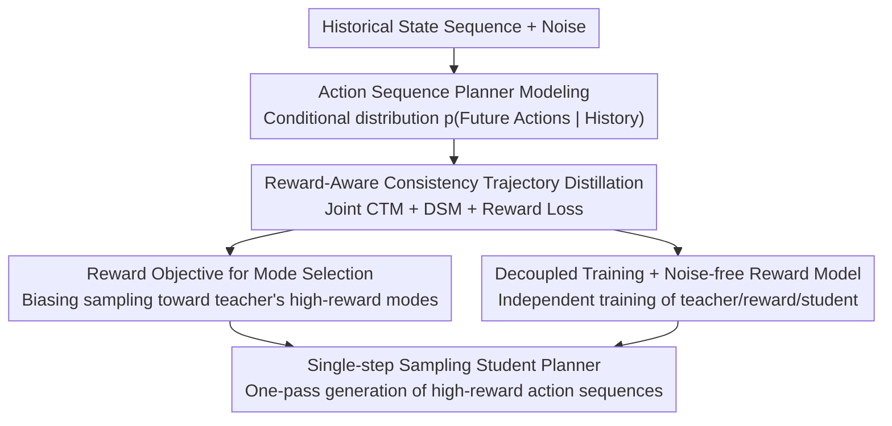

# Accelerating Diffusion Planners in Offline RL via Reward-Aware Consistency Trajectory Distillation

**Conference**: ICLR2026  
**OpenReview**: [https://openreview.net/forum?id=hRuTBS07C7](https://openreview.net/forum?id=hRuTBS07C7)  
**Code**: To be confirmed (promised to be open-sourced after acceptance)  
**Area**: Reinforcement Learning / Diffusion Models / Consistency Distillation  
**Keywords**: Offline RL, Diffusion Planner, Consistency Trajectory Distillation, Reward Guidance, One-step sampling

## TL;DR
RACTD integrates reward optimization objectives directly into the consistency trajectory distillation process. Using a pretrained diffusion teacher planner and an independently trained noise-free reward model, it distills a **single-step sampling** student planner. It outperforms the previous SOTA by 9.7% on average in D4RL while being up to 142 times faster in inference than the diffusion teacher.

## Background & Motivation
**Background**: Diffusion models have shown strong performance in offline reinforcement learning (offline RL) due to their ability to capture multi-modal behavior distributions and their robust out-of-distribution generalization. They are widely used as planners (directly generating future action sequences) or policies. However, diffusion models suffer from high inference latency because they require iterative denoising steps, making them unsuitable for delay-sensitive decision-making tasks like autonomous driving or robotics.

**Limitations of Prior Work**: To accelerate inference, the community has adapted "Consistency Distillation" from image generation to decision-making tasks, but existing approaches have drawbacks: (1) **Behavior Cloning (BC) approaches** only work well on expert data and fail on sub-optimal data (like medium-replay) because BC indiscriminately clones all behavior modes, including low-reward ones; (2) **Actor-Critic approaches** require training multiple networks (actor + critic) simultaneously from scratch, which is sensitive to hyperparameters, unstable, and computationally expensive; (3) **Guided Diffusion Sampling** requires training a "noise-aware" reward model and still necessitates multi-step sampling, where reward predictions at high noise levels are inaccurate and errors accumulate across steps.

**Key Challenge**: Achieving both "speed (single-step sampling)" and "selecting high-reward behaviors from sub-optimal data" simultaneously is difficult in existing frameworks, often requiring complex concurrent multi-network training.

**Goal**: Design a diffusion planner that is easy to train, supports single-step sampling, and favors high-reward modes even when trained on sub-optimal data.

**Key Insight**: The authors observe that once a student model can generate clean action sequences in a **single step**, the reward model can operate entirely in a noise-free "clean state-action space." This eliminates the need for noise-aware training and multi-step guidance. Consequently, "acceleration" and "reward optimization" transition from being mutually restrictive to mutually beneficial.

**Core Idea**: Instead of concurrent actor-critic training or multi-step guided sampling, **add a reward objective directly** into the consistency trajectory distillation loss. This allows the student to bias its sampling toward high-reward modes while distilling the teacher's multi-modal distribution.

## Method

### Overall Architecture
RACTD (Reward-Aware Consistency Trajectory Distillation) takes a sequence of historical states as input and outputs a sequence of future actions. The pipeline consists of three decoupled components: a **pretrained diffusion teacher planner** (EDM, multi-step denoising, capturing all behavior modes), an **independently pretrained differentiable reward model** $R_\psi$ (a return-to-go network operating in clean space), and the **distilled student planner** $G_\theta$ (single-step sampling). During training, the student is optimized via three losses: the CTM loss for "any-to-any" time-step jumps along the teacher's PFODE trajectory, the DSM loss to keep generation close to the training data, and the reward loss to push it toward high-reward modes. During inference, the student performs a single pass $\hat x_0^{(T)} = G_\theta(x_T, T, 0)$ to obtain the action sequence.

### Key Designs

**1. Reward-Aware Consistency Trajectory Distillation (RACTD): Integrating Reward into the Distillation Loss**

This is the backbone of the paper, addressing the issues where BC fails to select rewards and actor-critic is too complex. Beyond standard Consistency Trajectory Distillation (CTD = CTM loss + DSM loss), the authors add a reward objective. The CTM loss aligns two paths for predicting $x_k$: one where the student jumps directly from $t$ to $k$, and another where the teacher solver moves from $t$ to $u$, followed by the student jumping from $u$ to $k$. Both are mapped to time 0 to calculate the distance:

$$\mathcal{L}_{CTM} = \mathbb{E}\big[\, d\big(G_{sg(\theta)}(\hat x_k^{(t)}, k, 0),\; G_{sg(\theta)}(x_k^{(t,u)}, k, 0)\big)\big]$$

Where $\hat x_k^{(t)} = G_\theta(x_t, t, k)$ is the direct student prediction, $x_k^{(t,u)}$ involves the teacher solver, and $sg(\theta)$ denotes stop-gradient. The DSM loss ensures generation is grounded in data: $\mathcal{L}_{DSM} = \mathbb{E}[d(x_0, G_\theta(x_t, t, 0))]$. The crucial addition is the reward loss: the current action $\hat a_n$ is extracted from the student's single-step generated sequence and fed into the frozen reward model to estimate and maximize the return-to-go:

$$\mathcal{L}_{Reward} = -R_\psi(\vec s_n, \hat a_n)$$

The final loss is $\mathcal{L} = \alpha\mathcal{L}_{CTM} + \beta\mathcal{L}_{DSM} + \sigma\mathcal{L}_{Reward}$. This works because the distillation terms ensure the student "faithfully replicates the teacher's multi-modal distribution," while the reward term biases sampling within that distribution toward high-reward modes. The authors note this objective is formally related to Deterministic Policy Gradient (DPG), providing theoretical grounding.

**2. Reward Objective as Mode Selection: Picking High-Reward Modes from the Teacher's Multi-modality**

This design explains why RACTD is particularly effective for sub-optimal data. Offline datasets often have mixed quality; while a diffusion teacher captures these modes accurately, it cannot distinguish between high and low rewards. The authors verified this on D4RL hopper-medium-expert: the dataset's reward distribution is bimodal. The unconditional teacher and student replicate this bimodality, whereas the RACTD student concentrates its sampling mass on the high-reward peak. Thus, the reward term acts as a "mode selector" rather than a "mode eraser," shifting probability mass without destroying the teacher's representational capacity.

**3. Decoupled Training + Noise-free Reward Model: Benefits of Single-step Sampling**

By enabling single-step sampling, RACTD resolves the complexities of concurrent actor-critic training and noise-aware reward modeling. Since the student generates **clean** action sequences in one step, the reward model $R_\psi$ (comprising four ConvBlocks and one Linear layer) only needs training on noise-free state-action spaces. This provides stable and accurate gradient signals, unlike classifier-guided sampling which must evaluate noisy states where reward predictions are inherently inaccurate. Furthermore, the teacher, reward model, and distillation process are completely decoupled, allowing for flexible reuse of components.

**4. Action Sequence Planner Modeling: Modeling Future Sequences as a Planner**

The method models the "planner" rather than a "policy" or "world model." Given a historical state sequence $\vec s_n$ of length $h$, the models capture the conditional distribution $p(\vec a_n \mid \vec s_n)$, where $\vec a_n$ is a sequence of future actions of length $c$ (experimentally $h=1, c=16$). In diffusion notation, $x = \vec a_n \mid \vec s_n$. This approach encourages temporal coherence and reduces "invalid action" generation. Execution can be closed-loop (executing the first action and replanning) or open-loop (executing the whole sequence).

### Loss & Training
The teacher uses EDM with a pseudo-Huber distance and a second-order Heun solver for inference. The student uses $\mathcal{L} = \alpha\mathcal{L}_{CTM} + \beta\mathcal{L}_{DSM} + \sigma\mathcal{L}_{Reward}$, where $\alpha, \beta, \sigma$ are hyperparameter weights. The reward model is frozen after independent pretraining. MuJoCo tasks use closed-loop planning, while Maze2d long-horizon tasks use open-loop planning.

## Key Experimental Results

### Main Results
D4RL Gym-MuJoCo (9 tasks, offline model selection):

| Method | Avg Score ↑ | NFE ↓ | Notes |
|------|---------|-------|------|
| Diffusion QL | 87.9 | 5 | Diffusion Actor-Critic |
| Consistency AC | 85.1 | 2 | Consistency Actor-Critic |
| Consistency BC | 69.7 | 2 | Consistency BC |
| Diffuser | 77.5 | 20 | Diffusion Planner (Teacher family) |
| **RACTD (Ours)** | **96.4** | **1** | Single-step sampling |

In online model selection, RACTD reaches an average of 101.5 (NFE=1), achieving the best or second-best result in 8/9 tasks. On FrankaKitchen, RACTD averages 60.0, close to the 5-step Diffusion QL (61.6) and far exceeding single-step Flow Q-learning (46.8).

Long-horizon planning D4RL Maze2d (Open-loop):

| Method | U-Maze | Medium | Large | Average | NFE (Large) |
|------|--------|--------|-------|------|-----------|
| Diffuser | 113.9 | 121.5 | 123.0 | 119.5 | 256 |
| CTD (No Reward) | 123.4 | 119.8 | 127.1 | 123.4 | 1 |
| **RACTD (Ours)** | **125.7** | **130.8** | **143.8** | **133.4** | **1** |

In Large Maze, the planning dimension is 384. While Diffuser requires 256 steps, RACTD reaches 11.6x the performance (relative to a non-planning baseline) in a single step.

### Ablation Study
Comparison of reward integration (hopper-medium-replay):

| Configuration | Score | Note |
|------|------|------|
| Uncond Teacher + Uncond Student | 50.8 | Pure CTD, fails to select high rewards |
| Reward Teacher + Uncond Student | 109.5 | Reward integrated into Teacher |
| Reward Teacher + Reward Student | 96.0 | Rewards on both sides |
| **Uncond Teacher + Reward Student (RACTD)** | **109.5** | Ours, optimal |

Inference speed (hopper-medium-replay, V100): RACTD student takes 0.015s (NFE=1, score 109.5); EDM teacher takes 2.134s (NFE=80, score 114.2). The student is **142x faster** than the teacher with minimal performance loss.

### Key Findings
- **Reward on student side is optimal**: Applying reward to the teacher improves scores but may cause the teacher to lose behavior modes that could be useful in other scenarios. Applying it to the student retains diversity while performing mode selection during distillation.
- **Reward guidance is crucial for noisy/sub-optimal data**: RACTD shows the most significant gains in medium-replay and mixed datasets.
- **Single-step planning remains robust in long-horizon tasks**: Gains are highest in Large Maze, indicating strong representative power in high-dimensional planning.

## Highlights & Insights
- **Single-step sampling as an enabler for reward modeling**: The student's ability to generate clean sequences in one step allows reward models to operate in noise-free space, providing stable gradients—a clever causal inversion where speed assists optimization.
- **Mode Selection vs. Mode Erasure**: RACTD shifts sampling mass rather than erasing the teacher's distribution, explaining its superior generalization and offering a general philosophy for preference alignment.
- **Decoupled Architecture**: Independent training of the teacher, reward, and student makes the approach much more engineering-friendly than concurrent actor-critic optimization.

## Limitations & Future Work
- **Dependence on a pretrained teacher**: As a distillation framework, the student's representational limit is bounded by the teacher's captured modes.
- **Reward model quality ceiling**: Performance relies heavily on $R_\psi$, and the paper does not deeply analyze robustness against reward model errors.
- **Diversity vs. Reward tension**: Biasing Toward high-reward peaks might sacrifice distribution coverage, which could be problematic in tasks requiring high exploration.

## Related Work & Insights
- **vs Consistency AC / Diffusion QL**: These perform concurrent training of multiple networks from scratch. RACTD uses decoupled distillation and reward modeling, achieving better scores with fewer NFEs (1 vs 2-5).
- **vs Consistency BC**: BC fails to pick high-reward modes in sub-optimal data, whereas RACTD excels via its reward-based mode selection.
- **vs Guided Diffusion Sampling (Diffuser)**: Diffuser requires noise-aware rewards and multi-step sampling. RACTD is orders of magnitude faster and outperforms it in long-horizon tasks.

## Rating
- Novelty: ⭐⭐⭐⭐ Clear integration of reward into consistency distillation and compelling argument for student-side mode selection.
- Experimental Thoroughness: ⭐⭐⭐⭐ Extensive across MuJoCo, FrankaKitchen, and Maze2d, with comprehensive speed/ablation studies.
- Writing Quality: ⭐⭐⭐⭐ Clear motivation and effective visualizations of losses and frameworks.
- Value: ⭐⭐⭐⭐ High practical value for latency-sensitive robotics and decision-making due to its single-step, decoupled, and reward-aware nature.

<!-- RELATED:START -->

## Related Papers

- [\[ICML 2026\] DARTS: Distribution-Aware Active Rollout Trajectory Shaping for Accelerating LLM Reinforcement Learning](../../ICML2026/reinforcement_learning/darts_distribution-aware_active_rollout_trajectory_shaping_for_accelerating_llm_.md)
- [\[ICLR 2026\] One-Step Flow Q-Learning: Addressing the Diffusion Policy Bottleneck in Offline RL](one-step_flow_q-learning_addressing_the_diffusion_policy_bottleneck_in_offline_r.md)
- [\[ICLR 2026\] Improving and Accelerating Offline RL in Large Discrete Action Spaces with Structured Policy Initialization](improving_and_accelerating_offline_rl_in_large_discrete_action_spaces_with_struc.md)
- [\[ICLR 2026\] Beyond Penalization: Diffusion-based Out-of-Distribution Detection and Selective Regularization in Offline Reinforcement Learning](beyond_penalization_diffusion-based_out-of-distribution_detection_and_selective_.md)
- [\[ICLR 2026\] DEAS: DEtached value learning with Action Sequence for Scalable Offline RL](deas_detached_value_learning_with_action_sequence_for_scalable_offline_rl.md)

<!-- RELATED:END -->
