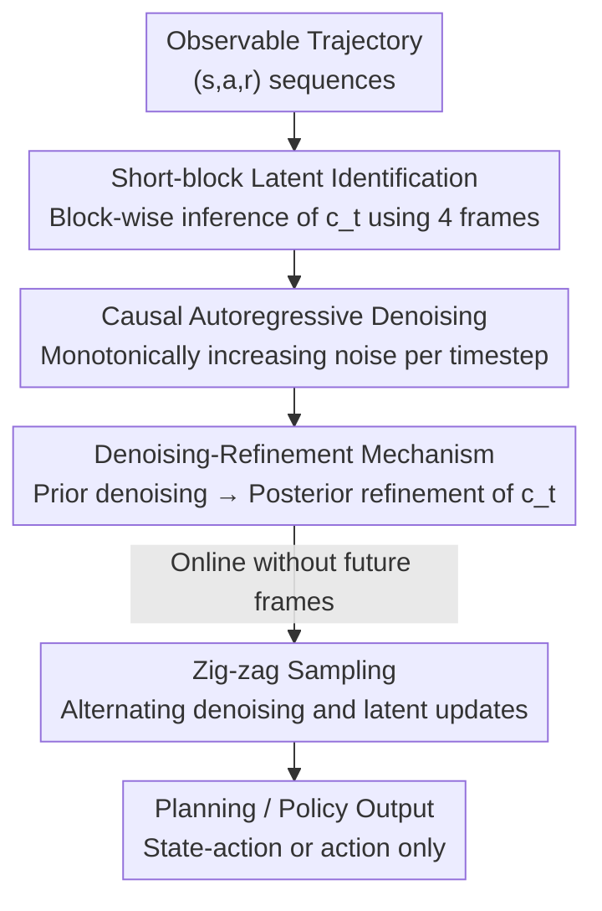

# Ada-Diffuser: Latent-Aware Adaptive Diffusion for Decision-Making

**Conference**: ICLR2026  
**OpenReview**: [https://openreview.net/forum?id=PKifFVXtSR](https://openreview.net/forum?id=PKifFVXtSR)  
**Code**: Project Page <https://sites.google.com/view/ada-diffuser>  
**Area**: Reinforcement Learning / Diffusion Decision-Making  
**Keywords**: Diffusion Decision-Making, Latent Variable Identification, POMDP, Autoregressive Diffusion, Causal Generation

## TL;DR
Ada-Diffuser explicitly incorporates "time-evolving hidden contexts (wind, goals, skills)" into diffusion-based decision models. It theoretically demonstrates that latent variables can be identified using a small temporal block of only 4 adjacent observations. By employing a "denoising-refinement" mechanism and zig-zag sampling, the model performs online latent inference and planning/control, consistently outperforming existing diffusion planners and latent context baselines across 23 settings in 8 environments.

## Background & Motivation
**Background**: A popular recent strategy treats decision-making as a "sequence generation problem," utilizing Transformers (Decision Transformer series) or diffusion models (Diffuser, Diffusion Policy) to directly generate future state-action trajectories and execute high-reward sequences. These generative decision-makers are highly expressive, scalable, and achieve impressive performance.

**Limitations of Prior Work**: Most existing methods assume environments are fully observable, ignoring **time-varying hidden factors**—such as sudden wind in robotics, switching target objects in manipulator control, or unobserved latent factors driving state transitions in healthcare/economics. When these latent variables exist and evolve, generative models that purely fit the "observed trajectory distribution" will model the dynamics incorrectly and produce sub-optimal decisions.

**Key Challenge**: Traditional POMDP or meta-RL methods encode historical observations into a belief state to represent latent states. However, this typically **requires either complete historical trajectories or data from multiple environments**, which is computationally expensive in high-dimensional spaces and naturally conflicts with the "scalability" of modern generative decision models. The core problem is: can the latent factors governing dynamics and rewards be identified using **minimal observations** and seamlessly integrated into a scalable diffusion framework while maintaining theoretical guarantees?

**Key Insight**: The authors model the system as a "time-evolving" latent contextual POMDP and characterize the data generation process using Structural Causal Models (SCM). A critical observation is that under mild assumptions, identifying the latent factor at time $t$ **only requires a short temporal window (4 observations total)**, rather than the entire trajectory.

**Core Idea**: Replace "whole-trajectory belief states" with "short-block latent identification + causal autoregressive diffusion." This couples latent variable inference and trajectory generation within a single diffusion model to achieve online, scalable, and identifiable adaptive decision-making.

## Method

### Overall Architecture
Ada-Diffuser addresses the problem of "online inference of evolving latent contexts $c_t$ while generating high-quality trajectories." It decomposes trajectory generation into two serial modules: the **Stage 1 Latent Identification Block** estimates a sequence of latent variables $\hat c_{0:T}$ from observed trajectories; the **Stage 2 Causal Diffusion Model** then learns the causal generation process of RL trajectories through autoregressive denoising conditioned on these latents.

Theory first: Theorem 1 ensures that the posterior $p(c_t \mid x_{t-2:t+1})$ is identifiable up to an invertible transformation—meaning a short window including one future frame is sufficient. However, a contradiction arises: identification requires future observations, which are **unavailable during online inference**. The method's elegance lies in its design of a "denoising-refinement + zig-zag sampling" mechanism to infer high-quality latents even without ground-truth future frames.

The following diagram illustrates the overall data flow from observable trajectories to planning/policy output:

### Key Designs

**1. Short-block Latent Identification: Replacing Belief States with 4-Frame Windows**

To solve the issue that latent identification requires full history or multi-environment data, the authors use causal identifiability theory to prove that a **minimal sufficient block** can recover latent variables. The system is modeled as a latent time-varying contextual MDP $M=(S,A,C,\mathcal T,R, \gamma)$, where latents evolve as $c_t \sim p(c_t\mid c_{t-1})$ and remain unobserved during training and inference. The SCM describes the data generation: $c_t=h(c_{t-1},\eta_t)$, $s_t=f(s_{t-1},a_{t-1},c_t,\epsilon_t)$, $a_t=\omega(s_t,c_t)$, $r_t=g(s_t,a_t,c_t,\delta_t)$. Under three mild assumptions (first-order MDP, distributional variability, and uniqueness of spectral decomposition), Theorem 1 states that the posterior $p(c_t\mid x_{t-2:t+1})$ is identifiable up to an invertible transformation $\hat c_t=h(c_t)$. Intuitively, **a short window containing one future frame carries all information needed to recover latent factors**. This reduces "expensive whole-trajectory inference" to "online sliding window inference."

Implementation-wise, Stage 1 uses variational inference: given block $x_{t-T_x:t+1}$, the prior $p_\phi(c_t\mid c_{t-1})$ looks only at intra-block history, while the posterior $q_\psi(c_t\mid x_{t-T_x:t+1})$ incorporates future observations to optimize the ELBO:

$$\mathcal L_{\text{ELBO},t}=\mathbb E_{q_\psi}\big[-\log p_\theta(x_t\mid x_{t-1},c_t)\big]+D_{\mathrm{KL}}\big(q_\psi(c_t\mid x_{t-T_x:t+1})\,\|\,p_\phi(c_t\mid c_{t-1})\big),$$

The reconstruction term is instantiated based on observable modalities. Encoders/decoders are implemented via GRU+MLP.

**2. Causal Autoregressive Denoising: Aligning Noise Schedules with Temporal Causal Structure**

Standard diffusion treats the entire trajectory uniformly with the same noise level, which fails to capture the autoregressive nature of sequential decision-making. The authors assign a **monotonically increasing noise level** $k_i=\frac{i}{T}K$ to a trajectory of length $T$, where the denoising progress of each timestep depends on its temporal distance from the anchor and the inferred latents. Denoising proceeds block-by-block autoregressively:

$$p_\theta\big(x^0_0,\dots,x^0_{T-1}\mid x^{k_1}_0,\dots,x^{k_T}_{T-1},\hat c_{0:T}\big),$$

This step-by-step process naturally aligns with the causal chain of "fixed past $\rightarrow$ gradually revealed future." This core is flexible: for planning, it generates the full trajectory $\{x_t,\dots,x_{t+T_p}\}$; for policy learning, it generates actions $\{a_{t+1},\dots,a_{t+T_a}\}$.

**3. Denoising-Refinement Mechanism: Bridging the Future Gap**

Since future observations are unavailable online, the denoising-refinement mechanism alternates between denoising and latent estimation. **During training**, it first samples from the prior $\hat c^{\text{prior}}_t\sim p_\phi(c_t\mid c_{t-1})$ to denoise and obtain $\hat x^{(0)}_t=\epsilon_\theta(x^{k_t}_t,k_t,\hat c^{\text{prior}}_t)$, then uses the posterior (which sees the future) to sample $\hat c^{\text{post}}_t\sim q_\psi(c_t\mid x_{t-k:t+1})$ for a refined prediction $\hat x^{(0)'}_t$. A **contrastive improvement loss** forces the posterior to outperform the prior:

$$\mathcal L_{\text{rel}}=\mathrm{softplus}\big(\log \mathcal L_{\text{post}}-\log \mathrm{sg}(\mathcal L_{\text{prior}})+m\big),$$

This distills the prior network to approach the "future-aware" posterior, ensuring reliable estimates online using only the prior.

**4. Zig-zag Sampling: Maintaining Consistency between Sequences and Latent Dynamics**

Zig-zag sampling weaves autoregressive denoising and latent refinement together: it starts with maximum noise $K$ and denoises timestep by timestep. For each $t$, it first uses the prior $\hat c^{\text{prior}}_t$ to denoise $x^K_t$ to an intermediate level $k_1$. Then, it uses the posterior $q_\psi(c_t\mid x^0_{t-k:t-1},x^{k_1}_t,x^{k_2}_{t+1})$ to update latents—here, the "future frame" $x^{k_2}_{t+1}$ is a **noisy estimate** rather than the ground truth. Finally, it uses the refined $\hat c^{\text{post}}_t$ to denoise $x^{k_1}_t$ to a clean $x^0_t$. This ensures the generated sequence is consistent with its latent dynamics.

### Loss & Training
The total objective consists of three parts: the diffusion loss $\mathcal L_{\text{diff}}=\mathbb E\big[\|\epsilon_\theta(\tau^t,t,y(\tau),c)-\epsilon\|^2\big]$, the Stage 1 ELBO, and the denoising-refinement objective $\mathcal L_{\text{d-r}}$. Latent identification uses GRU+MLP for encoders and MLP for decoders. The denoising network uses UNet or Transformer.

## Key Experimental Results

### Main Results
Testing across 8 environments and 23 settings, including MuJoCo locomotion, Maze2D, Franka-Kitchen, Robomimic, and LIBERO-10. Latent factors affecting dynamics ($c_s$) and rewards ($c_r$) were injected, distinguishing between per-episode (E) and per-step (S) variations.

| Environment (Latent Type) | Diffuser | DF | DF+DynaMITE | DF+LILAC | MetaDiffuser | Ada-Diffuser |
|--------|------|------|------|------|------|------|
| Cheetah-Wind-E ($c_s$) | -120.4 | -105.8 | -82.3 | -91.5 | -95.3 | **-68.9** |
| Cheetah-Wind-S ($c_s$) | -148.5 | -102.0 | -87.2 | -96.7 | -105.6 | **-73.5** |
| Cheetah-Vel-E ($c_r$) | -102.4 | -85.6 | -60.2 | -67.8 | -62.6 | **-45.8** |
| Ant-Dir-E ($c_r$) | 188.6 | 195.4 | 266.7 | 233.6 | 229.4 | **285.3** |

(Ada-Diffuser-Planner results based on 5 seeds; higher is better except for negative reward scenarios). Ada-Diffuser consistently outperforms diffusion baselines even when equipped with other latent context modules.

### Ablation Study

| Dimension | Configuration | Cheetah ($c_s$) | LIBERO |
|------|------|------|------|
| Latent ID | Full | **-73.5** | **93.4** |
|  | w/o latents | -103.5 | 89.3 |
|  | Freeze (at 10%) | -110.4 | 90.2 |
|  | Dim 4× / 6× | -89.5 / -102.4 | 87.6 / 85.0 |
| Causal Diff | Full | **-73.5** | **93.4** |
|  | w/o refine | -82.0 | 83.9 |
|  | w/o zigzag | -91.6 | 91.4 |
|  | same NS (fixed noise) | -89.7 | 85.2 |

### Key Findings
- **Latent module is critical**: Performance drops sharply (-73.5 $\rightarrow$ -103.5) if latents are removed or frozen, as the system must adapt to evolving contexts.
- **Backward refinement is the biggest contributor**: Removing refinement increases linear probe MSE from 0.18 to 0.28. The gap between the full model (0.18) and a future-aware oracle (0.12) is small, proving "noisy future estimates" are sufficient.
- **Identification accuracy correlates with reward**: Higher latent identification accuracy directly leads to higher normalized rewards, validating the importance of latent factors for decision-making.

## Highlights & Insights
- **Theory-driven "Minimal Sufficient Block"**: Compressing whole-trajectory requirements into a 4-frame window justifies in-block online inference and directly informs hyperparameter selection.
- **Resolving the Future Contradiction**: The denoising-refinement + zig-zag sampling elegantly handles the absence of future frames online by "hallucinating" a usable future.
- **Unified Core**: A single framework covers latent dynamics, rewards, actions, and even environments without explicit latents (where it defaults to Bayesian filtering), demonstrating broad utility.

## Limitations & Future Work
- Theoretical guarantees rely on first-order MDP and specific distributional assumptions; performance may degrade in highly non-stationary or weak-context real-world scenarios.
- Identification is limited to "up to an invertible transformation," which may restrict applications requiring highly interpretable latent variables.
- The zig-zag sampling relies on noisy future estimates; it remains to be seen if approximation errors accumulate in extremely long-horizon or rapidly changing latent dynamics.

## Related Work & Insights
- **vs. Pure Diffusion (Diffuser/DP)**: Ada-Diffuser explicitly models hidden contexts, leading to significant gains in latent-influenced settings and parity or slight gains elsewhere.
- **vs. Latent Context RL (MetaDiffuser/LILAC)**: Ada-Diffuser achieves online, single-environment scalability using short blocks rather than belief states or multi-environment data.
- **vs. Autoregressive Diffusion (Diffusion Forcing)**: Ada-Diffuser incorporates latent identification and dual-layered causal structures (temporal and latent) rather than just per-step noise scheduling.

## Rating
- Novelty: ⭐⭐⭐⭐⭐ Bridge between identifiability theory and diffusion decision-making is well-executed.
- Experimental Thoroughness: ⭐⭐⭐⭐ Solid across many settings, though lacking "wild" real-world deployment.
- Writing Quality: ⭐⭐⭐⭐ Clear logic; complex notation is handled consistently.
- Value: ⭐⭐⭐⭐⭐ Provides a theoretically grounded and scalable paradigm for generative decision-making with latent processes.

<!-- RELATED:START -->

## Related Papers

- [\[ICLR 2026\] EMFuse: Energy-based Model Fusion for Decision Making](emfuse_energy-based_model_fusion_for_decision_making.md)
- [\[ICLR 2026\] Information-based Value Iteration Networks for Decision Making Under Uncertainty](information-based_value_iteration_networks_for_decision_making_under_uncertainty.md)
- [\[ICLR 2026\] Accelerating Diffusion Planners in Offline RL via Reward-Aware Consistency Trajectory Distillation](accelerating_diffusion_planners_in_offline_rl_via_reward-aware_consistency_traje.md)
- [\[NeurIPS 2025\] Structured Reinforcement Learning for Combinatorial Decision-Making](../../NeurIPS2025/reinforcement_learning/structured_reinforcement_learning_for_combinatorial_decision-making.md)
- [\[ICML 2025\] Counterfactual Effect Decomposition in Multi-Agent Sequential Decision Making](../../ICML2025/reinforcement_learning/counterfactual_effect_decomposition_in_multi-agent_sequential_decision_making.md)

<!-- RELATED:END -->
