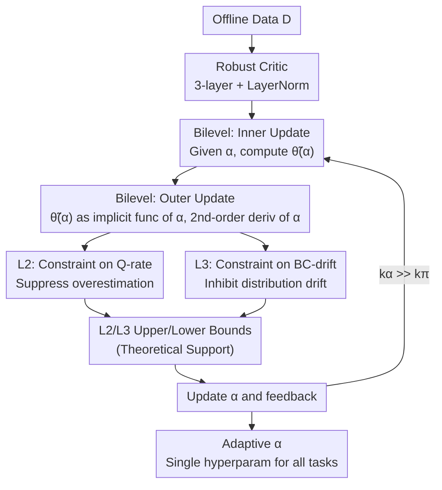

# Adaptive Scaling of Policy Constraints for Offline Reinforcement Learning

**Conference**: ICLR2026  
**OpenReview**: [https://openreview.net/forum?id=liOHottW7G](https://openreview.net/forum?id=liOHottW7G)  
**Code**: TBD  
**Area**: Reinforcement Learning / Offline RL  
**Keywords**: Offline Reinforcement Learning, Policy Constraints, Adaptive Scaling, Bilevel Optimization, TD3+BC

## TL;DR
Addressing the issue where policy constraint strength (the ratio between RL and Behavior Cloning) in offline RL must be manually tuned for each dataset, this paper proposes ASPC: treating the scaling factor $\alpha$ in TD3+BC as a learnable parameter. By using second-order differentiable bilevel optimization to dynamically adjust it during training—stabilized by constraining the rates of change for Q-values and BC loss—the method outperforms state-of-the-art (SOTA) results requiring per-dataset grid searches using **only a single set of hyperparameters** across 39 D4RL datasets, achieving a 35% average improvement over the baseline.

## Background & Motivation

**Background**: Offline RL learns policies solely from a fixed, pre-collected dataset without any environment interaction, which is critical for scenarios like autonomous driving, healthcare, or industrial control where trial-and-error is costly or dangerous. Its core challenge is **distribution shift**: querying Q-values at $(s,a)$ pairs not covered by the dataset leads to severe extrapolation overestimation, causing the policy to diverge. The primary solution is **policy constraint**, which adds a behavior cloning (BC) term during updates to keep the learned policy near the behavior policy $\pi_\beta$, exemplified by TD3+BC with the objective $\lambda Q(s,\pi(s)) - (\pi(s)-a)^2$.

**Limitations of Prior Work**: A long-neglected but decisive factor in policy constraint methods is the **scale of the constraint**—the balance between the RL objective and the BC term. This ratio varies drastically across tasks and data qualities: high-quality data requires more trust in BC, while low-quality data needs more trust in RL. Existing methods fall into two suboptimal categories: first, those relying on **per-dataset manual hyperparameter tuning** (e.g., ReBRAC, IQL), which collapse when a single configuration is used across all datasets (as shown in Figure 1(b)); second, **adaptive variants with fixed hyperparameters** (e.g., wPC, GORL), which only reweight **local** samples/actions without addressing the **global trade-off scale**, leaving a performance gap compared to fine-tuned baselines.

**Key Challenge**: Exhaustive grid searching is often infeasible in real-world offline RL. The challenge is: **Can a single set of hyperparameters achieve performance matching or exceeding fine-tuned methods across diverse datasets?** Existing "local weighting" only addresses the surface, failing to bridge the gap created by the fixed global scale.

**Key Insight**: Instead of treating $\alpha$ as a constant to be manually searched, it should be a **parameter optimized during training**, allowing the algorithm to adjust it based on data quality and the current training stage. The key is to provide a theoretically grounded optimization signal for $\alpha$ that does not destabilize training.

**Core Idea**: Utilize **second-order differentiable bilevel (meta-learning) optimization** to learn the scaling factor $\alpha$. The inner loop updates the policy for a given $\alpha$, while the outer loop treats the updated policy as an implicit function of $\alpha$ and adjusts it via second-order derivatives. Two terms—"constrained Q-value rate of change" and "constrained BC loss rate of change"—are added to the outer loss to push every update into a stable regime with provable performance non-degradation.

## Method

### Overall Architecture

ASPC is a **bilevel optimization loop** built on the TD3+BC backbone, with two modifications: the fixed constant $\alpha$ is replaced with a learnable parameter, and a more robust critic is employed. The combined objective remains:

$$L = \alpha\, L_{RL} + L_{BC},\qquad \lambda = \frac{\alpha}{\frac{1}{N}\sum_i |Q(s_i,a_i)|},$$

where $\lambda$ normalizes the RL term to the scale of the BC term, and $\alpha$ is the global scale to be dynamically adjusted. Training consists of three alternating nested steps: the critic updates via the Bellman objective; an **inner actor update** occurs every $k_\pi$ steps (gradient descent on policy $\theta$ for a given $\alpha$ to obtain $\tilde\theta(\alpha)$); and an **outer $\alpha$ update** occurs every $k_\pi\cdot k_\alpha$ steps (adjusting $\alpha$ via second-order derivatives of $\tilde\theta(\alpha)$). The outer loss consists of three components: $L_1$ (balancing RL/BC), $L_2$ (penalizing drastic Q-value increases), and $L_3$ (constraining BC loss drift). $L_2$ and $L_3$ act together to prevent RL or BC from spinning out of control.

### Key Designs

**1. Second-order Differentiable Bilevel Framework: From Manual Constant to Learned Parameter**

This addresses the infeasibility of per-dataset tuning. Borrowing from MAML-style meta-learning, the problem is split into two layers. The **inner loop** optimizes the policy for the current $\alpha$:

$$L_{inner}(\theta;\alpha) = \mathbb{E}_{(s,a)\sim D}\big[-\lambda(\alpha)\,Q(s,\pi_\theta(s)) + \|\pi_\theta(s)-a\|^2\big],$$

where $\lambda(\alpha)=\alpha/\mathbb{E}_s[|Q(s,\pi_\theta(s))|]$, yielding $\tilde\theta(\alpha)=\theta-\eta_\theta\nabla_\theta L_{inner}$. The **outer loop** treats $\tilde\theta(\alpha)$ as an **implicit function** of $\alpha$ and differentiates the outer objective with respect to $\alpha$ using second-order gradients:

$$\alpha \leftarrow \alpha - \eta_\alpha \frac{\partial L_{outer}(\tilde\theta(\alpha))}{\partial \tilde\theta}\frac{\partial \tilde\theta(\alpha)}{\partial \alpha}.$$

This allows $\alpha$ to respond to the real-time feedback of "what happens after an update," enabling global adjustment that local weighting methods cannot achieve.

**2. Dual Regularization $L_2/L_3$: Braking Updates via Rate of Change**

To prevent instability, two正则 terms are added: $L_2=\big(\mathbb{E}_s[Q(s,\pi_{\tilde\theta}(s))]-\mathbb{E}_s[Q(s,\pi_\theta(s))]\big)^2$ penalizes Q-value surges (a precursor to overestimation), and $L_3$ constrains BC loss drift. The form of $L_3$ is derived from Theorem 4.4 to ensure a monotonic performance bound. When Q-values fluctuate or deviate too far from the behavior policy, $L_3$ increases the penalty on BC drift to suppress distribution shift.

**3. Mutual Bounds of $L_2$ and $L_3$: Explaining Domain-Specific Requirements**

Proposition 4.2 provides the insight: under Lipschitz continuity assumptions, BC loss change ($\Delta L_{BC}$) and squared Q-value change $(\Delta Q)^2$ **bound each other**. This explains why some domains only require $L_2$ (e.g., MuJoCo), as it implicitly limits $\Delta L_{BC}$, while others like AntMaze require $L_3$. Only Maze2d requires both to be explicitly present due to weaker implicit coupling. Theorem 4.4 further guarantees that updates remain within a stable performance-improving interval.

**4. Robust Critic + Sparse $\alpha$ Updates: Ensuring Stability and Efficiency**

Dynamic $\alpha$ introduces instability. To counter this, the critic is deepened to three layers with LayerNorm. To manage the computational cost of second-order gradients, the $\alpha$ update interval $k_\alpha$ is much larger than $k_\pi$. Experiments show that increasing $k_\alpha$ (from 5 to 30) maintains high performance while reducing overhead to levels nearly identical to standard TD3+BC.

### Loss & Training
The inner loop objective is $L_{inner}$ (Eq 4). The outer loop objective is $L_{outer}=L_1+L_2+L_3$ (Eq 9). Training (Algorithm 1) involves: critic updates every step, actor inner updates every $k_\pi$ steps, and $\alpha$ outer updates every $k_\pi\cdot k_\alpha$ steps. $\alpha$ is initialized at 2.5.

## Key Experimental Results

### Main Results
Evaluated on 39 D4RL datasets. ASPC used a **single hyperparameter set**, whereas IQL and ReBRAC used **per-dataset grid searches**.

| Domain | TD3+BC* (✓) | A2PR (✓) | IQL (✗) | wPC* (✓) | ReBRAC (✗) | ASPC (✓) |
|------|------|------|------|------|------|------|
| MuJoCo Avg | 70.7 | 74.2 | 72.9 | 77.8 | 81.2 | **82.1** |
| Maze2d Avg | 68.9 | 123.5 | 46.2 | 94.6 | 96.7 | **147.2** |
| AntMaze Avg | 35.4 | 38.8 | 58.3 | **78.7** | 76.8 | 74.5 |
| Adroit Avg | 46.4 | 4.7 | 53.4 | 28.8 | **58.6** | 55.7 |
| **Total Avg** | 57.7 | 51.2 | 62.6 | 64.2 | 74.8 | **77.9** |

(✓=Fixed hyperparameters, ✗=Per-dataset tuning). ASPC achieved the highest total average (77.9), outperforming the fine-tuned ReBRAC (74.8) across all benchmarks with a single configuration.

### Ablation Study

Necessity of dynamic $\alpha$ (relative to Naive $\alpha=2.5$):
- **Ours (ASPC)**: **+36.6%** average gain over baseline.
- **Converged $\alpha$**: +25.9%.
- **Linear $\alpha$**: +17.0%.
Dynamic adaptation is superior to merely finding a better constant. Ablations of $L_1/L_2/L_3$ confirm that $L_2$ and $L_3$ are essential for stability in different task domains.

### Key Findings
- **Dynamics > Constants**: Fixing $\alpha$ to its final converged value still underperforms compared to the dynamic training process, proving the value of adaptation.
- **Interpretable $\alpha$ Evolution**: High-quality data yields smaller $\alpha$ (favoring BC), while low-quality data yields larger $\alpha$ (favoring RL).
- **Critic Robustness is Mandatory**: Without a deep critic and LayerNorm, dynamic $\alpha$ leads to catastrophic overestimation.
- **Universal Applicability**: The ASPC framework improved performance when applied to IQL, CQL, and Diffusion-QL.

## Highlights & Insights
- **Parameterization of Hyperparameters**: Successfully reformulates the human-tuning problem into an optimization problem, bridging the gap between local adaptation and global scaling.
- **Theoretical-Experimental Alignment**: Proposition 4.2 explains domain-specific behaviors, providing a rare case where theoretical bounds directly guide and explain ablation results.
- **Efficiency through Sparsity**: Demonstrates that second-order meta-learning can be efficient for RL by spacing out outer loop updates without losing performance.

## Limitations & Future Work
- **Architectural Dependency**: The reliance on a specific robust critic (LayerNorm/depth) suggests coupling that might require re-evaluation for significantly different backbones.
- **Second-order Sensitivity**: While sparse updates reduce cost, the sensitivity to $k_\alpha$ in highly non-stationary environments remains to be explored.
- **Not Universally SOTA in All Sub-tasks**: While the average is highest, specific domains (like Adroit) are still slightly outperformed by task-specific fine-tuning.

## Related Work & Insights
- **vs TD3+BC**: Automates the global scale that TD3+BC keeps fixed, enabling cross-dataset generalization.
- **vs wPC/GORL**: Addresses the "global trade-off" that local weighting methods ignore.
- **vs IQL/ReBRAC**: Replaces expensive grid search with an autonomous, robust learner.

## Rating
- Novelty: ⭐⭐⭐⭐⭐ 
- Experimental Thoroughness: ⭐⭐⭐⭐⭐ 
- Writing Quality: ⭐⭐⭐⭐ 
- Value: ⭐⭐⭐⭐⭐ 

<!-- RELATED:START -->

## Related Papers

- [\[ICLR 2026\] Offline Reinforcement Learning with Adaptive Feature Fusion](offline_reinforcement_learning_with_adaptive_feature_fusion.md)
- [\[ICLR 2026\] AutoTool: Automatic Scaling of Tool-Use Capabilities in RL via Decoupled Entropy Constraints](autotool_automatic_scaling_of_tool-use_capabilities_in_rl_via_decoupled_entropy_.md)
- [\[ICLR 2026\] Guided Flow Policy: Learning from High-Value Actions in Offline Reinforcement Learning](guided_flow_policy_learning_from_high-value_actions_in_offline_reinforcement_lea.md)
- [\[ICLR 2026\] ADM-v2: Pursuing Full-Horizon Roll-out in Dynamics Models for Offline Policy Learning and Evaluation](adm-v2_pursuing_full-horizon_roll-out_in_dynamics_models_for_offline_policy_lear.md)
- [\[ICLR 2026\] BAPO: Stabilizing Off-Policy Reinforcement Learning for LLMs via Balanced Policy Optimization with Adaptive Clipping](bapo_stabilizing_off-policy_reinforcement_learning_for_llms_via_balanced_policy_.md)

<!-- RELATED:END -->
