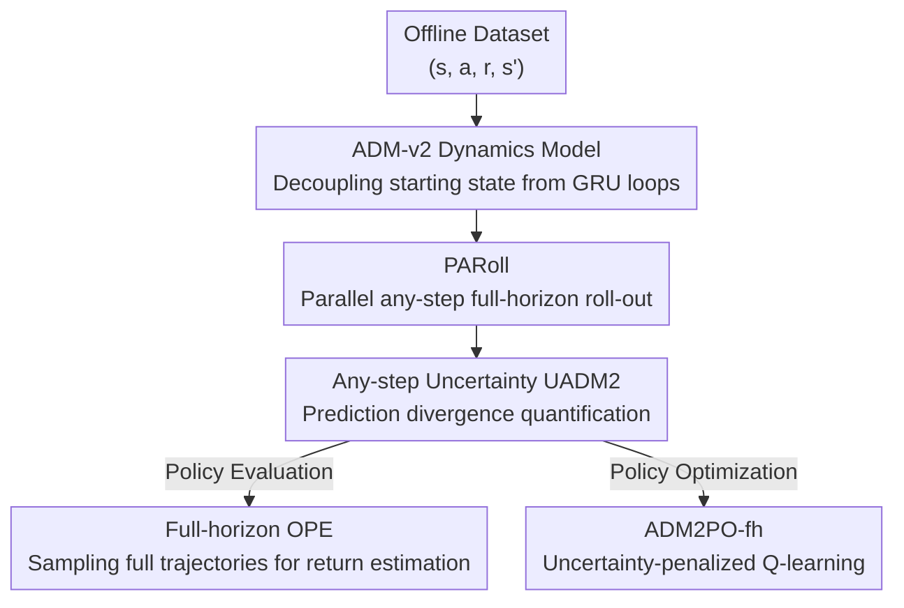

# ADM-v2: Pursuing Full-Horizon Roll-out in Dynamics Models for Offline Policy Learning and Evaluation

**Conference**: ICLR2026  
**OpenReview**: [https://openreview.net/forum?id=ICbXEwqpga](https://openreview.net/forum?id=ICbXEwqpga)  
**Code**: https://github.com/LAMDA-RL/adm2  
**Area**: reinforcement learning  
**Keywords**: Offline Reinforcement Learning, Model-based RL, Dynamics Models, Full-horizon roll-out, Uncertainty Estimation

## TL;DR
ADM-v2 structurally decouples the starting state of the "Any-step Dynamics Model" from the GRU loop. Combined with the parallel any-step roll-out algorithm PARoll, it enables dynamics models to reliably execute full-horizon roll-outs, achieving SOTA results in both offline policy evaluation (OPE) and offline policy optimization on D4RL and NeoRL.

## Background & Motivation
**Background**: Offline reinforcement learning (offline RL) learns policies from a fixed dataset without real-world interaction. Model-based offline RL (offline MBRL) first learns a dynamics model $\hat{T}$ from data and then conducts extensive policy exploration and evaluation within this model to save real samples. Ideally, the model should act as a simulator, allowing policies to roll out **an entire complete episode**.

**Limitations of Prior Work**: However, most dynamics models (ensemble models like EDM, causal models, adversarial models, etc.) fail to achieve this. They rely on **bootstrapping prediction**—where the next state is predicted based on the previous "predicted state"—causing model errors to accumulate over time (compounding error). To ensure sample reliability, mainstream MBRL algorithms (like MOPO, MOBILE) are theoretically derived under the "full-horizon roll-out" assumption but practice a compromise by using very short, **branched roll-outs** that truncate trajectories.

**Key Challenge**: Truncated roll-outs hurt policy learning and evaluation. First, truncation prevents policies from exploring edge states, affecting value function estimation; appropriate long roll-outs combined with uncertainty penalties can lead to better performance. Second, the most natural approach for Offline Policy Evaluation (OPE) is to calculate expected returns by sampling multiple complete trajectories in the model, which inherently requires long-term prediction capabilities. Thus, the fundamental problem is that **error accumulation from bootstrapping makes "full-horizon roll-out" practically unusable**.

**Key Insight**: This paper follows the paradigm of the Any-step Dynamics Model (ADM, Lin et al. 2025). ADM uses a GRU to directly model "state transitions after executing an arbitrary sequence of $k$ actions," reducing bootstrapping to **direct prediction** to suppress error accumulation. However, the original ADM has a structural burden: it duplicates the starting state $s_0$ and concatenates it with each action before feeding it into the GRU (inputs like $([s_0,a_0],[s_0,a_1],\dots)$), leading to strong coupling between the GRU hidden state and $s_0$, and preventing parallel acceleration for any-step prediction.

**Core Idea**: The starting state $s_0$ is **structurally decoupled** from every step of the GRU loop. Instead, $s_0$ is encoded into a hidden state $h_0$ only at the beginning, after which the GRU receives only actions. This makes direct prediction more accurate and stable while allowing different step-length predictions to be computed in parallel, truly supporting full-horizon roll-outs.

## Method

### Overall Architecture
ADM-v2 aims to let the dynamics model reliably run a full trajectory. The pipeline consists of four parts: first, the **ADM-v2 model** is trained from offline data (a GRU direct predictor with decoupled initial states); then, the **PARoll** algorithm executes parallel any-step full-horizon roll-outs with uncertainty; finally, these roll-outs are fed into two downstream tasks—**Full-horizon OPE** (evaluating a given policy) and **ADM2PO-fh** (policy optimization with uncertainty penalties).

Formally, ADM-v2 is denoted as $\hat{T}_\theta(s_{t+k}, r_{t+k} \mid s_t, a_{t:t+k-1})$: given a state $s_t$ and an action sequence of length $k$ ($1 \le k \le m$, where $m$ is the maximum prediction horizon), it outputs Gaussian distributions for $s_{t+k}$ and $r_{t+k}$. it consists of three components: a state encoder $\text{enc}_\theta$, a GRU unit $g_\theta$, and a transition decoder $\text{dec}_\theta$. The GRU and decoder together form an **ADM2 Unit**.

### Key Designs

**1. ADM-v2 Architecture: Decoupling the starting state from each GRU loop step**

The flaw in the original ADM was repeatedly injecting the starting state $s_t$ into every GRU input, causing strong hidden state coupling with $s_t$, a rigid structure, and lack of parallelism. ADM-v2 adopts a cleaner approach: first, it uses the state encoder to map the starting point $s_t$ to a hidden vector $h_t = \text{enc}_\theta(s_t)$, **using $h_t$ directly as the initial hidden state of the GRU**. Subsequently, the GRU only consumes actions: $h_{t+1} = g_\theta(h_t, a_t)$. The transition decoder then extracts Gaussian parameters $(\mu^s_{t+1}, \Sigma^s_{t+1}, \mu^r_{t+1}, \Sigma^r_{t+1}) = \text{dec}_\theta(h_{t+1})$ from $h_{t+1}$. The hidden state can be propagated until reaching the maximum horizon $m$.

Condensed $s_t$ information in $h_t$ without repeated injection provides two benefits: first, the sensitivity to $s_t$ perturbations in multi-step direct prediction is weakened, leading to more reliable predictions; second, this "initial hidden state + pure action sequence" structure is naturally suited for parallelism. The entire network is trained end-to-end without explicit supervision on intermediate variables like $h$, directly maximizing the log-likelihood across all $k$ horizons and averaging over $m$ steps:

$$J_{\hat{T}}(\theta) = \frac{1}{m}\sum_{k=1}^{m} \mathbb{E}_{(s_t, a_{t:t+k-1}, r_{t+k}, s_{t+k}) \sim D_{\text{env}}}\left[\log \hat{T}_\theta(s_{t+k}, r_{t+k} \mid s_t, a_{t:t+k-1})\right]$$

For long-term prediction, roll-outs are partitioned into multiple windows of length $m$. Within each window, direct prediction is performed from a real or predicted starting point without compounding error, and **bootstrapping only occurs at window transitions**. This compresses error accumulation from "every step" to "once every $m$ steps."

**2. PARoll: Computing any-step predictions in parallel to generate complete trajectories**

While ADM can estimate uncertainty by generating diverse predictions from different historical state backtracking, it is time-consuming because it requires recursive backtracking and repeated GRU calls at every step. ADM-v2 replaces the backtracking mechanism with **Parallel Any-step Roll-out (PARoll)**. At the start of a roll-out, it samples a sequence of state-actions $(s_0, a_0, \dots, s_{m-2}, a_{m-2}, s_{m-1})$ from the data. This provides $m$ different starting points at different time steps, each corresponding to a "timeline." For the $i$-th timeline, $s_{i-1}$ is encoded into $h^{(i)}_{i-1}$ and actions are recursively fed to obtain the hidden state $h^{(i)}_{m-1}$ at step $m-1$. This yields $m$ initial hidden states.

Subsequently, for each forward step, the hidden states of the $m$ timelines are **updated in parallel** with the same action: $h^{(i)}_t = g_\theta(h^{(i)}_{t-1}, a_{t-1})$, and $\hat{s}^{(i)}_t$ is decoded in parallel. Because these $m$ predictions $(\hat{s}^{(1)}_t, \dots, \hat{s}^{(m)}_t)$ originate from different starting points and traverse different transition step counts, they naturally form diverse predictions. Since the maximum training horizon is $m$, hidden states cannot be propagated indefinitely. Each timeline is reset and its hidden state re-encoded when it reaches the maximum horizon—cleverly, **only one timeline** needs to be reset at each step (timeline $(t \bmod m)+2$). Thus, each step requires only one state encoding + one parallel GRU + one parallel decoding to allow every roll-out to reach the full horizon, providing much higher efficiency than RNN-based models like ADM/RDM/P-Dreamer.

**3. Any-step Uncertainty $U_{\text{ADM2}}$ and ADM2PO-fh: Using prediction divergence as a penalty for policy optimization**

Offline policies inevitably explore dangerous regions not covered by data where the model is uncertain, requiring an uncertainty penalty. The $m$ diverse predictions generated by PARoll allow for uncertainty quantification **without an ensemble**. At each step $t \ge m-1$, one prediction is uniformly sampled from $(\hat{s}^{(1)}_{t+1}, \dots, \hat{s}^{(m)}_{t+1})$, and their variance is used as the uncertainty:

$$U_{\text{ADM2}}(s_t, a_t) = \mathbb{E}\left[\frac{1}{m}\sum_{k=1}^{m}\left((\Sigma^{(k)}_{s_t})^2 + (\mu^{(k)}_{s_t})^2\right) - (\bar{\mu}_t)^2\right]$$

where $\bar{\mu}_t = \frac{1}{m}\sum_k \mu^{(k)}_{s_t}$. This uncertainty can be calculated in parallel within PARoll with negligible extra time. Theoretically (Theorem 3.1), there exists a coefficient $\beta$ such that $\beta \cdot U_{\text{ADM2}}$ becomes a valid $\xi$-uncertainty quantifier that bounds the Bellman error. This is then used as a penalty in Q-estimation:

$$\hat{T}_{\text{ADM2}} Q(s_t, a_t) := \hat{T}^\pi Q(s_t, a_t) - \beta \cdot U_{\text{ADM2}}(s_t, a_t)$$

The intuition is: dangerous regions have high uncertainty and loose Bellman error bounds, leading to Q-overestimation, thus receiving a larger penalty. In-distribution samples have low uncertainty and are nearly unaffected. This guides the policy towards "reliable state-action regions" while pursuing performance. The policy optimization algorithm combining full-horizon roll-out with this penalty is **ADM2PO-fh**.

**4. Full-horizon OPE and Performance Bounds: Using the model as a proxy environment for direct policy evaluation**

Once ADM-v2 is learned, it can be used directly as a proxy environment. For any given policy, several complete trajectories are rolled out, and the average return is calculated for Offline Policy Evaluation (OPE). The gap between evaluated and true returns depends on the accuracy of the long-term roll-out. Theorem 3.2 provides a performance bound $|\eta(\pi) - \hat{\eta}(\pi)| \le C(\delta_{\max}, \epsilon_\pi)$, where $\delta_{\max}$ is the maximum divergence of the $k$-step transition distribution and $\epsilon_\pi$ is the policy divergence. The key conclusion: when $\delta_{\max} < \frac{\delta_1(1-\gamma^m)}{1-\gamma}$ (verified in experiments), the bound for ADM-v2 is **tighter** than that of a single-step dynamics model; if $m=1$, the bound degrades to the classic single-step model bound. This theoretically explains why models capable of full-horizon roll-out are more reliable for OPE.

### Loss & Training
The training objective is the average multi-step log-likelihood $J_{\hat{T}}(\theta)$ from Equation (1). Gradients are backpropagated through the GRU, state encoder, and transition decoder for end-to-end optimization without explicit supervision on intermediate variables. The maximum horizon $m$ is a critical hyperparameter, chosen to satisfy $\delta_{\max} < \frac{\delta_1(1-\gamma^m)}{1-\gamma}$ to ensure tighter performance bounds.

## Key Experimental Results

### Main Results
On the MuJoCo tasks of D4RL and NeoRL, ADM2PO-fh was compared against model-free methods (CQL, EDAC), short-branched roll-out MBRL (MOPO, MOBILE, MOREC, ADMPO), and full-horizon roll-out versions of other dynamics models. ADM2PO-fh achieved SOTA results on both benchmarks:

| Dataset | Metric | ADM2PO-fh (Ours) | Prev. SOTA (MOREC) | Gain |
|--------|------|------|----------|------|
| D4RL MuJoCo (Avg of 12 tasks) | Normalized Score | 87.6 | 83.7 | >4.6% |
| NeoRL MuJoCo (Avg of 9 tasks) | Normalized Score | 79.0 | 70.3 | >12.8% |

Notably, **only ADM-v2 maintained strong performance under full-horizon roll-outs**. Once MOPO and ADMPO were switched to full-horizon roll-outs (MOPO-fh, ADMPO-fh), their scores collapsed due to long-term error accumulation (e.g., D4RL average dropped from 70.3/81.0 to 36.5/56.4).

### Ablation Study

| Configuration | Key Metrics | Description |
|------|---------|------|
| ADM-v2 direct prediction vs ADM | $m$-step prediction error | ADM-v2 has lower error; structure is superior to ADM |
| Full-horizon error (horizon=1000) | roll-out error | ADM-v2 curve remains lower than EDM/RDM/P-Dreamer throughout; does not diverge at episode end |
| roll-out throughput | samples/second | ADM-v2 is faster than ADM/RDM/P-Dreamer; slightly slower than the simple EDM ensemble |
| Uncertainty-error correlation | Correlation coefficient | ADM-v2 reaches 0.928, superior to ADM(0.871), EDM(0.576), RDM(0.548) |

Regarding OPE, ADM-v2 significantly outperformed five model-free OPE methods (FQE, DR, IS, DICE, VPM) and other dynamics models across 15 tasks in the DOPE benchmark based on normalized absolute error, rank correlation, and regret@1.

### Key Findings
- **Full-horizon roll-out capability is key to performance**: ADM-v2 significiantly improves policy performance by enabling full roll-outs, whereas models lacking long-term prediction capabilities collapse under the same setting.
- **Direct prediction + decoupled starting state suppresses error accumulation**: ADM-v2's full-horizon roll-out error does not tend toward infinity even at 1000 steps, as it controls intra-window error.
- **High-quality uncertainty quantification**: An uncertainty-error correlation of 0.928 means $U_{\text{ADM2}}$ is a competent error estimator, better at distinguishing between stochastic policies, learned policies, and distributional shifts in behavior data.

## Highlights & Insights
- **Decoupling the starting state is a simple but multi-faceted improvement**: It weakens the influence of starting point perturbations on multi-step predictions (more accurate) and unlocks parallel computation (faster), while removing ADM's cumbersome backtracking—one structural change addresses accuracy, efficiency, and scalability.
- **PARoll's design is clever**: It generates diverse predictions using different backtracked starting points to estimate uncertainty, eliminating the need for ensemble models. By staggered resetting of timelines, the computational cost of diverse predictions is amortized toward a constant.
- **Elevating "model roll-out horizon" to a theoretical proposition**: Theorem 3.2 provides conditions under which full-horizon models yield tighter OPE bounds than single-step models, transforming the empirical observation into a provable conclusion.

## Limitations & Future Work
- **Slight efficiency disadvantage vs EDM**: As an RNN-based model, ADM-v2's roll-out throughput, while superior to other RNN variants, remains slightly lower than the minimalistic EDM ensemble. The authors argue this is a localized cost for fidelity gains.
- **Dependence on the choice of maximum horizon $m$**: Tighter performance bounds require $m$ to satisfy $\delta_{\max} < \frac{\delta_1(1-\gamma^m)}{1-\gamma}$. Choosing $m$ requires balancing "intra-window error accumulation" against "window transition frequency."
- **Experimental scope limited to proprioceptive MuJoCo**: Evaluations centered on state-vector based MuJoCo tasks. Full-horizon roll-out performance on high-dimensional visual observations or more complex real-world decision tasks remains to be verified.

## Related Work & Insights
- **vs Original ADM (Lin et al. 2025)**: Both suppress error accumulation using direct prediction. However, ADM replicates the starting state into every GRU step, resulting in a rigid, non-parallelizable structure. ADM-v2 decouples it as an initial hidden state and uses PARoll instead of backtracking, attaining higher accuracy and faster roll-outs.
- **vs Short-branched roll-out MBRL (MOPO / MOBILE / ADMPO)**: These presume full-horizon roll-outs in theory but compromise with short branches in practice; they fail when forced to roll out full horizons. ADM-v2 is the first to achieve SOTA under the full-horizon setting.
- **vs Ensemble Uncertainty (EDM, etc.)**: Traditional methods rely on prediction variance across multiple independent networks. ADM-v2 quantifies uncertainty via prediction divergence from different starting points within a single model, achieving higher correlation (0.928 vs 0.576).

## Rating
- Novelty: ⭐⭐⭐⭐ Structural improvements over ADM; the combination of decoupled starting states and PARoll is elegant and solves concrete problems, though it extends a mature paradigm.
- Experimental Thoroughness: ⭐⭐⭐⭐⭐ Covers dynamics model evaluation, OPE, and offline RL tasks across D4RL/NeoRL/DOPE benchmarks with multiple baselines, seeds, and theoretical bounds.
- Writing Quality: ⭐⭐⭐⭐ Clear structure with ample figure-text correspondence. Thorough theoretical treatment; some indices in PARoll require careful reading.
- Value: ⭐⭐⭐⭐⭐ Transforms "full-horizon roll-out" from a theoretical assumption to a practical tool in offline MBRL, offering direct value for policy evaluation and optimization with open-source code.

<!-- RELATED:START -->

## Related Papers

- [\[ICLR 2026\] Beyond Penalization: Diffusion-based Out-of-Distribution Detection and Selective Regularization in Offline Reinforcement Learning](beyond_penalization_diffusion-based_out-of-distribution_detection_and_selective_.md)
- [\[ICLR 2026\] MOBODY: Model-Based Off-Dynamics Offline Reinforcement Learning](mobody_model-based_off-dynamics_offline_reinforcement_learning.md)
- [\[ICML 2026\] Offline Reinforcement Learning with Universal Horizon Models](../../ICML2026/reinforcement_learning/offline_reinforcement_learning_with_universal_horizon_models.md)
- [\[ICLR 2026\] Adaptive Scaling of Policy Constraints for Offline Reinforcement Learning](adaptive_scaling_of_policy_constraints_for_offline_reinforcement_learning.md)
- [\[ICLR 2026\] Efficient Offline Reinforcement Learning via Peer-Influenced Constraint](efficient_offline_reinforcement_learning_via_peer-influenced_constraint.md)

<!-- RELATED:END -->
