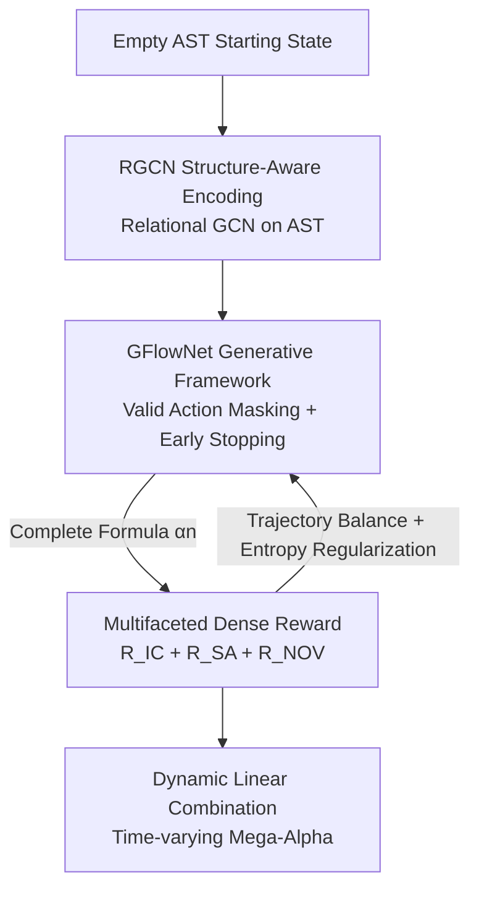

# AlphaSAGE: Structure-Aware Alpha Mining via GFlowNets for Robust Exploration

**Conference**: ICLR 2026  
**OpenReview**: [https://openreview.net/forum?id=zRKF4ln2VE](https://openreview.net/forum?id=zRKF4ln2VE)  
**Code**: https://github.com/BerkinChen/AlphaSAGE  
**Area**: Quantitative Finance / Generative Flow Networks / Symbolic Expression Mining  
**Keywords**: alpha mining, GFlowNets, RGCN, structure-aware, diversity reward

## TL;DR
AlphaSAGE reformulates formulaic alpha mining in quantitative stock selection from "Reinforcement Learning maximizing expected return" to "Generative Flow Networks (GFlowNets) sampling proportional to rewards." By incorporating an RGCN structural encoder and multifaceted dense rewards, the method discovers a collection of alpha factors that are simultaneously predictive, low-correlated, and structurally novel, significantly outperforming existing RL/GA/LLM baselines across Chinese and US stock markets.

## Background & Motivation
**Background**: The core of quantitative trading is mining "alphas"—mapping historical price-volume and fundamental data to predictive signals for future returns, typically expressed as interpretable mathematical formulas (e.g., $\text{Log}(\text{TsStd}(\text{low}, 10d))$). Early efforts relied on manual hypothesis testing, followed by Evolutionary Algorithms (GA) for formula evolution. Recently, the mainstream has shifted toward Reinforcement Learning (RL), modeling formula construction as a sequential token-by-token decision process where an agent incrementally adds operators or features to an expression.

**Limitations of Prior Work**: The authors identify three entangled issues hindering RL-based approaches. First is **sparse rewards**: feedback is only available after a complete formula is constructed and its Information Coefficient (IC) is calculated, leading to "cold-start" difficulties and inefficient exploration. Second is **inadequate representation**: most methods flatten formulas into Reverse Polish Notation (RPN) token sequences processed by LSTMs, losing hierarchical structure and treating semantically equivalent but syntactically different expressions (e.g., `close+open` vs. `open+close`) as distinct objects. Third is **mode collapse**: the objective of RL is to maximize a single expected return, causing policies to converge toward a "unique optimal solution," whereas practical trading requires a **basket of uncorrelated** alphas to diversify risk.

**Key Challenge**: The mathematical objective of maximizing expected return directly conflicts with the practical requirement for a diversified portfolio—the former seeks to converge to a single peak, while the latter aims to cover multiple peaks.

**Goal**: Simultaneously address exploration (sparse rewards), semantic understanding (structural representation), and diversity (avoiding mode collapse).

**Key Insight**: The sampling objective of GFlowNets is to ensure the probability of generating an object is **proportional to its reward** $P(\alpha)\propto R(\alpha)$, rather than only selecting the optimum. This naturally yields a set of "high-reward yet diverse" solutions, aligning perfectly with the requirements of alpha portfolios.

**Core Idea**: Replace RL with GFlowNets for sampling alpha distributions, utilize RGCN for structure-aware encoding on Abstract Syntax Trees (AST), and employ multifaceted dense rewards (predictivity + structural alignment + novelty) to transform sparse feedback into step-by-step signals.

## Method

### Overall Architecture
AlphaSAGE learns a **generative policy** $P_\theta(\alpha)$ within a vast formula space $\mathcal{X}$ such that the probability of sampling any alpha is proportional to a carefully designed reward $R(\alpha)$. This produces a diverse, high-quality alpha ensemble, which is then linearly combined into a time-varying "Mega-Alpha" for trading. The pipeline consists of two collaborative modules: the **AlphaGenerator** grows formulas starting from an empty AST—at each step, an RGCN encodes the current partial tree into node and graph-level embeddings, and the GFlowNet forward policy selects the next token from "syntactically valid" actions until a stop condition is met; the **AlphaEvaluator** takes the complete formula to calculate three reward components (structural alignment $R_{SA}$, novelty $R_{NOV}$, and predictivity $R_{IC}$) on historical cross-sectional data. These are synthesized into a total reward, and used alongside a policy entropy regularizer to update the GFlowNet and encoder via a Trajectory Balance objective.

### Key Designs

**1. GFlowNet Generative Framework: Sampling by Reward Instead of Optimizing for the Top**

This design directly addresses mode collapse. AlphaSAGE models formula construction as a trajectory $\tau=(s_0\to s_1\to\cdots\to s_n=\alpha)$ on a directed acyclic state graph: state $s$ is a partially constructed AST, actions involve adding an operator or feature token to an open leaf, and **illegal actions are masked** to ensure the next token is sampled from a valid distribution. GFlowNet learns a forward policy $P_F(s_{t+1}|s_t;\theta)$ for growth and a backward policy $P_B(s_t|s_{t+1};\theta)$ for decomposition. Through the flow consistency condition, the probability of generating a complete alpha satisfies $P(\alpha)=\sum_{\tau:s_n=\alpha}P_F(\tau)=R(\alpha)/Z$, where $Z=\sum_{\alpha'}R(\alpha')$ is a learnable partition function. Training utilizes the Trajectory Balance loss:

$$\mathcal{L}_{TB}(\tau)=\Big(\log Z_\theta+\sum_{t=1}^{n}\log P_F(s_t|s_{t-1};\theta)-\log R(s_n)-\sum_{t=1}^{n}\log P_B(s_{t-1}|s_t;\theta)\Big)^2$$

Unlike RL which pursues a single peak, this objective forces the policy to cover the entire high-reward region, resulting in a basket of structurally distinct candidates. To prevent formulas from becoming infinitely long, an **early stopping mechanism** is added: once the stack forms a valid expression, it stops with probability $p=\text{Len}(s_t)/\text{MaxLen}$, balancing the exploration of longer formulas with the efficient production of valid ones.

**2. RGCN Structure-Aware Encoder: Equivalent Representations for Equivalent Formulas**

To address the loss of structure in sequence representations, AlphaSAGE parses each formula into an AST $T_\alpha=(V_\alpha,E_\alpha)$, which is inherently invariant to "semantically irrelevant syntactic variations." A Relational Graph Convolutional Network (RGCN) is used for encoding—standard GNNs are avoided because "edge types" in an AST are critical: a temporal operator connected to a feature versus one connected to its window length represents two completely different semantic relationships. RGCN assigns independent weights $W_r^{(l)}$ for each relationship $r$:

$$h_v^{(l)}=\text{ReLU}\Big(\sum_{r\in R}\sum_{u\in N_r(v)}\tfrac{1}{c_{v,r}}W_r^{(l)}h_u^{(l-1)}+W_0^{(l)}h_v^{(l-1)}\Big)$$

Finally, a max-pooling operation over all nodes produces the graph-level embedding $e_\alpha$. This embedding is both fed into the GFlowNet forward policy as a generation condition and used for the structural alignment reward.

**3. Multifaceted Dense Rewards: Supplementing Sparse Terminal IC with Incremental Signals**

This solves the sparse reward problem. The total reward is a time-varying weighted sum $R(\alpha,T)=R_{IC}(\alpha)+\lambda(T)R_{SA}(\alpha)+\eta(T)R_{NOV}(\alpha)$. $R_{IC}$ represents terminal predictivity (Information Coefficient); $R_{NOV}=1-\max_{\alpha'\in F_{known}}|IC(\alpha,\alpha')|$ penalizes correlation with the existing library of high-quality alphas; the **structural alignment reward $R_{SA}$** is a novel design—it requires that "alphas with similar structural embeddings should exhibit similar behaviors." Behavior distance is defined as $d_{behav}(\alpha_i,\alpha_j)=\frac{1}{D}\sum_d(Z_i(d)-Z_j(d))^2$ (the mean squared difference of standardized daily cross-sectional outputs). By applying softmax weights $w_{ij}$ based on embedding distances over K-nearest neighbors, $R_{SA}(\alpha_i)=\exp(-\sum_{j\in N_K}w_{ij}\cdot d_{behav}(\alpha_i,\alpha_j))$ aligns the structural embedding space with the actual behavioral space. Weights $\lambda(T)$ and $\eta(T)$ are annealed during training, allowing dense guidance from structure and novelty in early stages while prioritizing true predictivity later. A forward policy entropy regularizer $\mathcal{L}_{ENT}$ is added to prevent premature convergence: $\mathcal{L}_{final}=\mathbb{E}_\tau[\mathcal{L}_{TB}(\tau)]+\beta\cdot\mathcal{L}_{ENT}$.

**4. Dynamic Linear Combination: Compiling an Alpha Basket into a Time-Varying Mega-Alpha**

The diverse alphas discovered need to be deployed as a single trading signal. AlphaSAGE adopts a dynamic selection strategy: instead of a static set, it filters effective alphas in each rebalancing period and re-weights them using simple linear regression. This adapts to market style shifts while maintaining interpretability and avoiding overfitting by discarding obsolete or redundant signals.

### Loss & Training
The core objective is the Trajectory Balance loss $\mathcal{L}_{TB}$ supplemented by forward policy entropy regularization $\mathcal{L}_{ENT}$: $\mathcal{L}_{final}=\mathbb{E}_\tau[\mathcal{L}_{TB}]+\beta\mathcal{L}_{ENT}$. The weights $\lambda(T)$ and $\eta(T)$ for structural and novelty rewards are linearly annealed, ensuring that terminal IC dominates the training objective in the later stages.

## Key Experimental Results

### Main Results
Compared against traditional ML (MLP/LightGBM/XGBoost), GA (GP), RL (AlphaGen/AlphaQCM), GAN (AlphaForge), and LLM (AlphaAgent) baselines in CSI300/500/1000 (China) and S&P500 (US), AlphaSAGE ranks first across all correlation metrics and achieves the best portfolio performance (highest annualized return, lowest drawdown, highest Sharpe ratio). CSI300 results:

| Dataset | Method | IC | ICIR | RIC | RICIR | AR | MDD | SR |
|--------|------|----|----|-----|-------|-----|-----|-----|
| CSI300 | XGBoost | 0.031 | 0.243 | 0.033 | 0.248 | 5.40% | -17.5% | 1.26 |
| CSI300 | AlphaGen | 0.058 | 0.414 | 0.057 | 0.360 | 4.00% | -22.6% | 0.76 |
| CSI300 | AlphaAgent | 0.051 | 0.325 | 0.056 | 0.329 | 2.16% | -26.9% | 0.65 |
| CSI300 | **Ours (AlphaSAGE)** | **0.079** | **0.496** | **0.094** | **0.583** | **7.62%** | **-17.3%** | **1.71** |

IC improved from 0.058 (AlphaGen) to 0.079, RICIR nearly doubled (0.360 → 0.583), and Sharpe Ratio increased from 1.55 (GP) to 1.71. Multi-seed experiments demonstrate stable rankings, and cumulative return curves for CSI300 (2022–2024) show consistent outperformance with smoother drawdowns.

### Ablation Study

| Configuration | Performance Trend | Description |
|------|---------|------|
| Pure GFlowNet | Weakest | Baseline without enhancements |
| + Early Stopping (ES) | Slightly Worse | ES requires a strong encoder to be effective |
| Seq Encoder → GNN | Largest Single Gain | Structure-aware representation is the most valuable |
| + Structure Alignment (SA) | More Stable ICIR/RICIR | Enhances ranking stability and tightens drawdowns |
| + Novelty Reward (NOV) | Higher Signal Quality | Reduces factor redundancy |
| + Entropy Reg (ENT) | Overall Best | Gains in IC/RIC/AR/SR while controlling MDD |

### Key Findings
- **Structure-aware encoding (replacing sequence encoders with GNNs) is the single most significant contributor**, confirming that losing structural information is the major bottleneck for RL-based methods.
- Adding early stopping alone can degrade performance, indicating it must be paired with a strong encoder—components are interdependent.
- Novelty and structural alignment reward weights perform best in the small-to-medium range.
- Entropy regularization provides robust exploration and is the crucial final step for optimization.

## Highlights & Insights
- **Integrating Diversity into the Objective Function via GFlowNets**: While most methods rely on post-processing deduplication, AlphaSAGE ensures sampling probability is proportional to reward, generating low-correlated alphas from the start. This is a fundamental solution to the conflict between RL objectives and portfolio needs.
- **Structural Alignment Reward $R_{SA}$ Coupons Representation with Behavior**: It does not just make embeddings "syntactically similar" but constrains "similar structure ⇒ similar behavior," effectively anchoring the RGCN embedding space to actual market performance.
- **Pragmatic Reward Annealing**: Using dense structural/novelty signals early on solves the cold-start problem, then gradually transitions to true predictivity, smoothing the sparse terminal IC into a guided signal throughout training.

## Limitations & Future Work
- US market data is limited to 2020-12-31 due to source constraints, potentially affecting the timeliness of cross-market conclusions.
- The combination stage utilizes a dynamic linear approach; exploring end-to-end joint optimization for "generation + portfolio construction" remains a future possibility.
- The multifaceted reward introduces several hyperparameters ($\lambda_{max}, \eta_{max}, \beta, T_{anneal}, K$), and the cost of tuning or migrating these to new markets has not been fully discussed.
- The dependency of the early stopping mechanism on a strong encoder suggests sensitivity to implementation details.

## Related Work & Insights
- **vs AlphaGen / AlphaQCM (RL Approaches)**: These model alpha construction as sequential decisions but maximize expected return, leading to mode collapse and sparse reward issues. AlphaSAGE uses GFlowNet sampling and multifaceted rewards to lead in both IC and portfolio metrics.
- **vs AlphaForge (GAN Approach)**: AlphaSAGE adopts its dynamic linear combination but replaces the adversarial generation with a structure-aware GFlowNet, resulting in more diverse and predictive alphas.
- **vs AlphaAgent (LLM Approach)**: LLMs propose hypotheses based on natural language, whereas AlphaSAGE utilizes interpretable symbolic ASTs and graph encoding, achieving better correlation and portfolio performance across all markets.
- **vs Sequence-based Methods (RPN via LSTM)**: These methods lose structure by flattening formulas; AlphaSAGE explicitly models heterogeneous relationships between operators, features, and windows via AST + RGCN, which the ablation study identifies as the primary source of gain.

## Rating
- Novelty: ⭐⭐⭐⭐⭐ First systematic introduction of GFlowNets to formulaic alpha mining, addressing the fundamental "diversity vs. single-peak optimality" conflict.
- Experimental Thoroughness: ⭐⭐⭐⭐ Covers 4 stock pools, multiple baselines, multi-seed robustness, and component-wise ablation, though US data is slightly dated.
- Writing Quality: ⭐⭐⭐⭐ Clear problem decomposition, complete reward formulations, and consistent notation.
- Value: ⭐⭐⭐⭐⭐ Highly applicable to quantitative stock selection; the "sampling for diverse high-quality solutions" paradigm is broadly relevant to symbolic and program generation tasks.

<!-- RELATED:START -->

## Related Papers

- [\[ICLR 2026\] SHAPO: Sharpness-Aware Policy Optimization for Safe Exploration](shapo_sharpness-aware_policy_optimization_for_safe_exploration.md)
- [\[ICLR 2026\] Beyond Noisy-TVs: Noise-Robust Exploration Via Learning Progress Monitoring](beyond_noisy-tvs_noise-robust_exploration_via_learning_progress_monitoring.md)
- [\[ICLR 2026\] ROMI: Model-based Offline RL via Robust Value-Aware Model Learning with Implicitly Differentiable Adaptive Weighting](model-based_offline_rl_via_robust_value-aware_model_learning_with_implicitly_dif.md)
- [\[ICML 2026\] Decoupling Skeleton and Flesh: Efficient Multimodal Table Reasoning with Disentangled Alignment and Structure-aware Guidance](../../ICML2026/reinforcement_learning/decoupling_skeleton_and_flesh_efficient_multimodal_table_reasoning_with_disentan.md)
- [\[ICLR 2026\] Solving Football by Exploiting Equilibrium Structure of 2p0s Differential Games with One-Sided Information](solving_football_by_exploiting_equilibrium_structure_of_2p0s_differential_games_.md)

<!-- RELATED:END -->
