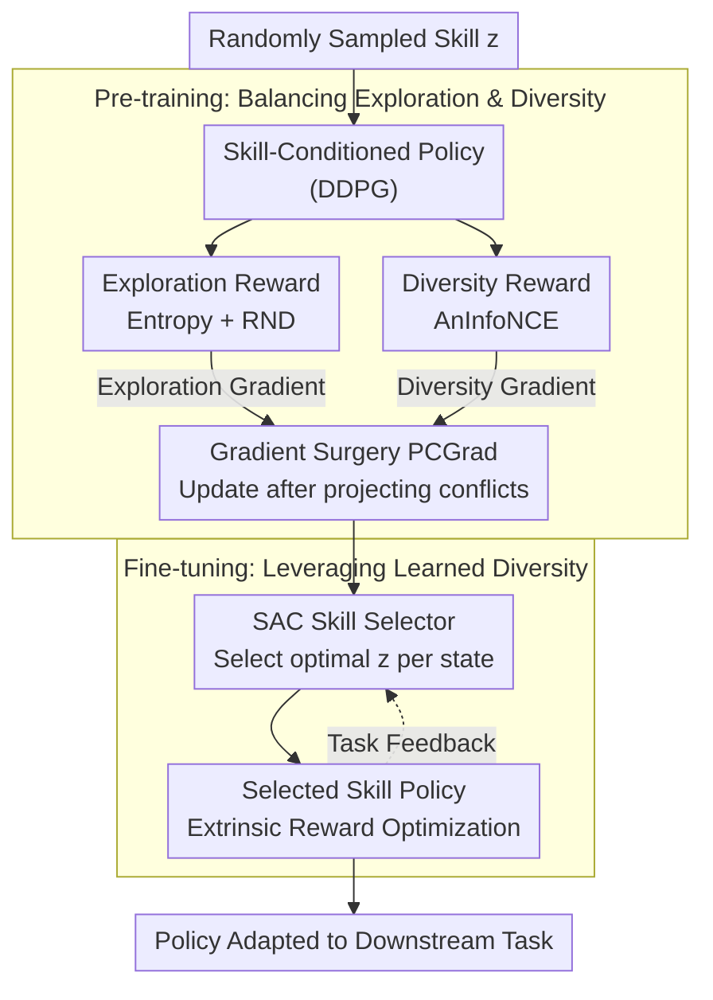

# AMPED: Adaptive Multi-objective Projection for balancing Exploration and skill Diversification

**Conference**: ICLR 2026  
**arXiv**: [2506.05980](https://arxiv.org/abs/2506.05980)  
**Code**: [https://github.com/Cho-Geonwoo/amped](https://github.com/Cho-Geonwoo/amped)  
**Area**: Reinforcement Learning / Skill Discovery  
**Keywords**: Unsupervised skill learning, gradient surgery, exploration-diversity balance, skill selector, multi-objective RL  

## TL;DR
The AMPED framework is proposed to balance gradient conflicts between exploration (Entropy + RND) and skill diversity (AnInfoNCE) using gradient surgery (PCGrad) during the skill pre-training phase. In the fine-tuning phase, an SAC-based skill selector adaptively chooses optimal skills. The method outperforms SBRL baselines such as DIAYN, CeSD, and CIC on Maze and URLB benchmarks.

## Background & Motivation

**Background**: Skill-based reinforcement learning (SBRL) enables rapid adaptation through pre-trained skill-conditioned policies. However, effective skill learning requires simultaneously maximizing exploration (covering more states) and skill diversity (making skills distinguishable).

**Limitations of Prior Work**: These two objectives are inherently conflicting. Mutual Information (MI)-driven diversity objectives often lead to premature specialization (limiting exploration), while entropy-driven exploration can sacrifice skill discriminability. Existing methods (CeSD, ComSD) directly sum reward signals without systematically addressing gradient conflicts.

**Key Challenge**: Exploration gradients drive the agent to visit broader regions, while diversity gradients drive the agent to separate different skills. These update directions can be diametrically opposed; naive summation leads to inefficient learning.

**Goal**: Systematically resolve the gradient conflict between exploration and diversity within a multi-objective RL framework and fully utilize the learned skill diversity during fine-tuning.

**Key Insight**: Exploiting exploration and diversity as two independent optimization objectives, using PCGrad gradient surgery to remove conflicting gradient components, and introducing a learned skill selector to replace random selection.

**Core Idea**: Resolving gradient conflicts in pre-training via gradient surgery and leveraging diversity during fine-tuning with a learned selector.

## Method

### Overall Architecture
AMPED addresses a fundamental contradiction in unsupervised skill learning: acquiring "useful" skills requires both broad exploration (state coverage) and skill distinguishability (diversity), yet the gradient directions for these objectives often conflict. AMPED decomposes the process into two stages. In the **pre-training phase**, the agent is conditioned on a randomly sampled skill $z$ and receives two streams of intrinsic rewards: exploration rewards (Entropy + RND) and diversity rewards (AnInfoNCE). Instead of direct summation, it calculates gradients separately and applies PCGrad gradient surgery to project away conflicting components before updating the policy. In the **fine-tuning phase**, an SAC-trained skill selector adaptively picks the most suitable pre-trained skill based on the current state and downstream task feedback, optimizing the policy with extrinsic rewards to convert pre-trained diversity into downstream gain.

### Key Designs

**1. Exploration Reward (Entropy + RND): Expanding State Coverage**

The exploration reward is a linear combination of two terms: $r_{\text{exploration}} = \alpha \cdot r_{\text{entropy}} + \beta \cdot r_{\text{rnd}}$. The first term is state entropy, estimated using the particle-based k-nearest neighbor distance as in CIC; sparser regions with more distant neighbors yield higher entropy, encouraging visits to unseen areas. The second term is the RND prediction error, measuring state novelty via the difference $\|f_\theta(s) - f_{\text{target}}(s)\|^2$ between a fixed random target network and an online predictor. These terms are used together because their effective ranges are complementary: entropy estimation is reliable when the replay buffer is small (but becomes $O(n\log n)$ as it grows, necessitating truncation), while RND maintains $O(n)$ complexity but suffers from noise early in training before the predictor converges.

**2. Diversity Reward (AnInfoNCE): Making Skills Distinguishable**

The diversity reward follows the MI-based paradigm, specifically utilizing the objective $I(S^{(1)}, S^{(2)})$ from BeCL to cluster states from the same skill and push apart states from different skills. Unlike heuristic penalties in CeSD, this provides stronger discriminative power. The primary modification is the MI estimator: AMPED replaces standard InfoNCE with Anisotropic InfoNCE (AnInfoNCE), which introduces a learnable diagonal matrix $\hat{\Lambda}$ to weight different dimensions of the embedding space ($\|x\|_{\hat\Lambda}^2 = x^\top \hat\Lambda x$). This captures the asymmetry of latent factors and provides more accurate MI estimation than standard InfoNCE.

**3. Gradient Surgery (PCGrad): Resolving Directional Conflicts**

This is the core of AMPED. Exploration gradients push for broader coverage, while diversity gradients push for skill separation. AMPED empirically finds that the conflict ratio between these gradients on URLB is as high as 0.9997 (Walker/Quadruped tasks conflict in almost every minibatch). Naive summation causes conflicting components to cancel out. AMPED applies gradient surgery: it calculates $g_{\text{explore}}$ and $g_{\text{diverse}}$ separately. If a conflict is detected ($g_1 \cdot g_2 < 0$), one gradient is projected onto the normal plane of the other with probability $p$:

$$g_1' = g_1 - \frac{g_1 \cdot g_2}{\|g_2\|^2} g_2$$

Removing the interfering component ensures that the modified gradients do not hinder either objective, allowing both to progress simultaneously.

**4. SAC Skill Selector: Utilizing Diversity in Fine-tuning**

If skills are chosen randomly during fine-tuning (as in DIAYN or CeSD), the learned diversity is wasted. AMPED models skill selection as an RL problem: a selector $p(z\mid s)$ observes the state and samples a skill $z$. The selector and policy are updated via SAC using downstream extrinsic rewards, employing $\epsilon$-greedy exploration that decays over time. This allows the agent to learn which pre-trained skills are best suited for specific tasks. Theorem 1 provides a theoretical guarantee: given a minimum total variation distance $\delta$ between skills and a distance $\varepsilon$ between the optimal skill and target policy, if the margin $\Delta = \delta - 2\varepsilon > 0$, the probability of the greedy selector failing to choose the optimal skill decreases exponentially with the number of samples ($n = O\big(\frac{1}{\Delta^2}(S\log 2 + \log H)\big)$). Higher diversity (larger $\delta$) reduces the samples required for fine-tuning.

## Key Experimental Results

### Main Results (Maze)
AMPED achieves both high state coverage and clear skill separation. In contrast, CeSD shows good coverage but mixed skill trajectories, while BeCL shows strong skill separation but significant gaps in coverage.

### Main Results (URLB)
AMPED achieves the highest returns across multiple URLB tasks, outperforming baselines including DIAYN, CIC, CeSD, BeCL, ComSD, RND, and APT.

### Ablation Study
- Removing gradient surgery → Significant performance drop.
- Removing RND → Insufficient exploration in complex environments.
- Removing AnInfoNCE → Poor skill discriminability.
- Removing the skill selector (using random selection) → Reduced fine-tuning efficiency.
- Each component provides a positive contribution.

### Key Findings
- Gradient surgery is the most critical component, directly resolving the core conflict between exploration and diversity.
- The learned skill selector is significantly more effective than random selection during fine-tuning, demonstrating that diversity is only valuable when "utilized."
- Theoretical predictions in Theorem 1 align with experiments: higher skill diversity leads to faster fine-tuning convergence.

## Highlights & Insights
- **Formalizing the exploration-diversity trade-off as a multi-objective gradient conflict** is the core insight; previous works recognized the difficulty of joint optimization but lacked the gradient-level analysis.
- **Theorem 1** provides a formal proof for "diversity $\rightarrow$ sample efficiency," answering the fundamental question of why skill diversity should be pursued.
- The overall pipeline is logically consistent: balancing objectives during pre-training to create potential assets, and utilizing that diversity during fine-tuning to realize gains.

## Limitations & Future Work
- The scalability of pairwise projections in PCGrad may be limited as the number of objectives increases.
- Validated only on continuous control tasks (MuJoCo/Maze); discrete action spaces and high-dimensional observations remain untested.
- The skill selector adds training overhead during the fine-tuning phase.
- Weight parameters $\alpha$ and $\beta$ for exploration rewards still require manual tuning.
- Lack of comparisons with traditional hierarchical RL (HRL) methods.

## Related Work & Insights
- **vs. CeSD**: CeSD sums exploration and diversity rewards directly without addressing gradient conflicts; AMPED uses systematic gradient surgery.
- **vs. DIAYN**: DIAYN is purely MI-driven and lacks sufficient exploration; AMPED explicitly incorporates exploration objectives.
- **vs. CIC**: CIC uses contrastive learning for exploration but lacks skill diversity; AMPED balances both.

## Rating
- Novelty: ⭐⭐⭐⭐ (Combination of gradient surgery in SBRL and learned selectors is innovative).
- Experimental Thoroughness: ⭐⭐⭐⭐ (Comprehensive tests across Maze, URLB, ablations, and theory).
- Writing Quality: ⭐⭐⭐⭐ (Clear motivation and intuitive visualizations).
- Value: ⭐⭐⭐⭐ (Provides a systematic solution to the exploration-diversity balance in SBRL).

<!-- RELATED:START -->

## Related Papers

- [\[ICLR 2026\] BoreaRL: A Multi-Objective Reinforcement Learning Environment for Climate-Adaptive Boreal Forest Management](borearl_a_multi-objective_reinforcement_learning_environment_for_climate-adaptiv.md)
- [\[ICLR 2026\] A Reward-Free Viewpoint on Multi-Objective Reinforcement Learning](a_reward-free_viewpoint_on_multi-objective_reinforcement_learning.md)
- [\[ICLR 2026\] Robust Multi-Objective Controlled Decoding of Large Language Models](robust_multi-objective_controlled_decoding_of_large_language_models.md)
- [\[ICLR 2026\] Self-Improving Skill Learning for Robust Skill-based Meta-Reinforcement Learning](self-improving_skill_learning_for_robust_skill-based_meta-reinforcement_learning.md)
- [\[ICLR 2026\] RAMPS: Robust Adaptive Multi-step Predictive Shield](robust_adaptive_multi-step_predictive_shielding.md)

<!-- RELATED:END -->
