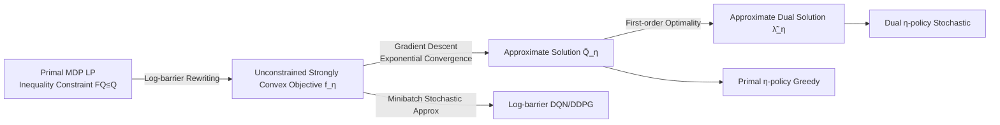

# Analysis of Approximate Linear Programming Solution to Markov Decision Problem with Log Barrier Function

**Conference**: ICLR 2026  
**OpenReview**: [https://openreview.net/forum?id=Gy83NOlS8f](https://openreview.net/forum?id=Gy83NOlS8f)  
**Code**: TBD  
**Area**: Reinforcement Learning / Theory  
**Keywords**: Linear Programming MDP, Log-barrier function, Error bounds, Convex optimization, DQN, DDPG  

## TL;DR
This paper uses a log-barrier function to rewrite the Linear Programming (LP) formulation of MDPs from an inequality-constrained problem into an unconstrained strongly convex objective $f_\eta$. The authors prove a linear error bound between the approximate optimal Q-function and the barrier parameter $\eta$, show exponential convergence for gradient descent, and design Log-barrier DQN / DDPG that eliminates the need for target networks.

## Background & Motivation
**Background**: Solving MDPs follows two main paths: Dynamic Programming (DP) based on Bellman equations (the RL mainstream, including DQN, etc.) and Linear Programming (LP) methods. The LP formulation has seen renewed interest in offline RL due to its flexibility with constraints and distributions.

**Limitations of Prior Work**: The LP formulation is inherently an **inequality-constrained optimization** problem, which is harder to solve than Bellman equations. Existing LP-based RL methods mostly employ primal-dual iterations, which exhibit slow convergence, high computational overhead, and lack convergence guarantees in many practical settings. This is the fundamental reason why the LP route has long been overlooked.

**Key Challenge**: The LP formulation offers structural advantages (direct minimization objective, natural resistance to Q-value overestimation), but its inequality constraints make it difficult to solve efficiently with simple gradient descent like Bellman methods. How can the structural advantages of LP be preserved while transforming it into an "easy-to-optimize" object?

**Goal**: To establish a framework for LP-based MDPs that is both theoretically sound and practically implementable—eliminating constraints, providing quantifiable approximation errors, and proving convergence.

**Core Idea**: **[Barrier Function Rewriting]** By borrowing the classic log-barrier function $\phi(x)=-\ln(-x)$ from convex optimization, all inequality constraints of the LP are absorbed into a single objective function. This yields an unconstrained, strictly convex optimization problem where approximate solutions can be obtained via gradient descent, and the approximation converges to the true solution as the barrier parameter $\eta\to 0$.

## Method

### Overall Architecture
The work centers on a single objective function $f_\eta(Q)$ controlled by the barrier parameter $\eta>0$. First, the primal LP based on the Q-function (minimizing $\sum \rho(s,a)Q(s,a)$ subject to $FQ\le Q$) is rewritten into an unconstrained objective using the log-barrier. It is proven to be strictly convex on the feasible region. Then, theoretical characterizations are provided regarding error bounds, convergence, and dual solutions. Finally, the minibatch stochastic approximation of this objective is used as a loss function for DQN/DDPG.

### Key Designs

**1. Log-barrier Rewriting: Melting inequality constraints into a strongly convex objective.** The constraints of the primal LP are $(FQ)(s,a,a')-Q(s,a)\le 0$, where $(FQ)(s,a,a')=R(s,a)+\gamma\sum_{s'}P(s'|s,a)Q(s',a')$. This paper applies a log-barrier penalty to each constraint, forming the objective:
$$f_\eta(Q)=\sum_{(s,a)}\rho(s,a)Q(s,a)+\eta\sum_{(s,a,a')}w(s,a,a')\,\phi\big((FQ)(s,a,a')-Q(s,a)\big),$$
As constraints approach violation, $\phi$ tends toward infinity, keeping the iterates within the strictly feasible region $D=\{Q:(FQ)-Q<0\}$. The authors prove that $D$ is a convex, open, and bounded-below set, and $f_\eta$ is strictly convex on $D$, strongly convex on any level set $L_c$, and has a Lipschitz gradient. These structural properties ensure the solvability and convergence of gradient descent. The weights $w(s,a,a')>0$ provide an interface for subsequent stochastic/minibatch sampling (e.g., empirical distribution or all ones).

**2. Closed-form Gradients and the "Manifestation" of Dual Variables.** Direct differentiation yields the gradient:
$$(\nabla_Q f_\eta(Q))(s,a)=\rho(s,a)+\gamma\sum_{(s',a')}P(s|s',a')\lambda_\eta(s',a',a)-\sum_{a'}\lambda_\eta(s,a,a'),$$
where $\lambda_\eta(s,a,a'):=\dfrac{\eta\,w(s,a,a')}{Q(s,a)-(FQ)(s,a,a')}$. The elegance lies in the first-order optimality condition (where the gradient is zero), which is **identical** to the equality constraints of the dual LP (Lemma 1). This implies that the $\tilde\lambda_\eta$ associated with the minimizer $\tilde Q_\eta$ is an approximation of the dual optimal variable $\lambda^*$. Thus, two types of policies can be derived from the same approximate solution: the greedy primal η-policy $\tilde\beta_\eta(s)=\arg\max_a\tilde Q_\eta(s,a)$, and the stochastic dual η-policy $\tilde\pi_\eta$ obtained by normalizing $\tilde\lambda_\eta$. Primal and dual information are unified within a single unconstrained problem.

**3. Two-sided Linear Error Bounds: Approximation accuracy quantified by $\eta$.** This is a core theoretical contribution. Theorem 1 provides **simultaneous upper and lower bounds** for the $\ell_\infty$ error between the approximate Q and optimal Q, both proportional to $\eta$:
$$\eta\min_{s,a,a'}w(s,a,a')<\|\tilde Q_\eta-Q^*\|_\infty\le \frac{\eta\sum_{s,a,a'}w(s,a,a')}{\min_{s,a}\rho(s,a)},$$
Similar two-sided linear bounds exist for the Bellman error $\|\tilde Q_\eta-T\tilde Q_\eta\|_\infty$. Theorem 2 extends these errors to the objective value: the gap between the return $J$ of the primal/dual η-policies and the optimal $J^{\pi^*}$ also contracts linearly with $\eta$, with the dual η-policy satisfying $J^{\tilde\pi_\eta}\le J^{\pi^*}$. The existence of a lower bound indicates that this approximation error is not merely "potentially small" but of the same order as $\eta$, providing an explainable basis for parameter tuning: smaller $\eta$ is more accurate but closer to the constraint boundary and numerically sensitive. The authors also prove that constant step-size gradient descent **converges exponentially** to $\tilde Q_\eta$ under mild conditions.

**4. Implementation in Deep RL: Log-barrier loss without target networks.** By replacing the probability densities in $f_\eta$ with minibatch sampling from a replay buffer, the DQN loss becomes:
$$L(\theta)=\frac{1}{|B|}\sum_{(s,a,r,s')\in B,\,a'}\big[Q_\theta(s,a)+\eta\,\phi(r+\gamma Q_\theta(s',a')-Q_\theta(s,a))\big].$$
There are two key differences from standard DQN: first, there is no longer an MSE Bellman loss, but rather "minimizing Q itself + barrier constraints"; second, **no target network is used**, which eliminates target synchronization. The authors candidly note that because the transition probability is outside the log-barrier, this stochastic approximation is biased in stochastic environments (it is an unbiased estimate of an upper bound surrogate of $f_\eta$ via Jensen's inequality) and only unbiased in deterministic dynamics where the Jensen gap is zero. A similar policy evaluation version gives the $L_{\text{critic}}$ for DDPG.

## Key Experimental Results

### Main Results (Discrete Control: Log-barrier DQN vs DQN)
Comparison across 5 Gymnasium environments (Acrobot-v1, CartPole-v1, LunarLander-v3, MountainCar-v0, Pendulum-v1), averaged over 10 random seeds:

| Setup | Performance |
|------|------|
| Overall | Log-barrier DQN is **on par** with standard DQN in most environments. |
| CartPole-v1 | Faster adaptation and significantly better stability (**clearly superior** in this task). |
| MountainCar-v0 | Used dense shaping rewards to replace original sparse rewards. |
| Pendulum-v1 | Discretized continuous action space for DQN compatibility. |

The authors hypothesize that the advantage in CartPole stems from the sharp "survival/termination" decision boundary: standard DQN Bellman+MSE propagates errors across boundaries, while the LP formulation minimizes the objective globally, avoiding such neighborhood estimation error propagation.

### Main Results (Continuous Control: Log-barrier DDPG vs DDPG)
Comparison on MuJoCo, 8 random seeds:

| Environment | Results |
|------|------|
| Ant / Walker2d / HalfCheetah / Humanoid | Performance is **significantly superior** to standard DDPG; solved Ant and Humanoid, which were previously considered difficult for standard DDPG. |
| Hopper (Simpler) | No significant advantage. |

### Key Findings
- **Anti-overestimation is the root cause for DDPG improvement**: The LP formulation is inherently a minimization problem ("finding the minimum Q-value satisfying Bellman consistency constraints"), acting as an implicit regularizer against optimistic overestimation. This leads to a more conservative, stable critic, providing more reliable gradients to the actor.
- **Consistency between theory and practice**: The error bounds linearly dependent on $\eta$ explain the need for careful $\eta$ tuning (the trade-off between precision and numerical stability).
- Replacing the log-barrier with SoftPlus also works, but log-barrier generally performs best.

## Highlights & Insights
- **Transformation of "difficult LP inequality constraints" into an "easy-to-optimize strongly convex objective"**, with the entire structure (convexity, strong convexity, Lipschitz) rigorously proven.
- **Two-sided (upper + lower) error bounds** are more informative than typical upper-bound-only proofs: they show the approximation error is $\Theta(\eta)$, which cannot be avoided by luck, providing an honest and explainable characterization.
- The observation that **First-order optimality = Dual LP equality constraints** is elegant: it allow the primal and dual to meet naturally in a single unconstrained problem, bypassing explicit primal-dual iterations.
- **Deep RL variants without target networks**: Translates theoretical insights (inherent overestimation resistance of LP) into practical algorithmic advantages, with particularly impressive gains in DDPG.

## Limitations & Future Work
- **Biased stochastic approximation in Deep RL**: In stochastic environments, the loss is only an unbiased estimate of an upper bound surrogate of $f_\eta$; it is strictly unbiased only in deterministic dynamics. The authors characterize this evaluation as preliminary.
- **Limited experimental scale**: Verified only on classic Gym/MuJoCo benchmarks; lacks verification on large-scale, complex tasks (e.g., full Atari suite, real-world offline RL datasets).
- **Sensitivity to hyperparameters like $\eta$**: Too small a barrier parameter approaches the constraint boundary, causing numerical instability and requiring careful tuning—stabilization techniques are discussed in Appendix Section N.
- **Gap between theory and practice**: Theoretical results for the tabular case do not directly hold under non-linear neural network approximation and only provide intuition.
- **Future Work**: Larger-scale verification, improving robustness, and extending the framework to offline RL (the natural battlefield for LP formulations).

## Related Work & Insights
- **LP/ALP Methods**: ALP by De Farias & Van Roy (2003), LRALP by Lakshminarayanan et al. (2017), convex/logistic Q-learning (Lu et al. 2021/2022, Bas-Serrano et al. 2021), and the primal-dual series. The primary difference is that **this work is the first to use barrier functions to eliminate LP inequality constraints**.
- **Barrier Functions and Safe RL**: Log-barrier is a classic tool in convex optimization (Boyd & Vandenberghe), recently used by Zhang et al. (2024) for constraint handling in SAC; this paper connects it to the LP representation of MDPs.
- **Insights**: Systematically introducing "classic constraint elimination techniques from constrained optimization" into RL solvers is a promising direction. The inherent minimization structure of LP formulations against Q-value overestimation may inspire broader conservative critic designs.

## Rating
- **Novelty**: ⭐⭐⭐⭐ First use of log-barrier to rewrite the MDP LP form as an unconstrained strongly convex problem with two-sided error bounds; fills a gap between LP-RL and barrier methods.
- **Experimental Thoroughness**: ⭐⭐⭐ Limited to classic Gym/MuJoCo benchmarks; the deep RL part is categorized as preliminary; theory is the main focus, experiments are supporting evidence.
- **Writing Quality**: ⭐⭐⭐⭐ Clear progression from motivation to theory and then to algorithms and experiments. Limitations like biased approximation are honestly addressed.
- **Value**: ⭐⭐⭐⭐ Provides a quantifiable and implementable framework for LP-based MDPs, providing practical inspiration for offline RL and anti-overestimation critic design.

<!-- RELATED:START -->

## Related Papers

- [\[ICLR 2026\] Replicable Reinforcement Learning with Linear Function Approximation](replicable_reinforcement_learning_with_linear_function_approximation.md)
- [\[ICLR 2026\] Is Pure Exploitation Sufficient in Exogenous MDPs with Linear Function Approximation?](is_pure_exploitation_sufficient_in_exogenous_mdps_with_linear_function_approxima.md)
- [\[ICLR 2026\] Solving General-Utility Markov Decision Processes in the Single-Trial Regime with Online Planning](solving_general-utility_markov_decision_processes_in_the_single-trial_regime_wit.md)
- [\[ICLR 2026\] PAMDP: Interact to Persona Alignment via a Partially Observable Markov Decision Process](pamdp_interact_to_persona_alignment_via_a_partially_observable_markov_decision_p.md)
- [\[ICLR 2026\] Universal Value-Function Uncertainties](universal_value-function_uncertainties.md)

<!-- RELATED:END -->
