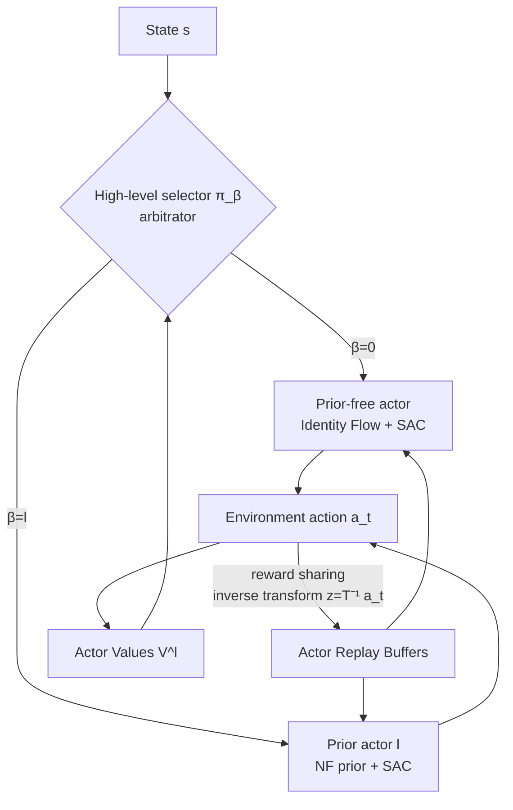

# APC-RL: Exceeding Data-Driven Behavior Priors with Adaptive Policy Composition

**Conference**: ICLR 2026  
**OpenReview**: [https://openreview.net/forum?id=gcnhcCQCv8](https://openreview.net/forum?id=gcnhcCQCv8)  
**Code**: To be confirmed  
**Area**: Reinforcement Learning / Imitation Learning / Demonstration Data  
**Keywords**: Demonstration data, behavior prior, Normalizing Flow, hierarchical reinforcement learning, policy composition, demonstration misalignment  

## TL;DR
APC employs a "learning-free arbitrator selector" to adaptively switch between multiple Normalizing Flow data priors and a prior-free actor. This approach accelerates learning when demonstrations are aligned and bypasses priors when they are suboptimal or misaligned, thereby "exceeding" the performance upper bound of the demonstration data itself.

## Background & Motivation
- **Background**: Incorporating demonstration data into RL to accelerate learning is a common strategy—either via policy regularization to mimic demonstrated actions (e.g., IL, QFilter) or by using generative models (VAE/NF) to model the demonstration action distribution as a latent space prior (e.g., PARROT, SPiRL), allowing the policy to explore within the latent space of the prior.
- **Limitations of Prior Work**: These methods implicitly assume that demonstrations are **optimal and provide full coverage**. In reality, demonstrations are often sparse, suboptimal, or misaligned with the target task. In such cases, "strictly following the data" becomes a primary cause of failure. Methods like PARROT, based on NF priors, are theoretically invertible and can "undo" the prior to learn any policy; however, in practice, the influence of the prior is **permanent**, leading to learning failure when misalignment occurs.
- **Key Challenge**: There is a need to fully utilize demonstration data when it is useful, yet completely discard it when it is useless or harmful. Existing methods bind to the prior in an "all-or-nothing" fashion, lacking the ability to online determine "where and for how long" to rely on the prior.
- **Goal**: To adaptively decide "where and for how long" to depend on demonstration data based on online reward feedback, enabling acceleration when aligned, robustness when misaligned, and breakthroughs beyond demonstration performance ceilings when suboptimal.
- **Core Idea**: **[Compositional Hierarchical Policy]** A low-level layer consists of "exactly one prior-free actor + at least one NF-based prior actor," which are adaptively picked by a high-level selector based on the value estimates of each actor. The prior-free actor provides an "escape pod" to completely decouple from demonstrations, ensuring the policy is never locked by a poor prior.

## Method

### Overall Architecture
APC (Adaptive Policy Composition) is a hierarchical RL architecture. Given $n$ reward-free, non-sequential demonstration datasets $D^{(1)}, \dots, D^{(n)}$, each prior actor pre-trains its behavior prior using a PARROT-style state-conditioned NF $T^{(l)}$. The prior-free actor uses an identity flow $T^{(0)}(z;s)=z$ to learn directly in the action space. During the online phase, a high-level selector $\pi_\beta$ selects one low-level actor to execute at each state. The selected actor uses SAC to learn a latent policy $\pi_z^{(\beta_t)}$ in its own NF latent space, sampling a latent action which is transformed via NF into an environmental action. The overall policy is a mixture of the low-level actors (with likelihood calculated via change-of-variables).

### Key Designs

**1. Compositional Policy Model: The prior-free actor as an escape pod.** The selector $\pi_\beta = \mathrm{Cat}(p_0(s), \dots, p_n(s))$ is a state-conditioned categorical distribution picking one of $n+1$ low-level actors. The overall policy is expressed in a mixture form $\pi(a \mid s) = \sum_{\beta'=0}^{n} \pi_\beta(\beta' \mid s) \pi_z^{(\beta')}(\tilde T^{(\beta')}(a;s) \mid s) | \det J_{\tilde T^{(\beta')}}(a;s) |$. Each prior actor uses its NF to map multimodal demonstration distributions into a simple unimodal Gaussian policy in the latent space. A critical distinction is the **mandatory inclusion of one prior-free actor using an identity flow**. While prior actors are efficient when demonstrations align, they fail when misaligned. The prior-free actor lacks demonstration guidance but possesses the full degree of freedom to "learn any policy from scratch via rewards." Consequently, the combined APC always has a fallback path independent of demonstrations, which is the root of its ability to "exceed the prior." To ensure NF invertibility, it is required that $|Z|=|A|$.

**2. Reward-sharing trick: Using NF invertibility to update all actors.** In a naive scheme, only the selected actor is updated at each step, which thins out experience as the number of actors increases and introduces **primacy bias**—if a suboptimal prior actor happens to lead early on, the selector may over-commit to it, stifling exploration of other potentially stronger actors. APC leverages NF invertibility to resolve this: any executed action $a_t$ can be inversely mapped into the latent space of every prior actor $z_t^{(i)} = \tilde T^{(i)}(a_t;s_t)$. Since different datasets induce different transformations, the same $a_t$ maps to different latent coordinates $z_t^{(i)} \neq z_t^{(j)}$ for different actors. This allows the construction of valid transitions for all unselected actors to be stored in their respective replay buffers $B^{(i)}$, enabling continuous updates for every actor at every step. Note that each actor must maintain an **independent buffer** because the same latent coordinate $z$ corresponds to different environmental actions under different NFs; the reward $r_t$ is only valid for the actor that actually produced $a_t$—the inverse mapping ensures that what is written into other buffers is semantically correct $(s, z^{(i)}, r, s')$. Ablations prove this step is indispensable for sample efficiency and suppressing primacy bias.

**3. Learning-free arbitrator selector: Determining probability directly from value.** Instead of training an independent high-level neural network, the selector utilizes an arbitrator design—selection probabilities are obtained directly from the value estimates of each low-level actor via softmax: $p_l(s) = \frac{1}{Z} \exp \left( \frac{1}{\eta} V^{(l)}(s) \right)$, where $\eta$ is a temperature controlling sharpness. Since the low-level uses SAC and lacks ready-made state values, APC uses a Monte-Carlo approximation: by sampling a latent action $z^{(l)}$ for each actor, $p_l(s) = \frac{1}{Z} \exp \left( \frac{1}{\eta} Q^{(l)}(s, z^{(l)}) \right)$ provides an unbiased (though high-variance) estimate. This design offers two benefits: it eliminates the extra parameters and gradient overhead of training a high-level policy and avoids the instability (learning rate sensitivity, low-level non-stationarity, primacy bias, difficult exploration) inherent in jointly optimizing high and low levels in hierarchical RL. Ablations show this learning-free selector significantly outperforms "learned" high-level policies in both stability and performance.

## Key Experimental Results

### Main Results (Three continuous control benchmarks)

| Environment | Setting | APC Performance | Comparison |
| :--- | :--- | :--- | :--- |
| PointMaze (Misaligned, Exp i) | Expert demos for one goal; test on three others | Converges to 100% success in ~0.5M steps, faster than SAC from scratch | PARROT 0% / IL 7% (still failing at 1.5M steps) |
| FrankaKitchen microwave (Misaligned) | Optimize microwave task using NF priors from other tasks | Solves the target task in all configurations | PARROT and IL suffer severe sample inefficiency or total failure |
| PointMaze / Kitchen (Aligned, Exp ii) | Demos perfectly aligned with task | Significantly faster than IL/QFilter/SAC; slightly slower than PARROT | PARROT is fastest (BC is near-optimal) |
| CarRacing (Suboptimal human demos, Exp iii) | ~30k steps of human driving data | Reaches optimal return (~900) in ~30k steps | SAC ~250k steps; PARROT stuck at suboptimal prior ceiling; IL/QFilter even slower |

### Ablation Study (CarRacing, Exp iv)

| Variant | Selector | Reward Sharing | Results |
| :--- | :--- | :--- | :--- |
| Full APC | Arbitrator | ✓ | Optimal; arbitrator switches to prior-free actor for high returns |
| No reward sharing | Arbitrator | ✗ | Performance degrades |
| Learned selector | Learned hierarchical | ✓ | Unstable |
| Learned + No sharing | Learned hierarchical | ✗ | Over-commits to prior actors; low returns |

### Key Findings
- **Outperforming SAC when misaligned**: APC is surprisingly faster than SAC learned from scratch under misaligned priors, indicating it treats "misaligned priors" as useful exploration signals rather than burdens.
- **Breaking the ceiling when suboptimal**: While PARROT is locked near human levels by suboptimal human demonstrations, APC uses them as a warm-start and then surpasses them, reaching optimality in ~30k steps.
- **Necessity of both components**: Visualizations show that the arbitrator + reward sharing switch to the prior-free actor as appropriate, while learned selectors without sharing over-commit to prior actors, resulting in lower returns.

## Highlights & Insights
- **The "escape pod" actor design is minimalist yet fundamental**: By mandating a prior-free actor at the low level, the "trust in demonstrations" is transformed from an implicit assumption into an explicit selection that can be revoked online, resolving the fundamental flaw of PARROT-style methods where prior influence is permanent.
- **Novel application of NF invertibility**: While invertibility was previously used to "theoretically undo the prior," this work uses it to share experience across actors (inverse mapping the same action into every latent space), simultaneously addressing sample efficiency and primacy bias.
- **Learning-free arbitrator bypasses hierarchical RL obstacles**: By using Q-values directly for selection probabilities instead of training a high-level policy, the method avoids non-stationarity and instability in joint optimization, making it more engineering-efficient.

## Limitations & Future Work
- **Arbitrator depends on accurate Q-estimation**: Selection probabilities are driven by Monte-Carlo Q approximations, which have high variance; APC is slower than PARROT in aligned settings because it must first learn accurate Q-values for the arbitrator to recognize the good prior.
- **Linearly increasing overhead with actor count**: Each demonstration dataset requires its own SAC + NF + buffer. As $n$ grows, computational and memory costs rise linearly, and reward sharing requires inverse transformations for all actors.
- **Validated only on low-to-mid dimensional continuous control**: PointMaze, Kitchen, and CarRacing have limited scales. Scalability to higher dimensions, image observations, or real robots remains to be verified.
- **Requirement for invertible NF**: The method is tied to Normalizing Flows (to utilize invertibility); the reward-sharing trick does not hold for non-invertible priors like VAEs or diffusion models.

## Related Work & Insights
- **PARROT (Singh et al. 2021)**: The direct baseline and foundation—single NF prior + latent space policy. APC extends it to a compositional version with multiple priors + a prior-free actor.
- **IL / QFilter (Lu 2023; Nair 2018)**: Regularization-based imitation and imitation with Q-filtering. QFilter already possesses the concept of "excluding bad demonstrations," but lacks the ability to utilize pre-trained priors for exploration.
- **Hierarchical RL and Arbitrators (Russell & Zimdars 2003)**: This work borrows the classic arbitrator concept for a learning-free selector, avoiding the instability of joint optimization in modern hierarchical RL.
- **Primacy bias (Nikishin 2022; Xu 2024)**: Explicitly incorporates the common RL issue of "overfitting to early experience" into the design motivation and mitigates it with reward sharing, providing insights for other multi-policy or ensemble RL methods.

## Rating
- **Novelty**: ⭐⭐⭐⭐ — The combination of "prior-free actor as escape pod + NF invertibility for cross-actor experience sharing + learning-free arbitrator" is quite ingenious, turning demonstration utilization from "all-or-nothing" into an online revocable choice.
- **Experimental Thoroughness**: ⭐⭐⭐½ — Coverage of three misaligned scenarios (task misalignment / suboptimal human demos) is solid and ablations are clear, but the environments are small-scale with only 3 seeds; lacks high-dimensional or real-robot verification.
- **Writing Quality**: ⭐⭐⭐⭐ — The Motivation–Method–Experiment logic is smooth. Four experimental questions correspond to four types of findings. Architecture diagrams and selector visualizations are intuitive.
- **Value**: ⭐⭐⭐⭐ — Directly addresses the pain point that "real-world demonstrations are often suboptimal/misaligned," providing a practical solution that can both provide a robust floor and exceed the demonstration ceiling. It is particularly useful for scenarios bootstrapping from suboptimal demonstrations.

<!-- RELATED:START -->

## Related Papers

- [\[ICLR 2026\] Safe Exploration via Policy Priors](safe_exploration_via_policy_priors.md)
- [\[ICLR 2026\] Webscale-RL: Automated Data Pipeline for Scaling RL Data to Pretraining Levels](webscale-rl_automated_data_pipeline_for_scaling_rl_data_to_pretraining_levels.md)
- [\[ACL 2026\] Adaptive Instruction Composition for Automated LLM Red-Teaming](../../ACL2026/reinforcement_learning/adaptive_instruction_composition_for_automated_llm_red-teaming.md)
- [\[ICLR 2026\] Prosperity before Collapse: How Far Can Off-Policy RL Reach with Stale Data on LLMs?](prosperity_before_collapse_how_far_can_off-policy_rl_reach_with_stale_data_on_ll.md)
- [\[ICLR 2026\] TRAPO: Trust-Region Adaptive Policy Optimization](trust-region_adaptive_policy_optimization.md)

<!-- RELATED:END -->
