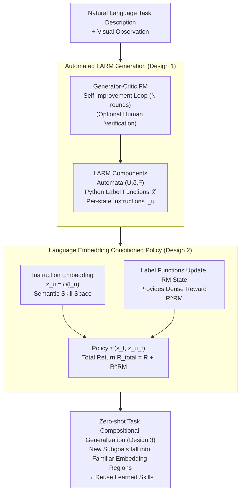

# ARM-FM: Automated Reward Machines via Foundation Models for Compositional Reinforcement Learning

**Conference**: ICLR 2026  
**arXiv**: [2510.14176](https://arxiv.org/abs/2510.14176)  
**Code**: See paper  
**Area**: Reinforcement Learning / LLM Agent  
**Keywords**: Reward Machines, Foundation Models, Compositional RL, Language-Aligned Automata, Zero-Shot Generalization  

## TL;DR
The ARM-FM framework is proposed to automatically generate Language-Aligned Reward Machines (LARM) from natural language task descriptions using foundation models (e.g., GPT-4o). These include automata structures, executable label functions, and natural language descriptions for each state. This provides compositional dense reward signals for RL agents, solving sparse-reward long-horizon tasks in environments like MiniGrid, Craftium (3D Minecraft), and Meta-World where standard RL fails, while achieving zero-shot task generalization.

## Background & Motivation

### Background

**Background**: A core bottleneck in RL is reward function design—sparse rewards provide insufficient signals, while dense rewards require manual expert design and are prone to exploitation. Reward Machines (RM) use finite state automata to decompose tasks into sub-goal sequences; though theoretically elegant, they traditionally require expert manual configuration.

**Limitations of Prior Work**: (a) High manual design costs for RMs limit widespread application; (b) While foundation models (FMs) excel at task decomposition, they struggle to generate structured reward signals usable by RL; (c) Existing FM-RL integrations (e.g., Eureka, Motif) output opaque reward models lacking composability and interpretability.

**Key Challenge**: FMs possess high-level reasoning but lack low-level control understanding for RL, whereas RL has low-level control capabilities but lacks high-level task understanding. A structured interface is needed to connect the two.

**Goal**: Use FMs to automatically generate interpretable, compositional reward specifications (RMs) that support cross-task skill sharing and generalization.

**Key Insight**: The automata structure of RMs is naturally suited for the code generation capabilities of FMs (generating states, transition functions, and label functions), and the natural language descriptions of RM states can connect different tasks via embedding spaces.

**Core Idea**: Direct FMs to generate "Language-Aligned Reward Machines" (LARM)—not only automating RM design but also building a sharable skill space through language embeddings.

## Method

### Overall Architecture
ARM-FM addresses the long-standing "reward source" problem in RL: sparse rewards lead to learning failure, and dense rewards depend on expert manual labor. The approach uses a Foundation Model (FM) to translate tasks into a Reward Machine (RM), which is then integrated into RL training. The pipeline consists of two phases: The first is **LARM Generation**, where the FM consumes natural language task descriptions and visual observations to output three components: the RM automata structure, Python label functions that map environment observations to RM event symbols, and a natural language instruction for each RM state. These outputs are refined through a generator-critic FM self-improvement loop (with optional human verification). The second is **RL Training**, where the agent's policy is conditioned on both the environment state and the language embedding of the current RM state. The RM provides dense intermediate rewards upon sub-goal completion, with the total return defined as $R_t^{\text{total}} = R_t + R_t^{\text{RM}}$. Essentially, the RM serves as a structured interface that is "FM-writable, human-readable, and RL-learnable."

### Key Designs

**1. Automated LARM Generation: Shifting RM Design from Experts to FMs**

RMs are theoretically elegant but restricted by the need for expert manual design. This design enables the FM to produce the three components of a machine simultaneously: the automata structure (state set $U$, transition function $\delta$, and terminal states $F$); executable Python label functions $\mathcal{L}: S \times A \to \Sigma$ that map raw observations to event symbols $\Sigma$; and a natural language instruction $l_u$ for each state $u$. To ensure quality, generation uses $N$ rounds of generator-critic self-improvement iterations. This is effective because the formal structure of RMs (discrete states and transition rules) aligns with FM code generation strengths, and outputs are verifiable: automata validity and label function executability can be checked directly, unlike black-box end-to-end reward models.

**2. Language Embedding Conditioned Policy: Semantic Skill Spaces instead of One-hot States**

Traditional RMs encode states as independent one-hot vectors, preventing skill transfer across tasks. This design embeds the natural language description of each RM state into a vector for the policy: $\pi(a_t | s_t, z_{u_t})$, where $z_{u_t} = \phi(l_{u_t})$ is obtained via an embedding model $\phi$. Consequently, semantically similar sub-tasks (e.g., "pick up blue key" and "pick up red key") are positioned closely in the embedding space, allowing the policy to share learned knowledge. Language embeddings transform discrete, isolated state indices into a semantically continuous skill space, forming the basis for zero-shot generalization.

**3. Zero-Shot Task Compositional Generalization: Reusing Skills in Familiar Regions**

In a continuous skill space, compositional generalization becomes a natural byproduct. If an agent is trained on Tasks A and B, and a new compositional Task C appears, the FM generates a new LARM-C. If the sub-goal embeddings $z_{u'}$ for C fall within the regions of the embedding space covered during training, the policy can reuse learned skills without retraining. Thus, solving new compositional tasks zero-shot results directly from "on-the-fly RM generation" combined with "semantic embedding-based skill reuse."

## Key Experimental Results

### MiniGrid (Sparse Reward)
- DQN+RM solves 3 long-horizon tasks (UnlockToUnlock, BlockedUnlockPickup, KeyCorridor) that all baselines (DQN/DQN+ICM/ReAct) fail to learn.
- The performance gap widens as grid size increases (8x8 to 16x16) in the DoorKey task.

### Craftium (3D Minecraft Resource Collection)
- PPO+LARM successfully completes the "Diamond Collection" sequence (Log → Stone → Iron → Diamond), while baseline PPO shows nearly zero progress.

### Meta-World (Robotic Manipulation)
- SAC+LARM achieves high success rates across most continuous control tasks, significantly outperforming sparse reward baselines.

### Multi-task Generalization (XLand-MiniGrid)
- A single agent trained on 10 tasks simultaneously: baselines fail completely; rewards alone provide little help (missing current sub-goal); embeddings alone provide weak signals. The full method (rewards + embeddings) maintains high performance.
- **Zero-shot Generalization**: Agents trained on tasks A+B directly solve unseen compositional task C.

### Scaling Effects of FM
- Across 1000 LARM generation experiments: larger models yield higher accuracy (Qwen3-32B outperforms smaller models significantly).
- PCA visualization reveals distinct semantic clustering of state embeddings (separation of start/middle/end states).

## Highlights & Insights
- The positioning of **RM as an FM-RL interface** is profound—it provides a structured intermediate representation that FMs can generate, humans can understand, and RL can optimize.
- The **Language Embedding Conditioned Policy** is ingenious—tasks like "pick up blue key" naturally share policy parameters, making compositional generalization straightforward.
- Extensive experimental coverage (2D/3D/Continuous Control/Multi-task/Zero-shot) demonstrates the framework's generality.
- The **Self-improvement loop** (generator+critic FM) effectively enhances generation quality.

## Limitations & Future Work
- Executable Python code for label functions depends on environment APIs—new environments require different API specifications.
- While optional, human verification remains beneficial; full automation still has gaps.
- Primary experiments used GPT-4o; the utility of weaker FMs remains limited.
- RM expressivity is constrained by finite automata—tasks requiring counting or continuous tracking are difficult to represent.
- Zero-shot generalization is limited to re-compositions of training sub-goals; entirely novel sub-goals still require training.

## Related Work & Insights
- **vs. Eureka (Ma et al.)**: Eureka uses evolutionary strategies to generate programmatic reward functions (opaque/non-compositional), whereas ARM-FM generates RMs (structured/compositional).
- **vs. ReAct (LLM-as-agent)**: ReAct uses LLMs directly for decision-making via text interfaces (unsuitable for pixel-level control); ARM-FM uses LLMs for specification and RL for control.
- **vs. Manual RM**: Automated generation removes the expert design bottleneck, while language embeddings enhance generalization.

## Rating
- Novelty: ⭐⭐⭐⭐⭐ Automated language-aligned RM generation and skill sharing via embedding spaces is a new paradigm.
- Experimental Thoroughness: ⭐⭐⭐⭐⭐ Extremely comprehensive across four environments, multiple baselines, multi-task, zero-shot, and FM scaling analysis.
- Writing Quality: ⭐⭐⭐⭐⭐ Excellent framework visualization (Figure 1) and clear logical organization.
- Value: ⭐⭐⭐⭐⭐ Provides a new structured paradigm for FM-RL integration with both practical and theoretical contributions.

<!-- RELATED:START -->

## Related Papers

- [\[ICLR 2026\] In-Context Compositional Q-Learning for Offline Reinforcement Learning](in-context_compositional_q-learning_for_offline_reinforcement_learning.md)
- [\[ICLR 2026\] Task Tokens: A Flexible Approach to Adapting Behavior Foundation Models](task_tokens_a_flexible_approach_to_adapting_behavior_foundation_models.md)
- [\[ICLR 2026\] 3D-aware Disentangled Representation for Compositional Reinforcement Learning](3d-aware_disentangled_representation_for_compositional_reinforcement_learning.md)
- [\[ICLR 2026\] Optimistic Task Inference for Behavior Foundation Models](optimistic_task_inference_behavior_models.md)
- [\[ICLR 2026\] Zero-Shot Adaptation of Behavioral Foundation Models to Unseen Dynamics](zero-shot_adaptation_of_behavioral_foundation_models_to_unseen_dynamics.md)

<!-- RELATED:END -->
