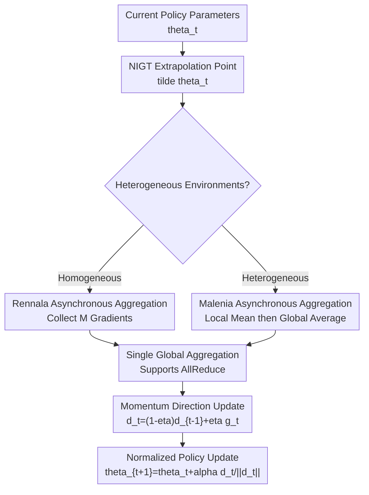

# Asynchronous Policy Gradient Aggregation for Efficient Distributed Reinforcement Learning

**Conference**: ICLR 2026  
**OpenReview**: [https://openreview.net/forum?id=SitVEPYv6W](https://openreview.net/forum?id=SitVEPYv6W)  
**Code**: Not disclosed  
**Area**: Reinforcement Learning / Distributed Reinforcement Learning  
**Keywords**: Asynchronous Policy Gradient, Distributed RL, NIGT, Communication Efficiency, Heterogeneous Computing  

## TL;DR
This paper adapts normalized implicit gradient transport (NIGT) into an asynchronously aggregatable distributed policy gradient algorithm. It proposes Rennala NIGT for homogeneous environments and Malenia NIGT for heterogeneous environments. Both theoretical complexity and MuJoCo experiments demonstrate that these methods better utilize fast workers, handle slow communication, and manage heterogeneous environments compared to AFedPG.

## Background & Motivation
**Background**: Policy gradient methods are among the most common optimization tools in reinforcement learning, ranging from classic REINFORCE to PG variants with momentum, normalization, and variance control. While single-machine theory is relatively well-understood, practical RL training increasingly relies on parallel sampling: multiple workers interact with environments simultaneously, generate trajectories, compute stochastic policy gradients, and transmit them back to a server or aggregate via AllReduce.

**Limitations of Prior Work**: Bottlenecks in distributed RL extend beyond "sample sufficiency" to practical engineering issues. First, trajectory computation time can vary significantly across workers, causing slow workers (stragglers) to delay synchronous algorithms. Second, policy gradient vectors are large; communicating every time a gradient is computed causes latency to eclipse the benefits of asynchronous sampling. While AFedPG is an important work in asynchronous policy gradients, its greedy updates require frequent communication with the server, leading to high communication complexity and a lack of native support for AllReduce.

**Key Challenge**: To achieve high speed, asynchronous RL must allow fast workers to contribute more trajectory gradients without being blocked by stragglers. However, for theoretical correctness, biased estimation of the objective function must be avoided when fast workers sample disproportionately. This contradiction manifests differently: in homogeneous environments where all workers face the same environment, more samples from fast workers are reasonable; in heterogeneous environments where workers have different rewards or policy distributions, fast workers cannot directly represent the collective.

**Goal**: The authors aim to address three issues in distributed policy gradients: reducing total computation time in homogeneous environments, decreasing aggregation frequency while supporting AllReduce when communication is expensive, and maintaining correct estimation of the average objective $J(\theta)=\frac{1}{n}\sum_i J_i(\theta)$ in federated or heterogeneous settings.

**Key Insight**: The paper starts from non-distributed NIGT. NIGT improves sample complexity through extrapolation points, momentum estimation, and normalized step sizes, but its original form does not handle multiple asynchronous workers. The observation is that the outer loop of NIGT only requires a "good enough" aggregate gradient estimate. Thus, the process of "how to asynchronously collect a batch of policy gradients" can be abstracted into an aggregator and plugged into the NIGT update.

**Core Idea**: Replace "communicating and updating upon every asynchronous gradient arrival" with "accumulating a batch of asynchronous policy gradients locally before a single aggregation." Specifically, Rennala and Malenia aggregators are designed for homogeneous and heterogeneous objectives, respectively.

## Method
### Overall Architecture
The algorithm is decoupled into two layers: the outer layer is a normalized policy update in the style of NIGT, and the inner layer is an asynchronous gradient aggregation process. The outer layer maintains a direction estimate $d_t$, calls the aggregator at the extrapolation point $\tilde{\theta}_t$ to obtain $g_t$, updates the direction via momentum $d_t=(1-\eta)d_{t-1}+\eta g_t$, and finally performs a fixed-length policy parameter update along $d_t/\|d_t\|$.

Homogeneous scenarios use AggregateRennala: all workers share the same environment distribution, so the algorithm waits until workers collectively return $M$ stochastic policy gradients. Fast workers can contribute multiple trajectories consecutively. Heterogeneous scenarios use AggregateMalenia: each worker represents a different local objective. The algorithm lets each worker form its own local average before averaging these averages globally, preventing fast workers from being over-weighted in the objective function.

### Key Designs
**1. NIGT Outer Update: Policy Optimization as "Direction Estimation + Normalized Step Size"**

The outer algorithm follows the NIGT logic of Cutkosky & Mehta and Fatkhullin et al., but replaces the objective with policy gradient estimates from truncated trajectories. Given a trajectory $\tau$ with a finite horizon $H$, the stochastic policy gradient is denoted as $g_H(\tau, \theta)$, which is an unbiased estimate of $\nabla J_H(\theta)$. By choosing a sufficiently large $H$, the gradient error between $J_H$ and the infinite horizon objective $J$ can be controlled at the $O(\gamma^H)$ level.

The key is not using $g_t$ for direct SGD, but constructing an extrapolation point $\tilde{\theta}_t=\theta_t+\frac{1-\eta}{\eta}(\theta_t-\theta_{t-1})$, aggregating gradients there, and updating the momentum direction $d_t$. The final normalized update $\theta_{t+1}=\theta_t+\alpha d_t/\|d_t\|$ decouples the step size from the gradient norm, theoretically achieving better $\varepsilon$-dependence under second-order smoothness assumptions than vanilla PG.

**2. Rennala Aggregation: Allowing Fast Workers to Contribute More in Homogeneous Settings**

In homogeneous environments, every trajectory sampled by any worker comes from the same policy and environment distribution; thus, finishing order does not affect the distribution of individual gradient samples. AggregateRennala exploits this: after broadcasting $\theta$, all workers start sampling; the algorithm does not wait for every worker to return once. Instead, whichever worker finishes first contributes to the average and immediately starts the next trajectory until $M$ gradients are collected in total.

This bypasses stragglers. If a worker is slow or disconnected, synchronous NIGT would stall, whereas Rennala's wait time is approximately determined by the harmonic mean of the fastest workers. The complexity involves $\min_{m\in[n]}[(\frac{1}{m}\sum_{i=1}^m 1/\dot h_i)^{-1}(\cdots)]$, meaning the algorithm automatically selects the "fastest $m$ workers worth waiting for."

**3. Local Accumulation + Single Communication: Preserving Asynchronous Benefits**

The asynchrony of AFedPG is characterized by updating as soon as a worker's gradient arrives, necessitating frequent communication. The proposed aggregator allows workers to accumulate gradients locally and perform one global aggregation once the batch is full. This supports both centralized server collection and decentralized AllReduce. Communication complexity is thus proportional to the number of outer iterations rather than the number of stochastic gradient calls.

This design explains the primary improvement in the small $\varepsilon$ regime: the communication term for Rennala NIGT is of order $O(\kappa\varepsilon^{-2})$, while AFedPG is at least $O(\kappa\varepsilon^{-3})$, potentially degrading to $\Omega(\varepsilon^{-7/2})$ where communication happens per oracle call. This is critical for distributed RL where parameter dimensions are high.

**4. Malenia Aggregation: Using Local Means to Preserve Global Objective Unbiasedness**

While fast workers contributing more is fine for homogeneous settings, it introduces bias in heterogeneous ones. If worker $i$ faces $J_i(\theta)$ and the global goal is $J(\theta)=\frac{1}{n}\sum_i J_i(\theta)$, letting fast workers contribute more gradients implicitly changes the objective to one weighted by computation speed.

AggregateMalenia maintains a local accumulated gradient $\bar g_i$ and sample count $M_i$ for each worker. It returns $\frac{1}{n}\sum_i \bar g_i/M_i$ rather than a simple average of all gradients. The stopping condition is based on a harmonic-style threshold for $M_i$ to ensure every local objective is sufficiently represented, maintaining an unbiased estimate of $\nabla J_H(\theta)$.

### Loss & Training
The objective is to maximize discounted return $J(\theta)=\mathbb{E}[\sum_{t=0}^{\infty}\gamma^t r(s_t,a_t)]$. The truncated objective $J_H(\theta)$ is used for computation, with the stochastic policy gradient defined as:

$$
g_H(\tau,\theta)=\sum_{t=0}^{H-1}\left(\sum_{h=t}^{H-1}\gamma^h r(s_h,a_h)\right)\nabla\log\pi_\theta(a_t|s_t).
$$

Theoretical analysis assumes bounded gradients and Hessians for the policy log-likelihood, with the Hessian being Lipschitz. These imply $J$ is gradient Lipschitz and Hessian Lipschitz, with bounded variance for $g_H$. Parameters such as momentum $\eta$, step size $\alpha$, and batch sizes are set based on the target precision $\varepsilon$.

Experiments use a Gaussian policy with a two-layer Tanh MLP (64 units), outputting mean $\mu_\theta(s)$ and standard deviation $\sigma_\theta(s)$ via Softplus. Actions are sampled via $u_t\sim\mathcal{N}(\mu_\theta(s),\mathrm{diag}(\sigma_\theta^2(s)))$ and transformed by $a_t=\alpha\tanh(u_t)$. All methods share the same hyperparameter tuning ranges: $\eta\in\{0.001,0.01,0.1\}$, learning rate $\alpha\in\{2^{-10},\ldots,2^{-1}\}$, and Rennala NIGT tunes $M=M_{init}\in\{20,30,50\}$.

## Key Experimental Results

### Main Results
The core results include theoretical complexity tables and MuJoCo performance curves. Below is a comparison of complexities in homogeneous distributed RL ($\dot h_i$ is interaction time per step for worker $i$, $\kappa$ is communication time).

| Method | Computational Time Complexity | Communication Complexity | Supports AllReduce |
|--------|------|------|----------|
| Synchronous Vanilla PG | $\max_i \dot h_i(\varepsilon^{-2}+1/(n\varepsilon^4))$ | $\kappa(\varepsilon^{-2}+1/(n\varepsilon^4))$ | Yes |
| Synchronous NIGT | $\Omega(\max_i \dot h_i/(n\varepsilon^{7/2}))$ | $\kappa\varepsilon^{-7/2}$ | Yes |
| Rennala PG/SGD | $\min_m[(\frac{1}{m}\sum_{i=1}^m1/\dot h_i)^{-1}(\varepsilon^{-2}+1/(m\varepsilon^4))]$ | $\kappa\varepsilon^{-2}$ | Yes |
| AFedPG | $(\frac{1}{n}\sum_i1/\dot h_i)^{-1}(n^{4/3}\varepsilon^{-7/3}+1/(n\varepsilon^{7/2}))$ | At least $\kappa\varepsilon^{-3}$ | No |
| Rennala NIGT | $\min_m[(\frac{1}{m}\sum_{i=1}^m1/\dot h_i)^{-1}(\varepsilon^{-2}+1/(m\varepsilon^{7/2}))]$ | $\kappa\varepsilon^{-2}$ | Yes |

| Experimental Scenario | Env / Worker Setup | Comp. & Comm. Setup | Key Observations |
|--------|------|------|------|
| Homogeneous | Humanoid-v4, $n=10$ | $h_i=1,\kappa_i=0$ | All three methods perform similarly; differences arise from asynchrony and communication. |
| Heterogeneous Comp/Comm | Humanoid-v4, $n=10$ | $h_i=\sqrt{i},\kappa_i=\sqrt{i}$ | Rennala NIGT converges faster; slow workers no longer dominate. |
| Expensive Communication | Humanoid-v4, $n=10$ | $h_i=\sqrt{i},\kappa_i=\sqrt{i}\cdot d^{1/4}$ | Rennala NIGT is the most robust; advantage grows with communication cost. |
| Multiple Environments | Reacher-v4 / Walker2d-v4 | $h_i=\sqrt{i},\kappa_i=\sqrt{i}\cdot d^{1/4}$ | Strong advantage on Reacher; smaller gaps on Walker2d/Hopper. |
| Heterogeneous Env | Humanoid-v4, $n=2$ | One standard, one flipped; $h_0=1,h_1=10$ | Malenia NIGT significantly outperforms AFedPG on the heterogeneous objective. |

### Ablation Study
The paper analyzes mechanisms through varied scenario settings rather than traditional module-removal tables.

| Configuration | Key Metric | Description |
|------|---------|------|
| Equal times | Curves overlap | Rennala aggregation provides no advantage without stragglers or bottlenecks. |
| Heterogeneous times | Faster reward gain | Asynchronous collection of $M$ gradients prevents being bottlenecked by the slowest worker. |
| Increased comm. times | Growth of Ours' advantage | Reducing communication frequency to $O(\kappa\varepsilon^{-2})$ is effective as costs rise. |
| Malenia heterogeneous env | Malenia vs. AFedPG | Local-mean-then-average avoids over-weighting fast workers in the heterogeneous objective. |

### Key Findings
- Rennala NIGT’s advantage stems from the combination of "asynchronous sampling + reduced communication" rather than model size or hyperparameter tuning.
- The advantage of Rennala NIGT over AFedPG increases with communication cost, aligning with the theoretical $O(\kappa\varepsilon^{-2})$ vs. $O(\kappa\varepsilon^{-3})$ gap.
- Malenia is necessary for heterogeneous settings; directly allowing fast workers to dominate changes the optimization target away from the equal-weighted average of environments.

## Highlights & Insights
- Rennala aggregation is elegant because it doesn't explicitly "select" fast workers but naturally achieves straggler robustness by waiting for the first $M$ results, making it more flexible for dynamic environments.
- Malenia aggregation embeds fairness into the estimator itself; averaging local means is a simple yet effective way to match the $J(\theta)$ structure.
- Treating communication complexity as a first-class citizen—rather than just sample complexity—aligns better with realistic distributed RL system bottlenecks.

## Limitations & Future Work
- Experiments use simulated delays rather than end-to-end verification on a large-scale real-world cluster.
- Heterogeneous experiments are limited in scale; they don't fully cover the complexities of real federated RL (e.g., transition or reward heterogeneity).
- Theoretical lower bounds provided apply to black-box stochastic gradient oracles; there remains an $\varepsilon$ gap between Rennala NIGT and the lower bound.
- The methodology is currently tailored for policy gradient estimators; future work could explore actor-critic baselines, GAE, or off-policy data reuse.

## Related Work & Insights
- **vs AFedPG**: AFedPG is limited to homogeneous settings, requires more frequent communication, and lacks AllReduce support; this work reduces communication to the outer-loop level.
- **vs Synchronous NIGT**: Rennala NIGT retains the sample complexity benefits of NIGT while removing the straggler bottleneck using asynchronous aggregation.
- **vs Rennala PG/SGD**: While Rennala PG/SGD offers harmonic-style computational benefits, Rennala NIGT uses momentum and normalization to improve the sample term from $1/(m\varepsilon^4)$ to $1/(m\varepsilon^{7/2})$.

## Rating
- Novelty: ⭐⭐⭐⭐☆ Combines NIGT with Rennala/Malenia aggregation naturally; clear theoretical positioning.
- Experimental Thoroughness: ⭐⭐⭐☆☆ MuJoCo results support the claims, but real distributed systems and more diverse heterogeneous tasks are needed.
- Writing Quality: ⭐⭐⭐⭐☆ Clear narrative; complexity tables are highly valuable.
- Value: ⭐⭐⭐⭐☆ Significant for high-communication/high-sampling cost training like distributed RLHF.

<!-- RELATED:START -->

## Related Papers

- [\[ICLR 2026\] DOPPLER: Dual-Policy Learning for Device Assignment in Asynchronous Dataflow Graphs](doppler_dual-policy_learning_for_device_assignment_in_asynchronous_dataflow_grap.md)
- [\[ICLR 2026\] Reinforcement Learning via Value Gradient Flow](reinforcement_learning_via_value_gradient_flow.md)
- [\[ICLR 2026\] Reevaluating Policy Gradient Methods for Imperfect-Information Games](reevaluating_policy_gradient_methods_for_imperfect-information_games.md)
- [\[ICLR 2026\] SPG: Sandwiched Policy Gradient for Masked Diffusion Language Models](spg_sandwiched_policy_gradient_for_masked_diffusion_language_models.md)
- [\[ICLR 2026\] Policy Likelihood-based Query Sampling and Critic-Exploited Reset for Efficient Preference-based Reinforcement Learning](policy_likelihood-based_query_sampling_and_critic-exploited_reset_for_efficient_.md)

<!-- RELATED:END -->
