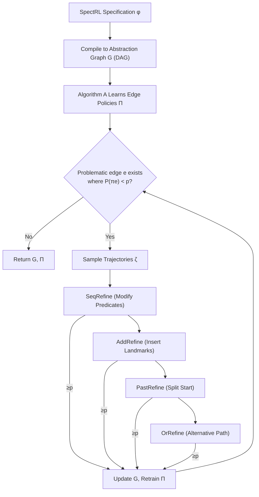

# Automating the Refinement of Reinforcement Learning Specifications

**Conference**: ICLR 2026  
**OpenReview**: [https://openreview.net/forum?id=a5jzk1hv2Y](https://openreview.net/forum?id=a5jzk1hv2Y)  
**Code**: [https://ambadkar.com/autospec](https://ambadkar.com/autospec)  
**Area**: reinforcement learning  
**Keywords**: specification-guided reinforcement learning, SpectRL, logic specification refinement, abstraction graph, reach-avoid, formal soundness  

## TL;DR
The AUTOSPEC framework is proposed to diagnose "undearnable policies due to coarse logic specifications" as failures on specific edges of an abstraction graph. It automatically refines specifications using four soundness-preserving operations (modifying predicates, inserting landmarks, splitting start regions, and finding alternative paths), enabling existing specification-guided RL algorithms to solve previously unsolvable tasks.

## Background & Motivation
**Background**: Specification-guided reinforcement learning (RL) replaces manually designed scalar rewards with logic formulas (such as the LTL fragment SpectRL). It describes tasks as boolean or sequential combinations of reach-avoid objectives (e.g., "reach A, then B, avoid C"), which are translated into dense rewards for training. A SpectRL specification can be compiled into an equivalent abstraction graph (DAG), where vertices represent sets of MDP states and edges are labeled with reach-avoid subtasks; thus, solving the task is reduced to achieving reachability on the abstraction graph.

**Limitations of Prior Work**: Existing methods assume users can provide "sufficiently fine-grained" specifications and "accurate" labeling functions (mapping states to predicates). In practice, users often provide **coarse / under-specified specifications** that are logically correct but provide insufficient guidance. For instance, a target region might be too large, including "trap states" (e.g., dead ends in the 9-rooms environment in Figure 1), or safety constraints might be too loose, leading to rewards that fail to guide the RL agent toward a useful policy.

**Key Challenge**: Coarse specifications $\to$ uninformative rewards $\to$ failure to learn policies. However, manually refining specifications is labor-intensive and requires prior knowledge of the environment (e.g., invisible walls or traps) that the user may not initially possess.

**Goal**: To automatically refine a coarse specification $\phi$ into a more detailed $\phi_r$ without user intervention. The goal is to ensure soundness, where $(\zeta \models \phi_r) \implies (\zeta \models \phi)$, while providing additional structure to make RL training easier.

**Core Idea** (**Exploration-guided Sound Refinement**): When the success probability of a learned policy falls below a threshold $p$, the framework uses sampled trajectory data to locate "hard-to-learn edges" in the abstraction graph. It applies four refinement operations with increasing structural modifications. Each operation is provably refinement-preserving. The first refinement that raises the satisfaction probability above $p$ is adopted, and the process iterates until the goal is met.

## Method

### Overall Architecture
AUTOSPEC acts as a wrapper for any SpectRL-compatible algorithm $A$ (e.g., DIRL, LSTS). The specification $\phi$ is first compiled into an abstraction graph $G$, and algorithm $A$ learns policies for each edge. For any problematic edge $e=u\to u'$ where $P(\pi_e) < p$, trajectories $\zeta$ are sampled. Refinement operations are attempted in the order **SeqRefine → AddRefine → PastRefine → OrRefine** (increasing from local to global structural changes). The refined edge is evaluated using the RL algorithm; if success exceeds $p$, $G$ is updated, policies $\Pi$ are retrained, and the next edge is processed. The final graph $G$ corresponds to the refined specification $\phi_r$.

### Key Designs
**1. SeqRefine: Tightening reach-avoid predicates using explored trajectories.** This is the most local refinement, targeting cases where the target region $b=\beta(u')$ or safety region $c=\beta(e)$ is too coarse. It consists of two sub-processes:
- **ReachRefine**: Collects states that successfully reached the target, calculates their convex hull, and intersects it with the original target to get $b_r = b \cap \mathrm{ConvexHull}(\text{reached states})$. This removes unreachable sub-regions (like traps) from the target description.
- **AvoidRefine**: Identifies states where trajectories entered unsafe zones and removes these verified dangerous areas from the safety region: $c_r = c \setminus \mathrm{ConvexHull}(\text{last } k \text{ unsafe states})$. These operations modify labels without changing graph topology to capture implicit environment constraints.

**2. AddRefine: Task decomposition by inserting intermediate landmarks.** If a path $u \to u'$ is too complex to learn as a single policy, it is split into two stages. AddRefine takes the midpoint states of successful trajectories reaching $\beta(u')$, defines a new vertex $\beta(u'') = \beta(e) \cap \mathrm{ConvexHull}(\text{midpoints})$, and replaces the edge $e = u \to u'$ with $u \to u''$ and $u'' \to u'$. This data-driven approach fills in "waypoints" the user omitted.

**3. PastRefine: Partitioning the source region by reachability.** Sometimes failure stems from the starting points—some initial states in $u$ are viable while others are not. PastRefine classifies trajectories as successful or failed for edge $e$, trains a hyperplane to separate them, and constructes a refined source $b_r$ containing only promising states. It creates a new vertex $u^*$ ($\beta(u^*) = b_r$) to replace the problematic edge while preserving other connections.

**4. OrRefine: Leveraging existing graph structures for alternative paths.** If a direct path is completely blocked (0% success), OrRefine searches for alternative parents $u_i$ of $u'$ (where $e_i = u_i \to u'$ already exists). It adds a new edge $e_{new} = u \to u_i$ and tightens $\beta(e_i)$ to test if the route $u \to u_i \to u'$ satisfies the threshold. This uses existing vertices to build new routes as a final fallback.

**Soundness Guarantee**: Theorem 1 proves that all four refinements satisfy the refinement relation (Definition 2): for any trajectory $\zeta$, $(\zeta \models \phi_r) \implies (\zeta \models \phi)$. The authors note that the problem is **not both sound and complete**—deciding if a policy satisfies a specification is undecidable for general continuous MDPs; thus, AUTOSPEC guarantees soundness but not completeness.

## Key Experimental Results

### Main Results: Algorithm Dependency under Complex Specifications (100-rooms)
Specification: $\phi=\phi_{start};(\phi_{m1}\text{ or }\phi_{m2});\phi_{m3};(\phi_{m4}\text{ or }\phi_{m5});\phi_{goal}$, featuring multiple disjunctions and sequential compositions.

| Base Algorithm | Exploration Strategy | Refinement Result | Satisfaction Prob. |
|---|---|---|---|
| DIRL | Dijkstra-style systematic exploration | Success (Seq+Past+OrRefine) | ~0% → ~60% |
| LSTS | Multi-armed bandit ε-greedy | Failure (No successful trajectories) | Stuck at 0% |
| Randomized 4-Way Gridworld | DIRL + AUTOSPEC vs DIRL | Key transition success <20% → >90% | 20% → ~60% |

### Ablation Study: Specific Failure Modes

| Refinement | Scenario / Failure Mode | Success Prob. Gain |
|---|---|---|
| SeqRefine(ReachRefine) | 9-rooms: Target contains traps | 15% → 85% |
| SeqRefine(AvoidRefine) | 9-rooms: Narrow dangerous passage | 30% → 75% |
| AddRefine | Multi-room long-horizon navigation | 20% → 90% |
| PastRefine | Starting points include unreachable states | 40% → 80% |
| OrRefine | Direct path blocked in multi-path spec | 0% → Reachable |

### High-Dimensional Validation and Overhead (PandaGym)
- 3D robotic arm manipulation with **invisible walls**: ReachRefine removes unreachable red zones behind walls, and PastRefine learns viable approach angles. Geometric refinements remain effective in high-dimensional spaces.
- Computational overhead: $T_{total} = T_{base} + \sum_{e \in R} T_e$. Empirically $T_{total} \le 2T_{base}$. In 100-rooms, the baseline takes ~240s, while AUTOSPEC takes 390±42s. Overhead scales linearly with the number of bottlenecks, not the state space size.

### Key Findings
Refinement quality **fundamentally depends on the exploration strategy of the base algorithm**. DIRL explores edges based on estimated difficulty, accumulating enough successful trajectories for refinement. LSTS spreads effort across all edges, failing to obtain trajectories for later stages. AUTOSPEC correctly reports "no samples available for refinement" in such cases, confirming that refinement is data-dependent.

## Highlights & Insights
- **Reframing "Reward Engineering" as "Specification Refinement"**: Instead of tuning scalar values, the method identifies and fixes structural flaws in a symbolic abstraction graph, making modifications interpretable and verifiable.
- **Provable Soundness + Plug-and-Play**: The four operations are formally proven to preserve the refinement relationship. As a wrapper, it supports algorithms like DIRL and LSTS without internal modifications.
- **Inferring Implicit Constraints from Exploration**: Constraints like traps or invisible walls are "learned" from trajectories using convex hulls or hyperplanes and written back into the specification.
- **Honest Boundary Specification**: The authors explicitly acknowledge undecidability and demonstrate that without successful trajectories (as seen with LSTS), the method cannot proceed.

## Limitations & Future Work
- **Dependency on Exploration**: If the base algorithm cannot generate any successful trajectories for an edge, refinement is impossible.
- **Soundness without Completeness**: Refinement can be overly conservative (tightened too much), and there is no guarantee that every coarse specification can be "saved."
- **Geometric Bias**: Convex hull and hyperplane methods assume that feasible/infeasible regions are roughly convex or linearly separable, which may fail for highly non-convex or interleaved regions.
- **Finite Horizon Focus**: Current work is limited to finite-horizon SpectRL. Future work aims to extend to infinite-horizon $\omega$-regular specifications and reduce the required volume of exploration data.

## Related Work & Insights
- **Spec-guided RL Taxonomy**: This work builds on Reward Machines (Icarte 2018), TLTL (Li 2017), and SpectRL (Jothimurugan 2019/2021).
- **Complementary Roles**: While DIRL and LSTS focus on learning policies for fixed specifications, AUTOSPEC addresses the "coarse specification" bottleneck.
- **CEGAR Methodology**: The iterative "failure $\to$ localization $\to$ refinement $\to$ retraining" loop mirrors Counterexample-Guided Abstraction Refinement (CEGAR).
- **Inspiration**: Automatic "debugging" of specifications is a high-value direction. Using LLMs for refinement proposals or extending guarantees to more expressive temporal logics are promising extensions.

## Rating
- **Novelty**: ⭐⭐⭐⭐ First systematic framework to automatically refine logic RL specifications based on learning failures.
- **Experimental Thoroughness**: ⭐⭐⭐ Covers n-rooms, PandaGym, and multiple base algorithms. However, evaluations are limited to two domains with a 60% success ceiling.
- **Writing Quality**: ⭐⭐⭐⭐ Very clear progression from motivation to proof and experiments.
- **Value**: ⭐⭐⭐⭐ Addresses a practical pain point in specification-guided RL by making it easier to deploy with imperfect user inputs.

<!-- RELATED:START -->

## Related Papers

- [\[ICML 2026\] Counterfactual Transport Flows for Offline Conservative Trajectory Refinement](../../ICML2026/reinforcement_learning/counterfactual_transport_flows_for_offline_conservative_trajectory_refinement.md)
- [\[CVPR 2026\] Seeing is Improving: Visual Feedback for Iterative Text Layout Refinement](../../CVPR2026/reinforcement_learning/seeing_is_improving_visual_feedback_for_iterative_text_layout_refinement.md)
- [\[ICCV 2025\] Progressor: A Perceptually Guided Reward Estimator with Self-Supervised Online Refinement](../../ICCV2025/reinforcement_learning/progressor_a_perceptually_guided_reward_estimator_with_self-supervised_online_re.md)
- [\[ICLR 2026\] Reinforcement Learning for Machine Learning Engineering Agents](reinforcement_learning_for_machine_learning_engineering_agents.md)
- [\[ICLR 2026\] In-Context Compositional Q-Learning for Offline Reinforcement Learning](in-context_compositional_q-learning_for_offline_reinforcement_learning.md)

<!-- RELATED:END -->
