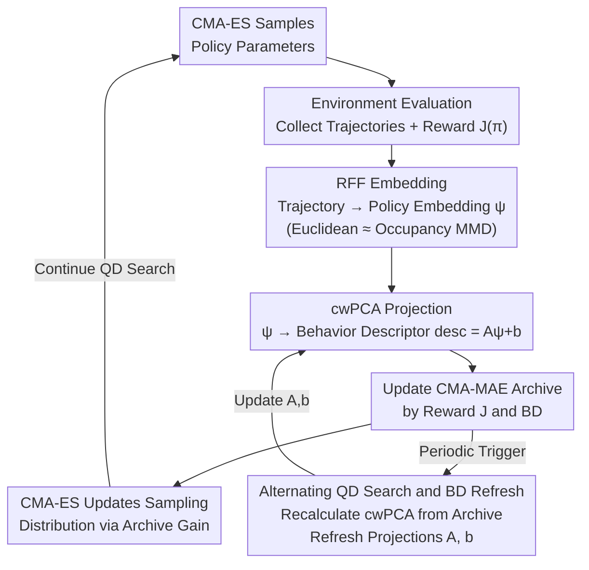

# AutoQD: Automatic Discovery of Diverse Behaviors with Quality-Diversity Optimization

**Conference**: ICLR 2026  
**arXiv**: [2506.05634](https://arxiv.org/abs/2506.05634)  
**Code**: [conflictednerd/autoqd-code](https://github.com/conflictednerd/autoqd-code)  
**Area**: Reinforcement Learning / Quality-Diversity Optimization  
**Keywords**: quality-diversity, occupancy measure, random Fourier features, behavior descriptor, CMA-MAE

## TL;DR

AutoQD is proposed to embed policy occupancy measures into a finite-dimensional space via Random Fourier Features (RFF), followed by dimensionality reduction using weighted PCA to obtain behavior descriptors (BD). This achieves QD optimization without manual BD design and consistently outperforms manual BDs and existing unsupervised QD methods across six continuous control tasks.

## Background & Motivation

**Background**: Quality-Diversity (QD) algorithms aim to discover a collection of policies that are both high-quality and behaviorally diverse, showing success in robot locomotion, game level generation, and protein design. QD-RL introduces QD concepts into sequential decision-making tasks, with the core being an archive where each cell stores the highest-reward policy for a specific behavioral region.

**Limitations of Prior Work**: QD algorithms depend heavily on **manual behavior descriptors (BD)**—functions that map policies to low-dimensional vectors (e.g., foot contact patterns of a bipedal robot). Manual BD design requires extensive domain knowledge and restricts diversity search to predefined dimensions, potentially missing interesting behavioral variants. Existing unsupervised methods (e.g., AURORA using autoencoders to learn BD) lack theoretical guarantees, while skill discovery methods like DIAYN/SMERL require a predefined number of skills and scale poorly.

**Key Motivation**: The occupancy measure $\rho^\pi(s,a) = (1-\gamma)\sum_{t=0}^{\infty}\gamma^t P(S_t=s, A_t=a|\pi)$ represents the discounted visitation frequency distribution of a policy over the state-action space. Under standard assumptions, there is a **one-to-one correspondence** between a Markov policy and its occupancy measure, making the occupancy measure a complete characterization of policy behavior. Can distances between occupancy measures be utilized to automatically construct BDs?

## Method

### Overall Architecture

AutoQD delegates the definition of "different behaviors" to the occupancy measure. The pipeline is a closed loop with a feedback mechanism: CMA-ES samples a batch of policy parameters, which are evaluated in the environment to produce trajectories and rewards $J(\pi)$. These trajectories are first compressed into a finite-dimensional vector $\psi^\pi$ via **Random Fourier Feature (RFF) embedding**, ensuring the Euclidean distance between two vectors approximates the Maximum Mean Discrepancy (MMD) between their occupancy measures. This is followed by **cwPCA projection** to reduce dimensions into a low-dimensional behavior descriptor (BD). Policies are placed into the CMA-MAE archive based on their reward and BD, and CMA-ES updates the sampling distribution according to archive improvements. The critical feedback loop involves **alternating QD search and BD refreshes**: at intervals, cwPCA is recalculated using embeddings of existing policies in the archive to refresh the projection matrix, allowing the definition of diversity to evolve as new behaviors are discovered.

### Key Designs

**1. RFF Embedding: Converting Policy Distance to Computable Euclidean Distance**

While occupancy measures completely characterize behavior, they are continuous distributions over state-action space and cannot be compared directly. AutoQD computes a $D$-dimensional random feature $\phi(s,a) = \sqrt{2/D}\,[\cos(w_1^T[s;a]+b_1), \ldots, \cos(w_D^T[s;a]+b_D)]$ for each state-action pair $[s;a]$, where frequencies $w_i \sim \mathcal{N}(0, \sigma^{-2}I)$ and phases $b_i \sim \mathcal{U}(0, 2\pi)$. These features approximate a Gaussian kernel $k(x,y)=\exp(-\|x-y\|^2/(2\sigma^2))$ in expectation. By taking the discounted weighted average of features along a trajectory, the policy embedding $\psi^\pi = \frac{1}{n}\sum_{j=1}^{n}(1-\gamma)\sum_{t=0}^{T}\gamma^t \phi(s_t^j, a_t^j)$ is obtained ($n$ is the number of trajectories), such that $\|\psi^{\pi_1}-\psi^{\pi_2}\| \approx \text{MMD}(\rho^{\pi_1}, \rho^{\pi_2})$. Theorem 1 proves that the deviation between the embedding distance and the true MMD converges at an exponential rate: $\Pr[\,|\,\|\phi_1-\phi_2\|_2 - \text{MMD}(\rho_1,\rho_2)\,| \geqslant \tfrac{3}{4}\varepsilon\,] \leqslant 2e^{-nc\varepsilon^2} + \mathcal{O}(\varepsilon^{-2}\exp(-D\varepsilon^2/(64(d+2)))) + 6e^{-n\varepsilon^2/8}$. Crucially, the error remains controlled if $D$ grows **linearly** with the state-action dimension $d$, avoiding the curse of dimensionality.

**2. cwPCA Projection: Compressing High-Dimensional Embeddings into Stable, Quality-Biased BDs**

Embeddings $\psi^\pi \in \mathbb{R}^D$ are too high-dimensional for direct use as BDs, as archive size scales exponentially. AutoQD employs Calibrated Weighted PCA (cwPCA). Embeddings are weighted by policy fitness before PCA, ensuring high-quality policies contribute more to the principal component axes and aligning diversity search with meaningful variations near "good" policies. A calibration step then scales output axes to $[-1,1]$, preventing archive boundaries from destabilizing as content drifts. The final BD is an affine transformation $\text{desc}(\pi) = A\psi^\pi + b$ ($A \in \mathbb{R}^{k\times D}$, $b \in \mathbb{R}^k$), which is efficient for frequent refreshes during optimization.

**3. Alternating QD Search and BD Refresh: Evolving the Definition of Diversity**

Fixing a BD would return to the limitation of predefined dimensions. AutoQD alternates between two phases. The QD optimization phase uses the current BD with CMA-MAE: CMA-ES maintains a Gaussian distribution over policy parameters, samples policies, evaluates rewards, and updates the distribution based on archive improvements. At scheduled intervals, the BD update phase recalculates cwPCA using embeddings of all current policies in the archive to obtain new $A, b$. Notably, RFF parameters $\{w_i, b_i\}$ are frozen after initialization; only the projection matrix evolves. This ensures the embedding space remains stable while the "perspective" changes, adapting to new behaviors without misaligning the distances of previously archived policies.

## Key Experimental Results

**Background**: 6 continuous control tasks—Ant, HalfCheetah, Hopper, Swimmer, Walker2d (MuJoCo) + BipedalWalker (Gymnasium).

**Baselines**: 5 methods covering manual BD, unsupervised QD, and diversity RL:

| Baseline | Type | BD Source |
|:---------|:-----|:--------|
| RegularQD | Manual BD + CMA-MAE | Domain-specific manual design |
| AURORA | Unsupervised QD | Latent final state via Autoencoder |
| LSTM-AURORA | Unsupervised QD | Last hidden state of LSTM on trajectories |
| DvD-ES | Diversity Evolution | Action distribution on random states |
| SMERL | Diversity RL | Skill-conditioned policy + Discriminator reward |

**Metrics**:

| Metric | Meaning | Measurement |
|:-----|:-----|:---------|
| GT QD Score | QD Score using manual BD archive | Quality + Human-defined Diversity |
| Vendi Score (VS) | Effective population size via occupancy similarity | Pure Diversity |
| qVS | Quality-weighted Vendi Score | Quality × Diversity |

## Main Results

### Comparison Across 6 Environments

| Environment | Metric | AutoQD | RegularQD | AURORA | LSTM-AURORA | DvD-ES | SMERL |
|:-----|:-----|:-------|:----------|:-------|:------------|:-------|:------|
| Ant | QD (×10⁴) | **361.4** | 182.6 | 5.6 | 19.2 | 0.3 | 1.0 |
| Ant | VS | **72.4** | 39.5 | 1.1 | 1.9 | 1.0 | 1.3 |
| HalfCheetah | QD (×10⁴) | **30.8** | 24.9 | 11.4 | 11.4 | 0.9 | 1.6 |
| Hopper | QD (×10⁴) | **1.84** | 1.20 | 1.06 | 1.36 | 0.56 | 0.97 |
| Hopper | qVS | **1.94** | 1.35 | 0.66 | 0.36 | 0.90 | 1.81 |
| Swimmer | QD (×10⁴) | **21.3** | 11.1 | 8.1 | 10.3 | 0.2 | 0.02 |
| Walker2d | QD (×10⁴) | **18.4** | 11.4 | 7.7 | 13.0 | 0.6 | 1.2 |
| BipedalWalker | QD (×10⁴) | **6.09** | 1.81 | 3.00 | 3.36 | 0.09 | 0.14 |
| BipedalWalker | VS | **12.2** | 1.6 | 2.9 | 3.4 | 1.1 | 5.5 |

⭐ **Key Findings**: AutoQD achieves the **best GT QD Score in all 6 environments**, and the best qVS and VS in 4/6 environments. Exceptions include HalfCheetah (high VS but lower qVS due to diverse low-reward "sliding" behaviors) and Walker2d.

### Robustness Under Environmental Dynamics

Testing adaptation to friction/mass changes in BipedalWalker:

| Change Type | AutoQD | RegularQD | AURORA | LSTM-AURORA | DvD-ES | SMERL |
|:---------|:-------|:----------|:-------|:------------|:-------|:------|
| Friction AUC | **1429.7** | 30.3 | 1309.4 | 1226.3 | 1204.0 | 496.2 |
| Mass AUC | **295.7** | 12.8 | 260.6 | 271.8 | 113.7 | 71.4 |

⭐ AutoQD's diverse policy set demonstrates the strongest adaptability: it achieves the best single-policy performance and the highest number of successfully adapted policies under strict thresholds ($p=0.9$).

## Highlights & Insights

**Novelty** ⭐⭐⭐⭐

- Solid theoretical foundation: Based on the one-to-one correspondence of occupancy measures and MMD approximation theorems, providing probabilistic bounds for error convergence.
- Fully automated: Eliminates the need for domain knowledge in BD design, with embedding dimensions scaling linearly with $d$.
- Comprehensive evaluation: 6 environments across 5 baselines and 3 metrics, covering manual BD, unsupervised QD, and diversity RL.
- Convincing adaptability: Systematic evaluation under varying friction and mass coefficients.

**Limitations** ⭐⭐⭐

- qVS is not optimal in HalfCheetah/Walker2d, suggesting automatic BD might over-focus on certain behavioral dimensions while ignoring human-relevant variations.
- High-stochasticity environments require many trajectories for embedding estimation, leading to lower sample efficiency.
- Kernel bandwidth $\sigma$ is fixed and does not adapt to different learning stages.
- Only integrated with CMA-MAE; compatibility with gradient-based QD methods (e.g., PGA-ME, PPGA) remains unverified.
- Experiments limited to state-vector observation spaces; not yet extended to image observations.

## Related Work & Insights

- **MAP-Elites** (Cully et al., 2015): The foundational QD work maintaining an archive organized by BD.
- **CMA-MAE** (Fontaine & Nikolaidis, 2023): Reformulates QD as a single-objective optimization with a soft archive.
- **AURORA** (Grillotti & Cully, 2022): Uses autoencoders for learning BD, but lacks theoretical guarantees.
- **DIAYN** (Eysenbach et al., 2019): Discovers diverse skills by maximizing skill-state mutual information.
- **SMERL** (Kumar et al., 2020): Adds task rewards to the DIAYN framework.
- **DvD-ES** (Parker-Holder et al., 2020): Characterizes behavioral differences using action distributions on random states.

**Insights**:

1. **Universality of Occupancy Embeddings**: This RFF embedding framework can be extended beyond QD for policy clustering, policy matching in imitation learning, or behavior comparison in inverse RL.
2. **cwPCA Limitations**: Weighted PCA is essentially linear. If the behavioral space has a non-linear manifold structure, Kernel PCA or non-linear methods like UMAP might improve BD quality.
3. **Gradient-based QD Challenges**: Refreshing BDs can destabilize gradient methods as the objective function changes. Smooth BD updates (e.g., EMA) or multi-step gradient updates between refreshes may be necessary.
4. **Practical Value**: Highly valuable for robotic behavior libraries, as the algorithm automatically discovers major dimensions of behavioral diversity. In sim-to-real scenarios, diverse policy sets offer natural complementarity to domain randomization.

<!-- RELATED:START -->

## Related Papers

- [\[ICLR 2026\] Post-training Large Language Models for Diverse High-Quality Responses](post-training_large_language_models_for_diverse_high-quality_responses.md)
- [\[ICLR 2026\] Reference Grounded Skill Discovery](reference_grounded_skill_discovery.md)
- [\[ICLR 2026\] A Hierarchical Circuit Symbolic Discovery Framework for Efficient Logic Optimization](a_hierarchical_circuit_symbolic_discovery_framework_for_efficient_logic_optimiza.md)
- [\[ICLR 2026\] AutoTool: Automatic Scaling of Tool-Use Capabilities in RL via Decoupled Entropy Constraints](autotool_automatic_scaling_of_tool-use_capabilities_in_rl_via_decoupled_entropy_.md)
- [\[ICLR 2026\] When Is Diversity Rewarded in Cooperative Multi-Agent Learning?](when_is_diversity_rewarded_in_cooperative_multi-agent_learning.md)

<!-- RELATED:END -->
