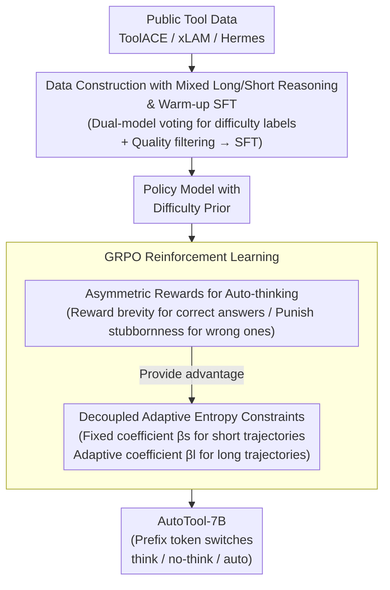

# AutoTool: Automatic Scaling of Tool-Use Capabilities in RL via Decoupled Entropy Constraints

**Conference**: ICLR 2026  
**arXiv**: [2603.13348](https://arxiv.org/abs/2603.13348)  
**Code**: None  
**Area**: Reinforcement Learning  
**Keywords**: Tool Use, Reinforcement Learning, Test-time Scaling, entropy constraint, GRPO, agentic LLM

## TL;DR

This paper proposes a reinforcement learning strategy with Decoupled Adaptive Entropy Constraints, enabling LLMs to automatically switch between long and short reasoning modes based on problem difficulty in tool-calling tasks. It improves accuracy by 9.8% while reducing inference token overhead by approximately 81%.

## Background & Motivation

Integrating Large Language Models (LLMs) with external tools is a critical path toward AGI. Currently, achieving Test-time Scaling (TTS) through Reinforcement Learning (RL) has shown significant success in mathematical reasoning—RL training allows model response length to grow synchronously with accuracy. However, the authors identify two core challenges in tool-calling tasks:

1.  **Reasoning Collapse**: When directly training tool-calling models with RL algorithms like GRPO, the response length decreases rather than increases—as training steps proceed, accuracy improves but response length shortens sharply. The model becomes "lazy" in expanding long-chain reasoning, leading to performance degradation in complex multi-turn tool-calling scenarios.
2.  **Overthinking**: Long-reasoning models obtained through distillation generate redundant reasoning trajectories for all problems, even simple ones, resulting in a wasted token overhead of approximately 10x.

The authors' further analysis reveals that reasoning collapse is highly correlated with information entropy—the entropy of the policy model drops rapidly during training, causing the model to lose exploration capability and default to short reasoning. Simply adding a length penalty cannot mitigate the low-entropy problem, and static entropy constraints are highly sensitive to the coefficient $\beta$.

## Method

### Overall Architecture

AutoTool decomposes "difficulty-adaptive reasoning" into two training stages: first, a warm-up SFT using mixed data with long/short reasoning labels allows the model to initially perceive which problems require deep thinking; then, a set of Decoupled Adaptive Entropy Constraints is applied to GRPO, paired with an asymmetric reward table to stabilize the strategy of "short reasoning for easy problems, long reasoning for difficult problems." The pivot of this design is the observation that the root cause of reasoning collapse is the collapse of information entropy during training rather than the data distribution; thus, controlling entropy becomes the core mechanism. During inference, the mode can be switched between think, no-think, and auto simply by placing a control token in the input prefix.

### Key Designs

**1. Data Construction and Warm-up SFT: Teaching the Model to "Distinguish Difficulty"**

If trained directly with uniform labels, the model will either produce long-winded responses for all tasks or collectively degenerate into short answers. The authors first integrate the PubTool dataset from public sources (ToolACE, xLAM, Hermes Function-Calling), obtaining 8.2k SFT samples and 7k RL samples after downsampling and quality filtering. The key to difficulty labeling lies in dual-model voting: for each data point, a no-thinking model (Qwen2.5-7B-Instruct) and a thinking model (Qwen3-32B) perform pass@8 inference. If the no-thinking model answers correctly, the ground-truth short reasoning is used as the label, indicating that deep thinking is unnecessary; otherwise, the long reasoning label from the thinking model is used. For RL data, half of the samples that are too simple or too difficult are removed to balance the distribution, and 7k high-quality samples aligned with the model's learning trajectory are filtered from 21k based on reward variance in multi-turn GRPO training (lower variance implies better alignment). After this warm-up SFT, the model enters the RL phase with a prior regarding which problems need expansion versus which can be answered quickly.

**2. Decoupled Adaptive Entropy Constraints: Managing Entropy Separately to Avoid Objective Conflict**

Directly adding a length penalty cannot suppress low entropy, and a single static entropy constraint is extremely sensitive to the coefficient $\beta$—long reasoning requires exploration (high entropy), while short reasoning requires convergence (low entropy). Using the same $\beta$ inevitably favors one at the expense of the other. AutoTool splits the entropy regularization coefficients in the GRPO policy loss based on the trajectory type:

$$\beta_i = \beta_s \cdot m_i \cdot \mathbb{I}\{H_i \leq H_s\} + \beta_l \cdot (1-m_i) \cdot \mathbb{I}\{H_i \leq H_l\}$$

where $m_i \in \{0,1\}$ identifies whether the $i$-th trajectory is short reasoning ($m_i=1$) or long reasoning ($m_i=0$), and $H_s, H_l$ are the target entropies for short/long reasoning, respectively. The entropy regularization is only activated when $H_i$ falls below the corresponding target (maintaining an entropy floor). Short reasoning uses a fixed $\beta_s$ to prevent over-exploration and maintain brevity; long reasoning uses a learnable $\beta_l$, dynamically adjusted via a separate loss:

$$\mathcal{L}_{\beta}^l = \frac{1}{\sum_j(1-m_j)} \sum_{i=1}^{N} (1-m_i) \cdot \beta_l \cdot (H_i - H_l)$$

When the entropy $H_i$ of long trajectories is lower than the target $H_l$, $\beta_l$ automatically increases to encourage more exploration; conversely, if $H_i$ is high, $\beta_l$ decreases to suppress excessive randomness. This preserves the brevity of short reasoning while ensuring that long reasoning always has sufficient exploration margin, mitigating reasoning collapse at its root without requiring manual $\beta$ tuning.

**3. Asymmetric Rewards for Auto-thinking: Encoding Difficulty-based Mode Selection into the Policy**

Controlling entropy is not enough; the model must also have clear guidance on "thinking more vs. thinking less." The advantage $\hat{A}_i$ in the policy loss is derived from this reward structure. The authors design an asymmetric answer reward table (after a format check for think/no-think templates):

| Scenario | Reward |
| :--- | :--- |
| Correct + no-think | +1.0 |
| Correct + think | +0.5 |
| Incorrect + think | -0.5 |
| Incorrect + no-think | -1.0 |

For the same correct answer, short reasoning (+1.0) receives a higher reward than long reasoning (+0.5), pushing the model toward quick answers for simple problems to save tokens. For incorrect answers, the penalty for long reasoning (-0.5) is lighter than for short reasoning (-1.0), making the model more willing to switch to long reasoning to try its luck when a difficult problem cannot be solved immediately. This asymmetric structure of "rewarding brevity for correctness and punishing stubbornness for errors" allows the trade-off between efficiency and accuracy to find a natural equilibrium.

## Key Experimental Results

### Main Results (BFCL)

| Model | Non-Live | Live | Multi-Turn | Overall |
| :--- | :--- | :--- | :--- | :--- |
| Qwen2.5-7B-Instruct | 86.46 | 67.44 | 7.62 | 53.69 |
| PubTool-SFT | 88.98 | 77.28 | 9.68 | 58.17 |
| PubTool-Distilled | 87.73 | 78.64 | 15.65 | 60.30 |
| Qwen3-8B | 88.81 | 78.54 | 33.00 | 66.34 |
| **Ours (auto)** | **89.76** | **80.22** | **38.18** | **70.12** |

- Gain of +11.95% over PubTool-SFT and +16.43% over the Base model.
- The most significant improvement is in Multi-Turn complex scenarios (+28.5% Gain vs. SFT).
- Performance is comparable to frontier models like GPT-4o (70.42) and o3 (70.32).

### Inference Efficiency Analysis

- AutoTool averages only ~183 tokens, whereas the distilled model uses ~966 tokens, **reducing token costs by 81%**.
- In Multi-Turn scenarios, the thinking rate is 45%, while in simple Non-Live scenarios, it is 0%—the model truly learns to adapt based on difficulty.
- Under the forced "no-think" mode, ACU (Accuracy per Computation Unit) reaches an optimal 0.97.

### Ablation Study

| Variant | Overall Change |
| :--- | :--- |
| Full Model | 70.12 |
| w/o data refine | -6.43 |
| w/o decouple | -5.89 |
| w/o adapt coeff | -2.34 |

Data quality filtering has the greatest impact, followed by the decoupled design. The adaptive coefficient contributes significantly to the stability of Multi-Turn performance (dropping by 10.53% when removed).

## Highlights & Insights

1.  **In-depth Analysis**: Provides a systematic analysis of the relationship between reasoning collapse and entropy, revealing that information entropy collapse, rather than data distribution, is the root cause.
2.  **Rational Design**: Decoupling entropy constraints for long and short reasoning avoids objective interference, and the adaptive coefficient removes the need for sensitive manual tuning.
3.  **High Practical Value**: A 7B model achieves GPT-4o level tool-calling performance while substantially reducing inference costs.
4.  **Controllable Modes**: Allows for flexible switching between think, no-think, and auto modes via prefixes during inference.
5.  **Elegant Reward Design**: Asymmetric rewards naturally guide the model to use short reasoning for simple problems and long reasoning for complex ones.

## Limitations & Future Work

1.  Validated only at the 7B scale; whether reasoning collapse persists and the method remains effective for larger models has not been explored.
2.  The scale of the PubTool dataset is limited (7k RL samples); the scalability of training with larger datasets has not been verified.
3.  Warm-up SFT relies on distilled data from Qwen3-32B, necessitating a powerful teacher model.
4.  The division between long and short reasoning depends on the presence of a "think" tag, offering limited fine-grained control over reasoning depth.
5.  Evaluation is primarily focused on function-calling tools; generalization to broader tool scenarios like code execution or web browsing has not been tested.

<!-- RELATED:START -->

## Related Papers

- [\[ICLR 2026\] ReTool: Reinforcement Learning for Strategic Tool Use in LLMs](retool_reinforcement_learning_for_strategic_tool_use_in_llms.md)
- [\[ICLR 2026\] ResT: Reshaping Token-Level Policy Gradients for Tool-Use Large Language Models](rest_reshaping_token-level_policy_gradients_for_tool-use_large_language_models.md)
- [\[ICLR 2026\] Webscale-RL: Automated Data Pipeline for Scaling RL Data to Pretraining Levels](webscale-rl_automated_data_pipeline_for_scaling_rl_data_to_pretraining_levels.md)
- [\[ICLR 2026\] Entropy Regularizing Activation: Boosting Continuous Control, Large Language Models, and Image Classification with Activation as Entropy Constraints](entropy_regularizing_activation_boosting_continuous_control_large_language_model.md)
- [\[ICLR 2026\] Adaptive Scaling of Policy Constraints for Offline Reinforcement Learning](adaptive_scaling_of_policy_constraints_for_offline_reinforcement_learning.md)

<!-- RELATED:END -->
