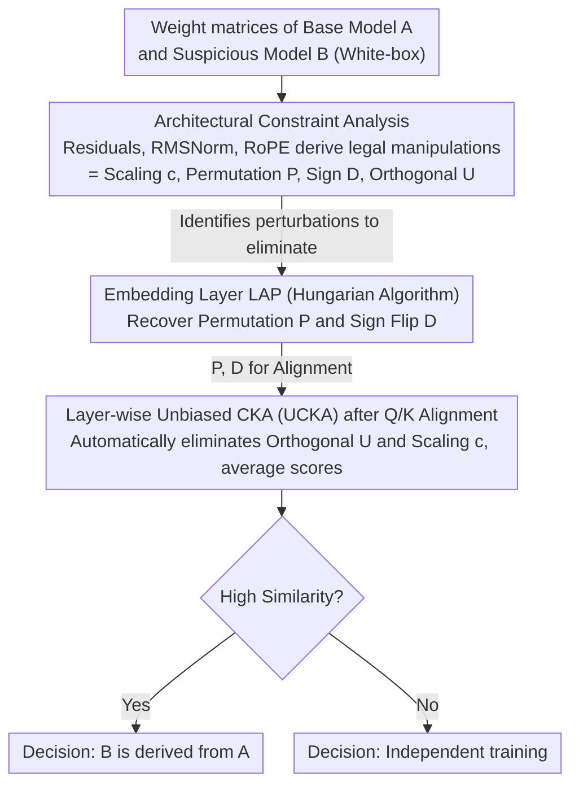

# AWM: Accurate Weight-Matrix Fingerprint for Large Language Models

**Conference**: ICLR 2026  
**arXiv**: [2510.06738](https://arxiv.org/abs/2510.06738)  
**Code**: [https://github.com/LUMIA-Group/AWM](https://github.com/LUMIA-Group/AWM)  
**Area**: Reinforcement Learning  
**Keywords**: model fingerprinting, intellectual property, weight manipulation, CKA, linear assignment problem  

## TL;DR
The paper proposes AWM, a training-free LLM weight matrix fingerprinting method. It utilizes the Linear Assignment Problem (LAP) to recover permutations and sign flips of the embedding layer, followed by unbiased CKA to eliminate the impact of orthogonal transformations on Q/K matrices. It achieves a perfect AUC (1.0) across 150 LLM pairs and remains robust against six types of post-training—including SFT, continued pre-training (5.5T tokens), RL, multi-modal expansion, pruning, and upcycling—within 30 seconds.

## Background & Motivation
**Background**: LLM training costs are extremely high, making intellectual property protection crucial. It is necessary to determine whether a suspicious model is trained from scratch or derived from an existing base model.

**Limitations of Prior Work**: Models often undergo extensive post-training (SFT, continued pre-training, RL, multi-modal expansion, pruning, upcycling), which causes significant parameter changes. Watermarking methods require additional training and can degrade performance. Existing fingerprinting methods like HuRef are not robust to continued pre-training, while REEF suffers from high false-positive rates.

**Key Challenge**: Malicious actors can mask a model's origin by scaling, permuting, pruning, or even rotating weight matrices, provided these operations maintain model performance. How can an invariant fingerprint be extracted under such constraints?

**Goal**: Design a fingerprinting method robust to all common post-training methods and weight manipulations while maintaining a low false-positive rate and high computational efficiency.

**Key Insight**: Systematically analyze constraints imposed by Transformer components (Residual connections, RMSNorm, RoPE) on weight manipulation. It is proven that to maintain model output, Q/K matrices can only undergo specific transformation forms (permutation + sign flip + orthogonal transformation + error), which can then be targeted for elimination.

**Core Idea**: By analyzing the structural constraints of the Transformer architecture on weight manipulation, a fingerprinting method is designed that is theoretically immune to all feasible manipulations.

## Method

### Overall Architecture
AWM addresses a binary question: is the suspicious model derived from a base model or independently trained? The difficulty lies in the fact that attackers can scale, permute, prune, or rotate weights to hide the origin as long as the output remains unchanged. AWM's approach is to derive these "legal manipulation" forms from the architecture and eliminate them sequentially. First, an architectural constraint analysis restricts legal manipulations to four types: scaling $c$, permutation $P$, sign flip $D$, and orthogonal transformation $U$. The process follows two steps: first, solving a Linear Assignment Problem (LAP) via the Hungarian algorithm on the embedding matrices of models sharing the same vocabulary to recover the column permutation matrix $P$ and sign flip matrix $D$. Second, using $P$ and $D$ to align the Q/K matrices and calculating layer-wise similarity using unbiased CKA—which is inherently immune to orthogonal transformations and scaling. The average similarity across layers determines if the model is derived or independent.

### Key Designs

**1. Deriving legal manipulation space from architectural constraints: Understanding attacker capabilities**

Existing fingerprinting methods (HuRef, REEF) mostly rely on empirical selection of weight invariants, which fail when encountering unseen manipulations. AWM reverses this by deriving from first principles: what transformations can weights undergo while keeping model output constant? Three layers of constraints tighten the requirements: residual connections require manipulations to propagate consistently across components (Prop 4.2); RMSNorm normalization further restricts feasible transformations of the embedding layer to $R_{emb} = cPD$, a combination of scaling, column permutation, and sign flip (Thm 4.3); RoPE and the structure of attention scores restrict Q/K matrix manipulations to:

$$W_B = c^{-1}D^TP^TW_A^TU^T + E$$

where $U$ is an orthogonal transformation and $E$ is an error term from post-training (Thm 4.4). The value of this derivation is that it transforms "which perturbations to eliminate" from heuristic guesses into a theoretically supported checklist: $c$ (scaling), $P$ (permutation), $D$ (sign), and $U$ (orthogonal).

**2. Recovering embedding layer permutation and sign via LAP**

Since each row of the embedding matrix corresponds to a token, attackers cannot mix rows without breaking vocabulary correspondence. Column manipulations are restricted to $cPD$ by Thm 4.3, providing a clean entry point. AWM constructs an absolute cosine similarity matrix between the embedding column vectors of two models, transforming the column correspondence into a bipartite graph matching problem solved via the Hungarian algorithm to obtain $P$. The signs of cosine similarities at matched positions yield the sign flip matrix $D$. Using absolute values for matching decouples permutation from sign flips. For models with different layer counts, hierarchical LAP matching is used to align layers.

**3. Bypassing orthogonal transformations via unbiased CKA without explicit $U$ resolution**

After recovering $P$ and $D$ to align Q/K matrices, the remaining perturbation is mainly the orthogonal matrix $U$. With $d^2$ free parameters, explicitly recovering $U$ in high-dimensional hidden spaces is neither realistic nor stable. AWM's key observation is that Centered Kernel Alignment (CKA) is inherently invariant to orthogonal transformations and constant scaling (Thm 3.1). Thus, $U$ does not need to be solved—calculating CKA on aligned Q/K matrices automatically eliminates $U$ and $c$. To avoid estimation bias in finite samples, the unbiased version (UCKA) is used. The final model similarity is the average UCKA value across all Q/K matrices. This step converts the challenge of "handling high-dimensional orthogonal perturbations" from a difficult optimization problem into a parameter-free metric selection.

### Loss & Training
The method is training-free and does not modify or degrade model performance. It only requires white-box access to weight matrices. The entire computation completes within 30 seconds on a single NVIDIA 3090.

## Key Experimental Results

### Main Results (150 LLM pairs)

| Metric | AWM | HuRef | REEF |
|------|-----|-------|------|
| AUC | **1.0** | ~0.85 | ~0.90 |
| pAUC (FPR<5%) | **1.0** | Low | Low |
| TPR@1%FPR | **1.0** | Low | Low |

### Robustness (60 offspring model pairs)

| Post-training Type | AWM | HuRef | REEF |
|-----------|-----|-------|------|
| SFT | ✅ (≥99.9%) | ✅ | ✅ |
| Continued Pre-training (5.5T tokens) | ✅ | ❌ Fail | Partial |
| RL (PPO/DPO) | ✅ | ✅ | ✅ |
| Multi-modal Expansion | ✅ | - | Partial |
| Pruning | ✅ | ❌ Fail | Partial |
| Upcycling | ✅ | - | Partial |

### Key Findings
- Similarity for all offspring models is $\geq 99.9\%$, while similarity for independent models is $\leq 0.7\%$, showing extreme separation and zero false-positive risk.
- HuRef is not robust to continued pre-training and pruning; REEF often exhibits high false-positive rates on independent model pairs.
- Completes in 30 seconds (NVIDIA 3090)—orders of magnitude faster than black-box methods requiring inference.
- The method remains effective for models with different layer counts (resolved via hierarchical LAP matching).

## Highlights & Insights
- **Deriving fingerprints from first principles**: Instead of empirical feature selection, the method systematically analyzes Transformer component constraints to derive a theoretically complete fingerprinting scheme.
- **Clever application of CKA**: Utilizing CKA's orthogonal invariance to eliminate transformations introduced by RoPE avoids the infeasibility of recovering high-dimensional orthogonal matrices.
- **High practical utility**: 30 seconds, single GPU, training-free, no performance loss, and zero false-positive rate—fully meeting requirements for practical deployment.

## Limitations & Future Work
- Currently only applicable to decoder-only Transformer architectures; encoder-decoder or SSM architectures require separate analysis.
- Assumes manipulations aim to keep output invariant; if an attacker accepts significant performance loss, they might bypass it.
- Independent models might show low similarity, but this is the expected behavior.
- Requires white-box access to weights, making it unsuitable for API-only MaaS scenarios.

## Related Work & Insights
- **vs HuRef**: While HuRef also uses weight invariants, it fails against continued pre-training. AWM solves this through complete manipulation analysis and unbiased CKA.
- **vs REEF**: REEF relies on geometric similarity in representation space but has high false-positive rates. AWM operates directly in the weight space, significantly improving separation.
- **vs Watermarking**: Watermarking requires additional training and may harm performance, whereas AWM is a posteriori and loss-free.

## Rating
- Novelty: ⭐⭐⭐⭐⭐ The methodology of deriving fingerprints from Transformer structural constraints is highly novel.
- Experimental Thoroughness: ⭐⭐⭐⭐⭐ Conducted on 150 model pairs across 6 post-training types with perfect metrics.
- Writing Quality: ⭐⭐⭐⭐⭐ Rigorous theoretical derivation and comprehensive experiments.
- Value: ⭐⭐⭐⭐⭐ A powerful and practical tool for LLM intellectual property protection.

<!-- RELATED:START -->

## Related Papers

- [\[ICLR 2026\] On Predictability of Reinforcement Learning Dynamics for Large Language Models](on_predictability_of_reinforcement_learning_dynamics_for_large_language_models.md)
- [\[ICLR 2026\] Revolutionizing Reinforcement Learning Framework for Diffusion Large Language Models](revolutionizing_reinforcement_learning_framework_for_diffusion_large_language_mo.md)
- [\[ICLR 2026\] Robust Multi-Objective Controlled Decoding of Large Language Models](robust_multi-objective_controlled_decoding_of_large_language_models.md)
- [\[ICLR 2026\] VerifyBench: Benchmarking Reference-based Reward Systems for Large Language Models](verifybench_benchmarking_reference-based_reward_systems_for_large_language_model.md)
- [\[ICLR 2026\] Using Reinforcement Learning to Train Large Language Models to Explain Human Decisions](using_reinforcement_learning_to_train_large_language_models_to_explain_human_dec.md)

<!-- RELATED:END -->
