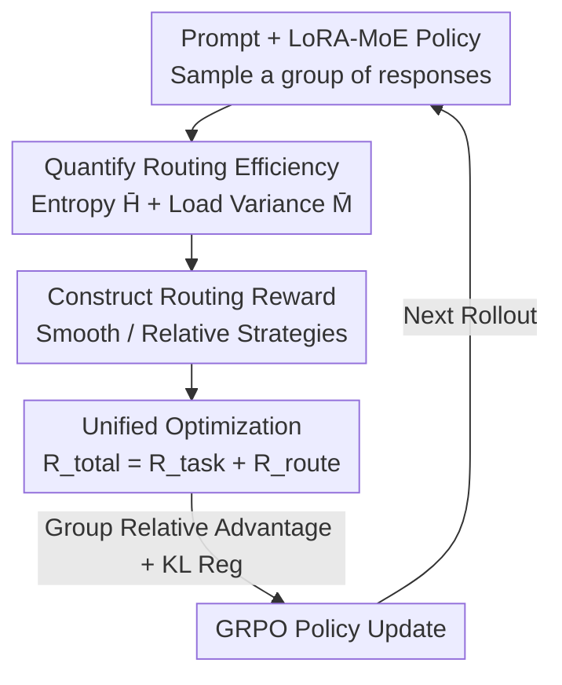

# Balancing the Experts: Unlocking LoRA-MoE for GRPO via Mechanism-Aware Rewards

**Conference**: ICLR2026  
**OpenReview**: [https://openreview.net/forum?id=rhD7ZuFAjU](https://openreview.net/forum?id=rhD7ZuFAjU)  
**Code**: To be confirmed (Paper states source code provided with supplementary materials)  
**Area**: Reinforcement Learning Fine-tuning / LoRA-MoE / Parameter-Efficient Fine-Tuning  
**Keywords**: GRPO, LoRA-MoE, Routing Collapse, Mechanism-Aware Rewards, Load Balancing

## TL;DR
To address the issues of routing collapse and low expert utilization when using GRPO for reinforcement fine-tuning of LoRA-MoE, this paper proposes RO-GRPO. It converts internal routing statistics (entropy + load variance) collected during training into a scalar reward, which is directly integrated into the total GRPO reward. Without auxiliary losses, architectural changes, or additional training stages, this approach improves mathematical reasoning accuracy while making expert routing more balanced and confident.

## Background & Motivation
**Background**: LoRA-MoE combines Low-Rank Adaptation (LoRA) with Mixture-of-Experts (MoE) by replacing a single LoRA with a set of parallel low-rank experts and a routing network. It has been proven in Supervised Fine-Tuning (SFT) to reduce task interference and improve knowledge retention, making it a promising direction for Parameter-Efficient Fine-Tuning (PEFT). Simultaneously, critic-free Reinforcement Fine-Tuning (RFT) algorithms like GRPO have shown strong performance in mathematical reasoning and instruction following, becoming a mainstay for aligning LLMs. A natural progression is to combine the two—fine-tuning LoRA-MoE using GRPO.

**Limitations of Prior Work**: However, this combination introduces problems. In SFT, routing is guided by an auxiliary load-balancing loss. In GRPO, optimization signals originate solely from external task rewards $R_{task}$, which evaluate only the final output correctness and remain "blind" to the internal decisions made by the router. Without explicit guidance, the router easily degrades into two typical failure modes: **Expert Collapse**, where the router selects only a small subset of experts, leading to severe load imbalance and wasted parameter capacity; and **Routing Indecision**, where the router outputs high-entropy (low confidence) distributions, preventing experts from developing specialized roles.

**Key Challenge**: Traditional auxiliary losses from SFT cannot be directly ported to GRPO. Auxiliary losses are differentiable and apply a **uniform** balancing penalty across all trajectories in a batch. This is incompatible with GRPO's logic of "judging quality based on group relative advantage"—it would indiscriminately suppress trajectories that might have correct answers despite slightly unbalanced routing. The authors seek a **loss-free** mechanism where routing load and task performance are jointly optimized through the same reward signal during the rollout phase, rather than imposing rigid constraints on each routing decision via an extra differentiable loss.

**Goal**: To inject an "internal, mechanism-aware" signal into the GRPO reward that directly targets routing collapse and indecision, without altering the LoRA-MoE architecture or adding training stages.

**Key Insight**: The authors observe that routing statistics (routing entropy, load distribution) can be conveniently collected during the generation (rollout) process. These scalars can be processed into a reward to align internal routing mechanisms with task performance. Since GRPO essentially uses scalar rewards to shape policies, the authors argue that these scalars can be generated from the model's "own internal mechanics."

**Core Idea**: Engineering the model's own routing statistics into a scalar reward and integrating it into the total GRPO reward. This extends reinforcement learning from "adjusting external behavior" to "adjusting internal mechanisms"—a first empirical demonstration of what the authors call mechanism alignment.

## Method

### Overall Architecture
The RO-GRPO (Routing-Optimized GRPO) pipeline is built upon standard GRPO, with modifications only on the reward side. For each set of generated responses, in addition to calculating the task reward $R_{task}$, the routing probability vectors are collected from all activated LoRA-MoE modules. These are aggregated into two scalar metrics (routing entropy and load variance) and converted into a mechanism reward $R_{route}$. Finally, $R_{total}=R_{task}+R_{route}$ is fed into the standard GRPO group relative advantage calculation to drive policy updates. $R_{route}$ itself is non-differentiable; its "gradient" is propagated implicitly through the policy gradient—trajectories with better routing receive higher total rewards and larger advantages, naturally pushing the policy toward being "both correct and routing-efficient." This process introduces no auxiliary losses, architectural changes, or extra training stages.

In implementation, LoRA-MoE modules are inserted into the gate, up, and down projections of the Feed-Forward Network (FFN) in each Transformer block. Only PEFT parameters are updated during training, while the base weights remain frozen.

As preliminary knowledge, a LoRA-MoE layer reformulates the output of a frozen pre-trained layer: for an input token representation $h$, the router first calculates gating probabilities $p=\mathrm{softmax}(W_{router}h)$, and outputs $h_{out}=h+\big(\sum_{e=1}^{E} p(e\mid h)\,B_eA_e\big)h$, where $\{(A_e,B_e)\}_{e=1}^{E}$ are $E$ parallel low-rank experts. GRPO is a critic-free policy optimization targeting the maximization of $\mathbb{E}_{x\sim D,\,y\sim\pi_\theta(\cdot\mid x)}[R_{task}(y)]$.

### Key Designs

**1. Quantifying Routing Efficiency: Reading the "Router State" via Entropy and Load Variance**

To transform internal mechanisms into rewards, observable scalars are required. The authors collect routing probability vectors from all activated LoRA-MoE modules for each generated sample and aggregate them into two indicators. The first measures **routing confidence**: the average Shannon entropy across all $T$ tokens, $\bar H=\frac{1}{T}\sum_{i=1}^{T}H(p_i)$, where $H(p)=-\sum_{e=1}^{E}p_e\ln p_e$ (a small $\epsilon$ is added in implementation). Lower entropy indicates more decisive routing, facilitating expert specialization. The second measures **load balancing**: for each module $m$, the utilization vector $\bar p_m$ is averaged over all tokens passing through it, and its MSE relative to the uniform distribution $u=\frac{1}{E}\mathbf{1}$ is calculated. Finally, the mean across $M$ modules is taken: $\bar M=\frac{1}{M}\sum_{m=1}^{M}\frac{1}{E}\lVert\bar p_m-\frac{1}{E}\mathbf{1}\rVert_2^2$. To ensure stable integration into rewards, both metrics are normalized to approximately $[0,1]$: $H_{norm}=\bar H/\ln E$ and $M_{norm}=\bar M/((E-1)/E^2)$. This quantification allows the "health" of the router to be compressed into two comparable numbers, where expert collapse manifests as high $M_{norm}$ and routing indecision as high $H_{norm}$.

**2. Constructing Routing Rewards: Smooth Curriculum Scheduling and Relative Refinement Gating**

The authors propose two complementary strategies to convert these metrics into a scalar reward $R_{route}$. **Smooth (Curriculum Scheduling)** initially encourages "confident routing" (entropy reduction) before transitioning to "load balancing" (MSE reduction). The reward is expressed as $R_{route}=-w_{route}\,(w_H(t)\cdot H_{norm}+w_B(t)\cdot M_{norm})$, where weights are dynamically scheduled over training progress $t\in[0,1]$ using a sigmoid $\sigma(t)=1/(1+e^{-k(t-c)})$: $w_H(t)=\lambda_H^{start}\cdot(1-\sigma(t))$ and $w_B(t)=\lambda_B^{end}\cdot\sigma(t)$. This sequence is justified as single-objective optimization is sub-optimal: minimizing only entropy harms load balancing, while focusing only on balancing early on fails to foster specialization. Specializing experts first and then organizing them for load balance follows the natural dynamics of MoE training. **Relative (Refinement Gating)** provides a sparse, adaptive reward: a constant positive reward $R_{route}=C$ is granted only when both confidence and load balance improve simultaneously relative to their respective exponential moving averages ($\bar H_{hist}$, $\bar M_{hist}$). It encourages "continuous self-surpassing" and eliminates the need for manual weight balancing between the two routing objectives.

**3. Unified Optimization: Implicit Backpropagation of Non-differentiable Rewards**

The mechanism reward $R_{route}$ is summed with the task reward: $R_{total}(y)=R_{task}(y)+R_{route}(y)$. Crucially, because $R_{route}$ is non-differentiable, it does not create an additional backpropagation path like an auxiliary loss. Instead, it is incorporated into the GRPO group relative advantage calculation. A group of responses $\{y_i\}$ is scored using $R_{total}$ to compute the relative advantage $\hat A_i$, which drives the policy update: $J_{\text{RO-GRPO}}(\theta)\approx\mathbb{E}\big[\sum_i \log\pi_\theta(y_i\mid x)\hat A_i-\beta\,D_{KL}(\pi_\theta\Vert\pi_{ref})\big]$. This "reward-not-loss" approach is superior because it allows the model to learn **trade-offs**: a trajectory with slightly imbalanced routing can still achieve a positive advantage if the answer is correct. In contrast, auxiliary losses penalize all trajectories uniformly regardless of task success—this rigid penalty can suppress unconventional but useful routing patterns required for complex tasks. Regarding costs, RO-GRPO shares the same architecture and parameter count as vanilla LoRA-MoE, adding only $O(TE)$ computations for post-hoc reward calculation, which is negligible compared to the forward pass $O(TKdr)$; it also avoids the extra gradient computation $\nabla_\theta\mathcal{L}_{aux}$, saving backpropagation overhead and memory.

### Loss & Training
The global reward scaling factor is $w_{route}=0.2$. For the Smooth strategy, initial entropy weight $\lambda_H^{start}=0.5$ and final balance weight $\lambda_B^{end}=2.0$. The Relative strategy uses a sliding window of the last 1000 samples for history baselines. The LoRA baseline uses rank=16, while LoRA-MoE uses $E\in\{2,4,8\}$ experts with rank=8 each to align the trainable parameter budget. The base model is frozen, and only PEFT parameters are updated. The same system prompt for guided step-by-step reasoning is used during training and evaluation.

## Key Experimental Results

### Main Results
In both unimodal (Qwen2.5-7B-Instruct, NuminaMath-TIR) and multimodal (Qwen2.5-VL-7B-Instruct, Geometry3k) mathematical reasoning, RO-GRPO consistently outperforms vanilla GRPO+LoRA-MoE across all expert counts ($E\in\{2,4,8\}$). The two reward variants have distinct strengths: Smooth performs best on GSM8K and SVAMP, while Relative is stronger on Geometry3k, MathVista, and WeMath.

| Setting | Method (Best Config) | Key Benchmark | Ours | Comparison Baseline | Gain |
|------|------------------|----------|------|----------|------|
| Unimodal | RO-GRPO (Smooth, E=2) | GSM8K | 91.51% | GRPO(LoRA) 90.45 / vanilla MoE 90.22 | +1.06 / +1.29 pp |
| Unimodal | RO-GRPO (Relative, E=4) | MGSM | 54.58% | vanilla MoE(E=4) 46.15 | +8.43 pp |
| Multimodal | RO-GRPO (Relative, E=2) | Geometry3k | 41.93% | vanilla MoE(E=2) 38.27 / GRPO(LoRA) 38.44 | +3.66 / +3.49 pp |
| Multimodal | RO-GRPO (Relative, E=4) | WeMath | 66.26% | GRPO(LoRA) 63.97 / Best vanilla MoE 63.74 | +2.29 / +2.52 pp |

Regarding routing metrics, RO-GRPO maintains lower or equal MSE compared to vanilla under the same $E$ (e.g., unimodal E=2 reduced from 0.020→0.016/0.017, multimodal E=2 from 0.038→0.033/0.036), while maintaining comparable entropy.

### Ablation Study

| Config (GSM8K, E=2) | Accuracy | Entropy | MSE | Description |
|------|---------|---------|-----|------|
| RO-GRPO (Smooth) | 91.51 | 0.639 | 0.016 | Full Model |
| w/o $R_B$ (Smooth) | 90.75 | 0.639 | 0.018 | Remove Balance Reward |
| w/o $R_H$ (Smooth) | 89.92 | 0.639 | 0.019 | Remove Confidence Reward |
| w/o $R_B$ (Relative) | 89.01 | 0.638 | 0.019 | Fell below vanilla baseline |
| Shuffled (Smooth) | 89.23 | 0.640 | 0.018 | Shuffled routing rewards within batch |
| GRPO (LoRA-MoE) | 89.39 | 0.640 | 0.020 | Vanilla Baseline |

### Key Findings
- **Co-dependence of Reward Components**: Removing either $R_B$ or $R_H$ leads to performance drops. For the Relative variant, removing $R_B$ caused performance to drop to 89.01%, lower than vanilla (89.39%).
- **Verifiable Causality**: The shuffling control (randomly permuting routing rewards within a batch to break the causal link between action and reward) reduced performance to vanilla levels (89.23/89.28%), proving gains stem from meaningful mechanism feedback rather than reward structure side effects.
- **Routing Rewards Inhibit Text Degradation**: At $E=4$ on Geometry3k, vanilla MoE saw 7.5% of generations fall into repetitive loops (only 28.95% accuracy). Smooth reduced this to 0.17%, and Relative eliminated it completely, restoring accuracy to 40.10%/40.27%. The Pareto front for inference latency vs. accuracy also improved.
- **Reward > Auxiliary Loss**: The Aux-Loss baseline succeeded in reducing entropy but failed to improve load balancing (MSE 0.036 vs. Ours 0.016 on GSM8K E=2) and tended to generate longer sequences without commensurate accuracy gains.
- **Unguided Routing is Fragile**: While vanilla MSE decreased as $E$ increased, accuracy did not reliably improve and even dropped (28.95% for Geometry3k E=4), highlighting instability without mechanism feedback.

## Highlights & Insights
- **"Rewards can be engineered from the model's own internal mechanics"**: This is the most profound takeaway. While RLHF rewards typically come from external sources (human preference, task correctness), this paper demonstrates that internal statistics like entropy and variance can be transformed into effective rewards, shifting the paradigm from "behavior alignment" toward "mechanism alignment."
- **Bypassing Loss Incompatibility with Rewards**: Making balancing constraints a reward rather than a loss fits the GRPO group relative advantage framework perfectly. It allows trajectories with slight imbalanced routing but correct answers to survive. This perspective is transferable to any scenario where soft structural constraints (e.g., sparsity, attention distribution, KV cache hit rate) are needed in RL.
- **Curriculum Scheduling Aligned with Training Dynamics**: Entropy reduction (specialization) followed by MSE reduction (organization) aligns with the Information Bottleneck (IB) perspective of "routers learning minimal sufficient representations," providing a theoretical basis rather than just empirical tuning.
- **Near-Zero Cost**: Since it uses the same architecture and parameters, adding only $O(TE)$ post-hoc calculation while saving the backpropagation of auxiliary losses, RO-GRPO is easily adoptable by existing GRPO+MoE pipelines.

## Limitations & Future Work
- **Narrow Task Scope**: Experiments only cover mathematical reasoning (unimodal and multimodal geometry/visual math). The effectiveness of routing rewards on coding, general instruction following, or long-context tasks remains unverified.
- **Empirical Metric Design**: The entropy + MSE indicators and the hyperparameters for the two reward strategies ($w_{route}$, $\lambda_{H}^{start}$, $\lambda_{B}^{end}$, sigmoid parameters, sliding window size) were tuned on validation sets. The lack of an adaptive or theoretically optimal selection method makes it unclear if retuning is needed for different base models or $E$ counts.
- **Strategy Selection**: Smooth and Relative both have advantages but neither is universally optimal. Users currently need to test both for specific tasks, as the authors provide no definitive criteria for selection.
- **Scale and Expert Limitations**: Verified only up to 7B models and $E\le 8$. It remains to be seen if "mechanism rewards" can stabilize routing in larger models or with many more experts. Future directions could include online reward weight adaptation and extending mechanism rewards to token/layer-level granularity.

## Related Work & Insights
- **vs. Auxiliary Load-Balancing Losses (Switch/ST-MoE/StableMoE)**: These use auxiliary losses in differentiable supervised training to prevent collapse, but such losses punish all trajectories uniformly. RO-GRPO uses non-differentiable rewards and group relative advantage, allowing task-successful trajectories "immunity" from routing penalties, resulting in better MSE and accuracy.
- **vs. Vanilla GRPO + LoRA-MoE**: Direct combination leaves task rewards "blind" to routing, leading to collapse/indecision. RO-GRPO provides mechanism-aware rewards, making it the first work to systematically study LoRA-MoE under the RFT framework.
- **vs. Standard RLHF (PPO/DPO/GRPO)**: These methods optimize only external scalar task rewards and do not supervise internal mechanisms. RO-GRPO expands the source of rewards to the model’s own mechanics, proposing a new paradigm for the principled alignment of complex modular architectures.

## Rating
- Novelty: ⭐⭐⭐⭐⭐ First to engineer internal routing statistics into GRPO scalar rewards, advancing from behavior alignment to mechanism alignment.
- Experimental Thoroughness: ⭐⭐⭐⭐ Covers 4+4 benchmarks across uni/multimodal settings and 3 expert counts with full ablation and causality controls, though limited to 7B scale and math tasks.
- Writing Quality: ⭐⭐⭐⭐ Logical progression with clear theoretical grounding in the IB perspective.
- Value: ⭐⭐⭐⭐ Zero-cost, plug-and-play solution for a practical pain point in GRPO+MoE integration.

<!-- RELATED:START -->

## Related Papers

- [\[ICLR 2026\] BranchGRPO: Stable and Efficient GRPO with Structured Branching in Diffusion Models](branchgrpo_stable_and_efficient_grpo_with_structured_branching_in_diffusion_mode.md)
- [\[ICML 2026\] Unlocking Zero-Shot Geospatial Reasoning via Indirect Rewards](../../ICML2026/reinforcement_learning/unlocking_zero-shot_geospatial_reasoning_via_indirect_rewards.md)
- [\[ICLR 2026\] Composition of Memory Experts for Diffusion World Models](composition_of_memory_experts_for_diffusion_world_models.md)
- [\[ICLR 2026\] Deft Scheduling of Dynamic Cloud Workflows with Varying Deadlines via Mixture-of-Experts](deft_scheduling_of_dynamic_cloud_workflows_with_varying_deadlines_via_mixture-of.md)
- [\[ICLR 2026\] FAPO: Flawed-Aware Policy Optimization for Efficient and Reliable Reasoning](fapo_flawed-aware_policy_optimization_for_efficient_and_reliable_reasoning.md)

<!-- RELATED:END -->
