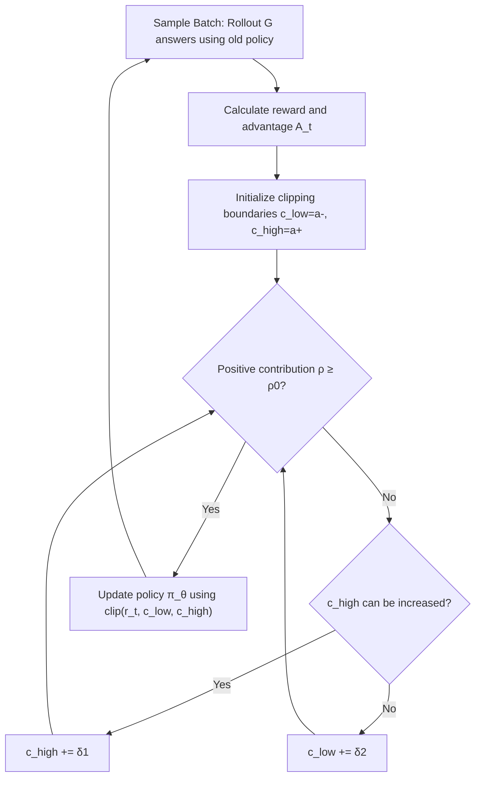

# BAPO: Stabilizing Off-Policy Reinforcement Learning for LLMs via Balanced Policy Optimization with Adaptive Clipping

**Conference**: ICLR 2026  
**OpenReview**: [https://openreview.net/forum?id=jIeJJqG7dz](https://openreview.net/forum?id=jIeJJqG7dz)  
**Code**: [https://github.com/WooooDyy/BAPO](https://github.com/WooooDyy/BAPO)  
**Area**: Reinforcement Learning / LLM Post-training  
**Keywords**: off-policy RL, adaptive clipping, entropy collapse, GRPO, policy gradient balance, LLM reasoning  

## TL;DR
BAPO dynamically adjusts the upper and lower clipping boundaries $c_{high}$ and $c_{low}$ of PPO/GRPO during training to maintain the contribution of positive samples to the policy gradient loss at a target value $\rho_0$. This mechanism simultaneously suppresses negative sample dominance and entropy collapse in off-policy RL, ensuring stable and efficient training for 7B/32B reasoning models.

## Background & Motivation

**Background**: RL has become the core paradigm for aligning and enhancing the reasoning capabilities of LLMs. Off-policy RL (where the rollout behavior policy differ from the target policy, utilizing "stale" data from past policies) is highly anticipated due to its high sample efficiency and tolerance for data latency, making it particularly suitable for modern training infrastructures like partial rollout and sample replay.

**Limitations of Prior Work**: However, applying off-policy RL to LLMs introduces significant issues. Preliminary experiments using GRPO (Figure 2) show that as data staleness increases from 0 to 8×, training rewards oscillate, gradients explode, and policy entropy drops sharply, leading to training collapse. In contrast, on-policy training remains stable across all metrics. This suggests the "high efficiency" of off-policy RL comes at the cost of "instability."

**Key Challenge**: The authors decompose this instability into two interrelated mechanisms. The first is **Optimization Imbalance**: analyzing positive and negative advantage tokens separately in the PPO target (Equation 5) reveals that positive samples are the minority in both quantity and contribution to the policy gradient loss. This is because models tend to generate longer trajectories (producing more negative tokens) on difficult problems, and low competence in early training leads to a high proportion of negative samples. Dominance by negative samples over-penalizes or suppresses neutral/correct behaviors, and low-probability negative tokens ($\pi_\theta(y_t)\to 0$, causing the $\log$ term to approach $-\infty$) trigger gradient explosions. The second is the **Entropy-Clip Rule**: the authors derive that the change in policy entropy $\Delta H(\pi_\theta)\approx -\eta\cdot\mathrm{Cov}[\log\pi_\theta(y_t), A_t\cdot X(y_t)+C]$, where only "unclipped" tokens influence the entropy. PPO's fixed symmetric clipping interval (e.g., $[0.8, 1.2]$) systematically excludes many "low-probability positive tokens" from optimization while over-penalizing low-probability negative tokens. This results in continuous distribution sharpening and monotonic entropy decline, causing the model to shift from "exploration" to "over-exploitation" and eventually hit a performance bottleneck.

**Goal**: Stabilize off-policy RL to balance positive/negative contributions and prevent gradient explosion while preserving policy entropy to maintain exploration, without introducing complex manual hyperparameter tuning.

**Core Idea**: The authors make a key observation (Figure 5) that tokens whose importance sampling (IS) weights $r_t$ deviate further from 1 tend to have lower probability and higher entropy. Based on this, they propose **Adaptive Asymmetric Clipping**: instead of fixed clipping boundaries, $c_{high}$ and $c_{low}$ are dynamically increased together for each batch. This first allows more low-probability positive tokens (to preserve entropy) and then moderately filters low-probability negative tokens (to prevent explosion) until the contribution ratio of positive samples to the loss reaches a preset target $\rho_0$.

## Method

### Overall Architecture
BAPO is built upon GRPO, replacing the **fixed and symmetric** clipping boundaries $\varepsilon$ in the PPO-style objective with a pair of **step-wise searched, asymmetric** boundaries $c_{low}$ and $c_{high}$. For each training step, advantages are calculated for sampled responses, followed by an inner loop: starting from initial boundaries $(a^-, a^+)$, the upper and lower bounds are increased by step sizes $\delta_1$ and $\delta_2$. The "positive sample contribution ratio $\rho$" is re-evaluated with each increment until $\rho$ reaches the target $\rho_0$ (or the boundaries reach their limits). Finally, the policy is updated using these specific boundaries. This mechanism transforms the goal of "maintaining entropy and balancing contributions" from manual tuning into an automatic per-step optimization problem.

### Key Designs

**1. Positive sample contribution ratio as regulation target: Quantifying entropy preservation as a constraint**. BAPO does not regulate entropy directly but captures an easier-to-control proxy: the ratio of the contribution of positive advantage tokens to the policy gradient loss. Formally, the method finds a pair $(c_{high}, c_{low})$ for each batch such that:

$$\frac{\sum_{A_t>0}\pi_{\theta_{rollout}}(y_t)\cdot|\min(r_t A_t,\ \mathrm{clip}(r_t,0,c_{high})A_t)|}{\sum_{A_t}\pi_{\theta_{rollout}}(y_t)\cdot|\min(r_t A_t,\ \mathrm{clip}(r_t,c_{low},c_{high})A_t)|}\ \ge\ \rho_0,$$

where $\rho_0$ (set to 0.4 in experiments) is the target ratio for positive signals. This design elegantly unifies the two mechanisms: a ratio that is too low implies negative sample dominance (imbalance) and the exclusion of low-probability positive tokens (entropy decline). Pushing the ratio to $\rho_0$ mitigates both. Setting an upper limit also prevents the ratio from spinning out of control—avoiding "tail degradation" where positive tokens overwhelm the loss and the model fails to improve on difficult problems.

**2. Step-wise search with upper bound priority: Sequencing for entropy preservation and explosion prevention**. When solving for $\rho_0$, BAPO does not raise both boundaries simultaneously. Instead, it **increases $c_{high}$ first and only increases $c_{low}$ after $c_{high}$ reaches its limit** (the inner loop of Algorithm 1). This order stems from findings in verification experiments (Figure 7): raising $c_{high}$ incorporates more low-probability positive tokens into the update, which improves performance and counters entropy decline. Conversely, loosening $c_{low}$ introduces more low-probability negative tokens, which degrades performance and accelerates entropy collapse. Thus, BAPO uses "expanding the upper bound" as the primary means to increase positive contribution, only slightly adjusting the lower bound if the upper bound reaches $b^+$. The movable ranges are set to $[a^-, b^-] = [0.6, 0.9]$ and $[a^+, b^+] = [1.2, 3.0]$, with step sizes $\delta_1 = 0.05$ and $\delta_2 = 0.02$. The larger range and step size for the upper bound reflect its primary role.

**3. Asymmetric clipping to smooth distribution and reverse entropy decline**. Viewed through the Entropy-Clip Rule (Figure 3), standard GRPO uses symmetric boundaries that strengthen high-probability positive tokens and punish low-probability negative tokens—updates that sharpen the distribution and reduce entropy. BAPO's asymmetric boundaries do the opposite: they include previously excluded low-probability positive tokens and remove excessive low-probability negative tokens, corresponding to updates that smooth the distribution and increase entropy. Combined with observations from Figure 5/9 (where tokens with IS weights further from 1 have lower probability and higher entropy), BAPO effectively "recalls high-entropy tokens" systematically. The authors also note that this framework unifies several prior techniques: DAPO's Clip-Higher (fixed $c_{high} = 1.28$), training only on top-20% high-entropy tokens, and target-entropy techniques can all be seen as special cases or approximations of BAPO's adaptive mechanism, with the difference being that BAPO is adaptive per step without manual specification.

## Key Experimental Results

### Main Results (AIME 2024 / 2025, average of pass@... 16 rollouts)

| Model | Scale | AIME 2024 | AIME 2025 | Average |
|------|------|-----------|-----------|------|
| DeepSeek-R1 | 671B | 79.8 | 70.0 | 74.9 |
| o3-mini-medium | - | 79.6 | 76.7 | 78.2 |
| Gemini-2.5-Flash-Thinking | - | 82.3 | 72.0 | 77.2 |
| Qwen3-32B | 32B | 81.4 | 72.9 | 77.2 |
| SkyWork-OR1-32B | 32B | 82.2 | 73.3 | 77.8 |
| BP-Math-32B (SFT) | 32B | 84.4 | 78.1 | 81.3 |
| BP-Math-32B (GRPO) | 32B | 84.6 | 78.8 | 81.7 |
| **BP-Math-32B (BAPO)** | 32B | **87.1** | **80.0** | **83.5** |
| SkyWork-OR1-7B | 7B | 70.2 | 54.6 | 62.4 |
| BP-Math-7B (SFT) | 7B | 66.9 | 59.0 | 62.9 |
| BP-Math-7B (GRPO) | 7B | 69.2 | 59.2 | 64.2 |
| **BP-Math-7B (BAPO)** | 7B | **70.8** | **62.5** | **66.7** |

The 7B BAPO model outperforms the open-source SkyWork-OR1-7B of the same scale (+7.9 points on AIME25). The 32B BAPO model achieves SOTA among comparable open-source models and exceeds DeepSeek-R1 by 7.3/10.0 points on AIME24/25, approaching o3-mini levels.

### Ablation Study

| Setting | AIME24 (Stale 2) | AIME24 (Stale 4) | AIME25 (Stale 2) | AIME25 (Stale 4) |
|------|------|------|------|------|
| Base Model | 54.2 | 54.2 | 38.4 | 38.4 |
| Fixed Symmetric Clip $[0.8, 1.2]$ | 58.3 | 54.2 | 39.4 | 40.2 |
| Clip-Higher $[0.8, 1.28]$ | 58.3 | 59.2 | 39.7 | 40.2 |
| **BAPO** | **60.9** | **62.0** | **44.2** | **43.3** |

BAPO consistently outperforms fixed clipping and Clip-Higher across different staleness levels, with the Gain increasing as staleness grows.

### Key Findings
- **Training Dynamics Comparison** (Figure 8 vs Figure 2): BAPO achieves rapid reward increase, stable gradient norm, and stable entropy simultaneously, whereas GRPO suffers from entropy collapse and gradient explosion as staleness increases.
- **Dynamic Boundaries** (Figure 10): The means of $c_{high}$ and $c_{low}$ fluctuate continuously during training, proving that BAPO adaptively balances positive/negative contributions per step rather than degrading into fixed values.
- **GRPO Sensitivity**: GRPO provides almost no Gain for strong SFT models (+0.2/+0.7 on 32B), while BAPO still provides a 2.7/1.9 point improvement, indicating gains come from the mechanism rather than simple RL continuation.
- **Partial Rollout Scenarios** (Figure 12): Under segmented rollout budgets of 2k/4k tokens, BAPO maintains higher rewards and more stable entropy compared to the baseline.

## Highlights & Insights
- **Attribution of instability to two actionable mechanisms**: Optimization imbalance and the Entropy-Clip Rule, supported by theoretical derivation (covariance form) rather than pure empirical tuning.
- **A single control knob $\rho_0$**: Elegantly couples "balancing positive/negative signals" and "preserving entropy" into a single online-solvable constraint, avoiding the manual tuning of multiple clipping hyperparameters seen in DAPO.
- **Unified perspective**: Explains a series of fragmented techniques (Clip-Higher, high-entropy token filtering, target-entropy) as special cases of adaptive clipping, providing clear theoretical increments.
- **Strong Empirical results**: Covers 7B/32B scales, multiple backbones, and various off-policy scenarios (sample replay, partial rollout, multiple staleness levels). The 32B results are competitive with o3-mini.

## Limitations & Future Work
- **Residual Hyperparameters**: Parameters like $\rho_0$, the movable ranges $[a^-, b^-]/[a^+, b^+]$, and step sizes $\delta_1/\delta_2$ still need to be set. Although the authors claim they were not fine-tuned, their universality across different tasks/models needs further validation.
- **Narrow Task Scope**: Evaluation is concentrated on AIME mathematical reasoning; other RL focal points like coding and agentic tasks are not covered.
- **Inner Loop Overhead**: The step-wise boundary search and repeated $\rho$ evaluation per step introduce additional computation. The training time cost relative to GRPO is not fully discussed.
- **Theoretical Approximation**: The Entropy-Clip Rule relies on a first-order approximation ($\approx$); its accuracy boundaries under large step sizes or strong off-policy conditions are unclear.

## Related Work & Insights
- **PPO / GRPO** (Schulman 2017; Shao 2024): Directly serves as the foundation for BAPO; the core modification is the clipping mechanism.
- **DAPO's Clip-Higher** (Yu 2025): Fixed increase of the upper bound to include low-probability positive tokens. BAPO generalizes this to per-step adaptation and adds constraints on negative sample contributions.
- **Entropy Control / High-Entropy Training** (Wang 2025a; He 2025 on target-entropy): Shares BAPO's motivation for entropy preservation and is integrated into its unified explanation framework.
- **Curriculum Learning** (Xi 2024a; Yuan 2025): BAPO's analysis of "high negative sample proportion in early stages" provides a new explanatory perspective for the effectiveness of curriculum-based methods.
- **Insight**: Transforming "training stability" into an "online constraint of a quantifiable proxy (positive contribution ratio)" is a strategy worth migrating to other unstable RL scenarios, such as RLHF and agentic RL.

## Rating
- **Novelty**: ⭐⭐⭐⭐ — The theoretical characterization of the Entropy-Clip Rule and adaptive asymmetric clipping with $\rho_0$ as a knob represent an insightful redesign of the PPO clipping mechanism, unifying several existing tricks.
- **Experimental Thoroughness**: ⭐⭐⭐⭐ — Comprehensive coverage of two scales, multiple backbones, and off-policy scenarios with solid visualization of training dynamics. Points deducted for task limitation to math reasoning and lack of training overhead analysis.
- **Writing Quality**: ⭐⭐⭐⭐ — Logical progression of mechanism analysis (imbalance → Entropy-Clip → asymmetric validation → BAPO) with well-placed supporting charts.
- **Value**: ⭐⭐⭐⭐ — Directly addresses a core pain point in deploying off-policy RL. The method is simple and reproducible, offering practical value for long-context/efficient RL training.

<!-- RELATED:START -->

## Related Papers

- [\[ICLR 2026\] Revisiting Group Relative Policy Optimization: Insights into On-Policy and Off-Policy Training](revisiting_group_relative_policy_optimization_insights_into_on-policy_and_off-po.md)
- [\[ICLR 2026\] TRAPO: Trust-Region Adaptive Policy Optimization](trust-region_adaptive_policy_optimization.md)
- [\[ICLR 2026\] On-Policy RL Meets Off-Policy Experts: Harmonizing Supervised Fine-Tuning and Reinforcement Learning via Dynamic Weighting](on-policy_rl_meets_off-policy_experts_harmonizing_supervised_fine-tuning_and_rei.md)
- [\[ICLR 2026\] Single-stream Policy Optimization](single-stream_policy_optimization.md)
- [\[ICLR 2026\] Geometric-Mean Policy Optimization](geometric-mean_policy_optimization.md)

<!-- RELATED:END -->
