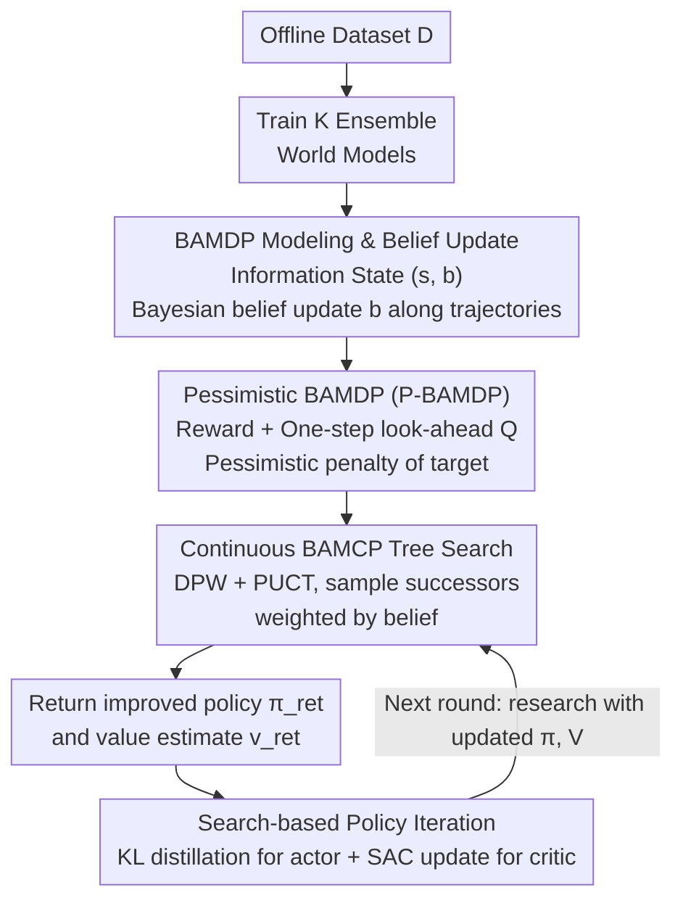

# BA-MCTS: Bayes Adaptive Monte Carlo Tree Search for Offline Model-based RL

**Conference**: ICLR 2026  
**arXiv**: [2410.11234](https://arxiv.org/abs/2410.11234)  
**Code**: None  
**Area**: Reinforcement Learning / Offline RL / Model-based Methods  
**Keywords**: Offline RL, Model-based RL, Bayes Adaptive MDP, MCTS, Uncertainty Quantification, Deep Ensemble

## TL;DR
This work introduces Bayes Adaptive MDP (BAMDP) into offline model-based RL for the first time, proposing Continuous BAMCP to solve Bayesian planning in continuous state/action spaces. By combining pessimistic reward penalties with search-based policy iteration (the "RL + Search" paradigm), it significantly outperforms 19 baselines on 12 D4RL tasks (Cohen's $d > 1.8$) and is successfully applied to nuclear fusion tokamak control.

## Background & Motivation
**Background**: Offline MBRL learns an ensemble of world models from static datasets and optimizes policies using model rollouts. MOBILE, CBOP, and RAMBO are current SOTA methods.

**Limitations of Prior Work**:
   - Multiple MDPs may behave identically on the offline dataset but diverge in OOD regions—model uncertainty must be addressed.
   - Existing methods **treat ensemble members uniformly** (e.g., uniformly sampling one model for prediction) and fail to utilize dynamic belief updates.
   - Different ensemble members have varying accuracies across different state-action regions, but there is no mechanism for the agent to adaptively trust more precise members.

**Key Challenge**: BAMDP provides a principled framework for uncertainty handling (dynamic model belief updates via Bayesian posterior), but existing BAMCP algorithms are only suitable for discrete spaces and require the true world model.

**Core Idea**: Model offline MBRL as a BAMDP + Propose Continuous BAMCP + Pessimistic reward penalty + Distill search results into a policy network—realizing an "RL + Search" (similar to AlphaZero) paradigm for offline MBRL.

## Method

### Overall Architecture
This paper addresses a long-overlooked problem in offline model-based RL: while an **ensemble** of world models learned from static data behaves consistently in covered regions, they disagree in OOD regions. Current methods either sample members uniformly or add static pessimistic penalties, failing to teach the agent "which model to trust here and now." The overall approach of BA-MCTS is to remodel offline MBRL as a Bayes Adaptive MDP (BAMDP), making the "belief about the model" part of the state and updating it dynamically during planning.

The specific pipeline involves: first training $K$ ensemble world models $\{(\mathcal{P}_\theta^i, \mathcal{R}_\theta^i)\}_{i=1}^K$ on the offline dataset $\mathcal{D}_\mu$; then constructing a BAMDP with pessimistic reward penalties (embedding "model belief" into the state and penalizing uncertain regions); for each sampled state, performing a tree search with Continuous BAMCP and belief updates to obtain improved policy and value estimates; and finally distilling the search results back into an actor-critic framework, using the updated networks to drive the next round of search in a policy iteration loop. This establishes an AlphaZero-style "RL + Search" paradigm for offline continuous control.

### Key Designs

**1. BAMDP Modeling & Belief Update: Learning "Which Model to Trust" as a State Variable**

The limitation addressed is that ensemble members have different accuracies in different regions, yet existing methods treat them equally. BA-MCTS defines the information state as $(s, b)$, where $s$ is the physical state and $b$ is the current belief distribution over ensemble members. Planning starts with a uniform prior $b_0 = [1/K, \ldots, 1/K]$ (since ensembles are IID sampled), and performs Bayesian updates after each step based on observed transitions and rewards (Eq. 4):

$$b'(\theta)(i) \propto b(\theta)(i) \cdot \mathcal{P}_\theta^i(s'|s,a) \cdot \mathcal{R}_\theta^i(r|s,a)$$

This means members with more accurate predictions are assigned higher weights in subsequent planning. This essentially differs from "uniform ensemble sampling"—the agent can selectively trust the most accurate model along each trajectory rather than treating uncertainty as a fixed heuristic.

**2. Pessimistic BAMDP (P-BAMDP): Safeguarding Regions Where All Models Are Inaccurate**

Even if BAMDP can adaptively trust more reliable models, it may still encounter OOD regions where all ensemble members are inaccurate, and belief updates alone cannot resolve this. P-BAMDP adds a layer of pessimistic penalty to the reward (Eq. 5), forming the "environment" solved by common search:

$$\tilde{r} = r - \lambda \cdot \text{std}[r^i + \gamma \mathbb{E}_{s'^i, a'} Q_{\psi^-}(s'^i, a')]_{i=1}^K$$

Notably, the penalty targets the standard deviation of the **one-step look-ahead Q-value target** across members. This more directly characterizes the overall uncertainty of the agent at a specific state-action pair, suppressing high-risk areas more effectively and acting as a safety valve for the belief mechanism.

**3. Continuous BAMCP: Extending Bayesian Planning to Continuous Stochastic Control**

Original BAMCP (Guez 2013) only handles discrete spaces and relies on the true world model. To adapt it for continuous offline MBRL, Double Progressive Widening (DPW) is introduced. The search tree maintains a limited list of children for each node, controlled by the visit count $\lfloor N^{\alpha} \rfloor$. New actions or successors are only added after sufficient visits, constraining the branching factor in continuous spaces. Since standard root sampling fails with DPW, the selection rule is changed to PUCT. During state expansion (StatePW), successors are sampled based on current weighted beliefs $s' \sim \sum_i b(\theta)(i) \mathcal{P}_\theta^i(\cdot|s,a)$, and beliefs are updated immediately after each transition. The paper further proves the consistency of this planner, showing it converges to a near-Bayes-optimal policy.

**4. Search-based Policy Iteration ("RL + Search"): Distilling Strong Search Signals into Deployable Networks**

Pure search only provides decisions for single states and lacks generalization or real-time deployment capabilities. Inspired by AlphaZero, BA-MCTS distills Continuous BAMCP results into an actor-critic framework. For each sampled state $s$, the search returns an improved policy $\pi_{ret}(a|s)$ based on visit counts, and the actor is aligned via KL divergence $D_{KL}(\pi_{ret} \| \pi)$. Simultaneously, the search-derived value estimate $v_{ret}$ updates the critic in a SAC style. Search acts as a "stronger policy evaluation and improvement operator," allowing the network to inherit search quality while maintaining generalization and real-time inference.

### Loss & Training
- World Model: Trained using NLL loss for a Gaussian mixture dynamics ensemble ($K$ members).
- Actor: $\mathcal{L}_{actor} = D_{KL}(\pi_{ret} \| \pi)$.
- Critic: Standard SAC soft Q-loss + pessimistic penalty.
- Search Parameters: $E$ simulations, depth $d_{max}$, DPW parameters $\alpha, \beta$.

## Key Experimental Results

### Main Results (D4RL MuJoCo, 12 tasks)

| Task | BA-MCTS | MOBILE | CBOP | RAMBO | COMBO |
|------|---------|--------|------|-------|-------|
| Hopper-medium | **103.9** | 102.5 | 98.7 | 92.8 | 97.2 |
| Walker2d-med-replay | **91.4** | 85.1 | 74.6 | 85.0 | 56.0 |
| **Average (12 tasks)** | **80.3** | 76.5 | 73.9 | 68.9 | — |

Cohen's $d > 1.8$ (vs all 19 baselines with standard deviations)—indicating extremely high statistical significance ($d > 0.8$ is considered a large effect).

### Tokamak Control (Nuclear Fusion, 3 tasks)

| Task | BA-MCTS | MOBILE | CBOP | SAC-10 |
|------|---------|--------|------|--------|
| Plasma Temp Tracking | **Optimal** | — | — | — |
| Shape Control | **Optimal** | — | — | — |
| Combined Control | **Optimal** | — | — | — |

Successful validation on highly stochastic real physical systems demonstrates the method's robustness.

### Ablation Study

| Configuration | Effect | Description |
|------|------|------|
| Remove BAMDP (Uniform Ensemble) | Significant drop | Core value of belief adaptation |
| Remove Pessimistic Penalty | Drop | Safety required in OOD regions |
| Remove Search (Pure RL) | Drop | Search provides stronger policy improvement signals |
| Increase Search Depth $d_{max}$ | Performance gain | Higher computational cost trade-off |

### Key Findings
- BAMDP belief updates allow the agent to "learn" which ensemble member is more reliable along a trajectory—crucial at OOD boundaries.
- The "RL + Search" paradigm successfully transfers from board games (AlphaZero) to continuous control via policy iteration with search result distillation.
- Short-horizon rollouts ($H$) combined with a value network as a terminal estimate effectively control model error accumulation.
- Tokamak validation shows the method is applicable to high-stochasticity control in real physical systems.

## Highlights & Insights
- **First application of BAMDP in offline RL**: A conceptual contribution where "ensemble uncertainty" is elevated from a heuristic to a principled Bayesian framework. Belief updates give the agent dynamic judgment regarding model reliability.
- **Transfer of the "RL + Search" Paradigm**: Core ideas from AlphaZero (search as strong supervision $\rightarrow$ distillation $\rightarrow$ iterative improvement) are successfully applied to continuous control, potentially opening a new paradigm for offline MBRL.
- **Theoretical Consistency Proof**: The convergence proof for Continuous BAMCP provides a theoretical foundation for planning in continuous BAMDPs.

## Limitations & Future Work
- High computational cost of MCTS planning—requiring $E$ simulations per state may limit real-time applications.
- Limited search depth $d_{max}$ means model errors can still accumulate.
- Fixed ensemble size $K$ (usually 7); richer posterior approximations (e.g., Bayesian Neural Networks) might be better.
- Not tested on visual observations (high-dimensional state spaces).
- DPW parameters $\alpha, \beta$ require tuning.

## Related Work & Insights
- **vs MOBILE/CBOP/RAMBO**: These methods use ensembles but treat members uniformly or only apply static pessimism; BA-MCTS uses dynamic belief updates + search-based planning, a fundamentally different paradigm.
- **vs BAMCP (Guez 2013)**: Original BAMCP is limited to discrete spaces and requires true models; Continuous BAMCP extends this to continuous spaces using learned models.
- **vs AlphaZero**: BA-MCTS is essentially "AlphaZero for offline MBRL"—using search, distillation, and iteration while adding Bayesian beliefs and pessimism.

## Rating
- Novelty: ⭐⭐⭐⭐⭐ First to unify BAMDP + Continuous BAMCP + Pessimism + Search-based PI in offline MBRL.
- Experimental Thoroughness: ⭐⭐⭐⭐⭐ New SOTA on 12 D4RL tasks + Tokamak application + Cohen's d significance analysis + thorough ablations.
- Writing Quality: ⭐⭐⭐⭐ Rigorous theory, clear algorithmic description.
- Value: ⭐⭐⭐⭐⭐ Introduces a new paradigm (BAMDP + "RL + Search") for offline MBRL with far-reaching implications.

<!-- RELATED:START -->

## Related Papers

- [\[ICLR 2026\] ROMI: Model-based Offline RL via Robust Value-Aware Model Learning with Implicitly Differentiable Adaptive Weighting](model-based_offline_rl_via_robust_value-aware_model_learning_with_implicitly_dif.md)
- [\[ICML 2026\] Reinforced Sequential Monte Carlo for Amortised Sampling](../../ICML2026/reinforcement_learning/reinforced_sequential_monte_carlo_for_amortised_sampling.md)
- [\[ICLR 2026\] GAS: Enhancing Reward-Cost Balance of Generative Model-assisted Offline Safe RL](gas_enhancing_reward-cost_balance_of_generative_model-assisted_offline_safe_rl.md)
- [\[ICLR 2026\] Offline Reinforcement Learning with Adaptive Feature Fusion](offline_reinforcement_learning_with_adaptive_feature_fusion.md)
- [\[NeurIPS 2025\] Sequential Monte Carlo for Policy Optimization in Continuous POMDPs](../../NeurIPS2025/reinforcement_learning/sequential_monte_carlo_for_policy_optimization_in_continuous_pomdps.md)

<!-- RELATED:END -->
