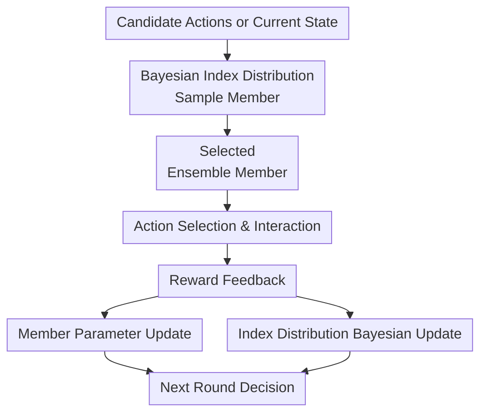

# Bayesian Ensemble for Sequential Decision-Making

**Conference**: ICLR2026  
**OpenReview**: [https://openreview.net/forum?id=s2hxd8JghB](https://openreview.net/forum?id=s2hxd8JghB)  
**Code**: Not released  
**Area**: Reinforcement Learning / Sequential Decision-Making  
**Keywords**: Bayesian Ensemble, Thompson Sampling, Contextual Bandit, DQN, Uncertainty Modeling  

## TL;DR
This paper proposes Bayesian Ensemble, which models the choice of "which ensemble member to select" as an inner bandit with Bayesian updates. By dynamically adjusting the sampling distribution of ensemble members using reward feedback in contextual bandits and DQN, the method significantly reduces regret and enhances cumulative returns in MiniGrid reinforcement learning tasks with negligible overhead compared to standard ensemble+ methods.

## Background & Motivation
**Background**: A core challenge in sequential decision-making is the balance between exploration and exploitation. The classical approach of Thompson Sampling maintains a posterior distribution over reward model parameters, samples a possible world each round, and acts optimally according to that world. In neural network scenarios, maintaining an exact posterior is intractable, so practical systems often use approximate posterior sampling methods like deep ensembles, random prior functions, or hypermodels.

**Limitations of Prior Work**: These ensemble-based Thompson Sampling methods typically treat each ensemble member as a posterior sample, but the index distribution for "selecting a member" is mostly fixed, such as a uniform discrete distribution or a standard Gaussian distribution. While convenient, this ignores a practical reality: members differ in quality. Random initialization, prior functions, and training paths may allow some members to learn useful uncertainties earlier, while others might consistently provide poor exploration directions.

**Key Challenge**: Existing ensemble methods only update the network parameters of the members themselves but do not update the probability of a member being sampled. In other words, while a learning loop exists between model parameters and environmental feedback, no direct loop exists between the index distribution and rewards. Member diversity is treated as a static resource rather than a decision object that can be calibrated via feedback.

**Goal**: The authors aim to add a lightweight but principled Bayesian layer for member selection without rewriting existing ensemble architectures. This layer needs to be compatible with both contextual bandits and reinforcement learning: reducing regret in bandits and stabilizing Q-estimation while improving exploration efficiency in DQN, all without incurring prohibitive computational costs.

**Key Insight**: A key observation in this paper is that the number of parameters in the index distribution is typically much smaller than those in a neural ensemble. Instead of solely training massive networks with surrogate losses, the "which member yielded a high reward" signal can be used as evidence for Bayesian inference to update the member selection distribution. This effectively treats ensemble member selection as a mini-bandit problem.

**Core Idea**: Bayesian Ensemble dynamically updates the sampling distribution of ensemble members using reward feedback, making members proven to be more useful more likely to be selected in subsequent decisions, while retaining the stochasticity and exploration capabilities of posterior sampling.

## Method
Bayesian Ensemble is not a brand-new network architecture but an index distribution updater that can be layered onto existing ensemble methods. It retains the standard training of each base model while maintaining an additional probability distribution $p^{(t)}$ over the member index $z$. Each round, a member is sampled from $p^{(t)}$, the selected member guides action selection, and finally, the network parameters and $p^{(t)}$ are updated using the actual reward.

### Overall Architecture
The overall process can be understood as "two-layer learning": the outer layer is a standard sequential decision agent interacting with the environment, and the inner layer is the Bayesian Ensemble treating each member as a candidate policy evaluator, updating "who to believe next" based on reward feedback. This design covers both bandits (Bayesian Ensemble Bandit, BEB) and RL (Bayesian Ensemble DQN, BE-DQN).

In BEB, members $f(x; z, \theta)$ output a probability distribution over a discrete reward space. Given candidate actions $X^{(t)}$, the algorithm samples $z^{(t)} \sim p^{(t)}$ and selects the action maximizing expected reward: $x^{(t)}=\arg\max_{x\in X^{(t)}} \sum_i R_i f(x;z^{(t)},\theta^{(t)})_i$. In BE-DQN, each member is a Q-network; the sampled member drives the behavior policy, while the weighted average of all members constructs the target.

### Key Designs
**1. Bayesian Index Distribution: Converting Member Selection from Fixed Randomness to Learned Posterior**

Traditional ensemble sampling uses indices from a fixed distribution, such as $z\sim \mathrm{Uniform}([K])$ or $z\sim \mathcal{N}(0,I)$. This paper argues that a fixed distribution wastes reward information. If a member consistently provides high rewards for the current task, it should be sampled more frequently; if it often leads to failure, it should retain exploration opportunities but not with the same weight as high-quality members.

Bayesian Ensemble thus maintains a time-varying $p^{(t)}(z)$. It does not replace the parameter learning of members but supplements it with a posterior update for member selection. Network parameters $\theta$ are still trained via empirical risk minimization, i.e., minimizing $\sum_{(x,r)\in D}\mathbb{E}_{z\sim p}[\ell(r,f(x;z,\theta))]$, while the index distribution $p$ is updated directly via rewards, as it has few parameters and is cheaper to update.

**2. BEB: Inner Thompson Sampling for Ensemble+ and Hypermodels**

In discrete ensemble+ scenarios, each member corresponds to a Beta distribution $w_i \sim \mathrm{Beta}(\alpha_i, \beta_i)$. Each round, weights are sampled from all Beta distributions, and the member with $z=\arg\max_i w_i$ is chosen. If the member receives a binary reward $r^{(t)} \in \{0,1\}$, a conjugate update is performed: $(\alpha_i, \beta_i) \leftarrow (\alpha_i, \beta_i) + (r^{(t)}, 1-r^{(t)})$. This is equivalent to performing Thompson Sampling on "which member is likely to succeed," with updates being exact Bayesian inference.

For continuous index methods like hypermodels, where indices originally come from a standard Gaussian, BEB extends this such that each index component has a Gaussian distribution with learnable mean and variance, updated via variational inference. Although more costly than Beta-Bernoulli updates, this incorporates continuous index uncertainty into the feedback loop.

**3. BE-DQN: Single Q-network for Behavior, Bayesian Weighted Ensemble for Target**

In the RL version, BE-DQN maintains $K$ Q-networks and a Beta distribution for each. Each iteration samples $w_1, \ldots, w_K$, normalizes them to $p_k = w_k / \sum_j w_j$, and chooses the $j$-th Q-network with the largest sampled weight to execute actions. Thus, the behavior policy maintains "single-member-driven" temporal consistency, avoiding the smoothing of exploration differences caused by averaging Q-values at every step.

Simultaneously, the training target does not rely solely on the selected Q-network but uses a weighted average of all Q-networks: $y_{s,a}=\mathbb{E}_B[r+\gamma\max_{a'}\sum_{k=1}^{K}p_k Q(s',a';\theta^k_{i-1})\mid s,a]$. This allows BE-DQN to preserve deep exploration in behavior selection while leveraging the variance reduction of ensembles in bootstrapping targets.

**4. Variance Bound: Theoretical Support for Stability and Exploration**

The authors analyze the impact of target approximation error (TAE) on Q-value estimation variance using a $M$-state unidirectional MDP. Under a zero-reward setting, the variance of DQN is $\sum_{m=0}^{M-1}\gamma^{2m}\sigma^2_{s_m}$. E-DQN reduces this to $\frac{1}{K}\sum_{m=0}^{M-1}\gamma^{2m}\sigma^2_{s_m}$ by uniformly averaging $K$ independent estimators.

The overall Q-estimation variance of BE-DQN is $\sum_{k=1}^{K}p_k^2\sum_{m=0}^{M-1}\gamma^{2m}\sigma^2_{s_m}$. Since $\sum_k p_k=1$, its variance lies between E-DQN and DQN: the lower bound corresponds to uniform weights, and the upper bound corresponds to trusting almost exclusively one member. This suggests BE-DQN is no less stable than a single DQN while being more biased toward high-reward members.

### Mechanism Example
Consider a news recommendation bandit with 20 candidate articles and an ensemble of 3 members. Initially, all Beta distributions are $\mathrm{Beta}(1,1)$, so the system tries them with roughly equal probability. In round 1, member 2 has the highest sampled weight; the agent uses member 2 to predict click probabilities and selects the article with the highest expectation. If the user clicks, member 2's distribution is updated to $\mathrm{Beta}(2,1)$.

In subsequent rounds, if members 2 and 3 frequently yield clicks, their $\alpha$ values grow faster, and their probability of being sampled with the maximum weight increases. Even if member 1 performs poorly temporarily, it is not permanently excluded, as Beta sampling occasionally provides exploration opportunities.

In BE-DQN, this is analogous to MiniGrid navigation. If a specific Q-network learns to pass through a door to the goal earlier, its Beta distribution receives positive feedback from successful trajectories, leading it to be chosen as the behavior network more often. However, the target is still a weighted average, preventing the training from being entirely dominated by the accidental overestimation of a single member.

### Loss & Training
In BEB, member parameters are trained using task losses. For finite discrete rewards, the model outputs a reward distribution on $\Delta_N$, with common losses being binary or multi-class cross-entropy. The objective is the expected empirical risk over dataset $D$ and index distribution $p$. New components in BEB occur only at the index distribution: ensemble+ uses Beta-Bernoulli conjugate updates, and hypermodel uses variational inference to update Gaussian index parameters.

In BE-DQN, each Q-network is trained using standard squared Bellman error on shared replay buffer data. Hyperparameters include: ensemble size $K=5$, discount factor $0.99$, learning rate $5\times10^{-4}$, batch size 32, replay buffer size $5\times10^4$, and target network updates every 500 steps, with $\epsilon$ decaying from 0.1 to 0.02. All DQN baselines use consistent architectures to isolate the effects of the ensemble weighting/sampling mechanism.

## Key Experimental Results

### Main Results
Experiments cover three scenarios: synthetic contextual bandits (Neural Testbed and Mushroom), real-world recommendation bandits (Yahoo!R6B), and MiniGrid reinforcement learning. Bandits are measured by regret or cumulative clicks, while RL is measured by average reward after $10^5$ frames.

| Scenario | Comparison | Ours | Key Result | Description |
|------|----------|----------|----------|------|
| Neural Testbed, $d=2$ | ensemble+ | ensemble+(BEB) | Regret reduced by 37.0% | Uniform index to Beta update |
| Neural Testbed, $d=10$ | hypermodel | hypermodel(BEB) | Regret reduced by 22.8% | Continuous index with VI update |
| Neural Testbed, $d=50$ | ensemble+ | ensemble+(BEB) | Regret reduced by 42.2% | More gains in high dimensions |
| Mushroom | ensemble+ | ensemble+(BEB) | Regret reduced by 8.7% | Real classification data bandit |
| Yahoo!R6B | hypermodel | hypermodel(BEB) | 50,322.1 clicks | Higher than hypermodel's 49,676.8 |

MiniGrid results show BE-DQN outperforms DQN, E-DQN, RE-DQN, and UAAC across several navigation tasks. Notably, on LavaGapS5-6x6 and MultiRoom-N2-S4, BE-DQN achieves average rewards of 0.350 and 0.118, respectively, while ensemble baselines are significantly lower.

| MiniGrid Environment | vanilla DQN | Ensemble DQN | Random Ensemble DQN | UAAC | BE-DQN |
|---------------|-------------|--------------|---------------------|------|--------|
| FourRooms | 0.004 | 0.012 | 0.010 | 0.036 | 0.040 |
| Empty-6x6 | 0.026 | 0.162 | 0.186 | 0.082 | 0.248 |
| LavaGapS5-6x6 | 0.026 | 0.178 | 0.120 | 0.022 | 0.350 |
| GoToDoor-5x5 | 0.066 | 0.120 | 0.128 | 0.106 | 0.142 |
| MultiRoom-N2-S4 | 0.002 | 0.042 | 0.030 | 0.004 | 0.118 |

### Ablation Study
The paper analyzes the cost and benefits of the BE layer through wall time, ensemble size, and update frequency rather than traditional component removal. A key finding is that Beta conjugate updates add almost no time cost to ensemble+, whereas hypermodel(BEB) gains come at the price of additional VI overhead.

| Analysis | Configuration | Key Metric | Description |
|--------|------|----------|------|
| Wall time, ensemble+, $d=50$ | baseline vs BEB | 1165.07s vs 1162.82s | Beta update overhead is negligible |
| Wall time, hypermodel, $d=50$ | baseline vs BEB | 60.16s vs 84.20s | VI update adds >20% extra cost |
| Ensemble size | 25 / 50 / 100 | Regret reduction 28.23% / 33.21% / 47.97% | Larger ensembles allow BEB to exploit more diversity |
| Reduced update frequency | Index dim 36 | Wall time 90.39s to 76.99s | Saving cost reduces regret reduction from 16.47% to 4.37% |

### Key Findings
- The primary gain of BE comes from "making the member selection distribution learnable": with the same base ensemble, regret drops consistently by allowing the index distribution to adapt to rewards.
- For discrete ensemble+, Beta-Bernoulli conjugate updates are extremely efficient with almost zero wall time increase; for hypermodel, mechanical VI updates for continuous indices are more expensive and require frequency tuning based on budgets.
- BE-DQN in MiniGrid avoids simple averaging for behavior, using single-member action and weighted ensemble targets, thus balancing deep exploration and variance reduction.
- The theoretical variance bound does not claim BE-DQN always has lower variance than E-DQN but places it between E-DQN and DQN. Benefits stem from the balance between stability, member selection, and exploration behavior.

## Highlights & Insights
- Explicitly modeling ensemble member selection as an inner bandit is the most distinct innovation. It does not overturn the ensemble sampling paradigm but identifies a neglected posterior: the member index itself should update with rewards.
- The framework is highly compatible with engineering systems as a "layer-on" approach rather than a full replacement. Existing systems like ensemble+, hypermodel, and DQN ensembles can be integrated by changing the index distribution parameterization.
- In BE-DQN, there is an interesting division of labor: behavior sampling encourages temporally coherent exploration, while weighted target averaging reduces bootstrapping volatility.
- Presenting bandit recommendation and MiniGrid RL within the same framework emphasizes that Bayesian Ensemble addresses abstract sequential decision uncertainty rather than specific benchmark tricks.

## Limitations & Future Work
- BEB effectiveness depends on whether reward signals clearly indicate member quality. In environments with sparse, delayed, or highly stochastic rewards, simple Beta updates might misattribute accidental success to member quality.
- Theoretical analysis primarily focuses on TAE variance in simplified MDPs, explaining stability boundaries but not fully covering the interplay of stochastic rewards, function approximation error, and complex policy distributions.
- The cost of hypermodel(BEB) continuous index updates via VI is notably higher. Future engineering research is needed to optimize update frequencies and approximation families for large-scale systems.
- MiniGrid experiments are limited. BE-DQN has yet to be verified in Atari, continuous control, or offline RL. In offline settings, biasing toward high-reward members could amplify extrapolation error, requiring additional constraints.
- Current designs rely on binary reward updates for Beta distributions. For continuous or risk-sensitive rewards, matching likelihoods and posterior approximations should be considered.

## Related Work & Insights
- **vs Deep Ensemble / Ensemble+**: Deep ensembles use multiple initializations for epistemic uncertainty, and ensemble+ adds random prior functions. This work keeps these members but changes the sampling probability from fixed uniform to reward-adaptive posterior.
- **vs Hypermodel / HyperAgent**: Hypermodels use continuous indices for scalable posterior sampling. This work extends fixed Gaussian indices to learnable ones with VI updates, allowing feedback absorption.
- **vs Ensemble DQN / Random Ensemble DQN**: E-DQN reduces variance by averaging, while RE-DQN uses random weights for stability. BE-DQN differs by using weights adjusted by rewards via a Beta posterior.
- **vs Thompson Sampling**: Classic TS maintains arm reward posteriors. This work embeds TS within an ensemble to decide "which approximate posterior sample to trust," suitable for scenarios where neural posteriors are hard to maintain explicitly.
- **Insight**: Many ensemble methods use default aggregation or sampling rules. These rules can be treated as learnable objects. Reliable feedback signals allow calibration via Bayesian updates, bandits, or meta-learning rather than static uniform or random selection.

## Rating
- Novelty: ⭐⭐⭐⭐☆ Incorporating index distributions into the Bayesian feedback loop is natural yet precise, providing a unified explanation for ensemble TS and DQN.
- Experimental Thoroughness: ⭐⭐⭐⭐☆ Covers synthetic bandits, real recommendations, and MiniGrid RL with cost analysis, though lacks larger RL or offline RL verification.
- Writing Quality: ⭐⭐⭐⭐☆ Clear narrative with complete algorithmic and theoretical boundaries, despite minor typos in table references.
- Value: ⭐⭐⭐⭐☆ Highly practical as a lightweight plugin for existing ensemble systems. Long-term value depends on the robustness of index posterior updates under complex rewards.

<!-- RELATED:START -->

## Related Papers

- [\[ICLR 2026\] EMFuse: Energy-based Model Fusion for Decision Making](emfuse_energy-based_model_fusion_for_decision_making.md)
- [\[ICLR 2026\] Ada-Diffuser: Latent-Aware Adaptive Diffusion for Decision-Making](ada-diffuser_latent-aware_adaptive_diffusion_for_decision-making.md)
- [\[ICML 2025\] Counterfactual Effect Decomposition in Multi-Agent Sequential Decision Making](../../ICML2025/reinforcement_learning/counterfactual_effect_decomposition_in_multi-agent_sequential_decision_making.md)
- [\[ICLR 2026\] Information-based Value Iteration Networks for Decision Making Under Uncertainty](information-based_value_iteration_networks_for_decision_making_under_uncertainty.md)
- [\[ICML 2026\] Multi-Agent Decision-Focused Learning via Value-Aware Sequential Communication](../../ICML2026/reinforcement_learning/multi-agent_decision-focused_learning_via_value-aware_sequential_communication.md)

<!-- RELATED:END -->
