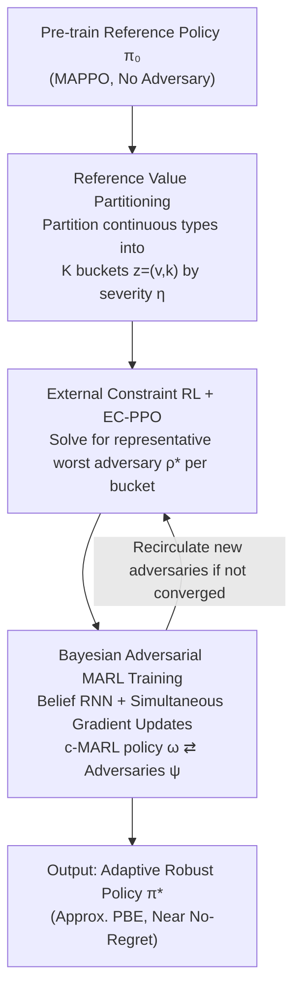

# Bayesian Robust Cooperative Multi-Agent Reinforcement Learning Against Unknown Adversaries

**Conference**: ICLR 2026  
**OpenReview**: [https://openreview.net/forum?id=G3gm7QBeMc](https://openreview.net/forum?id=G3gm7QBeMc)  
**Code**: https://github.com/kiarashkaz/BATPAL  
**Area**: Reinforcement Learning / Multi-Agent / Robustness  
**Keywords**: Cooperative Multi-Agent RL, Adversarial Robustness, Bayesian Games, Perfect Bayesian Equilibrium, Belief Estimation

## TL;DR
To address "unknown goal" adversaries in cooperative multi-agent reinforcement learning (c-MARL) deployment, this paper moves beyond learning a single worst-case max–min policy. Instead, it discretizes an infinite variety of adversarial strategies into finite types based on their "disruption severity." Representative worst-case adversaries are learned for each type, and a robust adaptive policy, BATPAL, is trained using a belief network and simultaneous gradient updates. BATPAL consistently outperforms existing SOTA against both seen and unseen attacks across four benchmarks.

## Background & Motivation

**Background**: c-MARL has shown strong performance in scenarios like autonomous driving, 5G, robotics, and smart grids. However, if even one agent is compromised (via direct action manipulation or observation poisoning), the entire team's performance can collapse. Robust policies against failures and adversarial attacks are thus critical. Existing methods primarily rely on data augmentation (injecting perturbations during training) or adversarial training (solving for a saddle point in a zero-sum Stackelberg game between defenders and adversaries).

**Limitations of Prior Work**: Such methods almost exclusively assume a "worst-case adversary" whose sole objective is to minimize the team reward. This results in a **single** policy optimized for the worst case, which is often suboptimal in normal collaborative scenarios. More critically, real-world adversaries during deployment might not aim to "minimize team reward" (e.g., they might pursue a private objective or exhibit non-collaborative behavior due to hardware failure).

**Key Challenge**: Robust learning based on "worst-case + gradient descent for saddle points" has three fundamental flaws. First, the worst-case assumption fails to characterize adversaries with diverse goals; a max–min policy may be far from optimal against real adversaries. Second, saddle-point optimization is inherently non-convex, causing algorithms to get stuck in local stable points, yielding only local Stackelberg equilibria. Third, seeing only "perturbed versions of a single adversarial strategy" during training causes agents to overfit to specific adversarial dynamics, potentially failing to reach even the max–min theoretical performance floor when facing unseen adversary types.

**Goal**: To train a robust MARL policy capable of adapting to **diverse** adversarial behaviors, avoiding the sacrifice of optimality in normal scenarios while maintaining adaptability against adversaries with unknown goals.

**Key Insight**: Rather than learning a single max–min policy, the set of adversarial strategies should be **partitioned into disjoint subsets** based on the range of team rewards they impose (i.e., "severity"). Robustness is then pursued against a "representative worst-case adversary" within each subset. This restricts the search to smaller, isolated feasible sets (mitigating local optima) and ensures diversity among adversaries encountered during training.

**Core Idea**: Model "unknown goals" as a Bayesian Dec-POMDP game with continuous adversary types. Discretize the continuous type space into finite categories based on "disruption severity relative to a reference policy." Solve for the Perfect Bayesian Equilibrium (PBE) and train this equilibrium policy using simultaneous gradient updates with a belief network.

## Method

### Overall Architecture

BATPAL (Bayesian Type-Partitioned Adversarial Learning) aims to minimize the **Bayesian regret** $R(\pi) = \mathbb{E}_{(v,\theta_v)\sim b_0}[\max_{\pi'} V^{\pi',\rho_{v,\theta_v}} - V^{\pi,\rho_{v,\theta_v}}]$, representing the expected gap between the defender's policy and the "optimal policy for a specific adversary" under a prior distribution $b_0$ over adversary identity $v$ and type $\theta_v$. Since adversaries can choose from potentially infinite strategies, directly solving for PBE is infeasible.

BATPAL decomposes the pipeline into three sequential steps: ① Pre-train a no-adversary reference policy $\pi_0$ using MAPPO and define the **severity** $\eta$ of each adversarial strategy to partition the continuous type space $[0,1]$ into $K$ buckets, converting the problem into a finite-type Bayesian game. ② For each bucket $z=(v,k)$, solve for the representative worst-case adversary policy using "External Constraint RL + EC-PPO." ③ Use simultaneous gradient updates with a belief RNN to iterate the c-MARL policy and the $K$ adversary policies simultaneously, converging to the PBE of the game $\hat{\mathcal{M}}_B$.

### Key Designs

**1. Reference Value Partitioning: Discretizing infinite adversary types via "relative score drop"**

The difficulty lies in the fact that private reward functions of adversary types $\Theta_v$ are unobservable. The only way collaborative agents can distinguish between two adversaries is by observing the rewards obtained when playing against them with a fixed policy. Thus, types are defined by "disruption severity relative to the reference policy $\pi_0$." Let $V_{\max}=V^{\pi_0}$ be the reward without adversaries, and $V^v_{\min}=\min_{\rho_v}V^{\pi_0,\rho_v}$ be the minimum reward adversary $v$ can impose when others use $\pi_0$. The severity of any adversarial strategy is defined as:

$$\eta_{\rho_v} = \frac{V_{\max}-V^{\pi_0,\rho_v}}{V_{\max}-V^v_{\min}} \in [0,1].$$

By uniformly partitioning $[0,1]$ into $K$ segments, an adversarial strategy falling into $(\frac{k-1}{K},\frac{k}{K}]$ is assigned to type $z=(v,k)$. This partitioning is theoretically supported: the authors prove that two adversaries with significantly different severities have a lower bound on the KL divergence of their policies (Prop. 3.2/3.3), ensuring diverse training behaviors. Furthermore, partitioning tightens the regret bound from a single max–min $V_{\max}-V^v_{\min}$ to a severity-dependent $\frac{k(V_{\max}-V^v_{\min})}{K}$ (Prop. 3.4), reducing the optimality gap for low-severity attacks. This is fundamentally why it is more robust than a single max–min approach.

**2. External Constraint RL and EC-PPO: Finding worst-case adversaries within severity intervals**

Finding the representative adversary for each bucket is equivalent to solving a specific constrained problem where the objective and constraints are in different MDPs:

$$\min_{\rho} \mathbb{E}[V^\rho_{(1)}]\quad \text{s.t.}\quad l \le \mathbb{E}[V^\rho_{(0)}] \le h,$$

where $V_{(1)}$ is the reward in MDP1 induced by the current defensive policy $\pi$, and $V_{(0)}$ is the reward in MDP0 induced by the reference policy $\pi_0$ (used to trap the severity within $[l,h]$). This differs from standard Safe RL because the objective and constraints come from **different MDPs and different trajectories**, termed "External Constraint RL." The authors use the log-barrier method to approximate this as an unconstrained objective $\min_\rho V^\rho_{(1)} - \lambda\log(V^\rho_{(0)}-l) - \lambda\log(h-V^\rho_{(0)})$ and provide a gradient algorithm with proven convergence to KKT points (Prop. 4.2). To handle the high sensitivity of barrier gradients near boundaries, they introduce **EC-PPO**, which uses PPO's clipping mechanism to implicitly prevent high-variance gradients from pushing the policy out of the feasible region, while also removing the need for expensive adaptive step-size calculations.

**3. Bayesian Adversarial MARL Training: PBE approximation with Belief RNNs**

Finally, the c-MARL policy must be trained to be "expectation-optimal across all buckets," yielding a PBE policy. The policy takes the belief $b^i$ as input: $\pi^i(\cdot|\tau^i, b^i, \theta^i{=}0)$. The authors prove that the finite-type game $\hat{\mathcal{M}}_B$ is equivalent to an $N+1$ player partially observable stochastic game, allowing for an "adversarial training with min-oracle" framework. The c-MARL side seeks $\arg\max_\omega \min_\psi \bar V^{\omega,\psi}$, where the External Constraint RL serves as the oracle returning the optimal adversary $\psi_z^*$ for each bucket. In practice, **simultaneous gradient updates** (two-time-scale) are used: $\psi_{n+1}=\psi_n-\alpha_n\hat g^{EC-PPO}_\psi$ and $\omega_{n+1}=\omega_n+\beta_n\hat g_\omega$, with $\alpha_n \ge \beta_n$ to ensure the adversary updates faster and acts as an approximate min-oracle. The belief is fitted using an RNN $b_{\chi^i}(\theta^{-i}|\tau^i)$ trained with cross-entropy loss against the true type $\theta^{-i}$.

### Loss & Training
The adversary side uses the EC-PPO gradient (PPO objective + log-barrier terms). The c-MARL side uses standard actor-critic policy gradients. Belief RNNs use cross-entropy for alignment with true adversary types. Implementation utilizes MAPPO for both pre-training $\pi_0$ and updating the c-MARL policy. Parameters are shared across agents; the c-MARL team shares one network, while $K$ networks exist for the $K$ adversary types. Only one random adversary network is updated per c-MARL update. Experiments use $K=4$ severity levels and a uniform prior during training.

## Key Experimental Results

Benchmarks: LBF (Level-Based Foraging, 5 agents), MPE-Spread (3 agents), SMAC-2s3z (5 agents), SMAC-MMM (10 agents). Metrics include team win rates (SMAC) and normalized average return (others). Adversaries include 10 types: BATPAL-trained severity adversaries, baseline-specific "A-X" attackers, and three unseen dynamic adversaries (ACT, DYN-1, DYN-2).

### Main Results

Win rates on SMAC-2s3z under representative attacks (higher is better; KT refers to "Known Type" empirical upper bound):

| Scenario (SMAC-2s3z) | BATPAL | EIR-MAPPO | Gen-Maxmin | RAP | MAPPO | KT |
|---|---|---|---|---|---|---|
| No Attack | 0.98 | 0.96 | 0.98 | 0.94 | 0.96 | 1.00 |
| Severity 2 | 0.55 | 0.12 | 0.18 | 0.39 | 0.11 | 0.94 |
| Severity 3 | 0.60 | 0.09 | 0.00 | 0.09 | 0.00 | 0.73 |
| Unseen ACT | 0.50 | 0.15 | 0.64 | 0.47 | 0.08 | 0.69 |
| Unseen DYN-2 | 0.71 | 0.56 | 0.57 | 0.74 | 0.38 | 0.90 |

Key Findings: ① BATPAL matches standard MAPPO in no-attack scenarios, showing no sacrifice of optimality. ② Despite learning a single team policy, it often outperforms baselines even against the specific attacks they were trained to defend against. ③ Baselines often perform worst against BATPAL-generated attacks, confirming that traditional adversarial training gets stuck in local optima while BATPAL's disjoint search finds stronger adversaries. ④ BATPAL approaches the KT upper bound and demonstrates near no-regret behavior against unseen attacks.

### Ablation Study

| Variant (MPE-Spread / SMAC-2s3z, ACT Attack) | MPE-Spread | SMAC-2s3z |
|---|---|---|
| BATPAL (Full) | 0.81 | 0.72 |
| No Belief | 0.70 | 0.33 |
| Perfect Belief (True Type) | 0.75 | 0.34 |
| EC PG (No PPO clipping) | 0.75 | 0.41 |
| Fixed Types (Static set vs Buckets) | 0.78 | 0.42 |

### Key Findings
- **Belief Network is critical**: Removing beliefs in SMAC-2s3z drops performance from 0.72 to 0.33. Interestingly, "Perfect Belief" does not outperform the estimated belief for unseen attacks, suggesting BATPAL learns to adapt to the **severity level** rather than the specific identity.
- **EC-PPO clipping is essential**: Replacing it with unclipped EC PG maintains normal performance but fails robustness. Clipping is necessary to prevent high-variance gradients from pushing adversaries out of their designated severity buckets.
- **Diversity is necessary but insufficient**: Training against a fixed set of diverse adversaries (Fixed Types) yields lower performance than BATPAL, suggesting that "bucketing + worst-case within buckets" provides coverage that a static set cannot.

## Highlights & Insights
- **Liberating "Unknown Goals" from Worst-Case Assumptions**: Mapping unobservable reward functions to a computable scalar $\eta$ in $[0,1]$ bypasses the impossibility of directly knowing an adversary's goal.
- **"External Constraint RL" as a Transferable Abstraction**: The framework of optimizing in one MDP while being constrained in another is a novel problem class. The EC-PPO solver can be reused whenever one needs to train representative policies within specific performance bands.
- **Bucketing Solves Local Optima through Decomposition**: Partitioning the adversary space into disjoint sets improves the probability of finding global worst-cases and provides severity-related regret bounds.
- **Beliefs Track Severity, Not Identity**: This observation suggests a new paradigm for adaptive defense: one does not need to identify who the adversary is, only how damaging they are.

## Limitations & Future Work
- Local optimality is mitigated but not entirely eliminated.
- The threat model assumes a **single** victim agent and that the adversary type remains constant within an episode.
- Convergence guarantees for PBE rely on simplified assumptions (e.g., Markov games, full observability) while practice uses simultaneous gradient approximations.
- Hyperparameters like the number of buckets $K$ and the log-barrier coefficient $\lambda$ require careful tuning for the optimality-feasibility trade-off.

## Related Work & Insights
- **vs EIR-MAPPO (Li et al. 2024)**: Both maintain beliefs about compromised teammates, but EIR-MAPPO only considers worst-case adversaries. BATPAL's Bayesian approach covers non-worst-case goals and shows significantly better robustness to unseen attacks.
- **vs Gen-Maxmin (Liu et al. 2024a)**: While Gen-Maxmin investigates adjustable non-worst-case adversaries in 2-agent settings, BATPAL generalizes this to multi-agent settings using PBE.
- **vs RAP (Vinitsky et al. 2020)**: RAP uses populations for robustness, but adversaries are sampled/fixed. BATPAL provides a theoretical lower bound on diversity (Prop 3.3) through systematic bucketing.

## Rating
- Novelty: ⭐⭐⭐⭐⭐ The "Severity Bucketing + External Constraint RL + Bayesian PBE" trinity provides a systematic re-modeling of the "unknown goal adversary" problem.
- Experimental Thoroughness: ⭐⭐⭐⭐ Extensive testing across four environments and 10 attacks, though limited by the single-victim assumption.
- Writing Quality: ⭐⭐⭐⭐ Clear framework with a good balance of theoretical propositions and intuitive explanations.
- Value: ⭐⭐⭐⭐⭐ Offers a new paradigm of "adaptation by severity" for c-MARL deployment, alongside the transferable External Constraint RL abstraction.

<!-- RELATED:START -->

## Related Papers

- [\[ICLR 2026\] Distributionally Robust Cooperative Multi-agent Reinforcement Learning with Value Factorization](distributionally_robust_cooperative_multi-agent_reinforcement_learning_with_valu.md)
- [\[ICLR 2026\] Robust Deep Reinforcement Learning against Adversarial Behavior Manipulation](robust_deep_reinforcement_learning_against_adversarial_behavior_manipulation.md)
- [\[ICLR 2026\] When Is Diversity Rewarded in Cooperative Multi-Agent Learning?](when_is_diversity_rewarded_in_cooperative_multi-agent_learning.md)
- [\[ICLR 2026\] Learning to Play Multi-Follower Bayesian Stackelberg Games](learning_to_play_multi-follower_bayesian_stackelberg_games.md)
- [\[ICLR 2026\] Potentially Optimal Joint Actions Recognition for Cooperative Multi-Agent Reinforcement Learning](potentially_optimal_joint_actions_recognition_for_cooperative_multi-agent_reinfo.md)

<!-- RELATED:END -->
## Related Papers

- [\[ICLR 2026\] Distributionally Robust Cooperative Multi-agent Reinforcement Learning with Value Factorization](distributionally_robust_cooperative_multi-agent_reinforcement_learning_with_valu.md)
- [\[ICLR 2026\] When Is Diversity Rewarded in Cooperative Multi-Agent Learning?](when_is_diversity_rewarded_in_cooperative_multi-agent_learning.md)
- [\[ICLR 2026\] Learning to Play Multi-Follower Bayesian Stackelberg Games](learning_to_play_multi-follower_bayesian_stackelberg_games.md)
- [\[ICLR 2026\] Robust Deep Reinforcement Learning against Adversarial Behavior Manipulation](robust_deep_reinforcement_learning_against_adversarial_behavior_manipulation.md)
- [\[ICLR 2026\] Potentially Optimal Joint Actions Recognition for Cooperative Multi-Agent Reinforcement Learning](potentially_optimal_joint_actions_recognition_for_cooperative_multi-agent_reinfo.md)

<!-- RELATED:END -->
