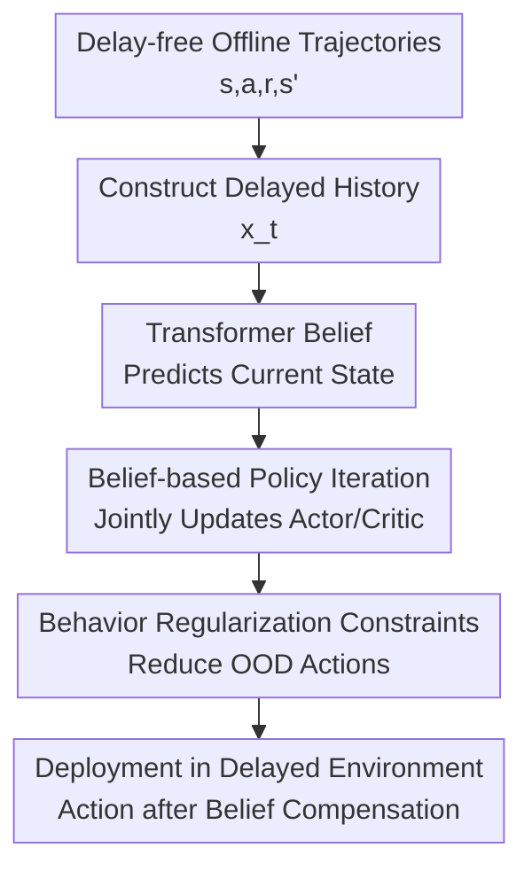

# Belief-Based Offline Reinforcement Learning for Delay-Robust Policy Optimization

**Conference**: ICLR 2026  
**OpenReview**: [https://openreview.net/forum?id=3C1U86DcW4](https://openreview.net/forum?id=3C1U86DcW4)  
**论文**: [OpenReview Forum](https://openreview.net/forum?id=3C1U86DcW4)  
**Code**: https://github.com/SimonZhan-code/DT-CORL  
**Area**: Reinforcement Learning  
**Keywords**: Offline Reinforcement Learning, Delay-Robust Control, belief state, Transformer, D4RL  

## TL;DR
DT-CORL utilizes a Transformer belief model to predict the current latent state from delayed observations and historical actions. By embedding this belief representation directly into conservative offline policy iteration, the policy trained on delay-free offline data maintains stable control performance during deployment under both deterministic and stochastic delays.

## Background & Motivation
**Background**: The core objective of offline reinforcement learning is to learn deployable policies from fixed datasets without further environment interaction. Delayed reinforcement learning focuses on real-world issues where latencies in sensing, communication, computation, or execution cause the agent's observations to lag behind the true current state. While the former emphasizes "no further sampling," the latter highlights "non-Markovian states," and both often coexist in real systems: simulators or historical logs are frequently delay-free, yet deployment on robots, drones, or high-frequency decision systems introduces lag.

**Limitations of Prior Work**: Directly training offline RL algorithms on delay-free data results in policies acting on stale observations during deployment, causing both the value function and policy to operate outside the training distribution. Common state augmentation techniques for delayed RL, which stack the past $\Delta$ actions or states, lead to dimensionality growth with delay length, causing sparser offline data coverage and worsening OOD (Out-of-Distribution) issues. If a belief model is trained and frozen before applying offline RL like CQL/IQL, belief errors are not corrected during downstream value learning, leading to magnified biases over long rollouts.

**Key Challenge**: The paper addresses the contradiction of how to handle the non-Markovianity caused by delays and the OOD risks of offline RL when only delay-free offline data is available. Delay compensation requires inferring the current state from history, but offline policy optimization requires the policy to stay within the data support; performing these tasks separately leads to inconsistent state distributions between the belief, critic, and actor.

**Goal**: The authors aim to learn policies capable of handling fixed or bounded stochastic delays during deployment without accessing delayed environments or transitions during training, relying solely on static delay-free trajectories $\mathcal{D}=\{(s_t,a_t,r_t,s_{t+1})\}$. Specifically, the method must avoid the dimensionality explosion of augmented state spaces, reduce cumulative error in belief prediction, and maintain sufficient conservatism in offline policy updates.

**Key Insight**: The paper treats the augmented state $x_t=\{s_{t-\Delta},a_{t-\Delta},\ldots,a_{t-1}\}$ in a delayed MDP as a compressible history summary problem. Rather than having the policy act directly on the high-dimensional $x_t$, the authors learn a belief function $b_\Delta(s_t\mid x_t)$ that maps stale observations and action history back to a latent estimate of the "current state." The key is not to train this belief in isolation but to ensure value estimation and policy improvement occur over this belief representation.

**Core Idea**: DT-CORL employs a Transformer to predict the delay-compensated belief state and jointly utilizes the belief, critic, and behavior-regularized actor within a constrained offline policy iteration framework. This converts delay-free data into training signals for delay-robust policy optimization.

## Method
The DT-CORL method can be understood as a closed loop that "constructs delayed inputs offline and compensates for delays online using belief." During training, artificial historical sequences under varying delay lengths are constructed from delay-free trajectories to train the Transformer belief to predict $s_t$ from $x_t$. Subsequently, the actor and critic no longer process the raw augmented state but perform offline policy evaluation and improvement based on the belief-predicted $\hat{s}_t$. During deployment, the agent receives delayed observations, constructs input from an action buffer, predicts the current state via the belief model, and outputs actions via the offline-trained policy.

### Overall Architecture
The workflow is divided into offline training and online deployment. The offline phase constructs pseudo-delayed inputs with $\Delta$-step history from a delay-free trajectory buffer to pre-train the Transformer belief, enabling it to predict the current latent state from stale states and action sequences. Subsequently, conservative offline policy iteration is performed on the belief state to align the critic, actor, and belief representation. In the online phase, the environmental data is no longer updated; the agent maintains an action buffer, feeds delayed observations and historical actions into the belief transformer, and selects actions via the policy $\pi(\cdot\mid \hat{s}_t)$ upon obtaining $\hat{s}_t$.

The theoretical component begins with the augmented delayed MDP, formulating offline RL with policy constraints as policy evaluation and improvement over augmented states. The authors then use the belief distribution $b_\Delta(s\mid x)$ to link $Q_\Delta(x,a)$ on augmented states to $Q(s,a)$ in the original state space, bounding the gap between the delayed policy and the belief-induced policy via Wasserstein distance. The resulting objective avoids high-dimensional histories by performing value learning and policy updates on $\hat{s}\sim b_\Delta(\cdot\mid x)$.

### Key Designs
**1. Transformer Belief: Compressing delayed history into current state estimates for control**

The problem with delayed observations is that $o_t$ may correspond to past states. Simply concatenating the past $\Delta$ actions restores formal Markovianity but causes the state dimension to explode to $S\times A^\Delta$, which is difficult to cover with offline data. The DT-CORL belief model receives $x_t=\{s_{t-\Delta},a_{t-\Delta},a_{t-\Delta+1},\ldots,a_{t-1}\}$ and outputs a predicted sequence from $\hat{s}_{t-\Delta+1}$ to $\hat{s}_t$, using $\hat{s}_t$ as input for the policy and value functions.

The choice of a Transformer over a standard MLP highlights the trade-off between sequence modeling and inference cost. While ensemble MLPs have fewer parameters, their errors accumulate rapidly over long delays; diffusion predictors offer high accuracy but require multi-step denoising, leading to excessive online latency. Transformers utilize attention to establish long-range dependencies between historical actions and old observations while maintaining significantly faster inference than diffusion models. On Hopper-medium with a 16-step delay, the Transformer achieved an MSE of $\approx 0.315$ with $\approx 22.27$ ms inference, whereas the diffusion MSE was lower but inference took $\approx 665.21$ ms, making it unsuitable for real-time control.

**2. Belief-based Constrained Policy Iteration: Teaching the critic on latent states seen during deployment**

A core flaw of two-stage belief baselines is that the belief model is treated as a fixed pre-processor: the critic is trained assuming clean states or fixed beliefs, but policy actions during deployment alter the subsequent belief distribution. DT-CORL formulates the Bellman target on the belief state—e.g., aligning the critic to fit $E_{\hat{s}\sim b_\Delta(\cdot\mid x)}[Q^\pi(\hat{s},a)]$ and targets based on the next-step belief. Consequently, the critic learns the latent state-action regions the policy will actually query, rather than static samples assuming a perfect belief.

The paper demonstrates through two delayed performance / Q-value difference bounds that the gap between the delayed policy on augmented states and the belief-induced policy can be controlled by Wasserstein distance. The constrained offline PI for the augmented delayed MDP is then mapped back to the original state space. The resulting policy improvement retains a behavior constraint term, effectively maximizing $Q$ while penalizing the deviation of $\pi$ from the delay-augmented behavior policy $\mu_\Delta$. This design integrates "delay compensation" and "offline conservatism" into a single update loop.

**3. Simplified Behavior Regularization: Approximating policy-behavior distance with action MSE**

While KL, MMD, or Wasserstein distances can theoretically constrain the learned policy to the behavior policy, accurately estimating these in continuous control is computationally heavy. DT-CORL adopts the practical approach of TD3+BC and ReBRAC, using the mean squared error (MSE) between actions $\hat{a}$ sampled from the learned policy and data actions $a$ as a proxy:

$$
\max_\pi\; E_{(x,a)\sim \mathcal{D},\hat{s}\sim b_\Delta(\cdot\mid x),\hat{a}\sim \pi(\cdot\mid \hat{s})}
\left[\hat{Q}^{\pi_k}(\hat{s},\hat{a}) - \alpha\lVert a-\hat{a}\rVert_2^2\right].
$$

This approximation provides several benefits: it eliminates the need to train a delay-augmented behavior model and preserves the critical "safety valve" of offline RL—preventing the actor from drifting into regions outside data support in pursuit of overestimated Q-values. For deterministic MDPs, rewards can be taken directly from $r(s_t,a_t)$ in the offline data without a separate reward model.

**4. Online Action Buffer and Masking: Aligning training and deployment input formats**

During deployment, the agent does not know the true current state and only receives the delayed observation $o_t$. DT-CORL maintains a circular action buffer of length $\Delta$, concatenating $o_t$ with $a_{t-\Delta},\ldots,a_{t-1}$ to form $x_t$ for state prediction by the Transformer belief. Since the policy outputs actions based solely on $\hat{s}_t$, delay compensation occurs at the policy's front end without requiring online fine-tuning.

To handle insufficient historical actions at the start of a sequence or end of an episode, the paper inserts special `[MASK]` tokens. Utilizing the Transformer’s native masking mechanism allows the same model interface to be used across different timesteps, ensuring offline-to-online consistency and preventing belief errors caused by zero-padding or random-padding.

### Loss & Training
The belief model training is formulated as dynamics prediction. In deterministic environments, the Transformer belief uses MSE to predict the real state sequence; in stochastic environments, a maximum likelihood objective fits the state distribution. Hyperparameters for the Transformer belief include a batch size of 256, 10 layers, hidden dim 256, 4 attention heads, AdamW optimizer, and $10^{-4}$ learning rate.

Policy optimization is implemented using a CORL/CleanRL style actor-critic framework. DT-CORL uses an actor learning rate of $3\times 10^{-4}$ and a critic learning rate of $10^{-3}$, with the critic updated every step and the actor every 2 steps. The authors emphasize that using action MSE regularization is sufficient for providing conservatism in continuous control tasks.

## Key Experimental Results

### Main Results
DT-CORL was evaluated on D4RL AntMaze, MuJoCo locomotion, and Adroit dexterous manipulation with deterministic delays $\Delta\in\{4,8,16\}$ and stochastic delays $\Delta\sim U(1,k)$. Baselines include state augmentation methods (Augmented-BC/CQL/COMBO), online delayed RL (DBPT-SAC), and two-stage belief methods (Belief-CQL/IQL).

| Scenario | Delay Setting | Metric | Ours (DT-CORL) | Baselines | Conclusion |
|------|----------|----------|--------------|----------|------|
| AntMaze umaze | stochastic, $k=16$ | normalized return | 67.3 | Aug-BC 24.7 / Aug-CQL 12.7 / DBPT-SAC 0.0 | Significant advantage in stochastic long-delays |
| AntMaze umaze-diverse | deterministic, $\Delta=8$ | normalized return | 62.0 | Aug-BC 58.7 / Aug-CQL 23.7 / Aug-COMBO 19.0 | Belief-based is more stable than augmented CQL |
| Hopper medium-expert | deterministic, $\Delta=16$ | normalized return | 109.9 | Belief-CQL 35.2 / Belief-IQL 24.7 | Joint training significantly beats frozen belief |
| Walker2d medium | deterministic, $\Delta=16$ | normalized return | 86.8 | Belief-CQL 39.2 / Belief-IQL 24.6 | Slower degradation under long delays |
| Adroit Hammer expert | deterministic, $\Delta=16$ | normalized return | 105.20 | Aug-CQL 0.21 / Belief-CQL 0.22 | Baselines fail in contact-rich tasks |

AntMaze results show that online delayed RL methods like DBPT-SAC collapse in purely offline settings. In MuJoCo, DT-CORL shows consistent gains on Hopper and Walker2d; performance degradation on HalfCheetah expert tasks suggests belief compensation's effectiveness depends on task dynamics and data quality.

### Ablation Study
| Configuration | Key Metric | Description |
|------|---------|------|
| Separate belief training | Hopper, $\Delta=16$: 68.3 / 73.1 | Significant drops when belief is frozen first. |
| DT-CORL joint training | Hopper, $\Delta=16$: 98.5 / 94.2 | More stable when belief aligns with policy iteration. |
| Transformer belief | 22.27 ms, MSE 0.315 | Balanced accuracy and speed for online control. |
| Diffusion belief | 665.21 ms, MSE 0.157 | High accuracy but too slow for real-time inference. |
| Ensemble MLP belief | 69.50 ms, MSE 11.790 | Error accumulates rapidly over long horizons. |

### Key Findings
- The primary Gain of DT-CORL stems from integrating belief prediction into policy evaluation rather than just using a stronger state predictor; Belief-CQL/IQL lag significantly despite using the same belief architecture.
- Augmented state methods work for small delays but degrade rapidly as $\Delta$ increases or becomes stochastic due to input dimensionality and sparse offline coverage.
- Transformers outperform because of their balance between long-sequence prediction quality, inference speed, and training stability; Diffusion models are too slow for real-time delay-robust control.
- In Adroit Hand tasks involving high-dimensional contact dynamics, DT-CORL restores performance from near-zero to 100+, demonstrating the belief model's ability to capture fine-grained temporal structures.

## Highlights & Insights
- The most valuable contribution is the integration of delay compensation and offline conservatism into a single policy iteration. Separating state estimation from policy learning makes it difficult to correct distribution shifts caused by estimation errors.
- Theoretical derivations go beyond intuition, using Wasserstein bounds to map augmented delayed MDP policy iteration back to the original state space, justifying why belief-based PI can replace high-dimensional augmented PI.
- Engineering choices are pragmatic: behavior constraints use action MSE rather than complex divergence estimators, matching findings in TD3+BC/ReBRAC that simple, stable regularizations often outperform noisy estimators in continuous control.
- From a control perspective, DT-CORL acts like a learned Smith Predictor: it relies on delay-free logs during training and predicts the "present" state during deployment to cancel out dead time.

## Limitations & Future Work
- DT-CORL assumes that the maximum delay or bounds are known during training/deployment. Handling unknown, variable, or asynchronous delays remains an open problem.
- Current experiments focus on low-dimensional states. Scaling to visual or multi-modal inputs may require spatial attention or world-model-based representation learning.
- Belief prediction depends on offline data coverage. If the behavior policy is narrow, the Transformer may only compensate for delays within limited regions.
- The method shows low performance on difficult goal-conditioned tasks like AntMaze large-play, suggesting a need for goal-conditioned belief or hindsight-style data augmentation.
- Training costs are notable (e.g., 7 hours for Adroit-Pen with 16-step delay); scaling to longer delays or larger spaces may hit computational bottlenecks.

## Related Work & Insights
- **vs Augmented Delayed RL**: Methods like DIDA and ADRL stack histories, which is intuitive but leads to dimension growth; DT-CORL compresses history via belief, keeping policy learning near the original state space for better sample efficiency.
- **vs Belief-Based Online Delayed RL**: Work like DATS or D-Dreamer focuses on online interaction; DT-CORL addresses the more difficult task of learning belief-robustness from strictly delay-free offline trajectories.
- **vs Offline RL (CQL/IQL)**: Traditional offline RL solves OOD actions but ignores observation delays; DT-CORL incorporates their behavior regularization while swapping the input for a belief-compensated state.
- **Impact**: The framework of "learning from ideal logs to compensate for real-world defects" can be extended to sensor noise, control frequency inconsistency, or packet loss in networked control systems.

## Rating
- Novelty: ⭐⭐⭐⭐⭐ Systematically addresses offline-to-delayed-online transition by joining belief and constrained PI.
- Experimental Thoroughness: ⭐⭐⭐⭐ Extensive coverage of benchmarks and delays; however, lacks real-world robot experiments.
- Writing Quality: ⭐⭐⭐⭐ Clear problem definition and theoretical support, though some task analyses could be deeper.
- Value: ⭐⭐⭐⭐⭐ Highly relevant for robotics and networked control where logging is clean but deployment is latent.

## Related Papers

- [\[ICLR 2026\] Preference-based Policy Optimization from Sparse-reward Offline Dataset](preference-based_policy_optimization_from_sparse-reward_offline_dataset.md)
- [\[ICLR 2026\] Dual-Robust Cross-Domain Offline Reinforcement Learning Against Dynamics Shifts](dual-robust_cross-domain_offline_reinforcement_learning_against_dynamics_shifts.md)
- [\[ICLR 2026\] In-Context Compositional Q-Learning for Offline Reinforcement Learning](in-context_compositional_q-learning_for_offline_reinforcement_learning.md)
- [\[ICLR 2026\] Guided Flow Policy: Learning from High-Value Actions in Offline Reinforcement Learning](guided_flow_policy_learning_from_high-value_actions_in_offline_reinforcement_lea.md)
- [\[ICLR 2026\] Adaptive Scaling of Policy Constraints for Offline Reinforcement Learning](adaptive_scaling_of_policy_constraints_for_offline_reinforcement_learning.md)

<!-- RELATED:END -->

<!-- RELATED:START -->

## Related Papers

- [\[ICLR 2026\] Preference-based Policy Optimization from Sparse-reward Offline Dataset](preference-based_policy_optimization_from_sparse-reward_offline_dataset.md)
- [\[ICLR 2026\] Dual-Robust Cross-Domain Offline Reinforcement Learning Against Dynamics Shifts](dual-robust_cross-domain_offline_reinforcement_learning_against_dynamics_shifts.md)
- [\[ICLR 2026\] Offline Preference-based Value Optimization](offline_preference-based_value_optimization.md)
- [\[ICLR 2026\] Adaptive Scaling of Policy Constraints for Offline Reinforcement Learning](adaptive_scaling_of_policy_constraints_for_offline_reinforcement_learning.md)
- [\[ICLR 2026\] GEPO: Group Expectation Policy Optimization for Stable Heterogeneous Reinforcement Learning](gepo_group_expectation_policy_optimization_for_stable_heterogeneous_reinforcemen.md)

<!-- RELATED:END -->
