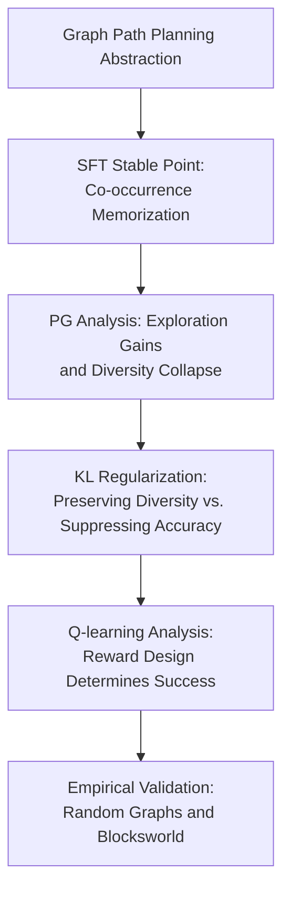

# Benefits and Pitfalls of Reinforcement Learning for Language Model Planning: A Theoretical Perspective

**Conference**: ICLR 2026  
**OpenReview**: [https://openreview.net/forum?id=34a6DfHOUF](https://openreview.net/forum?id=34a6DfHOUF)  
**Code**: Yes (provided with supplementary materials)  
**Area**: Reinforcement Learning / Theory of Language Model Planning  
**Keywords**: RL post-training, Language model planning, Policy gradient, Q-learning, Diversity collapse

## TL;DR
This paper utilizes path planning on graphs as an analyzable abstraction for language model planning. It theoretically demonstrates that SFT tends to learn co-occurrence memorization, and the advantage of policy gradient primarily stems from exploration but at the cost of output diversity. In contrast, Q-learning with process rewards is shown to potentially maintain correctness, diversity, and off-policy training capabilities simultaneously.

## Background & Motivation
**Background**: LLM planning capabilities have transitioned from simple next-token prediction to RL-centric post-training paradigms. Exemplified by reasoning models like o1 and DeepSeek-R1, RL is employed to reward correct behaviors in long-chain reasoning, tool calling, game strategies, vision-language navigation, and long-horizon robotic tasks. In many experiments, RL post-training indeed enhances planning and generalization more effectively than supervised fine-tuning (SFT) alone.

**Limitations of Prior Work**: While empirical results are accumulating, mechanistic explanations remain sparse. A common adage is "RL generalizes, SFT memorizes," but this phrase does not address several nuanced questions: What exactly does SFT memorize? Do the gains of RL come from the optimization objective itself or from the continuous sampling of new trajectories during training? Why do policy gradient (PG) methods become increasingly singular in their outputs during late-stage training? Why is Q-learning, a mature value-function method in gaming, rarely used for LLM post-training, and what PG shortcomings could it theoretically address?

**Key Challenge**: Language model planning requires two simultaneous achievements: outputting an executable correct path while avoiding collapse into a few paths seen during training, as real-world test problems often require combining unseen edges, nodes, and intermediate states. SFT's cross-entropy training is naturally tied to a fixed data distribution. PG allows for exploration but tends to push probability mass towards a few successful trajectories, while Q-learning faces challenges regarding reward design and Q-value bias. The core tension of the paper lies in the relationship between "correctness, generalization, diversity, and training feasibility."

**Goal**: The authors aim to provide a provable explanation of learning dynamics within a model that is sufficiently simple yet preserves the essence of planning. Specifically, the paper answers four questions: what structure SFT converges to in path planning; where the gains of PG over SFT originate; whether PG's diversity collapse can be theoretically characterized; and under what reward design Q-learning can recover graph structures and what advantages it holds over PG.

**Key Insight**: The paper adopts a directed graph path planning abstraction: each node is a token, an edge represents a valid transition, and the planning task is to generate a valid path from a source to a target. This abstraction corresponds to actual planning scenarios like tool-calling dependency graphs, proof dependency graphs, and Blocksworld state transitions, yet is simple enough to express next-token prediction, PG loss, and Q-learning updates in analyzable forms.

**Core Idea**: The study reduces "LLM planning post-training" to the learning dynamics of path generation on a graph. It explains from the perspective of stable points and gradient updates that the true advantage of RL is data expansion through exploration, the cost of PG is diversity collapse, and Q-learning with process rewards can more directly recover adjacency and reachability structures.

## Method

### Overall Architecture
The paper does not propose a new engineering system to replace PPO directly but builds a theoretical analysis framework. It abstracts planning tasks into path generation on an unknown directed graph $G=(V,E)$, analyzes the losses, stable points, and training dynamics of SFT, policy gradient (PG), and Q-learning, and finally validates these theoretical phenomena using small Transformer experiments on random graphs and Blocksworld.

The input consists of source-target pairs $(s,t)$ and valid path samples. The model outputs token sequences like `s t s a b c t \n`. SFT sees only fixed path data; PG samples trajectories using the current policy and updates based on 0-1 outcome rewards; Q-learning treats model logits as approximate Q-values and compares outcome reward designs with process reward designs.

### Key Designs
**1. Graph Path Planning Abstraction: Turning LLM planning into a provable next-node learning problem**

The first step is stripping "planning" down to its structural core: a node set $V$, an edge set $E$, an adjacency matrix $A$, and a reachability matrix $R$. Given $(s,t)$, the model must output a valid path. In Blocksworld, a node can be understood as a block configuration, and an edge is a valid move.

This abstraction provides a clear criterion for "planning ability." If the current node is $j$ and the target is $i$, a good model should select a next node $k$ such that $A[j,k]=1$ and $R[i,k]=1$. The authors define the set of such correct candidates as $C(i,j)$. All subsequent theorems examine whether training dynamics can push probabilities or logits toward this set.

**2. SFT Stable Point Characterization: Explaining "memorizing co-occurrence" rather than learning reachability transitivity**

The authors assume that when predicting the next token, the logit can be viewed as a function $f(u_{target},u_m)$ of the target node $u_{target}$ and current node $u_m$. The optimal solution for SFT is straightforward: for any triplet $(u_{target},u_m,k)$, the softmax output probability equals the empirical frequency in the training set:

$$
\mathrm{softmax}(f(u_{target},u_m))[k]
=\frac{N_{u_{target},u_m,k}}{\sum_{k'}N_{u_{target},u_m,k'}}.
$$

This theorem precisely captures SFT's limitation: it fits triplet co-occurrence statistics. Frequently occurring transitions in the training paths are amplified, while low-frequency edges may not be learned even if they exist. Crucially, SFT does not automatically utilize transitivity to complete reachability relationships not directly present in the training set.

**3. Policy Gradient Analysis: RL gains come from exploration, while the cost is the singularization of successful trajectories**

For PG, an important equivalence is established: when the reward is a simple 0-1 outcome reward and there is no KL regularization, the PG loss on a round of generated data is equivalent to "performing SFT only on the correct paths sampled in this round." PG is stronger than SFT primarily because the model continuously samples new trajectories, finding correct paths absent from the original SFT data, thereby dynamically expanding the training set.

However, the authors prove that for incorrect candidates $k\notin C(i,j)$, PG gradients continuously suppress their logits, potentially leading to perfect training accuracy. Meanwhile, within the correct candidate set, stochastic updates cause the distribution to deviate from a uniform distribution, leading to diversity collapse. Theorem 4.3 shows that even after incorrect actions are suppressed to $-\infty$, the KL divergence from the uniform distribution $KL(U_{C(i,j)}\|\mathrm{softmax}(f^t(i,j)))$ continues to increase in expectation.

**4. Q-learning and Process Rewards: Recovering adjacency and reachability with local signals**

The key is that Q-learning's reward design determines whether it can learn graph structures. Outcome rewards lead to Q-value bias, where logits for non-target actions collapse into constants dependent only on the target $i$, failing to distinguish valid moves at the current node $j$.

The authors introduce process rewards: positive rewards for reaching the target and negative rewards for moving to a non-adjacent node:

$$
R(u,m)=\delta_{u_{m+1}=u_{target}}-\delta_{(u_m,u_{m+1})\notin E}.
$$

Under continuous exploration, the stable point of process-reward Q-learning recovers three structures: $f(i,j)[k]\to 1$ if $k$ is an adjacent neighbor and can reach the target; $f(i,j)[k]\to 0$ if only one condition is met; and $f(i,j)[k]\to -1$ if neither is met. This is more structural than PG as all valid next steps converge to the same high value, preserving diversity.

### Loss & Training
SFT uses standard autoregressive cross-entropy. For PG, the trajectory loss includes outcome reward weighted log-probabilities with an optional KL term:

$$
\ell=-\sum_{m\ge 1}\left(R(u)\log \hat u_m[u_{m+1}]+\lambda \log \hat u_m[u_{m+1}]\left\{\log \frac{\hat u_m[u_{m+1}]}{\hat u^{base}_m[u_{m+1}]}\right\}\right).
$$

Q-learning treats logits $\tilde u_m$ as Q-values, minimizing the one-step Bellman error:

$$
\ell=\sum_{m\ge 1}\left(\tilde u_m[u_{m+1}]-R(u,m)-\left\{\max_k \tilde u_{m+1}[k]\right\}\right)^2.
$$

Experiments use a 1-layer single-head Transformer. Random graphs are generated with $|V|=100$ and edge probability 0.15.

## Key Experimental Results

### Main Results
The experiments validate theoretical predictions regarding training dynamics.

| Setting | Training Accuracy Trend | Test Accuracy Trend | Output Diversity | Main Conclusion |
| :--- | :--- | :--- | :--- | :--- |
| Continual SFT | Continues fitting fixed data | Declines over training | No exploration expansion | Continual SFT on fixed data worsens memorization |
| PG, $\lambda=0$ | Reaches and maintains 100% | Rises then falls with diversity | Progressive collapse | Exploration yields gains, but results in diversity collapse |
| PG, $\lambda=0.001$ | High but limited by KL | Better than SFT | Some diversity preserved | Small KL mediates accuracy and diversity |
| Q-learning, process reward | High accuracy | Significantly better than outcome | Preserves multiple actions | Process rewards are key to recovering graph structure |
| Q-learning, outcome reward | Near collapse | Near zero accuracy | No effective structure | Outcome rewards lead to Q-value bias |

### Ablation Study
Ablations focus on KL regularization intensity and reward design. For PG, as $\lambda$ increases from 0 to 0.1, diversity improves but training accuracy and the ability to learn new source-target pairs are suppressed. This confirms that KL is a diversity-preserving term but also a learning constraint.

### Key Findings
- SFT fails not because the model cannot learn graph structures, but because its objective only requires matching co-occurrence frequencies.
- The advantage of PG stems from the exploration of new correct paths. Without KL, it is essentially SFT on sampled successful trajectories.
- PG's diversity collapse is theoretically substantiated: even with 100% accuracy, the number of sampled correct paths decreases.
- Q-learning's potential depends on process rewards. Outcome rewards fail to provide enough information for step-by-step legality.
- Off-policy Q-learning yields results similar to on-policy, suggesting robustness to data distribution shifts common in large-scale LLM training.

## Highlights & Insights
- The paper decomposes "why RL improves LLM planning" into a verifiable mechanistic chain: SFT learns co-occurrence, PG expands data via exploration, PG eventually collapses, and Q-learning requires process rewards.
- Theorem 4.1 serves as a reminder that PG success is largely about training data transitioning from fixed samples to model-explored successful samples.
- The theoretical characterization of diversity collapse is elegant, defining it as a deviation from the uniform distribution of correct next steps.
- Q-learning suggests a direction: if reliable process rewards or verifiers can be designed, value-function-based training might be superior to pure PG for maintaining multi-solution structures.

## Limitations & Future Work
- **Limitations**: The theoretical model is simplified (1-layer Transformer, graph abstraction). Real-world natural language semantics and long contexts are significantly more complex. Process rewards are not always easily obtainable in tasks like mathematical proof or open-ended coding.
- **Future Work**: Scaling Q-learning to large-scale LLM training remains to be proven. Future research could explore combining the exploration capabilities of PG with the off-policy and diversity advantages of Q-learning.

## Related Work & Insights
- **Previous SOTA**: Compares the "RL generalizes, SFT memorizes" empirical observations with the proposed triplet co-occurrence statistical theory.
- **Related Papers**: Connects with works like ALPINE regarding autoregressive learning of graph reachability and current LLM RL paradigms like PPO/GRPO.

## Rating
- **Novelty**: ⭐⭐⭐⭐☆
- **Experimental Thoroughness**: ⭐⭐⭐☆☆
- **Writing Quality**: ⭐⭐⭐⭐☆
- **Value**: ⭐⭐⭐⭐☆

<!-- RELATED:START -->

- Wang et al. 2024b, "Path planning in autoregressive learning"
- Chu et al. 2024, "RL generalizes, SFT memorizes"
- Cui et al. 2024, "Entropy mechanisms in reasoning RL"

<!-- RELATED:END -->

## Related Papers

- [\[ICLR 2026\] The Sample Complexity of Online Reinforcement Learning: A Multi-Model Perspective](the_sample_complexity_of_online_reinforcement_learning_a_multi-model_perspective.md)
- [\[ICLR 2026\] On the Generalization of SFT: A Reinforcement Learning Perspective with Reward Rectification](on_the_generalization_of_sft_a_reinforcement_learning_perspective_with_reward_re.md)
- [\[ICLR 2026\] Model Predictive Adversarial Imitation Learning for Planning from Observation](model_predictive_adversarial_imitation_learning_for_planning_from_observation.md)
- [\[AAAI 2026\] Language Model Distillation: A Temporal Difference Imitation Learning Perspective](../../AAAI2026/reinforcement_learning/language_model_distillation_a_temporal_difference_imitation_learning_perspective.md)
- [\[ICLR 2026\] GRACE: A Language Model Framework for Explainable Inverse Reinforcement Learning](grace_a_language_model_framework_for_explainable_inverse_reinforcement_learning.md)

<!-- RELATED:END -->
