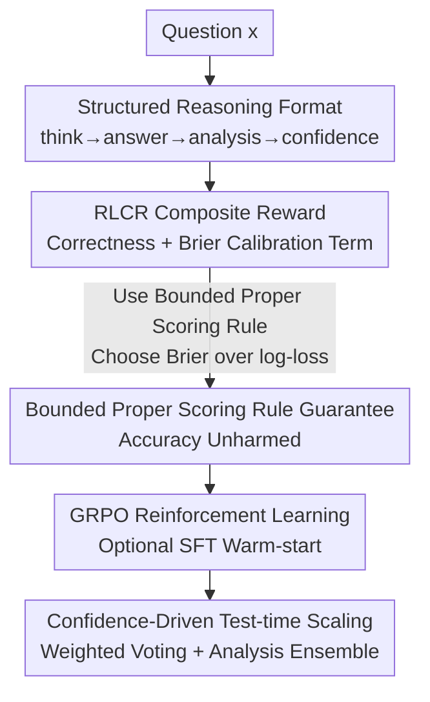

# Beyond Binary Rewards: Training LMs to Reason About Their Uncertainty

**Conference**: ICLR2026  
**OpenReview**: [https://openreview.net/forum?id=ASQ649zdHm](https://openreview.net/forum?id=ASQ649zdHm)  
**Code**: To be confirmed  
**Area**: LLM Reasoning / Reinforcement Learning / Uncertainty Calibration  
**Keywords**: RLVR, Calibration Reward, Brier Score, Proper Scoring Rules, Confidence Reasoning

## TL;DR
This paper proposes RLCR (Reinforcement Learning with Calibration Rewards), which overlays a Brier score term on top of standard "binary correctness rewards." This allows reasoning models to output a **calibrated confidence** while generating answers. Without significant loss in accuracy, it reduces Expected Calibration Error (ECE) from 0.37 to 0.03 on HotpotQA and reverses the degradation trend of standard RL—where models typically become "more confident and more chaotic" as training progresses—on out-of-distribution (OOD) tasks.

## Background & Motivation
**Background**: Current successful reasoning models (such as the DeepSeek-R1 series) are almost exclusively trained using RLVR (Reinforcement Learning with Verifiable Rewards). This approach provides models with a binary reward $R_{\text{correctness}}(y,y^*)=\mathbb{1}_{y\equiv y^*}$—assigning 1 for correct answers and 0 for incorrect ones—to achieve SOTA performance on verifiable tasks like mathematics and programming.

**Limitations of Prior Work**: This binary reward has a subtle side effect: it provides the same reward for "confidently correct" and "luckily guessed" answers, while applying the same penalty for "honest abstention" and "confident incorrectness." In other words, it **encourages overconfident guessing**. Multiple studies confirm that even initially well-calibrated models become overconfident after RL training; this is particularly evident in reasoning models, where calibration deteriorates and hallucination rates rise. In high-stakes scenarios like medical or legal fields, models must not only be accurate but also express hesitation when uncertain—a capability that RLVR tends to eliminate.

**Key Challenge**: The reward contains only the "correctness" dimension, lacking any signal to constrain "how certain the model is about itself." There appears to be a trade-off between accuracy and calibration: if a calibration penalty is added, will it force the model to intentionally output "certainly wrong" answers to minimize calibration loss?

**Goal**: This is decomposed into two specific questions: (1) Can reasoning models be optimized for correctness and calibration simultaneously? (2) Can the content of the reasoning chain itself be used to improve calibration?

**Key Insight**: The authors draw from **proper scoring rules** in statistical decision theory. A scoring rule is defined as "proper" if and only if its expectation is maximized when the reported confidence $q$ equals the true probability of correctness $p$. The Brier score $-(q-\mathbb{1}_{y\equiv y^*})^2$ is a classic example. While such rules have been used for decades in fields like weather forecasting, they have rarely been applied to the RL training of LLMs.

**Core Idea**: Combine "binary correctness reward + Brier calibration reward" into a composite reward. This encourages the model to output both an answer and a verbalized confidence after reasoning. Through a single model and one RL process, the model simultaneously learns to "answer correctly" and "know how correct it is."

## Method

### Overall Architecture
The modifications in RLCR are remarkably minimal: it retains the entire RLVR workflow (GRPO algorithm, cold start from a base model, no KL regularization) with only two changes—**requiring the model to output an additional confidence scalar** and **adding a Brier term to the reward function**.

Specifically, the model is prompted to generate output using structured tags: first reasoning within `<think>`, then providing an answer in `<answer>`, followed by an `<analysis>` section to reflect on "certainty and reasoning," and finally outputting a confidence $q\in[0,1]$ in `<confidence>`. During training, the reward is:

$$R_{\text{RLCR}}(y,q,y^*) = \mathbb{1}_{y\equiv y^*} - (q-\mathbb{1}_{y\equiv y^*})^2$$

The first term governs "correctness," while the second term ensures "confidence does not deviate from the truth." High-confidence incorrect answers and low-confidence correct answers are both penalized. The paper further utilizes Theorem 1 to prove that this reward, which seemingly involves a trade-off, actually **does not sacrifice accuracy**: under the Bernoulli assumption, its expectation is maximized at $q=p_y$ (the true probability of correctness), and among all calibrated predictions, the expected reward is maximized by the answer with the highest probability of correctness. Post-training, the verbalized confidence can also support test-time scaling—using confidence as a proxy reward without additional supervision for weighted voting.

### Key Designs

**1. RLCR Composite Reward: Embedding "Calibration" into RL Objectives via Brier Score**

This is the core of the paper, directly addressing the issue where binary rewards encourage blind guessing. RLVR rewards $\mathbb{1}_{y\equiv y^*}$ are strictly 0 or 1, making them blind to confidence. RLCR subtracts a Brier term $(q-\mathbb{1}_{y\equiv y^*})^2$, incorporating "how far the reported confidence is from the ground truth" into the reward. Intuitively, when the answer is correct ($\mathbb{1}=1$), the model must push $q$ toward 1 to maximize the reward; when incorrect ($\mathbb{1}=0$), it must push $q$ toward 0. Thus, both high-confidence errors and low-confidence successes are penalized. A key advantage is that the calibration term **requires no additional annotation**—correctness is already calculated in RLVR, and the Brier score simply reuses that signal.

**2. Bounded Proper Scoring Rules: Why Brier is Necessary over Log-loss**

Merely adding a calibration term is insufficient; the authors address whether the model might learn to output "certainly wrong" answers to minimize loss. Theorem 1 provides a negative answer—under the assumption that $\mathbb{1}_{y\equiv y^*}\sim\text{Bernoulli}(p_y)$, the expectation of $R_{\text{RLCR}}$ satisfies both "calibration incentive" (expected reward is maximized at $q=p_y$ for any $y$) and "correctness incentive" (among calibrated predictions, the answer with the highest $p_y$ yields the highest expected reward).

Crucially, this guarantee **depends on the scoring rule being bounded**. While log-loss $\mathbb{1}_{y\equiv y^*}\log q+(1-\mathbb{1}_{y\equiv y^*})\log(1-q)$ is also a proper scoring rule, it is unbounded—the penalty goes to infinity as confidence approaches the boundaries, which might incentivize the model to output incorrect answers. The paper generalizes this: as long as the scoring rule satisfies $S(p,1)-S(p,0)<\lambda$ (boundedness), a guarantee similar to Theorem 1 exists. This elevates the choice of the Brier score from an empirical preference to a theoretical necessity.

**3. Structured Confidence Reasoning: Integrating Uncertainty into CoT via Self-Review**

The second question is whether reasoning chain content can improve calibration. RLCR does not just modify the reward; it designs a four-stage generation format: `<think>/<answer>/<analysis>/<confidence>`. The model first thinks and answers, then enters an `<analysis>` stage to review "whether the evidence is sufficient, why the question is difficult, and what parts are uncertain," before finally providing a numerical confidence. This forces the model to explicitly verbalize its "metacognition" rather than guessing based on isolated token probabilities.

Ablation studies (Table 2) prove this segment is functional: adding the analysis prompt to RLVR (without changing the reward) reduces OOD ECE from 0.46 to 0.39. However, it is less effective than modifying the reward. Both components **contribute independently** to calibration, with the best results achieved when combined.

**4. Confidence-driven Test-time Scaling: Calibrated Confidence as a Free Proxy Reward**

Since the model outputs calibrated confidence, it can serve as a scorer during inference without an external reward model. The paper proposes two simple algorithms: **max-confidence** (selecting the candidate with the highest confidence among $N$ samples, corresponding to Best-of-N) and **confidence-weighted majority vote** (weighting each vote by its confidence). Experiments show that weighted majority voting consistently outperforms standard majority voting, max-confidence, and likelihood-based baselines. Furthermore, resampling $K$ `<analysis>` chains for a fixed answer and averaging their confidence ($\bar q=\frac1K\sum_i q_i$) can further reduce residual noise, though the gains are modest since uncertainty about uncertainty is generally low.

### Loss & Training
The base algorithm is GRPO (Group Relative Policy Optimization), starting from Qwen2.5-7B base without KL regularization. For math tasks, an `SFT+RLCR` variant was trained: the base model sampled 500 questions, and DeepSeek-R1 generated uncertainty analyses for light SFT warm-starting, followed by RLCR. This warm-start further improves calibration but leads to a noticeable decline in OOD accuracy (likely due to catastrophic forgetting caused by SFT), making pure RLCR a more stable choice for OOD scenarios.

## Key Experimental Results

### Main Results
Models were trained on HotpotQA (multi-hop, with controlled deletion of relevant paragraphs to create varying information completeness) and Big-Math, then evaluated on 6 and 5 OOD datasets, respectively. Metrics include Accuracy, AUROC, Brier, and ECE.

| Training Set | Method | In-domain Acc | In-domain ECE | OOD Acc | OOD ECE |
|--------------|--------|---------------|---------------|---------|---------|
| HotpotQA     | Base   | 39.7%         | 0.53          | 53.3%   | 0.40    |
| HotpotQA     | RLVR   | 63.0%         | 0.37          | 53.9%   | 0.46    |
| HotpotQA     | RLVR + BCE Classifier | — | 0.07 | — | 0.24 |
| HotpotQA     | **RLCR (Ours)** | 62.1% | **0.03** | 56.2% | **0.21** |
| Big-Math     | RLVR   | 72.9%         | 0.26          | 52.5%   | 0.49    |
| Big-Math     | **RLCR (Ours)** | 72.7% | **0.10** | 50.9% | **0.25** |
| Big-Math     | SFT+RLCR (Ours) | 72.2% | 0.08 | 43.8% | 0.18 |

Core Conclusion: RLCR accuracy is essentially on par with RLVR (62.1% vs 63.0%, 72.7% vs 72.9%), indicating the calibration term does not hurt accuracy. However, calibration is vastly superior—In-domain ECE dropped from 0.37 to 0.03. Crucially, on OOD tasks, RLVR causes calibration to worsen (0.40→0.46) while RLCR improves it (down to 0.21). RLCR even slightly outperforms BCE/Brier classifiers that require training two separate large models, without doubling the inference cost.

### Ablation Study
Table 2 decomposes the "Calibration Reward" and "Explicit Uncertainty Reasoning" components (trained on HotpotQA):

| Configuration | In-domain ECE | OOD ECE | In-domain Tokens | Description |
|---------------|---------------|---------|------------------|-------------|
| RLCR          | 0.03          | 0.21    | 249              | Full method |
| RLCR w/o Analysis | 0.09      | 0.26    | 113              | No analysis stage, still beats RLVR |
| RLVR w/ Analysis | 0.34      | 0.39    | 224              | Analysis prompt only, no reward change |
| RLVR          | 0.37          | 0.46    | 92               | Binary reward baseline |

### Key Findings
- **Both components are independently effective, with the reward being more critical**: Adding an analysis prompt to RLVR reduces ECE from 0.37 to 0.34 (OOD 0.46→0.39), but reward modification is far more impactful—RLCR w/o Analysis achieves 0.09 even without the analysis segment.
- **Efficiency-friendly fallback**: The token count (113) and accuracy (61.7%) of RLCR w/o Analysis are nearly identical to RLVR (92 tokens / 63.0%), but the calibration is vastly better (ECE 0.09 vs 0.37), making it a low-cost drop-in replacement.
- **Confidence Self-consistency**: Resampling multiple analysis chains for the same answer results in low standard deviation in confidence, suggesting low "uncertainty about uncertainty." The sum of confidence for different answers to the same question in RLCR stays close to the ideal value of 1, whereas RLVR significantly exceeds 1 (overconfidence).

## Highlights & Insights
- **Minimum modification, maximum gain**: The method simply subtracts a Brier term from the RLVR reward and requires one additional numerical output, yet it reverses the long-standing issue of RL training leading to overconfidence with almost zero migration cost.
- **"Boundedness" is a overlooked key**: Intuitively, both log-loss and Brier score are proper scoring rules and should work. However, the paper clarifies that unbounded log-loss can incentivize incorrect answers, whereas only bounded rules provide the double guarantee of Theorem 1—a theoretical detail worth remembering.
- **Calibration itself boosts accuracy**: Using calibrated verbalized confidence for weighted voting outperforms likelihood-based voting without any external reward model. This demonstrates that "expressing uncertainty" is not just a safety property but can directly translate into test-time performance.
- **Shared representation benefits**: Using the same model to both solve the problem and report confidence allows the calibration task to reuse internal representations from the problem-solving process. The authors hypothesize this is why RLCR achieves better OOD calibration generalization, a principle applicable to any generative task requiring self-evaluation.

## Limitations & Future Work
- **Residual OOD Overconfidence**: Fig. 4b shows that the sum of RLCR confidence on OOD tasks still exceeds 1, indicating that calibration is not fully solved and OOD robustness can be further improved.
- **Double-edged Sword of SFT Warm-starting**: While SFT+RLCR provides the best calibration, it leads to a significant drop in OOD accuracy (likely catastrophic forgetting), suggesting the coordination between SFT and RL data needs adjustment.
- **Strong Theoretical Assumptions**: Theorem 1 assumes success indicators follow a Bernoulli($p_y$) distribution and does not distinguish between epistemic and aleatoric uncertainty. Whether real-world model confidence can truly approach the ideal $p_y$ is primarily supported by empirical evidence.
- **Reliance on Verifiable Correctness**: The $\mathbb{1}_{y\equiv y^*}$ in the reward requires exact matching or verifiable answers. How to transfer this to open-ended generation or tasks without standard answers remains an open question.

## Related Work & Insights
- **vs RLVR (Standard RL)**: RLVR only rewards correctness and is blind to confidence, leading to overconfidence and OOD calibration degradation. RLCR adds a zero-annotation Brier term to the same framework, maintaining accuracy while comprehensively improving calibration.
- **vs Post-hoc Confidence Classifiers (BCE / Brier Classifier / Probe)**: These methods train a separate model or probe on top of RLVR outputs, which is costly (requiring two models) and achieves weaker calibration than RLCR. RLCR is single-model, end-to-end, and performs better.
- **vs Answer Token Probability**: Using the average probability of tokens in `<answer>` as a baseline for confidence performs poorly because reasoning models often "decide" on an answer during the CoT phase, pushing token probabilities high. This fails to reflect true uncertainty and highlights the necessity of forcing the model to **explicitly reason** about its uncertainty.
- **Insight**: Proper scoring rules represent a long-overlooked toolkit for LLM RL. The paradigm of "Bounded Proper Scoring Rule + RL Reward" can be extended to any scenario requiring calibrated signals, such as retrieval, tool use, or agent self-assessment.

## Rating
- Novelty: ⭐⭐⭐⭐ Introducing proper scoring rules into RL rewards with theoretical boundedness guarantees is a clear, albeit focused, contribution.
- Experimental Thoroughness: ⭐⭐⭐⭐⭐ Covers multiple tasks, in-domain and OOD, compares 6 baselines, and includes component ablations and test-time scaling.
- Writing Quality: ⭐⭐⭐⭐⭐ The problem-theory-experiment chain is clean; theoretical details like boundedness are well-explained.
- Value: ⭐⭐⭐⭐⭐ Directly addresses the overconfidence of RL reasoning models with minimal modifications, providing high deployability and reusability.

<!-- RELATED:START -->

## Related Papers

- [\[ICLR 2026\] Rubrics as Rewards: Reinforcement Learning Beyond Verifiable Domains](rubrics_as_rewards_reinforcement_learning_beyond_verifiable_domains.md)
- [\[ICLR 2026\] Learning to Be Uncertainty: Pre-training World Models with Horizon-Calibrated Uncertainty](learning_to_be_uncertain_pre-training_world_models_with_horizon-calibrated_uncer.md)
- [\[ICLR 2026\] Learning to Reason as Action Abstractions with Scalable Mid-Training RL](learning_to_reason_as_action_abstractions_with_scalable_mid-training_rl.md)
- [\[ICLR 2026\] Learn More with Less: Uncertainty Consistency Guided Query Selection for RLVR](learn_more_with_less_uncertainty_consistency_guided_query_selection_for_rlvr.md)
- [\[ICLR 2026\] ExGRPO: Learning to Reason from Experience](exgrpo_learning_to_reason_from_experience.md)

<!-- RELATED:END -->
