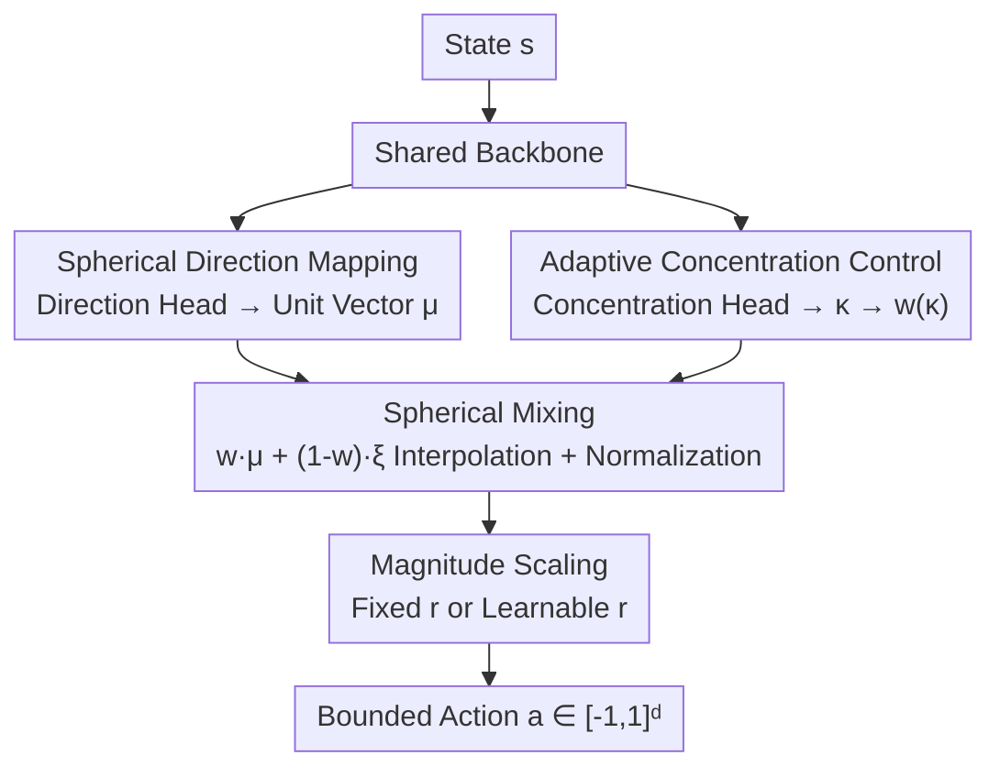

# Beyond Distributions: Geometric Action Control for Continuous Reinforcement Learning

**Conference**: ICLR2026  
**OpenReview**: [https://openreview.net/forum?id=6VqCOnTVXa](https://openreview.net/forum?id=6VqCOnTVXa)  
**Code**: To be confirmed  
**Area**: Reinforcement Learning / Continuous Control  
**Keywords**: Continuous control, geometric action generation, spherical policy, distribution-free policy, SAC

## TL;DR
Addressing the geometric distortion caused by the "unbounded support + tanh squashing" of Gaussian policies in bounded action spaces, this paper proposes GAC (Geometric Action Control). It decomposes action generation into a "unit direction vector on a sphere + a learnable concentration scalar," replacing probabilistic sampling with spherical interpolation. This reduces parameter count from $2d$ to $d+1$ and sampling complexity from $O(dk)$ to $O(d)$, matching or outperforming SAC across 6 MuJoCo and 6 DMControl tasks (e.g., Ant-v4 +37.6%, quadruped-run +112%).

## Background & Motivation
**Background**: Continuous control in deep reinforcement learning (robotics, autonomous driving, etc.) has defaulted to **Gaussian policies** for over a decade. From DDPG to SAC, PPO, and TRPO, this choice persists primarily for mathematical convenience: closed-form entropy, simple reparameterization, and mature optimization properties.

**Limitations of Prior Work**: The support of a Gaussian distribution is the entire $\mathbb{R}^d$ (unbounded), while physical systems have bounded action spaces $[-1,1]^d$. The standard remedy is using $\tanh$ to squash samples into the bounded range, but this transformation distorts distribution geometry, causes vanishing gradients near boundaries, and destroys the natural symmetry of the action space. As policies become more deterministic late in training, actions cluster at the boundaries—exactly where the $\tanh$ gradient approaches zero. The authors observed this in approximately 40% of SAC training steps on HalfCheetah. Such instability is often misdiagnosed as "insufficient exploration" but is essentially a **low-level geometric mismatch** between Gaussian policies and bounded action spaces.

**Key Challenge**: Some researchers have turned to the von Mises–Fisher (vMF) distribution, which is defined directly on the unit sphere and naturally respects bounded constraints. However, this elegance comes at a high computational cost: sampling requires rejection methods with $O(dk)$ complexity (where $k$ is the expected number of rejections, and acceptance rates can drop to 0.1 at high concentrations); density calculations involve modified Bessel functions $I_v(\kappa)$, which suffer from numerical overflow at large $\kappa$; and the concentration parameter is non-intuitive for practitioners. This creates a dilemma: accept Gaussian's geometric flaws or pay the computational price of complex distributions.

**Key Insight**: The authors question whether the "distribution paradigm itself is necessary." Actions in physical systems can naturally be decomposed into **direction** and **magnitude**—a robotic arm applies a certain force in a certain direction. This suggests that effective action generation might not require explicit modeling of probability densities.

**Core Idea**: Replace probabilistic sampling with **direct spherical geometric operations**. The network outputs a single unit direction vector and a concentration scalar. Actions are generated through linear interpolation between a "deterministic direction" and "uniform spherical noise," transforming sampling from complex distributions into simple interpolation while maintaining the geometric consistency required by bounded action spaces.

## Method

### Overall Architecture
GAC addresses how to generate actions in bounded spaces by completely discarding the assumption that "policy = probability density over actions." It represents a policy using two network heads: a **direction head** outputting a unit vector $\mu$ on the sphere, and a **concentration head** outputting a scalar $\kappa$ to control exploration intensity. The final action is obtained via **spherical mixing**, which interpolates between the deterministic direction and uniform spherical noise, followed by normalization and scaling by radius $r$. The entire process involves no log-probabilities, entropy terms, or reparameterization tricks—exploration is an inherent geometric property woven into the action generation structure rather than an external injection of noise or entropy rewards. GAC acts as a plug-and-play policy module within the SAC framework, replacing entropy regularization controlled by the temperature coefficient $\alpha$ with $\kappa$.

### Key Designs

**1. Spherical Direction Mapping: Constraining action "orientation" to the unit sphere**

To solve the geometric mismatch where Gaussian policies rely on $\tanh$ squashing, GAC forces the direction network $f_\mu: \mathcal{S} \to \mathbb{R}^d$ to output a raw vector that is immediately L2-normalized: $\mu(s) = f_\mu(s) / \lVert f_\mu(s)\rVert_2$, ensuring $\mu(s) \in \mathbb{S}^{d-1}$ always lies on the unit sphere. The significance of this step is that the action support naturally aligns with bounded constraints without any squashing functions, thus avoiding vanishing gradients at the boundaries. This echoes the concentration of measure in high-dimensional spaces—where direction carries the primary semantic information—making "direction first" a geometrically intuitive decomposition.

**2. Adaptive Concentration Control: Internalizing exploration via a learnable scalar κ**

To avoid the manual tuning of temperature $\alpha$ and reliance on external entropy rewards in SAC, GAC uses an independent network $f_\kappa: \mathcal{S} \to \mathbb{R}$ to predict a concentration score, converted via sigmoid into a mixing weight $w(\kappa) = \sigma(\kappa) \in (0,1)$. Larger $w$ results in more deterministic actions, while smaller $w$ increases the noise ratio and exploration. Crucially, $\kappa$ is not an external knob but is **learned directly** from the value landscape. Within the SAC framework, the actor objective becomes $L_{\text{actor}}(\phi) = \mathbb{E}_{s\sim D}\big[\kappa(s) - \min_{i=1,2} Q_{\theta_i}(s,a)\big]$, and the soft Q-target replaces the entropy term with $-\kappa(s')$: $y(r_t, s') = r_t + \gamma\big(\min_{i} Q_{\theta'_i}(s', a') - \kappa(s')\big)$. Thus, $\kappa(s)$ becomes a "soft confidence"—providing high concentration for certain states and maintaining diversity in uncertain regions—eliminating temperature scheduling and providing better interpretability than uniform entropy maximization. Theoretically, the authors prove (Theorem 1) that the expectation of the mixed vector is exactly $\mathbb{E}_\xi[v] = w(\kappa)\mu$, meaning as $\kappa$ increases, variance vanishes and samples contract toward $\mu$, achieving a **vMF-like concentration effect without Bessel functions**.

**3. Spherical Mixing: Replacing distribution sampling with linear interpolation**

This is the core operator of GAC, compressing "sampling from a complex distribution" into a single line of interpolation. The action generation is:
$$a = r \cdot \text{normalize}\big(w(\kappa) \cdot \mu + (1-w(\kappa)) \cdot \xi\big),$$
where $\xi \sim \text{Uniform}(\mathbb{S}^{d-1})$ (sampled from normalized Gaussian noise to provide isotropic exploration), and $r$ is a task-specific scaling radius (default $r=2.5$). Normalization after mixing is critical: even if the noise ratio is large (e.g., when $\kappa\approx 1$, about 30% comes from $\xi$), spherical normalization only changes the direction without destroying the magnitude, keeping actions consistent. The entire sampling involves only normalization and linear interpolation with $O(d)$ complexity, compared to $O(dk)$ for vMF rejection sampling (typical $k \in [2, 10]$). It completely removes density estimation, reparameterization, and explicit entropy calculations, bypassing $\tanh$ saturation.

**4. Adaptive Magnitude Scaling: Learnable dimension-wise radii for asymmetric/contact-rich tasks**

The fixed radius $r$ has a geometric motivation: a unit vector in $\mathbb{R}^d$ has an expected per-dimension magnitude of roughly $1/\sqrt{d}$ (approx. 0.24 for $d=17$); without scaling, actions are too weak. At $r=2.5$ and typical $w(\kappa)\approx 0.85$, per-dimension action magnitudes fall between 0.6–0.9, fitting within $[-1, 1]$. However, a fixed radius implies an "isotropic" prior, which is too rigid for **anisotropic** coordinated tasks like quadrupeds or fish. The authors extend this to a learnable per-dimension magnitude vector $r \in \mathbb{R}^d$ (output by a small head with softplus to ensure positivity), replacing the scalar $r$ with an element-wise product:
$$a = r \odot \text{normalize}\big(w(\kappa) \cdot \mu + (1-w(\kappa)) \cdot \xi\big).$$
This preserves GAC's core spherical structure while granting each joint/leg independent magnitude degrees of freedom, leading to significant gains on DMControl quadruped tasks. Experiments show that learned $r$ stabilizes within the theoretical range of $[1.5, 3.0]$ after ~100K steps: Walker tasks converge to a near-uniform 1.7–2.4 (close to fixed $r=2.5$), while Quadruped tasks show distinct per-dimension heterogeneity.

### Loss & Training
GAC reuses the SAC actor-critic training pipeline, merely replacing the Gaussian policy with the geometric action generator: the actor minimizes $L_{\text{actor}}(\phi) = \mathbb{E}_{s\sim D}[\kappa(s) - \min_i Q_{\theta_i}(s,a)]$, and the critic uses twin Q-networks with the minimum for soft updates. Since the action space is bounded and geometric operations are smooth, the soft Bellman operator remains a contraction mapping, ensuring convergence. Training used 1M environment steps, 8 parallel environments, and 5 random seeds, with baselines (SAC/TD3/PPO) using CleanRL recommended hyperparameters.

## Key Experimental Results

### Main Results
On six MuJoCo benchmarks (fixed radius variant, $r=2.5$ for most, $r=1.0$ for Ant-v4), GAC achieved the best results in 4 out of 6 tasks:

| Environment (Action Dim) | GAC | SAC | TD3 | PPO |
|------|------|------|------|------|
| HalfCheetah-v4 (6D) | **12750 ± 758** | 12540 ± 517 | 12208 ± 799 | 1608 ± 793 |
| Ant-v4 (8D) | **5633 ± 158** | 4094 ± 1039 | 3531 ± 1263 | 1969 ± 778 |
| Humanoid-v4 (17D) | **5823 ± 121** | 5717 ± 123 | 5819 ± 278 | 619 ± 59 |
| Walker2d-v4 | **5165 ± 334** | 5152 ± 608 | 4457 ± 457 | 2874 ± 517 |
| Hopper-v4 | 1952 ± 285 | 2094 ± 604 | **2896 ± 749** | 2118 ± 124 |
| Pusher-v4 | -32 ± 0 | **-23 ± 2** | -27 ± 1 | -78 ± 9 |

The highlight is high-dimensional tasks: on Ant-v4, GAC outperformed SAC by 37.6% and TD3 by 59.5% with significantly lower variance, reaching near-optimal performance in 200K steps whereas SAC/TD3 required 400K. The weaknesses in Hopper-v4 and Pusher-v4 stem from spherical normalization's preference for "near-unit norm" actions, which can be restrictive for contact-heavy/asymmetric tasks.

On six more difficult DMControl tasks (using the adaptive scaling variant GAC-Scale), 5/6 matched or exceeded SAC, with gains of +34%–+112% on quadruped tasks:

| Environment | GAC-Scale | SAC | TD3 | PPO |
|------|------|------|------|------|
| quadruped-run | **638 ± 75** | 301 ± 8 | 576 ± 212 | 119 ± 22 |
| quadruped-walk | **925 ± 17** | 690 ± 336 | 873 ± 94 | 131 ± 18 |
| cheetah-run | **762 ± 24** | 661 ± 185 | 753 ± 27 | 150 ± 32 |
| walker-run | **742 ± 15** | 700 ± 56 | 651 ± 87 | 69 ± 16 |
| walker-walk | **960 ± 4** | 956 ± 10 | 952 ± 5 | 186 ± 11 |
| fish-upright | 858 ± 35 | **923 ± 5** | 866 ± 39 | 311 ± 78 |

### Ablation Study
Ablations on radius $r$ and components in HalfCheetah-v4 (mean of 5 seeds):

| Configuration | Final Reward | Relative Change | Key Observation |
|------|---------|---------|---------|
| GAC (Default $\kappa$, $r=2.5$) | 12750 ± 758 | Baseline | Optimal balance |
| $r=3.5$ | 12229 ± 422 | -4.1% | Slight over-scaling, reached saturation |
| $r=1.5$ | 7272 ± 1235 | -43.0% | Insufficient action magnitude |
| w/o $\kappa$ Controller | 11370 ± 643 | -10.8% | Loss of adaptive exploration |
| w/o Normalization | Diverged | N/A | Gradient explosion within 5k steps |
| Raw Action Output | Crashed | N/A | Unbounded actions, NaN loss |

### Key Findings
- **Spherical normalization is the lifeline of stability**: Removing normalization leads to divergence within 5k steps due to gradient explosion. Normalization ensures all actions share the same norm, eliminating scale ambiguity and acting as an implicit regularizer.
- **Asymmetric sensitivity to radius $r$**: Dropping $r$ from 2.5 to 1.5 causes a 43% loss (actions too weak), but increasing to 3.5 only causes a 4.1% drop. This suggests that "large enough" is more important than "precise." Within the $[1.0, 3.5]$ range, performance fluctuation is <10%, showing $r$ is a stable geometric factor rather than a fragile hyperparameter.
- **Explicit contribution of adaptive exploration via $\kappa$**: Removing learnable $\kappa$ results in a 10.8% drop and slower convergence, confirming that adjusting exploration based on state confidence is superior to uniform entropy regularization.

## Highlights & Insights
- **The "Distribution-Free" action generation paradigm**: The most striking aspect is the challenge to the assumption that "policy must be a probability density." Since actions are functions of state plus randomness, using spherical interpolation to generate structured actions directly is efficient, saves computation (no density evaluation/reparameterization/entropy), and is naturally bounded.
- **Exploration becomes "intrinsic" instead of "external"**: Random direction $\xi$ is part of the policy structure, not an auxiliary perturbation. $\kappa$ acts as an internal control signal for exploration-exploitation, suitable for any policy in bounded spaces (e.g., robot joints, continuous action model-based RL).
- **"Innovation through simplification"**: Unlike hyperbolic RL or Riemannian policies that use geometry to increase expressivity, GAC uses geometry to simplify, following the lineage of TRPO→PPO and DDPG→TD3.
- **vMF-like concentration without Bessel functions**: Theorem 1 ($\mathbb{E}_\xi[v]=w(\kappa)\mu$) provides a clean, reusable trick—when controllable concentration is needed on a sphere, mixing + normalization is a lightweight alternative to rejection sampling.

## Limitations & Future Work
- **Spherical prior restrictions on asymmetric tasks**: The drop in performance on Hopper-v4 and Pusher-v4 is attributed to the fixed spherical normalization favoring near-unit norm actions. The learnable $r$ variant alleviates this but increases outputs to $2d+1$, offsetting the parameter advantage of the fixed variant.
- **Single-author benchmarks limited to MuJoCo/DMControl**: Lack of validation on real robots or higher-dimensional, long-horizon tasks. Whether the "geometric simplicity principle" holds for sparse rewards or hybrid discrete-continuous actions remains unknown.
- **Lack of direct empirical comparison with vMF policies**: While motivated by vMF limitations, the paper primarily compares against SAC/TD3/PPO. Directly comparing GAC vs vMF curves under identical conditions would be more convincing.
- **Theoretical link between $\kappa$ and SAC entropy remains empirical**: Replacing entropy terms with $-\kappa(s)$ relies on the intuition that high concentration corresponds to low entropy. While convergence proofs are in the appendix, the quantitative correspondence between $\kappa$ and actual policy entropy is not fully closed.

## Related Work & Insights
- **vs. Gaussian + tanh Policies (SAC/TD3/PPO)**: They use unbounded distributions + squashing functions, causing vanishing gradients and symmetry breakage. GAC operates directly on the sphere, providing naturally bounded support and consistent gradients while reducing parameters from $2d$ to $d+1$.
- **vs. vMF Spherical Policies**: Both respect spherical geometry, but vMF requires rejection sampling ($O(dk)$) and Bessel functions (numerical overflow). GAC uses spherical mixing ($O(d)$) and sigmoid concentration, which is practical for engineering and provides vMF-like control (Theorem 1).
- **vs. Beta / Normalizing Flows / Mixture Distributions**: These increase distribution expressivity but Beta is hard to scale, Flows are 2–3x slower and unstable, and Mixtures exacerbate boundary issues. GAC simplifies the geometric structure instead of increasing distribution complexity.
- **vs. Geometric RL (Hyperbolic / Riemannian / Quaternion Policies)**: While also focusing on non-Euclidean geometry, those typically add complexity for expressivity. GAC unifies these geometric intuitions into a framework for simplification in continuous control.

## Rating
- Novelty: ⭐⭐⭐⭐⭐ Challenges the "policy = density" assumption, shifting the paradigm to distribution-free spherical action generation.
- Experimental Thoroughness: ⭐⭐⭐⭐ 12 tasks + comprehensive ablations, but missing real-world robot validation and direct vMF comparison.
- Writing Quality: ⭐⭐⭐⭐⭐ Clear progression of motivation, precise formulas, and insightful ablations.
- Value: ⭐⭐⭐⭐ Simple, efficient, and plug-and-play for SAC. The "geometric simplicity" principle is inspiring, though the boundaries of the spherical prior need further exploration.

<!-- RELATED:START -->

## Related Papers

- [\[ICLR 2026\] Learning Massively Multitask World Models for Continuous Control](learning_massively_multitask_world_models_for_continuous_control.md)
- [\[ICLR 2026\] WIMLE: Uncertainty-Aware World Models with IMLE for Sample-Efficient Continuous Control](wimle_uncertainty-aware_world_models_with_imle_for_sample-efficient_continuous_c.md)
- [\[NeurIPS 2025\] Actor-Free Continuous Control via Structurally Maximizable Q-Functions](../../NeurIPS2025/reinforcement_learning/actorfree_continuous_control_via_structurally_maximizable_qf.md)
- [\[ICML 2026\] DR.Q: Debiased Model-based Representations for Sample-efficient Continuous Control](../../ICML2026/reinforcement_learning/debiased_model-based_representations_for_sample-efficient_continuous_control.md)
- [\[ICLR 2026\] Geometric-Mean Policy Optimization](geometric-mean_policy_optimization.md)

<!-- RELATED:END -->
