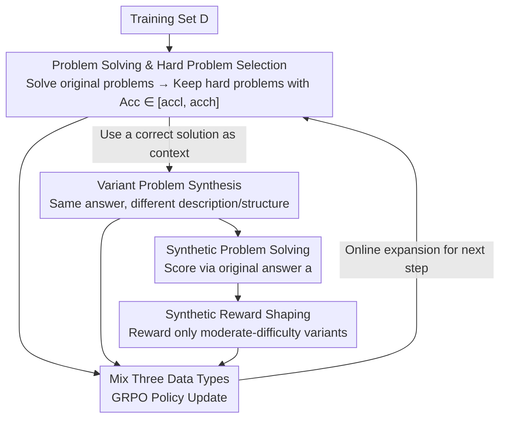

# Beyond Pass@1: Self-Play with Variational Problem Synthesis Sustains RLVR

**Conference**: ICLR2026  
**OpenReview**: [https://openreview.net/forum?id=Wjf3OMJxpn](https://openreview.net/forum?id=Wjf3OMJxpn)  
**Code**: https://github.com/MasterVito/SvS  
**Area**: LLM Reasoning / Reinforcement Learning  
**Keywords**: RLVR, Self-play, Problem Synthesis, Policy Entropy, Pass@k  

## TL;DR
To address the issues of policy entropy collapse and Pass@k stagnation in standard RLVR training, this paper proposes **SVS (Self-play with Variational problem Synthesis)**. In this method, the policy model uses its own correct solutions to difficult problems to "back-synthesize" a set of variant problems with the same answers. Solving these new problems online expands the training data and sustains policy entropy, achieving absolute gains in Pass@32 of 18.3% and 22.8% on AIME24/25, respectively.

## Background & Motivation
**Background**: RLVR (Reinforcement Learning with Verifiable Rewards) has become the mainstream paradigm for post-training LLMs, particularly for strengthening complex reasoning capabilities. Representative methods include policy optimization like GRPO, which treats the correctness of answers as rewards.

**Limitations of Prior Work**: Recent works (Yue et al. 2025; Cui et al. 2025b) have observed that improvements in Pass@1 in standard RLVR come at the cost of **policy entropy** (which characterizes output diversity). Over extended training, entropy decreases monotonically until it collapses to near zero, as the model repeatedly outputs the same "memorized" correct trajectories for training problems to "hack" rewards. Consequently, Pass@k (which often represents the upper bound of LLM reasoning at larger $k$) barely increases or even falls below the base model, eventually causing Pass@1 to saturate due to a lack of exploration space.

**Key Challenge**: There is a trade-off between entropy and performance, primarily caused by **repeated training on a fixed, finite problem set**. An intuitive solution is to continuously introduce new problems and increase data diversity. However, collecting high-quality new problems with verifiable reference answers for RLVR is difficult: human-annotated sets are scarce and may not match the strong reasoning capabilities of modern LLMs. While synthetic data is common, it often lacks precise reference answers, which are the only training signal for RLVR.

**Goal**: To find a simple and effective problem augmentation strategy that simultaneously satisfies three conditions: (1) iteratively updatable online to maintain data diversity; (2) provides precise reference answers; and (3) aligns with the model's current capability (augmenting only problems it can "reach but has not mastered").

**Key Insight**: The authors first conduct diagnostic experiments (Section 2) verifying that "diversified, periodically updated problem sets can slow down entropy decline and improve Pass@k." They find that rephrasing problems using an external LLM introduces semantic inconsistencies, destroys answer labels, and suffers from limited diversity due to using the original problem as context.

**Core Idea**: Instead of looking outward for problems, **let the policy use its own correct solutions to difficult problems to back-synthesize variant problems**. Since a correct solution contains all the necessary information of the original problem, variant problems generated from it naturally share the same reference answer. This eliminates the need for additional labeling and aligns with the model's own capabilities, sustaining training entropy purely via self-play.

## Method

### Overall Architecture
SVS extends the experience collection of each RLVR step from "problem solving only" to a self-play cycle alternating between "solving and posing problems," populating the training buffer $B$ with synthesized variant problems online. Data in one training step consists of three parts: (1) **Original problem solving**—the policy generates $G$ solutions $\{y_i\}$ for a sampled training problem $x$, receives binary rewards based on the reference answer $a$, filters out all-correct/all-wrong groups, and identifies "underperforming" hard problems; (2) **Variant problem synthesis**—the policy uses a correct solution $y_i$ of these hard problems as context to generate $G_v$ variant problems $\{\hat{x}_i^j\}$, requiring changed descriptions and structures while keeping the answer unchanged; (3) **Synthetic problem solving**—the policy solves these variant problems, using the original answer $a$ for scoring. These three types of data are mixed after filtering and reward shaping to update the policy $\pi_\theta$ via GRPO. This entire pipeline relies solely on the policy model itself, without external guidance or distillation, and is decoupled from specific RLVR algorithms (compatible with PPO / GSPO / Reinforce++).

### Key Designs

**1. Variant Problem Synthesis: Back-posing using correct solutions for zero-labeling gains**

This step addresses the bottleneck of RLVR augmentation: synthetic problems lacking precise answers. The authors' key observation is that a correct solution $y_i$ contains all the information of the original problem $x$. By feeding $y_i$ back into the policy as context to "reverse-write" a new problem, the resulting variants **naturally share the original reference answer $a$**. This saves annotation costs and uses "answer consistency" as a natural criterion for validating variants. Formally, for each correct solution $y_i$, a set of $G_v$ variant problems $\{\hat{x}_i^j\}_{j=1}^{G_v}$ is synthesized. These vary significantly in structure and phrasing, forcing the policy to explore new/more diverse reasoning paths. This inverse mapping from solution to problem is also included in reward training, forcing the policy to understand problem semantics and structure more deeply.

**2. Targeted Augmentation of Hard Problems: Focus on underperforming problems**

Unselective augmentation across all problems is either wasted on mastered simple problems or idles on impossible ones. SVS thus identifies **underperforming problems**, defined as problems where the average accuracy $\mathrm{Acc}(x)$ of a group falls within the interval $[\mathrm{acc}_l, \mathrm{acc}_h]$. This excludes "too easy" and "unsolvable" extremes, focusing augmentation on problems aligned with the model's current capability frontier. An ablation (SvS-Asp, which targets simple problems with accuracy 37.5%–75%) proves that augmenting simple problems merely accelerates overfitting and limits exploration, leading to lower Pass@32. Note that GRPO also naturally filters out all-correct (Acc=1) or all-wrong (Acc=0) groups as they provide zero advantage signal.

**3. Reward Shaping for Synthetic Problems: Rewarding only "moderate difficulty" to prevent cheating**

A naive synthetic reward (Eq. 3) would give a positive reward as long as the policy samples one correct answer: $\mathbf{R}_{\mathrm{v}}(\hat{x}_i^j)=\mathbb{I}\left(\mathrm{Acc}(\hat{x}_i^j,a)>0\right)$. However, the authors found this prone to exploitation—since variants are generated from correct solutions, the policy may insert too many hints or even the answer itself into the problem, creating "trivial problems" to gain easy rewards. Such simplified variants fail to stimulate reasoning and cause the pipeline to degrade. Thus, a reward shaping constraint (Eq. 4) is introduced to reward only **moderate difficulty** synthetic problems:

$$\mathbf{R}_{\mathrm{v}}(\hat{x}_i^j)=\mathbb{I}\left(\hat{\mathrm{acc}}_l \le \mathrm{Acc}(\hat{x}_i^j,a) \le \hat{\mathrm{acc}}_h\right)$$

In other words, if a variant is solved perfectly (too easy/hint leakage) or no correct solutions are sampled (unsolvable/answer drift), it receives a negative reward. This suppresses both "hint-stuffing" and "invalid problems," ensuring synthetic problems consistently challenge the policy.

**4. Joint GRPO Update: Reinforcing solving and posing in one loop**

After experience collection, the training buffer $B$ contains three types of (prompt, response, reward) triplets: original problem solving $(x,y_i,R_c(y_i,a))$, variant synthesis $(y_i,\hat{x}_i^j,R_v(\hat{x}_i^j))$, and synthetic problem solving $(\hat{x}_i^j,\hat{y}_k,R_c(\hat{y}_k,a))$. Solving rewards are uniform answer-matching indicators $R_c(y,a)=\mathbb{I}(\mathrm{Extract}(y)=a)$. These mixed data types update the policy via the GRPO objective, making it **simultaneously learn** to solve training problems, pose challenging problems for itself, and solve its own posed problems. This online update of the problem set prevents the policy from memorizing a few specific problems, stabilizing policy entropy and supporting long-term exploration.

### Main Results
On Qwen2.5-32B-Instruct, SVS achieves substantial and sustained improvements over standard RLVR on competition-level benchmarks (Table 1, DAPO-17k training):

| Training/Metric | AIME24 P@1 | AIME25 P@1 | Avg P@1 | AIME24 P@32 | AIME25 P@32 | Avg P@32 |
|-----------|-----------|-----------|---------|-------------|-------------|----------|
| RLVR (D17k) | 28.8 | 30.0 | 22.5 | 52.5 | 42.4 | 44.6 |
| **SVS (D17k)** | **39.3** | **40.5** | **27.9** | **70.8** | **65.2** | **53.1** |
| ∆ | +10.5 | +10.5 | +5.4 | +18.3 | +22.8 | +8.5 |

Under MATH-12k training, SVS's Pass@32 is on average +16.0 higher than RLVR (Avg 38.6 → 54.6). Across scales (Table 2, Pass@1 overall average), SVS provides improvements of approximately +2.9 / +1.7 / +2.5 for 3B / 8B / 32B respectively, consistently outperforming RLVR across all scales and benchmarks.

### Ablation Study
Comparison of alternative augmentation strategies on Qwen2.5-32B-Instruct + DAPO-17k (Table 3, Avg):

| Configuration | Pass@1 Avg | Pass@32 Avg | Description |
|-----------|-----------|-------------|-------------|
| RLVR | 22.5 | 44.6 | Standard Baseline |
| Ext (Extend RLVR to same sample size) | 24.6 | 46.3 | Just more samples, still trails SVS |
| Eup (Additional rollouts for hard problems) | 21.7 | 50.9 | Pass@32 up, Pass@1 down; biased toward exploration |
| SvS-Asp (Augmenting simple instead of hard) | 22.8 | 42.8 | Accelerates overfitting; lowest Pass@32 |
| **Full SVS** | **27.9** | **53.1** | Full method; highest in both metrics |

### Key Findings
- **Entropy stability is the cause; sustained performance is the effect**: Figure 5 shows RLVR entropy declining monotonically until collapse, while SVS stabilizes entropy within a range. This corresponds to SVS's Pass@1/Pass@32 continuing to rise while RLVR saturates after ~450 steps in Figure 1.
- **Pushing the reasoning boundary**: Sweeping Pass@k from 1 up to 1024 (Figure 6), SVS consistently outperforms RLVR and the base model across all $k$ on AIME. On MATH-500, RLVR is eventually surpassed by the base model at large $k$, while SVS remains ahead—showing that the gains come from an expanded reasoning boundary rather than just trading exploration for sampling efficiency.
- **Two rules for augmentation**: (1) Responsive augmentation should focus on underperforming hard problems (Eup > SvS-Asp); (2) Sustaining problem set diversity via online updates is more critical than a fixed set (Full SVS > Eup). Extending training (Ext) yields minimal gains, proving SVS's benefits are not simply from more samples.
- **Transferable to code generation**: Section 5.4 shows SVS consistently outperforms RLVR and maintains higher entropy on TACO / Codeforces / APPS / CodeContests, showing the method is not limited to math.
- **Formatting overfitting as a latent risk**: Training purely on DAPO-17k (integer answers only) causes SVS to drop performance on open-ended benchmarks. Mixing in open-ended problems (D25k) mitigates this and achieves the best overall score.

## Highlights & Insights
- **"Back-posing from solutions" is the masterstroke**: Using correct solutions as context to generate variant problems solves the core dilemma of synthetic data lacking precise answers. Answers are naturally inherited, enabling zero-label self-improvement.
- **Reward shaping prevents self-play degradation**: The biggest risk of self-posing is the policy "posing trivial problems to farm rewards." The authors block this by rewarding only moderate difficulty. This insight on reward hacking and its fix is valuable for any paradigm involving model-generated training signals.
- **Entropy as an observable training health indicator**: Diagnostic experiments demonstrate the causal chain: "updating problem set → entropy recovery → Pass@k improvement," providing a clear mechanistic explanation for why RLVR saturates.
- **Algorithm-agnostic self-improvement**: SVS does not rely on external teachers/distillation and is orthogonal to PPO / GSPO / Reinforce++, making it easy to integrate into existing RLVR pipelines.

## Limitations & Future Work
- **Formatting Overfitting**: On datasets with limited answer formats (like integer-only DAPO-17k), SVS overfits to the format, causing performance drops on open-ended benchmarks. This suggests that the "same answer" constraint can amplify formatting bias when the answer space is narrow.
- **Proxy Verification Mechanism**: The correctness of synthetic problems is approximated by "whether the policy can sample an answer matching the original" (Eq. 4), rather than a true semantic verification. If the policy uses flawed reasoning to arrive at a correct answer, noisy problems may be introduced.
- **Hyperparameter-dependent thresholds**: The underperformance interval $[\mathrm{acc}_l,\mathrm{acc}_h]$ and reward shaping interval $[\hat{\mathrm{acc}}_l,\hat{\mathrm{acc}}_h]$ are manually set. Their robustness across different models/datasets and potential for adaptive tuning are not fully explored.
- **Future Directions**: One could introduce stronger semantic consistency checks (e.g., cross-model verification or answer distribution testing) and explore adaptive scheduling of difficulty intervals based on training progress.

## Related Work & Insights
- **vs. Standard RLVR / GRPO**: Standard methods optimize on a fixed set, improving Pass@1 at the cost of entropy collapse and Pass@k stagnation. SVS sustains entropy via online synthesis, pushing up Pass@k to eventually benefit Pass@1.
- **vs. External LLM Rephrasing (e.g., MetaMath)**: Rephrasing relies on external models and can introduce semantic inconsistencies. SVS uses the policy's own solutions, ensuring answer conservation and alignment with its own capability through pure self-improvement.
- **vs. Exploration Enhancement (e.g., Eup's additional rollouts)**: Simply sampling more on hard problems improves Pass@32 but hurts Pass@1. SVS achieves both by combining problem diversity with solution-driven target problem focus.

## Rating
- Novelty: ⭐⭐⭐⭐⭐ The perspective of "back-posing from solutions" for answer-conserving self-play is clever and elegantly bypasses the lack of labels in synthetic data.
- Experimental Thoroughness: ⭐⭐⭐⭐⭐ Comprehensive evidence across 3B–32B scales, 12 reasoning benchmarks, code generation, Pass@k sweeps to 1024, and four major ablation strategies.
- Writing Quality: ⭐⭐⭐⭐ Clear mechanistic narrative; mechanisms and diagnostic experiments align well. Some threshold/hyperparameter details are scattered in the appendix.
- Value: ⭐⭐⭐⭐⭐ Directly addresses the core pain point of entropy collapse in RLVR. The algorithm-agnostic nature makes it highly practical for scaling RLVR training.

<!-- RELATED:START -->

## Related Papers

- [\[ICLR 2026\] Self-Harmony: Learning to Harmonize Self-Supervision and Self-Play in Test-Time Reinforcement Learning](self-harmony_learning_to_harmonize_self-supervision_and_self-play_in_test-time_r.md)
- [\[ICLR 2026\] SPELL: Self-Play Reinforcement Learning for Evolving Long-Context Language Models](spell_self-play_reinforcement_learning_for_evolving_long-context_language_models.md)
- [\[ICLR 2026\] SPIRAL: Self-Play on Zero-Sum Games Incentivizes Reasoning via Multi-Agent Multi-Turn Reinforcement Learning](spiral_self-play_on_zero-sum_games_incentivizes_reasoning_via_multi-agent_multi-.md)
- [\[ICLR 2026\] Goedel-Prover-V2: Scaling Formal Theorem Proving with Scaffolded Data Synthesis and Self-Correction](goedel-prover-v2_scaling_formal_theorem_proving_with_scaffolded_data_synthesis_a.md)
- [\[ICLR 2026\] MATH-Beyond: A Benchmark for RL to Expand Beyond the Base Model](math-beyond_a_benchmark_for_rl_to_expand_beyond_the_base_model.md)

<!-- RELATED:END -->
