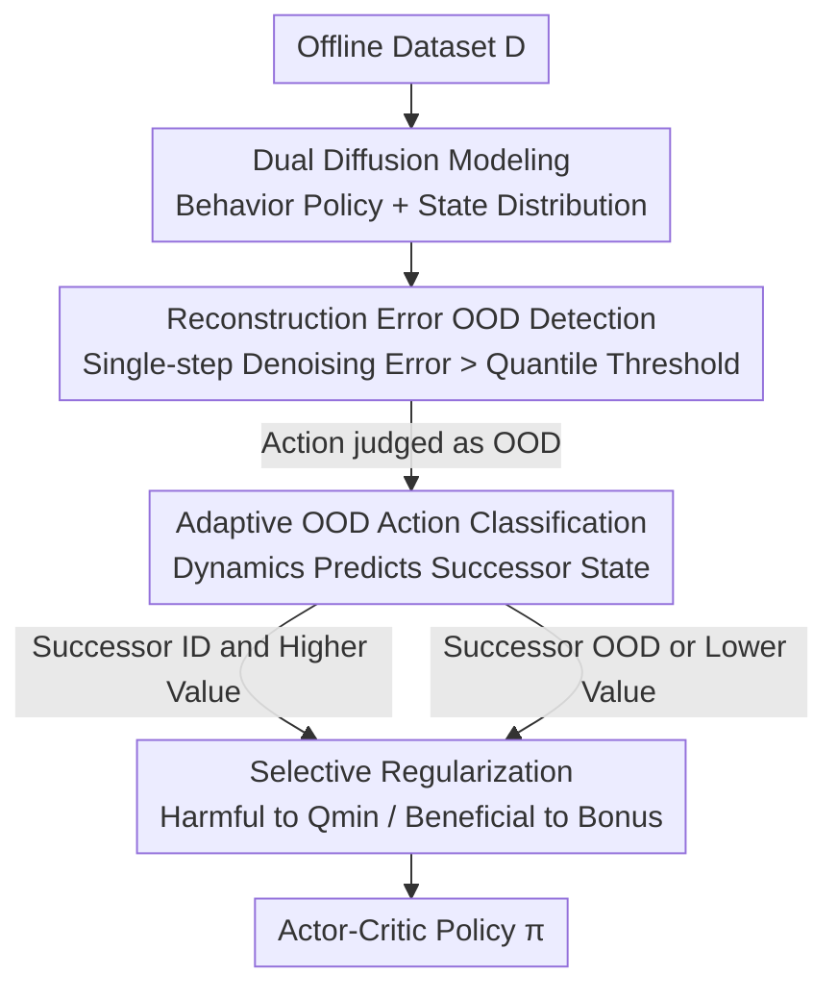

# Beyond Penalization: Diffusion-based Out-of-Distribution Detection and Selective Regularization in Offline Reinforcement Learning

**Conference**: ICLR2026  
**OpenReview**: [https://openreview.net/forum?id=a4DbIONcpb](https://openreview.net/forum?id=a4DbIONcpb)  
**Code**: https://github.com/7ingw24/DOSER  
**Area**: Reinforcement Learning / Offline RL  
**Keywords**: Offline Reinforcement Learning, Out-of-Distribution Detection, Diffusion Models, Selective Regularization, Value Overestimation

## TL;DR
DOSER utilizes two diffusion models to characterize the behavior policy and state distribution, respectively, using single-step denoising reconstruction error as a reliable OOD (Out-of-Distribution) metric. By leveraging a dynamics model, OOD actions are further categorized into "beneficial" and "harmful" types; the former receives a reward bonus while the latter is penalized. This approach suppresses value overestimation without stifling potential exploration in offline RL, achieving state-of-the-art results on D4RL, particularly on sub-optimal datasets.

## Background & Motivation

**Background**: Offline reinforcement learning learns policies solely from static datasets $D=\{(s,a,r,s')\}$ without environment interaction, making it suitable for scenarios where online exploration is costly or dangerous, such as robotics, healthcare, and autonomous driving. However, directly applying standard off-policy algorithms to the offline setting leads to distribution shift: when the policy generates actions deviating from the data distribution, the value function extrapolates incorrectly to unseen regions, causing severe value overestimation and training collapse.

**Limitations of Prior Work**: Mainstream mitigation strategies fall into two categories: policy constraint methods (fitting the learned policy to the behavior policy, often using VAEs to model behavior distributions) and value regularization methods (learning conservative Q-functions that penalize OOD actions). Both have significant flaws: VAEs struggle to capture the multi-modal structure of real-world behaviors and often collapse diverse actions into "average" actions in low-density regions. Value regularization methods generally apply **uniform penalization** across the entire out-of-support region, suppressing valuable exploration that could potentially improve performance.

**Key Challenge**: The root problem lies in the entangled defects of "inaccurate OOD identification" and "blanket penalization." Identification relies on distribution models with limited expressiveness (e.g., the unimodal Gaussian assumption of VAEs), failing to distinguish which actions are truly out-of-distribution. Treatment fails to distinguish between good and bad OOD actions, forcing a trade-off between conservatism and exploration. Recent works like CCVL, ACL-QL, and DoRL-VC attempt fine-grained regulation but either incur high training overhead via Q-ensembles or inherit strong Gaussian assumptions about behavior policies.

**Goal**: To correctly "identify OOD" and "treat OOD"—requiring both an OOD detector that does not rely on strong distributional assumptions and can capture multi-modal behavior, and a regularization strategy that differentiates between beneficial/harmful OOD actions.

**Key Insight**: The authors observe that diffusion models are naturally adept at capturing complex multi-modal distributions, and "single-step denoising reconstruction error after adding noise" serves as an effective likelihood-free proxy for distribution fit—the farther from the distribution, the worse the reconstruction. By overlaying a dynamics model to predict the successor state of an OOD action, one can determine if the deviation is a "lucky find" or a "pitfall."

**Core Idea**: Replace VAE likelihood with diffusion reconstruction error for precise OOD detection, and use the predicted successor state value to distinguish beneficial vs. harmful OOD actions. This upgrades "uniform penalization" to "selective regularization"—penalizing the harmful and rewarding the beneficial.

## Method

### Overall Architecture
DOSER (Diffusion-based OOD Detection and SElective Regularization) takes an offline dataset $D$ as input and outputs a policy $\pi_\varphi$ learned within an actor-critic framework. In the pre-training phase, it fits two diffusion models (behavior policy $\hat\pi_\beta(a|s)$ and state distribution $d_0(s)$) and a dynamics model $p_\psi(s'|s,a)$, calculating quantile thresholds $\tau_a, \tau_s$ for reconstruction errors on the training set. During policy optimization, it first uses diffusion reconstruction error to detect OOD actions, then predicts successor states via the dynamics model. By combining state OOD identification and value comparison, it classifies OOD actions into beneficial or harmful types. Finally, the critic loss pulls harmful actions toward $Q_{min}$ and provides an adaptive bonus for beneficial actions.

### Key Designs

**1. Dual Diffusion Models for Behavior Policy and State Distribution: Replacing Unimodal Gaussian Assumptions**

To address the "inaccurate VAE identification and multi-modal collapse" issue, DOSER trains two diffusion models based on the EDM framework. One is a conditional diffusion model learning the empirical behavior policy $\hat\pi_\beta(a|s)$, where the denoising network $\epsilon_{\theta_a}(a_t,\sigma_t,s)$ is trained to reconstruct clean actions from noisy actions $a_t=a_0+\sigma_t\epsilon$: $L(\theta_a)=\mathbb{E}\big[\lambda(\sigma_t)\|a_0-\epsilon_{\theta_a}(a_t,\sigma_t,s)\|_2^2\big]$. The other is an unconditional diffusion model learning the state distribution $d_0(s)$ using a similar objective $L(\theta_s)=\mathbb{E}\big[\lambda(\sigma_t)\|s_0-\epsilon_{\theta_s}(s_t,\sigma_t)\|_2^2\big]$. Diffusion models are used instead of VAEs because they naturally capture multi-modal distributions, avoiding the compression of diverse behaviors into a single average action. The action diffusion detects if the "action is out of bounds," while the state diffusion detects if the "action leads to an unseen state."

**2. Single-step Denoising Reconstruction Error as OOD Metric: A Likelihood-free Measure**

For a state-action pair $(s,a_0)$ encountered during policy optimization, a noise scale $\sigma_t$ is sampled to produce $a_t=a_0+\sigma_t\epsilon$. The action OOD score is defined as the L2 distance between the original action and the denoised result: $E_a(s,a_0)=\|a_0-\epsilon_{\theta_a}(a_t,\sigma_t,s)\|_2$. Similarly for states: $E_s(s_0)=\|s_0-\epsilon_{\theta_s}(s_t,\sigma_t)\|_2$. The indicator functions are $I_{ood}(a_0)=\{E_a(s,a_0)>\tau_a\}$ and $I_{ood}(s_0)=\{E_s(s_0)>\tau_s\}$, where $\tau_a, \tau_s$ are the $p$-th percentiles of reconstruction errors on the training set. $p$ directly controls conservatism. This design is likelihood-free, directly measures manifold fit, and requires only one forward pass per sample. Robustness is improved by **randomly sampling multiple diffusion timesteps** rather than using a fixed noise scale.

**3. Adaptive OOD Action Classification: Distinguishing "Lucky Finds" from "Pitfalls"**

DOSER introduces a two-stage evaluation using a pre-trained dynamics model $p_\psi(s'|s,a)$ to predict the successor state $s'_\pi$ of an OOD action $a_{ood}$. It is judged along two dimensions: first, whether $s'_\pi$ remains within the distribution (determined by $E_s$); second, if it is in-distribution, whether $V(s'_\pi)$ exceeds $V(s'_{id})$—where $s'_{id}$ is the predicted successor state after executing the optimal ID action $a^*_{id}=\arg\max_{a\sim\pi_\beta}Q(s,a)$. Formally: $A^+_{ood}:=\{a\mid E_s(s'_\pi)\le\tau_s \wedge V(s'_\pi)\ge V(s'_{id})\}$ and $A^-_{ood}:=\{a\mid E_s(s'_\pi)>\tau_s \vee V(s'_\pi)<V(s'_{id})\}$. Essentially, only actions that lead to in-distribution states with higher value than the best ID action are considered beneficial.

**4. Selective Regularization Critic Loss: Dual Penalization and Reward**

The policy evaluation loss adds two directional regularization terms to the standard Bellman error. For harmful OOD actions, $Q_\theta(s,a)$ is pulled toward the theoretical minimum $Q_{min}=R_{min}/(1-\gamma)$ (coefficient $\beta$) to suppress overestimation. For beneficial OOD actions, an adaptive bonus is provided, targeting $\eta(Q_{\theta'}(s,a^*_{id})+\delta_V)$ (coefficient $\lambda$), where $\delta_V=V(s'_\pi)-V(s'_{id})$ measures the value gain. The complete loss is:

$$L(\theta)=\mathbb{E}_{D}\big[(Q_\theta-(R+\gamma\,\mathbb{E}_{a'\sim\pi_\beta}Q_{\theta'}))^2\big]+\beta\,\mathbb{E}\big[I(a\in A^-_{ood})(Q_\theta-Q_{min})^2\big]+\lambda\,\mathbb{E}\big[I(a\in A^+_{ood})(Q_\theta-\eta(Q_{\theta'}(s,a^*_{id})+\delta_V))^2\big]$$

This bonus compensates for extrapolation errors in OOD regions and guides the policy toward high-value areas, serving as the core of "beyond penalization."

### Loss & Training
The value network is trained using expectile regression $L_\tau^2$ similar to IQL. The dynamics model $p_\psi$ is trained via supervised regression on $\|p_\psi(\cdot|s,a)-s'\|_2^2$. The policy $\pi_\varphi$ is optimized with maximum entropy regularization $L(\varphi)=\mathbb{E}[\alpha\log\pi_\varphi(\cdot|s)-Q_\theta(s,a)]$, where $\alpha$ is dynamically adjusted. 

## Key Experimental Results

### Main Results
Evaluated on D4RL benchmarks (Gym-MuJoCo v2, Adroit v1), DOSER is compared against policy constraint (TD3+BC/IQL/A2PR), value regularization (CQL/SVR/ACL-QL), and diffusion-based (DQL/SfBC/IDQL/QGPO/SRPO/DTQL) baselines.

| Dataset | Metric | DOSER | A2PR | SVR | DTQL | Note |
|--------|------|-------|------|-----|------|------|
| halfcheetah-m-r | Norm. Score | **63.0 ± 1.1** | 56.6 | 52.5 | 50.9 | Significant advantage on sub-optimal data |
| hopper-m | Norm. Score | **104.0 ± 0.5** | 100.8 | 103.5 | 99.6 | Leader |
| MuJoCo-v2 Avg | Norm. Score | **93.2** | 93.0 | 91.4 | 88.7 | Highest overall |
| Adroit-v1 Avg | Norm. Score | **83.6** | - | 71.7 | 72.7 | Large lead |
| pen-human | Norm. Score | **87.8 ± 14.7** | - | 73.1 | 64.1 | Outstanding on difficult tasks |

DOSER's advantage is particularly prominent in "medium" and "medium-replay" settings containing sub-optimal behaviors.

### Ablation Study

| Configuration | MuJoCo Task (hopper-m / halfcheetah-m-r) | Description |
|------|---------|------|
| DOSER w/o AC and VC | 102.1 / 58.8 | Only diffusion detection, uniform penalization |
| DOSER w/o VC | 99.4 / 61.9 | Action classification active, penalizes harmful only |
| DOSER (Full) | **104.0 / 63.0** | Full: Classification + Value bonus |

### Key Findings
- Even without classification/bonus (w/o AC and VC), DOSER competes with SOTAs, proving **diffusion reconstruction error is a powerful OOD detector**.
- Uniform penalization suppresses beneficial OOD actions; adding classification (w/o VC) recovers performance; adding value compensation (Full) provides the best balance.
- Diffusion reconstruction error differentiates ID/OOD significantly better than model ensembles, MC dropout, or CVAE reconstruction error.

## Highlights & Insights
- **Reconstruction Error for OOD**: Denoising error is a likelihood-free, multi-modal metric that avoids the density estimation pitfalls of VAEs.
- **"OOD $\neq$ Penalty"**: Using a dynamics model to judge consequences decouples conservatism from "region-level" to "consequence-level."
- **Adaptive Bonus $\delta_V$**: It guides the policy toward high-value regions even when Q-estimates are inaccurate.

## Limitations & Future Work
- **Overhead**: Training two diffusion models and a dynamics model is more computationally expensive than VAE-based methods.
- **Model Dependency**: Classification reliability depends on the accuracy of $p_\psi$ and value estimate $V$, which may struggle in high-dimensional or stochastic environments.
- **Sensitivity**: Thresholds $\tau_a, \tau_s$ are hyperparameters that may require tuning across different dataset qualities.
- **Domain**: Only validated on continuous control; discrete actions and pixel-based observations remain unexplored.

## Related Work & Insights
- **vs CQL / SVR**: DOSER replaces uniform penalization with selective regularization, avoiding the suppression of exploration in sub-optimal data.
- **vs A2PR**: A2PR uses a discriminator to enhance CVAE; DOSER eliminates the Gaussian assumption via diffusion and acts directly on OOD actions.
- **vs DoRL-VC / ACL-QL**: These rely on VAE or Gaussian strategies for behavior modeling; DOSER uses diffusion for more accurate multi-modal modeling.

## Rating
- Novelty: ⭐⭐⭐⭐
- Experimental Thoroughness: ⭐⭐⭐⭐
- Writing Quality: ⭐⭐⭐⭐
- Value: ⭐⭐⭐⭐

<!-- RELATED:START -->

## Related Papers

- [\[ICLR 2026\] ADM-v2: Pursuing Full-Horizon Roll-out in Dynamics Models for Offline Policy Learning and Evaluation](adm-v2_pursuing_full-horizon_roll-out_in_dynamics_models_for_offline_policy_lear.md)
- [\[ICLR 2026\] DEAS: DEtached value learning with Action Sequence for Scalable Offline RL](deas_detached_value_learning_with_action_sequence_for_scalable_offline_rl.md)
- [\[NeurIPS 2025\] Structural Information-based Hierarchical Diffusion for Offline Reinforcement Learning](../../NeurIPS2025/reinforcement_learning/structural_information-based_hierarchical_diffusion_for_offline_reinforcement_le.md)
- [\[ICML 2025\] Learning to Trust Bellman Updates: Selective State-Adaptive Regularization for Offline RL](../../ICML2025/reinforcement_learning/learning_to_trust_bellman_updates_selective_state-adaptive_regularization_for_of.md)
- [\[ICLR 2026\] Adaptive Scaling of Policy Constraints for Offline Reinforcement Learning](adaptive_scaling_of_policy_constraints_for_offline_reinforcement_learning.md)

<!-- RELATED:END -->
