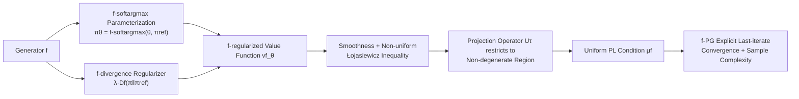

# Beyond Softmax and Entropy: Convergence Rates of Policy Gradients with $f$-SoftArgmax Parameterization & Coupled Regularization

**Conference**: ICLR 2026  
**OpenReview**: [https://openreview.net/forum?id=O93c9H4SXc](https://openreview.net/forum?id=O93c9H4SXc)  
**Code**: [https://github.com/Labbi-Safwan/f-regularised-policy-gradient](https://github.com/Labbi-Safwan/f-regularised-policy-gradient)  
**Area**: reinforcement learning / policy gradient theory  
**Keywords**: policy gradient, softmax parameterization, f-divergence, Tsallis divergence, last-iterate convergence, sample complexity  

## TL;DR
By replacing the default "softmax parameterization + entropy regularization" in RL with the **coupled duo** of "$f$-softargmax parameterization + homologous $f$-divergence regularization", the authors prove that the coupled objective satisfies the Polyak-Łojasiewicz (PL) inequality. This allows for the first **explicit last-iterate convergence guarantee** for stochastic policy gradients without preconditioning. Specifically, Tsallis divergence improves the exponential sample complexity of softmax to polynomial complexity.

## Background & Motivation
**Background**: Policy gradient methods (such as TRPO/PPO) are the cornerstones of modern RL, but their convergence behavior is extremely sensitive to seemingly low-level design choices, with policy parameterization being a core component. In discrete control, the combination of softmax parameterization and entropy regularization has become the default standard.

**Limitations of Prior Work**: Recent theoretical work reveals a fundamental flaw in softmax: without regularization, it creates extremely flat regions in the optimization landscape (Fig 1a), leading to an unavoidable **exponential lower bound** on convergence rates (Li et al. 2023). While entropy regularization is introduced to mitigate this, the landscape remains flat, and no polynomial convergence guarantees exist to date. Existing remedies are sub-optimal: preconditioning (like Natural Policy Gradient) corrects ill-conditioning but is computationally expensive and hard to scale; log-barrier regularization provides polynomial rates but lacks last-iterate guarantees and is unstable in practice.

**Key Challenge**: Prior research has focused on "changing the regularizer within softmax," but few have questioned softmax itself. The question remains: **is the bottleneck for convergence the regularizer or the parameterization base itself?**

**Goal**: Treat policy parameterization as a designable object. Move beyond softmax to find parameterizations that make the optimization landscape naturally well-behaved without relying on preconditioning or exponential batch sizes.

**Key Insight**: **(Coupled Design)** Use the generator $f$ of an $f$-divergence to simultaneously induce both the parameterization ($f$-softargmax) and the regularizer ($f$-divergence), such that they share the same $f$. This "homologous coupling" generalizes the classic softmax-entropy pair into an entire family. When choosing Tsallis divergence, the optimization landscape is significantly improved, and the convergence rate is exponentially faster than softmax-entropy.

## Method

### Overall Architecture
The method centers on the belief that "parameterization and regularizer must be a coupled pair": first, define $f$-softargmax parameterization using the $f$-divergence generator (where softmax is the KL special case), then use the $f$-divergence induced by the same $f$ as a regularizer. The two are naturally matched (the optimal regularized policy is exactly an $f$-softargmax). Based on this coupled structure, the authors establish the regularity of the value function—smoothness and a non-uniform Łojasiewicz inequality. This is then upgraded to a uniform Polyak-Łojasiewicz (PL) condition using a projection operator that restricts the policy to a non-degenerate region, finally providing explicit convergence and sample complexity for the stochastic policy gradient algorithm, f-PG.

### Key Designs

**1. $f$-softargmax parameterization: Unifying a family of parameterizations with divergence generators.** Given a strictly convex generator $f$ with $f(1)=0$ and a full-support reference distribution $q$, the $f\text{-softargmax}$ is defined as $f\text{-softargmax}(x,q):=\arg\max_{\nu\in\mathcal P(A)}\{\langle\nu,x\rangle - D_f(\nu\|q)\}$. The policy is then $\pi^f_\theta(\cdot|s):=f\text{-softargmax}(\theta(s,\cdot),\pi_{\mathrm{ref}}(\cdot|s))$. The KL generator recovers the familiar softmax, while the Tsallis generator ($0<\alpha<1$) yields a new class of "heavy-tailed but smooth" parameterizations $\pi\propto\nu_{\mathrm{ref}}(1+(\alpha-1)(x-\mu^\alpha_x))^{1/(\alpha-1)}$. Each member of this family can be computed by solving a 1D root-finding problem (bisection), which is computationally cheap. Note that Tsallis with $\alpha>1$ is excluded as it induces **sparse** (non-smooth) policies.

**2. Source-coupled parameterization and regularization: Aligning parameterization with the geometry of the regularized problem.** Instead of choosing the parameterization in isolation, the authors derive it from the structure of the optimal $f$-regularized solution: the optimal policy $\pi^f_\star(\cdot|s)$ satisfies $f\text{-softargmax}(q^f_\star(s,\cdot)/\lambda,\pi_{\mathrm{ref}})$. This means that by setting logits $\theta^f_\star=q^f_\star/\lambda+b(s)$, $f$-softargmax **exactly reproduces** the optimal regularized policy. In other words, under this coupling, "learning the policy" is equivalent to "learning the regularized optimal Q-function." The regularizer is not an external penalty but an inherent property derived from the variational characterization of the optimal policy. This geometric alignment allows for well-behaved analysis; for instance, entropy regularization does not match Tsallis parameterization.

**3. From non-uniform Łojasiewicz to uniform PL: Eliminating degenerate policies via a projection operator.** The authors first prove that the coupled objective $v^f_\theta(\rho)$ is $L_f$-smooth and satisfies a non-uniform Łojasiewicz inequality $\|\nabla_\theta v^f_\theta(\rho)\|^2\ge\mu_f(\theta)(v^f_\star-v^f_\theta)$, where the coefficient $\mu_f(\theta)\propto\min_{s,a}w^f_\theta(a|s)^2$ vanishes as the policy becomes deterministic. The proof uses a second-order Taylor expansion of $f$-softmax to bound the optimality gap by $\frac\lambda2(\zeta^f_\theta)^\top\nabla^2 f\text{-softmax}(\xi)\zeta^f_\theta$. To obtain a uniform lower bound, a projection operator $U_\tau$ is designed to pull any "too deterministic" policy (probabilities near 0) back above a threshold $\pi_{\mathrm{ref}}\tau$. Under an appropriate threshold $\tau_\lambda$, $\mu_f$ is uniformly bounded below by $\underline\mu_f$ in the restricted region, upgrading the condition to a uniform PL condition.

**4. f-PG algorithm and explicit convergence: Projected REINFORCE under the PL framework.** In the f-PG algorithm, a batch of truncated trajectories of length $H$ is sampled at each step to estimate $\nabla v^f_\theta$ using a REINFORCE-style estimator $g^f_Z(\theta)$, followed by a projected update $\theta_{t+1}=T_{\tau_\lambda}(\theta_t+\eta g^f_{Z_t}(\theta_t))$. Under the PL condition and specified estimator bias/variance bounds ($\|g^f-\nabla v^f_\theta\|\le\beta_f$, variance $\le\sigma_f^2/B$), the authors prove $\mathbb E[\Delta_t]\le(1-\tfrac{\eta\underline\mu_f}{4})^t\Delta_0+\tfrac{6\eta\sigma_f^2}{B\underline\mu_f}+\tfrac{6\beta_f^2}{\underline\mu_f}$. All constants are explicitly defined relative to problem parameters. This is the **first explicit last-iterate guarantee for this class of methods without preconditioning or exponential batch sizes**. Setting the temperature $\lambda$ to $O((1-\gamma)\epsilon)$ extends the conclusion to the unregularized objective. The final sample complexity is dominated by the asymptotic behavior of $(f^\star)''$: faster growth of $(f^\star)''$ leads to better condition numbers. For specific generators, softmax-entropy (KL) sample complexity explodes at $\exp(1/((1-\gamma)\epsilon))$, while $\alpha$-Tsallis grows only **polynomially** with $1/(1-\gamma)$. Furthermore, an optimal accuracy-adaptive choice $\alpha^\star(\epsilon)\approx 11/(2\log(1/\epsilon))$ suggests that the best $\alpha$ is neither 0 nor 1, but varies with the target precision.

## Key Experimental Results

The experiments aim to show that this theoretical framework can be seamlessly integrated into modern on-policy algorithms. The authors replace the parameterization and entropy regularization in PPO with Tsallis versions, resulting in **$\alpha$-Tsallis PPO**, and compare it against standard PPO in two environments.

### Main Results

| Environment | Setting | Focus |
|------|------|--------|
| Noisy CartPole | Standard + reward noise $\sigma^2\in\{0.5,2.0,10.0\}$ | Robustness under high-variance returns |
| DeepSea | Grid size $L\in\{20,30,40,50\}$, sparse rewards | Deep exploration capability |

Each curve uses the optimal temperature and step size for that $\alpha$; shaded areas represent $\pm 1$ standard error over 25 random seeds.

### Key Findings
- **Noisy CartPole**: Values of $\alpha<1$ systematically outperform the PPO baseline in standard and low-noise settings, and the **advantage becomes more pronounced as noise increases** (largest gap at $\sigma^2=10$). The heavy-tailed Tsallis parameterization is more robust to high-variance returns.
- **DeepSea**: As the grid size $L$ increases, the improvement over PPO becomes more significant. In the hardest cases ($L=40,50$), $\alpha=0.7$ achieves the highest return and fastest learning, indicating that deep exploration tasks favor intermediate $\alpha$ values.
- **No Universal $\alpha$**: Different noise levels and exploration problems favor different regions of the Tsallis family, confirming the theoretical conclusion that the optimal $\alpha$ depends on the problem and target precision, supporting the use of "parameterization-regularizer pairs" as tunable hyperparameters.

## Highlights & Insights
- **Elevating parameterization from an "isolated choice" to a "geometric object coupled with the regularizer"** is the most significant perspective shift: the quality of a parameterization cannot be judged independently of the regularizer.
- **The first explicit, non-preconditioned, non-exponential batch last-iterate guarantee** achieves polynomial rates previously only accessible via NPG preconditioning or log-barrier methods, but through the lighter mechanism of "changing parameterization."
- **Theory-guided hyperparameters**: The result $\alpha^\star(\epsilon)\approx 11/(2\log(1/\epsilon))$ provides a practical, accuracy-adaptive rule for divergence selection rather than arbitrary tuning.
- The proof removes the dependency on the specific properties of the logarithm found in softmax-entropy proofs by using Taylor expansions, which is key to generalizing to the entire $f$-divergence family.

## Limitations & Future Work
- **Theoretical scope restricted to finite tabular MDPs**: Explicit constants and PL analysis rely on finite state/action spaces, full-support reference policies, and the $\rho_{\min}>0$ exploration assumption. No guarantees for continuous/function approximation or general settings yet.
- **Generator assumptions exclude sparse policies**: Tsallis with $\alpha>1$ is excluded due to non-smoothness, meaning the framework does not yet cover the practically useful region of "natural sparsity."
- **Temperature $\lambda$ requirement**: The temperature must be sufficiently small to ensure the PL condition holds, and unregularized conclusions are obtained indirectly by tuning $\lambda$. Practical selection remains an engineering challenge.
- **Small experimental scale**: Validations are restricted to CartPole and DeepSea; the performance of $\alpha$-Tsallis PPO on large-scale benchmarks like Atari or MuJoCo is untested. A sample complexity of $\epsilon^{-12}$ still leaves a gap for practical applications.

## Related Work & Insights
- The **exponential lower bound of softmax policy gradients** (Mei et al. 2020a/b; Li et al. 2023) is the primary pain point addressed. While **escort transforms** (Mei et al. 2020a) and **Hadamard parameterization** (Liu et al. 2025) are alternative attempts, the former relies on increasing step sizes (unsuitable for SGD) and the latter lacks explicit constants. This work wins with a more flexible family and explicit stochastic guarantees.
- The idea of **coupling parameterization and regularizers** is borrowed from supervised learning (Blondel et al. 2020; Roulet et al. 2025) and is systematically introduced to RL here for the first time.
- The distinction from **(lazy) mirror descent** is insightful: f-PG computes gradients in the "dual parameter $\theta$," whereas mirror descent computes them in the policy space $\pi$, implicitly requiring a preconditioning term (inverse policy Jacobian). This explains f-PG's superior scalability.
- The conclusion that the optimal $\alpha$ depends on precision aligns with **bandit literature** (Zimmert & Seldin 2021), suggesting Tsallis-softargmax might offer acceleration in broader online learning contexts.

## Rating
- **Novelty**: ⭐⭐⭐⭐⭐ High originality in viewing parameterization and regularization as a coupled geometric pair, leading to the first explicit last-iterate guarantee for this class.
- **Experimental Thoroughness**: ⭐⭐⭐ Clear proof-of-concept (Tsallis outperforms PPO in noise/exploration tasks), but limited to toy-scale environments. Lacks large-scale benchmarks and systematic statistical comparisons.
- **Writing Quality**: ⭐⭐⭐⭐ Coherent flow from motivation to proof and experiment. Good visualizations of the landscape (Fig 1) and comparative positioning (Table 1). Formulas are dense, posing a barrier for non-theoretical readers.
- **Value**: ⭐⭐⭐⭐ Provides solid theoretical grounds and an actionable selection rule for "moving beyond softmax," offering guidance for both PG theory and PPO practice. Full-scale realization requires future work.

<!-- RELATED:START -->

## Related Papers

- [\[ICLR 2026\] Does “Do Differentiable Simulators Give Better Policy Gradients?” Give Better Policy Gradients?](does_do_differentiable_simulators_give_better_policy_gradients_give_better_polic.md)
- [\[ICLR 2026\] ResT: Reshaping Token-Level Policy Gradients for Tool-Use Large Language Models](rest_reshaping_token-level_policy_gradients_for_tool-use_large_language_models.md)
- [\[ICLR 2026\] Relative Entropy Pathwise Policy Optimization](relative_entropy_pathwise_policy_optimization.md)
- [\[ICLR 2026\] Convergence of an actor-critic gradient flow for entropy regularised MDPs in general spaces](convergence_of_an_actor-critic_gradient_flow_for_entropy_regularised_mdps_in_gen.md)
- [\[ICLR 2026\] Beyond Penalization: Diffusion-based Out-of-Distribution Detection and Selective Regularization in Offline Reinforcement Learning](beyond_penalization_diffusion-based_out-of-distribution_detection_and_selective_.md)

<!-- RELATED:END -->
