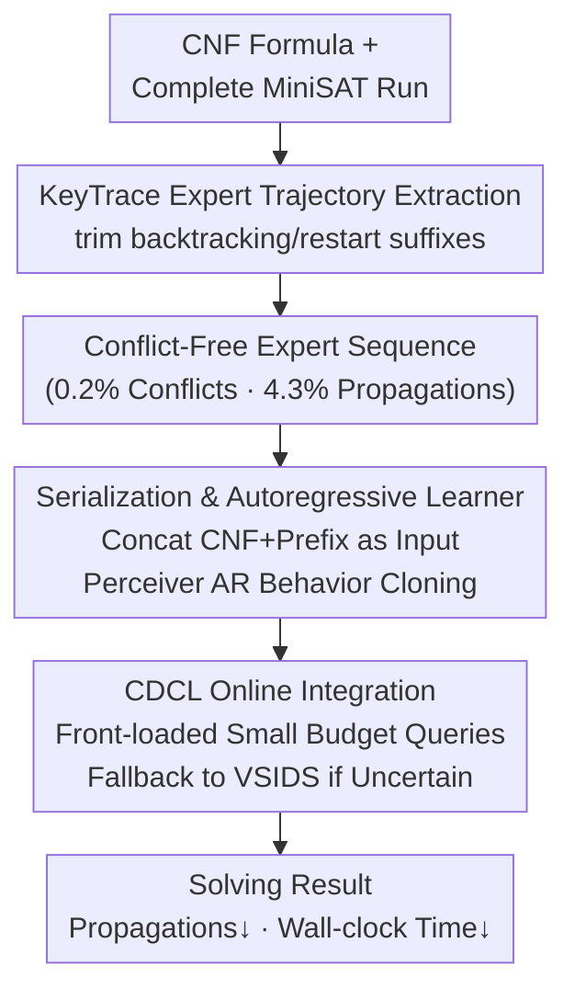

# Boolean Satisfiability via Imitation Learning

**Conference**: ICLR2026  
**arXiv**: [2509.25411](https://arxiv.org/abs/2509.25411)  
**Code**: [https://github.com/zewei-Zhang/ImitSAT](https://github.com/zewei-Zhang/ImitSAT)  
**Area**: Reinforcement Learning  
**Keywords**: SAT, Imitation Learning, CDCL, Branching Strategy, Autoregressive, Transformer  

## TL;DR
ImitSAT is proposed as the first CDCL solver branching strategy based on imitation learning. By compressing solver runs into conflict-free KeyTrace expert sequences, branching decisions are modeled as an autoregressive prediction task conditioned on prefixes. This approach significantly reduces the number of propagations and solving time with a small query budget, while demonstrating strong generalization capabilities on structured SAT problems.

## Background & Motivation

**Background**: The Boolean Satisfiability problem (SAT) is a cornerstone of theoretical CS and AI. Modern solvers predominantly use the CDCL framework, where branching decisions determine the search trajectory, and unit propagation (UP) accounts for 80%-90% of the execution time.

**Limitations of Prior Work**:
   - Classical branching heuristics (e.g., VSIDS) are manually designed with limited adaptability.
   - SATformer only adjusts variable activity during initialization and cannot influence branching once the search begins.
   - Graph-Q-SAT utilizes reinforcement learning (RL) online agents, but RL requires extensive exploration, suffers from sparse and unstable rewards, and relies only on current state snapshots without utilizing full history.

**Key Insight**: Propagation accounts for approximately 88.9% of CDCL execution time (measured in MiniSAT); thus, reducing the number of propagations is the primary path to accelerating the solver. High-quality branching decisions can directly minimize propagations.

**Mechanism**: Imitation learning is used to replace reinforcement learning—learning directly from expert trajectories to obtain dense, decision-level supervisory signals, thereby avoiding exploration overhead.

## Core Problem
How can high-quality expert signals be extracted from CDCL solver trajectories to train a plug-and-play branching strategy that reduces the number of propagations?

## Method

### Overall Architecture
ImitSAT aims to resolve the "which variable to branch on" decision in a CDCL solver. Since branching governs the search trajectory and unit propagation (occupying 80-90% of runtime), a superior branching strategy can directly suppress the propagation count. The approach consists of two steps: first, "distilling" a complete solver run into an expert trajectory (KeyTrace) that retains only useful decisions; second, using this trajectory to train an autoregressive model to predict the next branching variable based on the "path taken so far." The trained model is integrated into a standard CDCL solver as a plugin, queried at each decision point, falling back to VSIDS when uncertain, while leaving other components unchanged.

### Key Designs

**1. KeyTrace Expert Trajectory Extraction: Compressing redundant solver runs into conflict-free sequences**

Original CDCL trajectories $\mathcal{T}_t$ are filled with dead ends that are eventually backtracked. Using them directly as supervisory signals is both lengthy and noisy. KeyTrace scans the trajectory from left to right, maintaining a working sequence $\mathcal{K}$: decision or propagation events are appended directly; upon a backtracking event, $\text{trim}_{\leq h}$ removes all suffix events higher than the backtrack level $h$, and the new decision is then appended. Restarts are treated as trimming to level 0. This ensures that only decisions that "ultimately survive and lead to a solution" are preserved. The compression is extreme—replaying a KeyTrace requires only 0.2% of the original MiniSAT conflicts, 19.6% of decisions, and 4.3% of propagations. It produces almost no conflicts, serving as a clean, dense expert demonstration, which is the fundamental reason IL outperforms RL here.

**2. Serialization & Autoregressive Learner: Modeling branching as next-variable prediction**

Branching decisions naturally depend on the "prefix history," aligning perfectly with the structure of autoregressive language models. The CNF formula and the current KeyTrace prefix are concatenated as a unified input: `[CNF] || F_DIMACS || [SEP] || enc(K_t) || [D]`, where `[D]` is a decision probe token prompting the model to output the next signed variable. Training uses behavior cloning to minimize the negative log-likelihood (cross-entropy) of expert decisions. The backbone is Perceiver AR (Hawthorne et al., 2022), which compresses the output latent array length to 1, reducing per-query complexity from $O(N^2)$ to $O(N)$. This is critical for SAT instances with hundreds of variables. The configuration uses 16 attention heads and 12 Transformer blocks.

**3. Online Integration: Small budget queries + front-loaded scheduling**

During inference, the model acts as a plug-and-play brancher. At each decision point, it is queried with a very small budget (3-5 times per instance). If the model is uncertain, it falls back to VSIDS, ensuring completeness—CDCL components like propagation, conflict analysis, and clause learning remain untouched. The budget is spent using front-loaded scheduling, concentrating queries at the beginning of the search, as early decisions have the greatest impact on the search tree shape, while marginal returns of single decisions diminish later.

### Training Strategy
Two enhancement methods stabilize learning on small datasets. **Variable Permutation Augmentation** constructs equivalent but varied training samples by shuffling variable IDs, effectively mitigating overfitting (validation loss otherwise increases after an initial drop). **Phased Curriculum Learning** starts with small-scale variables and gradually expands to larger scales, accelerating convergence on simple instances.

## Key Experimental Results

### Main Results: Random 3-SAT (MRPP $\tilde{r}$↓, lower is better)

| Method | 5-15 | 16-30 | 31-60 | 61-100 | 50 | 100 |
|------|------|-------|-------|--------|-----|-----|
| Graph-Q-SAT (3calls) | 1.00 | 0.94 | 0.89 | 1.15 | 0.71 | 0.85 |
| SATformer | 1.00 | 0.89 | 0.84 | 0.78 | 0.88 | 0.81 |
| **ImitSAT (3calls)** | **0.75** | **0.83** | **0.75** | **0.78** | **0.74** | **0.76** |

ImitSAT achieves the lowest MRPP across almost all variable ranges and the highest 1% Win Rate $W_{1\%}$.

### Generalization: Structured SAT Families (MRPP $\tilde{r}$↓)

| Method | JNH | AIM | PARITY | PHOLE | PRET |
|------|-----|-----|--------|-------|------|
| Graph-Q-SAT (5calls) | 1.11 | 1.18 | 0.56 | 0.82 | 0.92 |
| SATformer | 1.36 | 1.01 | 0.73 | 1.00 | 1.00 |
| **ImitSAT (5calls)** | **0.85** | **0.81** | **0.30** | **0.82** | **0.42** |

Trained only on random 3-SAT, the model generalizes to structured problems without fine-tuning, with significant gains on PARITY and PRET.

### Wall-clock Time
- On harder 61-100 variable ranges, ImitSAT achieves the lowest wall-clock time (propagation savings exceed query overhead).
- On easier 16-30 and 31-60 ranges, pure MiniSAT remains faster, though ImitSAT is the strongest learning-based method.

## Highlights & Insights
- **First IL-based CDCL branching strategy**: Avoids RL exploration instability and provides dense supervision.
- **KeyTrace design**: Compresses solver trajectories to the extreme (4.3% propagation) while remaining conflict-free.
- **Natural fit for sequence prediction**: Branching decisions depend on prefix history, which autoregressive models handle perfectly.
- **Plug-and-play**: Does not alter other CDCL components, maintaining completeness with minimal query overhead (3-5 calls/instance).

## Limitations & Future Work
- Constrained by context windows, training and evaluation were limited to $\leq 100$ variables, not yet reaching industrial-scale instances.
- On simple instances (16-30 variables), inference overhead is not offset by propagation savings, making it slower than pure MiniSAT.
- The current implementation uses a Python-based MiniSAT; a C++ implementation might widen the efficiency gap.
- Optimal strategies for curriculum learning and query budget scheduling require more systematic research.

## Related Work & Insights
- **vs SATformer**: SATformer only affects initial VSIDS scores; ImitSAT provides direct guidance during the search.
- **vs Graph-Q-SAT**: GQSAT uses RL and snapshots with sparse rewards; ImitSAT uses IL and full prefix history for stable training.
- **vs IL in MIP branch-and-bound**: MIP B&B is a monotonic tree search; CDCL is non-monotonic with restarts and clause learning, presenting more complex dynamics. ImitSAT trains a global autoregressive policy rather than a local ranking model.

## Rating
- Novelty: ⭐⭐⭐⭐ First application of IL to CDCL branching; novel KeyTrace construction.
- Experimental Thoroughness: ⭐⭐⭐⭐ Comprehensive evaluation across SAT families and wall-clock times, though variable scale is limited.
- Writing Quality: ⭐⭐⭐⭐ Clear derivation from motivation to method; intuitive KeyTrace visualization.
- Value: ⭐⭐⭐⭐ Opens a new direction for learning-augmented SAT solving, though industrial scale remains a bottleneck.

<!-- RELATED:START -->

## Related Papers

- [\[ICLR 2026\] Latent Wasserstein Adversarial Imitation Learning](latent_wasserstein_adversarial_imitation_learning.md)
- [\[ICLR 2026\] On Discovering Algorithms for Adversarial Imitation Learning](on_discovering_algorithms_for_adversarial_imitation_learning.md)
- [\[ICLR 2026\] Imitation Learning as Return Distribution Matching](imitation_learning_as_return_distribution_matching.md)
- [\[NeurIPS 2025\] Quantifying Generalisation in Imitation Learning](../../NeurIPS2025/reinforcement_learning/quantifying_generalisation_in_imitation_learning.md)
- [\[ICLR 2026\] Model Predictive Adversarial Imitation Learning for Planning from Observation](model_predictive_adversarial_imitation_learning_for_planning_from_observation.md)

<!-- RELATED:END -->
