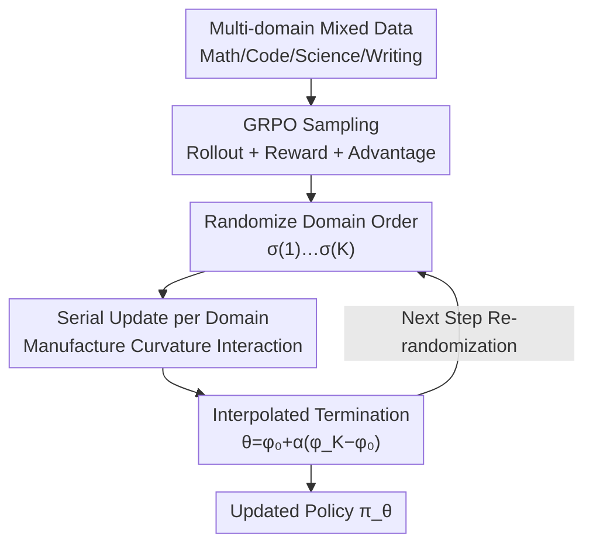

# Boosting Multi-Domain Reasoning of LLMs via Curvature-Guided Policy Optimization

**Conference**: ICLR2026  
**OpenReview**: [https://openreview.net/forum?id=R2EZtdHWJT](https://openreview.net/forum?id=R2EZtdHWJT)  
**Code**: https://github.com/MIRALab-USTC/CGPO  
**Area**: Reinforcement Learning / RLHF / LLM Reasoning  
**Keywords**: Multi-domain RL, Cross-domain conflict, Curvature guidance, Gradient alignment, GRPO  

## TL;DR
Addressing the cross-domain conflict in multi-domain RL training for LLMs (e.g., "improving math degrades writing"), CGPO draws on the idea of Newton's method using curvature to precondition gradients. Instead of explicitly computing the Hessian, CGPO splits a batch into domain-specific sub-batches and **performs serial updates in a random order**. Domains updated later naturally perceive the curvature perturbations left by earlier ones, which in expectation is equivalent to maximizing the inner product of gradients across domains—implicitly aligning cross-domain gradients. On Qwen2.5-3B/7B across four domains and seven benchmarks, the average score consistently outperforms joint training and gradient balancing baselines (7B: 59.59 vs. Joint 56.62) with almost zero additional overhead.

## Background & Motivation
**Background**: Using RL (PPO, GRPO) to enhance the reasoning capabilities of LLMs has become mainstream. Recent work has moved from single-domain (e.g., math or code only) to **multi-domain joint training**, mixing math, code, scientific QA, and creative writing in one dataset to train a versatile model.

**Limitations of Prior Work**: Multi-domain mixed training creates extremely complex and conflicting reward landscapes. Empirical studies frequently observe **cross-domain conflicts**: gains in one capability often come at the expense of another. Worse, the online sampling (rollout) in RL makes interactions between different domains unpredictable. Since rollouts are expensive, cross-domain gradient cancellation wastes significant compute resources.

**Key Challenge**: Cross-domain conflict essentially manifests as **gradient conflict**, but existing mitigation methods are ineffective in the "RL for LLM" scenario. One category is gradient balancing/projection (PCGrad, CAGrad, FAMO, etc.), which passively balances gradients after conflict occurs. These do not utilize the geometric structure of the reward landscape and can increase variance on noisy rollout gradients, harming stability. Furthermore, most require **storing gradients of all domains in VRAM simultaneously**, causing memory to explode with the number of domains—unscalable for LLMs. Another category is second-order methods (Newton's method, SOAP), which use curvature information to resolve conflicts (validated in PINNs) but are computationally infeasible for high-dimensional, rollout-intensive LLM settings due to Hessian computation/inversion.

**Goal**: Find a cross-domain conflict mitigation mechanism that is both **congruent with the nature of RL (noisy gradients, online sampling)** and **computationally efficient at scale** to enhance multi-domain reasoning in LLMs.

**Key Insight**: The authors re-examine the structure of Newton's update $H^{-1}g$. Using a heuristic expansion, $H^{-1}g \approx 2g - Hg + \dots$. In a multi-domain setting where $g=\sum_k g_k$ and $H=\sum_k H_k$, the term $-Hg$ contains **cross-domain terms** $-H_j g_i\ (i\neq j)$, where the curvature of domain $j$ modulates the gradient of domain $i$. This coupling—where one domain's curvature "stirs" another's gradient—allows second-order methods to coordinate conflicting gradients. The insight is: **Instead of computing the Hessian, we can "manufacture" this cross-domain curvature-gradient coupling.**

**Core Idea**: Use "serial updates in a random order" to implicitly create cross-domain curvature-gradient interactions ($H_j g_i$). Early domains modify parameters, and the gradient of later domains at the new parameter point naturally absorbs curvature information from the predecessors. After randomizing the domain sequence, all domain pairs are coupled in expectation, which is equivalent to pushing the gradients of different domains to align, guiding parameters toward cross-domain consistent regions.

## Method

### Overall Architecture
CGPO (Curvature-Guided Policy Optimization) uses GRPO as the base policy gradient algorithm. It addresses how to prevent domains from undermining each other during multi-domain RL. Within one update step: it samples rollouts and calculates rewards/advantages for all domains; then, instead of a "single aggregate step for all domains," it **iteratively updates through a random permutation of domains**. Each domain computes and applies its gradient at the parameter point resulting from all prior domain updates in that step. Finally, it performs an interpolation between the terminal parameters $\phi_K$ and the starting point $\phi_0$: $\theta_{\text{new}}=\phi_0+\alpha(\phi_K-\phi_0)$.

The key is that the total parameter change in this serial process can be decomposed into two parts: a standard **aggregated gradient** (individual domain learning) and **cross-domain curvature-gradient interaction terms** like $\sum H_{\sigma(k)}g_{\sigma(l)}$ (cross-domain coordination). The latter is precisely what standard first-order joint training lacks. This mechanism only requires partitioning a mini-batch and one vector interpolation, adding almost no compute.

### Key Designs

**1. Serial Domain Updates: Obtaining Curvature Interaction without Hessian**

This is the core of CGPO, directly addressing the need for $H_j g_i$ without the cost of Hessian calculation. The authors approximate the curvature-gradient product by **observing how one domain's gradient changes after another domain's update**. For domains $i$ and $j$, if domain $i$ updates parameters from $\theta^{(i)}_{\text{pre}}$ to $\theta^{(i)}_{\text{post}}$, the change in domain $j$'s gradient (via first-order Taylor expansion) is:

$$g_j\big(\theta^{(i)}_{\text{post}}\big)-g_j\big(\theta^{(i)}_{\text{pre}}\big)\approx H_j\big(\theta^{(i)}_{\text{pre}}\big)\big(\theta^{(i)}_{\text{post}}-\theta^{(i)}_{\text{pre}}\big)\approx \eta\,H_j\big(\theta^{(i)}_{\text{pre}}\big)\,g_i\big(\theta^{(i)}_{\text{pre}}\big),$$

which is exactly the desired $H_j g_i$. Thus, **curvature information is automatically injected by calculating gradients on updated parameters**, using only first-order gradients. CGPO splits one update into $K$ sequential steps: starting from $\phi_0=\theta_{\text{new}}$, the $k$-th domain updates from $\phi_{k-1}$ to $\phi_k$. Each gradient is scaled by its mini-batch proportion $\frac{|D_{\sigma(k)}|}{\sum_s|D_{\sigma(s)}|}$ to maintain the effective learning rate.

**2. Randomized Domain Order: Symmetrizing Coupling for Implicit Gradient Alignment**

If the domain order were fixed, serial updates would produce biased interactions where early domains dominate. The term $\sum_{l<k}H_{\sigma(k)}g_{\sigma(l)}$ only covers partial pairs. By **re-sampling a random permutation $\sigma$ each iteration**, every ordered pair $(i,j)$ has an equal probability. Taking the expectation symmetrizes their contributions:

$$H_i(\phi_0)g_j(\phi_0)+H_j(\phi_0)g_i(\phi_0)=\frac{\partial}{\partial\phi_0}\big(g_i(\phi_0)^\top g_j(\phi_0)\big),$$

meaning the update moves in a direction that **increases the inner product of gradients $g_i^\top g_j$**. This is the mathematical definition of gradient alignment (making gradients from different domains more similar to reduce cancellation).

**3. Interpolation Coefficient $\alpha$: Balancing Stability and Curvature Utilization**

The direction $\phi_K-\phi_0$ is a "geometry-aware update direction." However, taking the full step might move beyond the local smooth region, making the first-order approximation fail and destabilizing training. CGPO uses $\theta_{\text{new}}=\phi_0+\alpha(\phi_K-\phi_0)$, where $\alpha$ controls the step size. $\alpha=1.2$ was found to be optimal. Since $\alpha$ is close to 1.0, the **gains come from curvature-aware updates rather than simply increasing the learning rate.**

### Loss & Training
The base objective is the clipped surrogate with KL regularization from GRPO. The authors argue that **surrogate objectives are faithful gradient approximators** within the trust region. Four domain-specific rewards are used: rules for Math; SandboxFusion unit tests for Code; a 1.5B General-Verifier for Science; and Qwen2.5-72B-Instruct for Creative Writing. Reasoning processes must be enclosed in `<think></think>` tags. Hyperparameters: LR $1\times10^{-6}$, prompt batch 128, mini-batch 64, group size 8, $\alpha=1.2$.

## Key Experimental Results

### Main Results
Training on Qwen2.5-3B/7B-Instruct with ~20k multi-domain samples, evaluated across seven benchmarks (WritingBench scores ×10 for scale).

| Model | Method | MATH500 | AMC | HumanEval | MBPP | GPQA-d | SuperGPQA | WritingBench | AVG |
|------|------|---------|-----|-----------|------|--------|-----------|--------------|-----|
| 3B | Joint Learning | 64.50 | 39.38 | 72.39 | 59.40 | 24.87 | 24.12 | 58.61 | 49.04 |
| 3B | FAMO | 63.80 | 39.12 | 72.48 | 59.20 | 23.47 | 26.51 | 58.46 | 49.01 |
| 3B | **CGPO** | 64.20 | 39.71 | 74.29 | 60.80 | 24.37 | 26.63 | **63.04** | **50.42** |
| 7B | Joint Learning | 76.00 | 56.25 | 79.88 | 68.60 | 19.70 | 32.75 | 63.15 | 56.62 |
| 7B | FAMO | 75.65 | 55.63 | 82.54 | 68.80 | 23.07 | 31.49 | 63.62 | 57.26 |
| 7B | **CGPO** | 75.55 | **59.38** | **84.15** | **72.00** | **26.77** | 32.75 | **66.52** | **59.59** |

CGPO achieves the highest average scores for both model sizes. Gains are particularly significant in **Code Generation and Creative Writing**—domains with high conflict potential. The gain increases with model capacity (7B > 3B).

### Ablation Study

| Configuration | AVG (7B) | Description |
|------|----------|------|
| CGPO (Random) | **59.59** | Complete method |
| CGPOfix (Fixed) | 58.48 | No randomization; early domains dominate |
| α=0.9 | 58.15 | Under-utilization of curvature |
| α=1.2 | **59.59** | Optimal balance |
| α=1.5 | 58.04 | Step too large, local instability |

**Computational Overhead**: On the 7B model, CGPO takes 18.6h vs. 17.8h for Joint training. The 4% increase is negligible.

### Key Findings
- **Randomization is essential**: Fixed order introduces systematic bias. Randomization align gradients across all pairs (+1.1 points).
- **Gains are not from step size**: Since $\alpha \approx 1.0$, the improvement stems from the curvature-aware interaction, not just larger steps.
- **Geometric information is superior**: Baselines like FAMO or Omni-Thinker (using loss/gradient magnitude only) are weaker than CGPO, which leverages the reward landscape's geometry.

## Highlights & Insights
- **"Manufacturing interaction" vs. "Computing interaction"**: A clever strategy to obtain $H_j g_i$ for nearly free by sequentializing first-order updates.
- **Symmetry and Alignment**: The derivation linking random permutations to maximizing gradient inner products is elegant.
- **Practicality**: Given that rollouts are the bottleneck in RLHF, CGPO's overhead is minimal, making it highly deployable.
- **Generalization**: The paradigm of random serial updates + interpolation can likely extend beyond these four domains to any multi-task RL setting.

## Limitations & Future Work
- **Heuristic Theory**: Core derivations rely on informal first-order Taylor expansions; strict convergence guarantees are missing.
- **Initial Disparities**: Why certain domains accelerate more than others (e.g., writing vs. math) remains an open question.
- **Scalability**: Only tested on 3B/7B models with 4 domains. Behavior with more heterogeneous tasks or larger models (70B+) is to be explored.

## Related Work & Insights
- **vs. FAMO/PCGrad**: These methods are passive and memory-intensive (often OOM for LLMs). CGPO is active and memory-friendly.
- **vs. Newton/SOAP**: CGPO distills the "curvature guidance" core while avoiding $O(d^2)$ or $O(d^3)$ Hessian costs.
- **vs. Reptile/FedAvg**: While these also use serial updates, CGPO's motivation (capturing cross-domain curvature) and its combination with GRPO and randomization are uniquely tailored for multi-domain reasoning.

## Rating
- Novelty: ⭐⭐⭐⭐⭐ 
- Experimental Thoroughness: ⭐⭐⭐⭐ 
- Writing Quality: ⭐⭐⭐⭐⭐ 
- Value: ⭐⭐⭐⭐⭐ 

<!-- RELATED:START -->

## Related Papers

- [\[ICLR 2026\] Multi-Agent Guided Policy Optimization](multi-agent_guided_policy_optimization.md)
- [\[ACL 2026\] Visually-Guided Policy Optimization for Multimodal Reasoning](../../ACL2026/reinforcement_learning/visually-guided_policy_optimization_for_multimodal_reasoning.md)
- [\[ICLR 2026\] FAPO: Flawed-Aware Policy Optimization for Efficient and Reliable Reasoning](fapo_flawed-aware_policy_optimization_for_efficient_and_reliable_reasoning.md)
- [\[ICLR 2026\] Correlated Policy Optimization in Multi-Agent Subteams](correlated_policy_optimization_in_multi-agent_subteams.md)
- [\[ICLR 2026\] Revisiting Group Relative Policy Optimization: Insights into On-Policy and Off-Policy Training](revisiting_group_relative_policy_optimization_insights_into_on-policy_and_off-po.md)

<!-- RELATED:END -->
