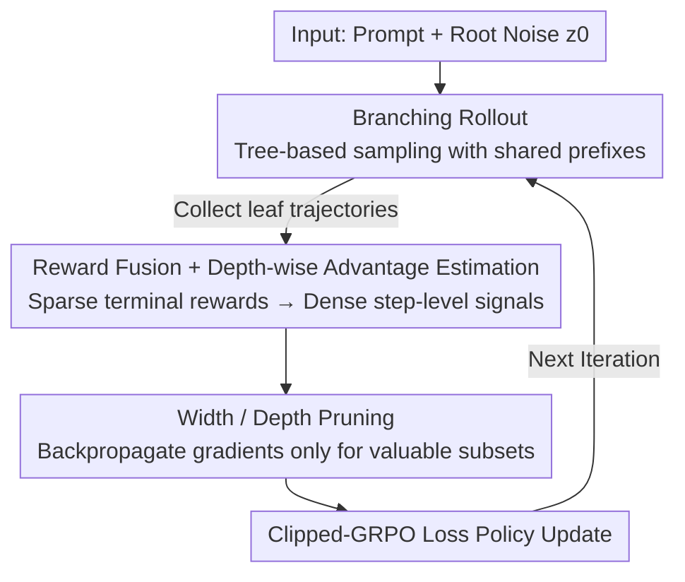

# BranchGRPO: Stable and Efficient GRPO with Structured Branching in Diffusion Models

**Conference**: ICLR2026  
**OpenReview**: [https://openreview.net/forum?id=T2nP2IQasd](https://openreview.net/forum?id=T2nP2IQasd)  
**Code**: Not public (the paper does not provide a link)  
**Area**: Alignment RLHF / Diffusion Models  
**Keywords**: GRPO, Diffusion Model Alignment, Tree-based rollout, Dense rewards, Credit assignment

## TL;DR
BranchGRPO transforms the "independent sequential sampling" of GRPO in diffusion/flow models into a structured branching tree with shared prefixes. This tree structure simultaneously addresses two issues: prefix reuse amortizes sampling costs, and leaf-reward backward fusion provides depth-normalized dense step-level advantages. Combined with width/depth pruning to backpropagate gradients only on valuable subsets, it achieves up to a 16% improvement in HPSv2.1 image alignment compared to DanceGRPO and reduces single-round training time by nearly 55%, with a hybrid variant reaching 4.7× acceleration.

## Background & Motivation

**Background**: Diffusion and Flow Matching models are the mainstream for image/video generation, but large-scale pre-training alone cannot guarantee alignment with human preferences (aesthetics, semantics, temporal consistency). Consequently, RLHF has been adapted for visual generation, with Group Relative Policy Optimization (GRPO) becoming a dominant solution for text-to-image/video due to its stability and scalability, exemplified by works like DanceGRPO and Flow-GRPO.

**Limitations of Prior Work**: Adapting GRPO to diffusion/flow models faces two structural bottlenecks. First is **inefficiency**: standard GRPO uses sequential rollouts where every trajectory in a group must be sampled independently from scratch under new/old policies, resulting in $O(N \cdot T)$ complexity ($T$ denoising steps, $N$ group size), leading to redundant calculations. Second is **sparse rewards**: existing methods distribute a single terminal reward **uniformly** across all denoising steps, ignoring the information carried by intermediate states, which leads to unreliable credit assignment and high gradient variance.

**Key Challenge**: The "decision criticality" of different time steps in the denoising process varies—early steps determine the global structure, while late steps focus on refinement. However, the uniform propagation of sparse terminal rewards treats all steps equally. This raises a fundamental question: **how can sparse outcome rewards be attributed to the specific denoising steps that truly shape the final quality?**

**Goal**: Without breaking the marginal sampling distribution or sacrificing exploration diversity, (1) amortize the sampling cost of rollouts, (2) transform sparse terminal rewards into dense step-level signals, and (3) further reduce backpropagation overhead.

**Key Insight**: The denoising process unfolds step-by-step and is naturally suited for a tree structure. By branching trajectories at specific "split steps," common prefixes can be reused. This tree structure also makes it intuitive that the "value of an internal node = the aggregation of its descendant leaf rewards," allowing terminal rewards to be propagated backward.

**Core Idea**: Replace sequential rollouts with a **structured branching tree**—shared prefixes amortize computation, leaf rewards are fused via path probabilities and normalized by depth to obtain dense advantages, and width/depth pruning removes low-value paths and redundant depths to improve both efficiency and stability.

## Method

### Overall Architecture

BranchGRPO is a **tree-structured policy optimization framework** for diffusion/flow models. For each prompt, it starts from a single root noise $z_0 \sim \mathcal{N}(0, I)$ and denoises step-by-step along a reverse SDE. At predefined **split steps**, the current state randomly expands into $K$ child nodes, generating multiple sub-trajectories that share early prefixes and branch out later, until reaching the maximum depth $T$ to collect all leaf rewards. After obtaining leaf rewards, they are **fused upward** into internal nodes and **depth-normalized** into dense step-level advantages. Finally, **width/depth pruning** is applied to backpropagate gradients only for a selected subset of nodes using a standard clipped-GRPO objective. The pipeline follows: "Sampling Tree → Reward Fusion → Advantage Normalization → Pruning → Update."

### Key Designs

**1. Branching Rollout: Replacing independent sampling with a shared-prefix tree**

This addresses the $O(N \cdot T)$ redundancy of sequential rollouts. In BranchGRPO, all trajectories in a tree share the same root noise and early denoising prefixes, branching only at designated split steps $B$, thus amortizing the computation of prefix segments. Branching is achieved by injecting stochastic perturbations in the SDE transition: at a split step $i \in B$ (step size $h_i = t_i - t_{i+1}$), instead of one successor, $K$ correlated child nodes are generated:

$$z_{i+1}^{(b)} = \mu_\theta(z_i, t_i) + g_{t_i}\sqrt{h_i}\,\xi_b, \quad \xi_b = \frac{\xi_0 + s\,\eta_b}{\sqrt{1+s^2}}, \quad b = 1,\dots,K$$

where $\xi_0$ is shared across branches and $\eta_b$ is branch-specific, both sampled i.i.d. from $\mathcal{N}(0,I)$. The hyperparameter $s \ge 0$ controls the correlation between child nodes; small $s$ means branches are highly correlated and stable, while large $s$ makes branches nearly independent for wider exploration. Crucially, by construction, each $\xi_b \sim \mathcal{N}(0,I)$, ensuring the **marginal distribution of each child node $z_{i+1}^{(b)}$ is identical to the original SDE step**, guaranteeing that prefix reuse does not distort the sampling distribution. The authors verified that branching does not hurt diversity: comparing 4096 samples from DanceGRPO and BranchGRPO, KID in Inception space is 0.0057 and in CLIP space is 0.00022, making the distributions nearly indistinguishable at a semantic level.

**2. Reward Fusion + Depth-wise Advantage Estimation: Converting sparse rewards to dense step signals**

This addresses the high variance and unreliable credit assignment caused by "uniform distribution of a single terminal reward." The tree structure allows the value of internal nodes to be expressed through the rewards of descendant leaves. Leaf signals are propagated backward in two steps. First is **reward fusion**, performing soft-weighted aggregation for an internal node $n$ (descendant leaf set $L(n)$):

$$\bar{r}(n) = \sum_{\ell \in L(n)} w_\ell^{(n)} r_\ell, \quad w_\ell^{(n)} = \frac{\exp(\beta s_\ell)}{\sum_{j \in L(n)} \exp(\beta s_j)}, \quad s_\ell = \log p_{\text{beh}}(\ell \mid n)$$

where $p_{\text{beh}}$ is the behavior policy and $\beta$ controls concentration: $\beta=0$ degrades to uniform averaging (robust to log-prob calibration errors and preserves low-probability leaves for exploration, but has high variance with many branches), while $\beta=1$ degrades to behavior policy weighting (stabler but may concentrate excessively on high-likelihood leaves). Second is **depth-wise normalization**: nodes at the same depth share the same noise level and are comparable, whereas reward magnitudes vary significantly across depths. Thus, rewards are standardized independently within each depth $d$:

$$A_d(n) = \frac{\bar{r}(n) - \mu_d}{\sigma_d + \epsilon}, \quad \mu_d = \text{mean}_{n \in N_d}\bar{r}(n), \quad \sigma_d = \text{std}_{n \in N_d}\bar{r}(n)$$

The advantage of each edge $A(e)$ is inherited from its child and can be clipped to $[-A_{\max}, A_{\max}]$. This prevents late denoising steps with lower variance from dominating the gradient, resulting in a "process-dense and balanced" credit signal.

**3. Width / Depth Pruning: Backpropagating gradients only on valuable node subsets**

This addresses the exponential growth of trajectories and the high cost of backpropagation as branches increase. A key constraint is that **pruning occurs only after reward fusion and normalization, affecting only the backward pass—sampling and reward evaluation are unaffected**. Thus, all trajectories contribute to reward signals, but gradients are computed only for the selected subset. **Width pruning** reduces the number of leaves: Parent-Top1 retains only the child with the higher reward at the last split step, roughly halving gradient computation while covering all parents. **Depth pruning** skips gradients for certain time steps: it utilizes a sliding window (initially at the last split point, size 4) that shifts toward later steps every 30 iterations until a stop depth. Depth pruning achieved the best performance in experiments, revealing high redundancy in late-stage denoising steps.

The final optimization uses a standard clipped-GRPO objective along the tree edges:

$$J(\theta) = \mathbb{E}\left[\frac{1}{|E|}\sum_{e \in E} \min\left(\rho_e(\theta)A(e),\, \text{clip}(\rho_e(\theta), 1-\epsilon, 1+\epsilon)A(e)\right)\right]$$

### Loss & Training

The training procedure (Algorithm 1) involves: every iteration, synchronizing the behavior policy $\pi_{\theta_{\text{old}}}$, sampling root noise, building a rollout tree (branching by $K$ at split steps), evaluating leaf rewards → reward fusion → depth-wise normalization → pruning → updating the policy via the clipped-GRPO loss. Implementation details: tree depth $d=20$, branching factor $K=2$ (16 leaves before pruning), default split steps $(0,3,6,9)$, correlation $s=4$. Training for 300 steps with 16×H200 GPUs. Additionally, a **hybrid ODE–SDE** variant (BranchGRPO-Mix) uses SDE for split steps and a sliding window while using ODE for others, reducing round time to 148s (compared to MixGRPO 289s, DanceGRPO 469s) while maintaining stability.

## Key Experimental Results

### Main Results

Efficiency and alignment quality comparison on HPDv2.1 using FLUX.1-Dev backbone:

| Method | Round Time (s)↓ | HPS-v2.1↑ | PickScore↑ | ImageReward↑ | Unified Reward↑ |
|------|------|------|------|------|------|
| FLUX (Unfinished) | - | 0.313 | 0.227 | 1.112 | 3.370 |
| DanceGRPO(tf=1.0) | 698 | 0.360 | 0.234 | 1.612 | 3.388 |
| MixGRPO (20,5) | 289 | 0.359 | 0.228 | 1.594 | 3.380 |
| BranchGRPO | 493 | 0.363 | 0.229 | 1.603 | 3.386 |
| BranchGRPO-DepPru | 314 | **0.369** | **0.235** | **1.625** | **3.404** |
| BranchGRPO-Mix | 148 | 0.363 | 0.230 | 1.598 | 3.384 |

The depth pruning variant achieved the best alignment across all metrics (HPS-v2.1 improved from 0.360 in DanceGRPO to 0.369) with a 55% reduction in time (314s vs 698s). The Mix variant accelerated training by 4.7× (148s) with minimal quality loss. On SD3.5-M, the method reduced GPU hours from 2000 to 1460 while improving HPS-v2.1/PickScore/ImageReward/GenEval, proving generalizability across backbones and GRPO pipelines.

### Ablation Study

| Config Dimension | Key Finding | Description |
|------|------|------|
| Branch Correlation $s$ | $s=4$ is optimal | $s=1,2$ lacks exploration/converges slowly; $s=8$ is unstable early on |
| Split Step Position | Early splitting is better | $(0,3,6,9)$ increases rewards faster than $(9,12,15,18)$ |
| Split Density | Denser is faster early | Dense splitting accelerates early training; sparse splitting converges eventually |
| Reward Fusion | Path-weighted ($\beta=1$) is steadier | Uniform ($\beta=0$) has high variance; weighting is consistently higher/more stable |
| Pruning Strategy | Depth pruning yields highest reward | Width pruning (Parent-Top1) is smoothest but slightly lower terminal reward |

### Key Findings
- **High redundancy in late denoising steps**: Skipping late-stage gradients via depth pruning actually yielded the highest final reward, confirming that late steps contribute less to credit assignment.
- **Superior Reward-KL efficiency**: BranchGRPO-DepthPruning's Reward-KL curve stays above the DanceGRPO frontier, yielding more reward per unit of KL divergence, reflecting more stable credit assignment.
- **Following the scaling law of branch expansion**: Increasing branch factor $K$ or split points consistently improves reward curves, while DanceGRPO scales poorly in terms of time.
- **Diversity remains unchanged**: Prompt-conditional LPIPS-MPD and TCE are nearly identical to the baseline, showing no diversity loss.

## Highlights & Insights
- **The "Tree" abstraction tackles two bottlenecks simultaneously**: shared prefixes naturally amortize sampling (solving inefficiency), and internal node value aggregation naturally supports dense credit signals (solving sparse rewards)—an elegant use of a single data structure for dual gains.
- **Marginal-preserving branching construction**: Using $\xi_b = (\xi_0 + s\eta_b)/\sqrt{1+s^2}$ ensures the marginal remains $\mathcal{N}(0,I)$, so the "prefix reuse" speedup is theoretically free of sampling distribution distortion.
- **Decoupling forward sampling from backward gradients**: Pruning only affects the backward pass while retaining full exploration in reward evaluation. This "compute-exploration" decoupling can be applied to any tree-based RL training.
- **Depth-wise normalization**: It addresses the fact that reward magnitudes are not directly comparable across noise levels. Standardizing within each depth prevents low-variance late steps from dominating the gradient—a useful insight for any process-reward scenario.

## Limitations & Future Work
- Code is not public, and the hardware requirements (16×H200) present a barrier for replication on smaller resources.
- Multiple hyperparameters (correlation $s$, split position, fusion $\beta$, pruning window) require task-specific tuning without an adaptive scheme currently.
- Video generation (WanX) evaluation is primarily qualitative; missing quantitative tables comparable to the image side makes cross-modal generalization less convincing.
- Reward fusion extremes (uniform vs path-weighted) each have variance/concentration trade-offs; an adaptive $\beta$ strategy deserves further study.

## Related Work & Insights
- **vs DanceGRPO / Flow-GRPO**: These works first adapted GRPO to visual generation but used sequential rollouts and uniform credit assignment. BranchGRPO improves efficiency via prefix reuse and stability via dense depth-normalized advantages.
- **vs TempFlow-GRPO**: Also identifies the sparse reward issue but uses "time-aware weighting." BranchGRPO uses tree fusion which inherently generates dense signals through structure.
- **vs MixGRPO**: While MixGRPO uses ODE-SDE sliding windows for efficiency, BranchGRPO-Mix absorbs this idea and combines it with branching/pruning for even faster speed (148s vs 289s).
- **vs TreePO (LLM)**: Both use tree-based rollouts, but BranchGRPO is specifically adapted for diffusion dynamics (split steps, SDE perturbation, depth normalization).

## Rating
- Novelty: ⭐⭐⭐⭐ Uses a single branching tree to solve both the inefficiency and sparse reward bottlenecks of diffusion GRPO.
- Experimental Thoroughness: ⭐⭐⭐⭐ Two backbones, multiple baselines, efficiency-quality dual dimension, and rich ablations; video quantitative data is slightly thin.
- Writing Quality: ⭐⭐⭐⭐ Clear motivation-method-experiment logic; formulas and figures are well-integrated.
- Value: ⭐⭐⭐⭐ Accelerates diffusion alignment by 2–4.7× without distorting the distribution while improving quality; highly practical for industrial RLHF fine-tuning.

<!-- RELATED:START -->

## Related Papers

- [\[ICLR 2026\] Balancing the Experts: Unlocking LoRA-MoE for GRPO via Mechanism-Aware Rewards](balancing_the_experts_unlocking_lora-moe_for_grpo_via_mechanism-aware_rewards.md)
- [\[ICLR 2026\] Composition of Memory Experts for Diffusion World Models](composition_of_memory_experts_for_diffusion_world_models.md)
- [\[ICLR 2026\] SPG: Sandwiched Policy Gradient for Masked Diffusion Language Models](spg_sandwiched_policy_gradient_for_masked_diffusion_language_models.md)
- [\[ICML 2026\] Learning Unmasking Policies for Diffusion Language Models](../../ICML2026/reinforcement_learning/learning_unmasking_policies_for_diffusion_language_models.md)
- [\[NeurIPS 2025\] Reinforcing the Diffusion Chain of Lateral Thought with Diffusion Language Models](../../NeurIPS2025/reinforcement_learning/reinforcing_the_diffusion_chain_of_lateral_thought_with_diffusion_language_model.md)

<!-- RELATED:END -->
