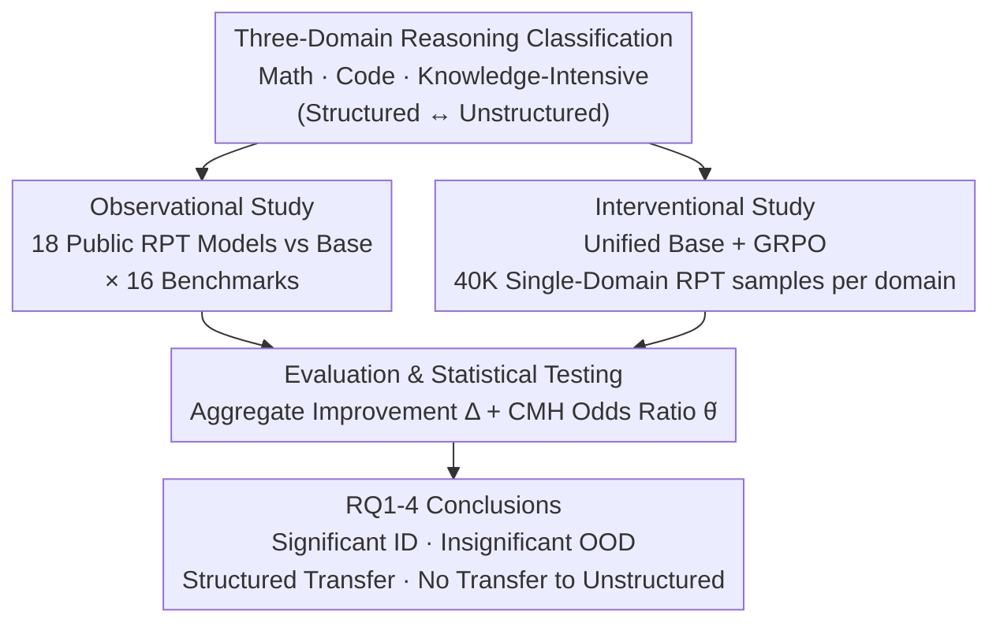

# Breaking Barriers: Do Reinforcement Post Training Gains Transfer To Unseen Domains?

**Conference**: ICLR 2026  
**arXiv**: [2506.19733](https://arxiv.org/abs/2506.19733)  
**Code**: TBD  
**Area**: Reinforcement Learning  
**Keywords**: Reinforcement Post Training (RPT), RLVR, Cross-Domain Generalization, Structured Reasoning, Unstructured Reasoning, LLM

## TL;DR
Through observational studies (18 open-source RPT models) and interventional studies (single-domain GRPO training), this work systematically reveals the generalization limitations of Reinforcement Post Training (RPT/RLVR). While RPT significantly improves performance within the training domain, cross-domain generalization is inconsistent: gains transfer between structured domains (Math ↔ Code) but fail to generalize to unstructured domains (Law/Finance/Medical). This finding remains consistent across different algorithms, model scales, and training steps.

## Background & Motivation

**Background**: RPT (especially RLVR) has recently achieved remarkable progress in mathematical and code reasoning. Gemini 3 Pro reached 100% on AIME 2025, Claude Opus 4.5 reached 81% on SWE-bench, and GPT-5.2-Pro reached 93.2% on GPQA Diamond. These models are typically post-trained on a mix of multi-domain data.

**Core Problem**: Does the reasoning capability improvement brought by RPT possess broad domain generalization like pre-training? Existing works almost exclusively evaluate RPT models within the training domain, lacking systematic cross-domain analysis.

**Key Challenge**: (1) Existing RPT models use different algorithms, hyperparameters, and multi-domain data, making it difficult to isolate the effects of RPT itself; (2) Evaluation needs to cover both structured (Math, Code) and unstructured (Law, Finance, Medical) reasoning tasks.

**Key Insight**: A two-stage research paradigm of "observational + interventional" is adopted—broadly evaluating existing models to discover trends first, and then validating causal relationships through controlled experiments.

## Method

### Overall Architecture

This is an empirical study aimed at answering whether "reasoning gains from RPT transfer beyond the training domain." This is decomposed into four progressive research questions: cross-domain transfer of gains (RQ1), the impact of reasoning structural similarity on generalization (RQ2), intra-domain generalization between sub-tasks (RQ3), and the stability of these patterns across algorithms/scales/steps (RQ4). To observe universal trends while isolating causality, a two-stage design is employed: an observational study performing a large-scale horizontal comparison of 18 public RPT models, followed by an interventional study using a unified base model and algorithm for single-domain RPT. Evidence is synthesized using evaluation metrics backed by statistical tests.

### Key Designs

**1. Three-Domain Classification (Structured vs. Unstructured): An Operational Coordinate System for "Cross-Domain"**
The authors categorize reasoning tasks into three domains: **Math** (GSM8K, MATH-500, AIME 2024, AMC 2023), **Code** (MBPP, HumanEval, BigCodeBench, LiveCodeBench, USACO, Codeforces, Polyglot), and **Knowledge-Intensive Reasoning** (PubMedQA, MedQA, TabFact, LegalBench, FinBench). A critical dimension is identified: Math and Code are **structured reasoning**, following deterministic logical steps and precise syntax, while Law/Finance/Medical are **unstructured reasoning**, requiring context sensitivity and reliance on world knowledge to handle ambiguity.

**2. Observational Study: Identifying Phenomena Across 18 Public Models**
RPT models were systematically filtered from 466 candidates down to 18 based on data availability, parameter scale (1.5B–14B), and the requirement that the base was not purely a pre-trained model (ensuring RPT is the primary variable). Each model was compared against its base on 16 benchmarks. This stage provides broad evidence across various algorithms and scales.

**3. Interventional Study: Controlled Training to Isolate RPT Causality**
To eliminate interference from different algorithms or data, variables were fixed: the base model is DeepSeek-R1-Distill-Qwen-1.5B, the algorithm is GRPO (Group Relative Policy Optimization) with identical hyperparameters. The only difference is the training data (40K samples each for Math, Code, and Knowledge-Intensive domains). Any OOD performance difference can thus be attributed to the RPT data domain. Replication using DAPO, 2 epochs, and Llama-3.2-3B-Instruct was also performed.

**4. Evaluation Metrics & Statistical Testing: Beyond Point Estimates**
Generalization is quantified using **Aggregate Accuracy Improvement** $\Delta_{i,j}^{(\mathcal{D})}$, representing the weighted average pass@1 improvement of an RPT model relative to its base. To account for noise, the **Cochran-Mantel-Haenszel (CMH) test** is used to calculate a common odds ratio $\hat{\theta}$ across benchmarks with significance marked at $p<0.05$. An $\hat{\theta}$ close to 1 indicates no real advantage from RPT.

## Key Experimental Results

### RQ1: RPT cannot generalize to arbitrary unseen domains

| Metric | In-Domain (ID) Avg | Out-of-Domain (OOD) Avg |
|------|--------------|----------------|
| $\Delta$ (pass@1 %) | +2.87 | **-3.19** |
| Odds ratio $\hat{\theta}$ | 3.10 | 1.32 |

- Typical Case: DeepScaleR-1.5B gained +5.1% in Math but only +1.7% in other domains (a 3x drop).
- Extreme Case: AZR-Coder-7B gained +30.12% in Code but dropped **-23.31%** OOD.
- Interventional experiments showed no statistically significant OOD gains regardless of the RPT domain.

### RQ2: Transfer occurs between structured domains, but not across types

| Training Domain → Test Domain | Math | Code | Knowledge-Intensive |
|---------------|------|------|-----------|
| **Math RPT** | +2.18% | +4.77% | -0.27% |
| **Code RPT** | +15.44% | +9.49% | -0.27% |
| **Knowledge RPT** | +21.40%* | +12.16%* | Decrease |

- Bidirectional transfer exists between Math and Code; Math → Code transfer is stronger (Math is a more fundamental structured reasoning).
- Structured → Knowledge-Intensive: No significant improvement, or even a decrease.
- **Counter-intuitive finding**: Knowledge-Intensive → Structured RPT actually shows significant positive transfer, suggesting unstructured reasoning may be a "superset" of structured reasoning.

### RQ3: Intra-domain generalization depends on structural similarity

- Generalization within structured domains is good (consistent gains across sub-tasks).
- Generalization within unstructured domains is poor: Fino1-8B (Finance RPT) showed PubMedQA -2%, LegalBench -1.6%, and TabFact **-15.8%**.
- Knowledge-RPT also showed an overall decline in the knowledge domain in interventional experiments, indicating a lack of shared logical templates in unstructured tasks.

### RQ4: Generalization constraints remain consistent across configurations

| Base + Algorithm | $\Delta^{(ID)}$ | $\Delta^{(OOD)}$ | Gap |
|------------|-----------------|-------------------|-----|
| DS-Qwen-1.5B + GRPO | +3.13 | **-1.81** | 4.94 |
| Llama-3.2-3B + GRPO | +6.47 | +1.41 | 5.06 |
| DS-Qwen-1.5B + DAPO | +3.96 | **-1.27** | 5.23 |

- Different RL algorithms (GRPO vs. DAPO), different base models, and increased training steps all exhibit the same pattern.
- The ID-OOD gap widens with training steps before eventually stabilizing.
- Larger model parameters cause ID gains to grow 16.5% more than OOD gains, exacerbating overfitting.

## Highlights & Insights

- **"Observational + Interventional" Paradigm**: Rigorous research design combining broad trends from 18 models with causal validation from controlled experiments.
- **Counter-intuitive Unstructured-to-Structured Transfer**: Knowledge RPT models show statistically significant gains in Math, suggesting high-level knowledge reasoning may encompass elements of structured reasoning.
- **Hierarchy of Structured Reasoning**: Math → Code transfer is stronger than Code → Math, reflecting that mathematical reasoning is a more foundational capability.
- **OOD Damage from Minimal Data**: AZR-Coder caused -23% OOD drop despite minimal training data, suggesting RPT itself (rather than simple overfitting) causes generalization failure.
- **Application of CMH Statistical Test**: Use of a standardized hypothesis testing framework rather than point estimates increases the credibility of the conclusions.

## Limitations & Future Work

- Interventional experiments only utilized 1.5B models; single-domain RPT experiments for larger models (7B+) are missing.
- Knowledge-intensive training data was filtered by o3-mini; filtering quality may impact conclusions.
- The study focuses on pure RLVR and does not explore the generalization of joint SFT + RPT training.
- The number of unstructured domain benchmarks is limited (5), and whether some (e.g., TabFact) truly represent "unstructured reasoning" is debatable.
- Lack of mechanistic explanation; model internal representations (e.g., via probing) were not analyzed.
- Findings are based on open-source models; closed-source RPT models (like o1 or full DeepSeek-R1) might behave differently.

## Related Work & Insights

- **vs. DeepSeek-R1/o1 Series**: While these models show comprehensive improvements by using multi-domain data, they cannot distinguish true generalization from ID/OOD mixing. This paper isolates generalization limits via single-domain experiments.
- **vs. RPT Limitation Studies (Yue et al., Ma et al.)**: While previous work questioned RPT's reasoning quality or efficiency, this is the first to systematically investigate the data domain generalization of RPT.
- **vs. Pre-training Generalization**: Pre-training achieves broad generalization through massive diverse data; RPT generalization is much weaker, indicating "reasoning learning" in post-training is essentially domain-specific pattern reinforcement.
- **Practical Implications**: RPT should utilize data tailored to the target domain; it is unrealistic to expect Law/Medical reasoning improvements solely through Math/Code RPT.

## Rating
- Novelty: ⭐⭐⭐⭐ First systematic study of RPT cross-domain generalization with rigorous design.
- Experimental Thoroughness: ⭐⭐⭐⭐⭐ 18 models × 16 benchmarks, multi-stage validation, and ablations across algorithms/models/steps.
- Writing Quality: ⭐⭐⭐⭐ Clear structure, RQ-driven, and rigorous statistical testing.
- Value: ⭐⭐⭐⭐⭐ Significant warning for the RPT community, revealing a widely overlooked generalization bottleneck.

<!-- RELATED:START -->

## Related Papers

- [\[ICLR 2026\] Prompt Curriculum Learning for Efficient LLM Post-Training](prompt_curriculum_learning_for_efficient_llm_post-training.md)
- [\[ICLR 2026\] Masked Skill Token Training for Hierarchical Off-Dynamics Transfer](masked_skill_token_training_for_hierarchical_off-dynamics_transfer.md)
- [\[ICLR 2026\] Rubrics as Rewards: Reinforcement Learning Beyond Verifiable Domains](rubrics_as_rewards_reinforcement_learning_beyond_verifiable_domains.md)
- [\[ICLR 2026\] Representation-Based Exploration for Language Models: From Test-Time to Post-Training](representation-based_exploration_for_language_models_from_test-time_to_post-trai.md)
- [\[ICLR 2026\] Post-training Large Language Models for Diverse High-Quality Responses](post-training_large_language_models_for_diverse_high-quality_responses.md)

<!-- RELATED:END -->
