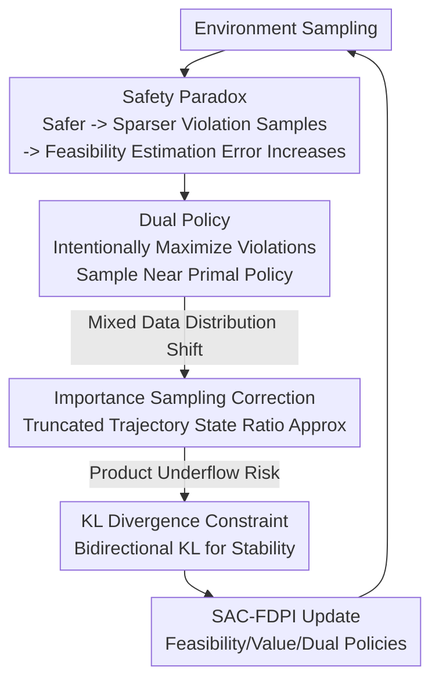

# Breaking Safety Paradox with Feasible Dual Policy Iteration

**Conference**: ICLR2026  
**OpenReview**: [https://openreview.net/forum?id=BHSSV1nHvU](https://openreview.net/forum?id=BHSSV1nHvU)  
**Code**: To be confirmed  
**Area**: Safe Reinforcement Learning  
**Keywords**: Safe RL, Feasibility Function, Safety Paradox, Dual Policy, Importance Sampling

## TL;DR
This paper identifies a counter-intuitive "Safety Paradox" in Safe RL: as a policy becomes safer, constraint-violating samples become sparser, causing the estimation of the feasibility function to deteriorate and ultimately undermining safety. The authors propose FDPI, which employs a dedicated "dual policy" to intentionally collect violation samples. Combined with importance sampling and KL constraints, FDPI achieves the lowest violations and near-highest returns on Safety-Gymnasium.

## Background & Motivation
**Background**: Safe Reinforcement Learning (Safe RL) requires not only reward maximization but also strict adherence to constraints $h(x) \le 0$ at every step, with the ideal goal being "zero violations." The core of such methods is a **feasibility function**, used to judge whether a state can remain safe over an infinite horizon—it defines the feasible region of the policy and serves as a "safety-oriented learning objective." Common feasibility functions include the cost value function (CVF), Hamilton-Jacobi reachability functions, and the Constraint Decay Function (CDF) used in this paper. These functions are learned via fixed-point iterations based on Bellman-like "risk self-consistency conditions," estimated from sampled data.

**Limitations of Prior Work**: Feasibility functions are estimated from sampled data and fundamentally rely on **violation samples** (constraint-violating samples) for accurate learning—only by observing "line-crossing" transitions can the agent know which states are dangerous and to what extent. However, the goal of Safe RL is to train policies to be increasingly safe, leading to increasingly sparse violation samples.

**Key Challenge**: The authors term this contradiction the **Safety Paradox**: Safer policy → Sparser violation samples → Larger feasibility function estimation error → Inaccurate feasibility region identification and biased learning objectives → Degraded safety. This fundamentally differs from the sparse reward problem in standard RL. In standard RL, higher rewards directly promote further reward improvement (positive feedback), whereas the safety paradox is a **self-defeating negative feedback loop**—the safer the agent becomes, the harder it is to remain safe.

**Goal**: Existing methods for handling sample sparsity fall into two categories, neither of which solves this paradox. Passive methods (e.g., PER) weight existing key samples in the buffer but fail when key samples are non-existent. Active methods (e.g., curiosity-driven exploration) modify the environment or behavior to create key samples, but this often deviates from the optimal policy and requires intrusive task modifications.

**Core Idea**: Train a **dedicated dual policy that maximizes violations** to increase the proportion of violation samples without increasing the total sample budget. This reduces the feasibility function estimation error, pushing policy safety to higher levels—while using importance sampling to correct distribution shifts and KL constraints to ensure numerical stability.

## Method

### Overall Architecture
FDPI (Feasible Dual Policy Iteration) starts from the premise that the only way to break the safety paradox is to **increase violation samples**. It follows the Feasible Policy Iteration (FPI) framework by Yang et al., integrated with the Maximum Entropy RL of SAC, resulting in SAC-FDPI. The system maintains two policies: the **primal policy** ($\pi_p$) pursues "high return + safety," while the **dual policy** ($\pi_d$) is deliberately trained to "intentionally violate constraints while staying close to the primal policy." Both policies sample from the environment and are mixed into a single buffer. The primal policy ensures overall safety, while the dual policy injects a controlled stream of violation transitions, ensuring the feasibility function always has enough violation data to learn from.

The mixed data introduces **distribution shift**: the expectations in the loss functions should be calculated over the state-action distribution of the primal policy, but the buffer contains dual policy samples. FDPI uses **Importance Sampling (IS)** to correct this and utilizes **truncated trajectories** to approximate the difficult-to-calculate marginal state distribution ratios. Finally, a **KL divergence constraint** between the two policies prevents IS product underflow. The framework updates two action-feasibility networks, one action-value network, and two policy networks.

### Key Designs

**1. Safety Paradox: Theoretical Proof that "Safer means Worse Estimation"**

This is the soul of the paper and the motivation for the method. The authors use the Constraint Decay Function (CDF) as a concrete example of a feasibility function: $F^\pi(x)=\mathbb{E}_{\tau\sim\pi}[\gamma^{N(\tau)}\mid x_0=x]$, where $N(\tau)$ is the first time step of violation in trajectory $\tau$. The CDF is learned via the risk self-consistency condition $F^\pi(x)=\mathbb{E}[c(x)+(1-c(x))\gamma F^\pi(x')]$ through fixed-point iteration ($c(x)=\mathbb{I}[h(x)>0]$ is the violation indicator). For analysis, the authors use the Monte Carlo estimator $\hat F^\pi(x)=\frac1K\sum_i\gamma^{N(\tau_i)}$.

Theorem 1 provides an upper bound on the relative estimation error, which depends on two quantities: the expectation $\mu^\pi_N$ and variance $\sigma^{2,\pi}_N$ of the steps to the first violation. The error bound is proportional to $\big(|\ln\gamma|\sigma^\pi_N+(\ln\gamma)^2\sigma^{2,\pi}_N\big)/\gamma^{\mu^\pi_N}$. Intuitively, as a policy becomes safer, $\mu^\pi_N$ increases (violations happen later), causing the denominator $\gamma^{\mu^\pi_N}$ to decrease and the error bound to grow. Theorem 2 further proves under mild assumptions (introducing a "distance to violation" function $D$) that **safer policies have larger variance in the number of steps to violation for infeasible states far from the boundary**. Together, these theorems conclude that the estimation error bound for CDF increases as the policy becomes safer. This formalizes a vague engineering phenomenon into a fundamental theoretical obstacle.

**2. Dual Policy: Using a "Villain" to Generate Violation Samples**

Since the only way out is to increase violation samples, FDPI trains an additional dual policy $\pi_d$ to intentionally violate constraints. A dual feasibility function $G_d(x,u)=\mathbb{E}_{\tau\sim\pi_d}[\gamma^{N(\tau)}\mid x_0=x,u_0=u]$ is introduced, and the dual policy objective is to **maximize** it: $\max_{\pi_d}\mathbb{E}_{x,u\sim\pi_d}[G_d(x,u)]$. Both primal and dual policies participate in sampling, controlled by a **dual threshold** $d$ (fixed at 0.95 in experiments). When the moving average of feasible states exceeds $d$, the dual policy is activated to collect half of the samples. Crucially, the **total sample budget remains unchanged**—the dual policy reallocates sampling quota rather than adding extra samples.

**3. Importance Sampling Correction: Approximating State Ratios with Truncated Trajectories**

Feeding dual policy data directly into the primal policy loss introduces distribution shift. For the primal feasibility loss, the state $x$ and action $u$ partially come from the dual policy. The action IS ratio is easy to compute, but the state IS ratio $r_{pd}(x)=p^{\pi_p}(x)/p^{\pi_d}(x)$ involves marginal state distributions and is **intractable**. FDPI approximates this ratio using a trajectory $\tau$ containing $x$, **truncated to the time step** $t(x)$ where $x$ occurs: $\hat r_{pd}(x)=\prod_{s=0}^{t(x)}\frac{\pi_p(u_s|x_s)}{\pi_d(u_s|x_s)}$. The justification is that actions after $x$ do not affect the probability of reaching $x$, and removing them reduces IS variance. This converts an uncomputable marginal ratio into a computable product along a single trajectory.

**4. KL Divergence Constraint: Preventing IS Collapse**

The IS ratio is a product of probability ratios. Since the probability of an action under the "other policy" is often lower than under the behavioral policy, the product can easily underflow to zero. The authors find that **constraining the KL divergence between policies** mitigates this: since $\mathbb{E}_{u\sim\pi_d}[\log\frac{\pi_p(u|x)}{\pi_d(u|x)}]\ge-\delta$, the expectation of each log-term is bounded, preventing the product from shrinking indefinitely. This KL constraint also ensures the dual policy "violates constraints without straying too far," staying close to the primal policy so that the generated violation samples are relevant to the state distribution the primal policy faces.

### Loss & Training
SAC-FDPI learns five networks: two action-feasibility networks $G_{p,\phi_p}, G_{d,\phi_d}$, one action-value network $Q_\omega$, and two policy networks $\pi_{p,\theta_p}, \pi_{d,\theta_d}$. The feasibility and value network losses include the IS weight $\hat r$. The primal policy loss maximizes value within the feasible region ($G_{p} \le \epsilon$) and minimizes feasibility outside it: $L_{\pi_p}=\mathbb{E}[\hat r_p(x)(\mathbb{I}_f(\alpha\log\pi_p-Q_\omega)+(1-\mathbb{I}_f)G_{p})]$. A relaxation threshold $\epsilon=0.1$ is used for feasibility determination.

## Key Experimental Results

### Main Results
Covering 14 environments in Safety-Gymnasium (Point/Car robots × Nav tasks, plus 6 MuJoCo velocity-constrained tasks).

| Dimension | SAC-FDPI (Ours) | Main Baselines |
|----------|------------------|----------|
| Normalized Cost | **Lowest overall** | CPO / RCPO / FOCOPS / CUP / SAC-Lag are all higher |
| Normalized Return | Near-highest (on par with SAC-FPI) | Most baselines are lower |
| Late-stage Violations | Nearly zero, no spikes | SAC-FPI still has persistent spikes |

Baselines include iterative unconstrained RL (RCPO, PPO-Lag, SAC-Lag), constrained policy optimization (CPO, FOCOPS, CUP), and SOTA unconstrained RL + penalty (DSAC-T-Pen).

### Ablation Study
The core ablation is SAC-FPI (without dual policy) vs. SAC-FDPI:

| Configuration | Violation Sample Ratio | Feasibility Estimation Error | Late-stage Violations |
|------|--------------|----------------|--------------|
| SAC-FDPI (Full) | ~10x higher in most envs | Sharp, symmetric distribution near 0 | Near-zero, stable |
| SAC-FPI (No Dual) | <1% in nearly all envs | Flat, dispersed distribution | Persistent cost spikes |

### Key Findings
- **Dual policy effectively injects violation samples**: SAC-FDPI maintains a violation sample ratio significantly higher than SAC-FPI, explaining why the latter suffers from cost spikes as violation data disappears.
- **More violation samples → More accurate feasibility estimation**: Contrasting the violation ratio with estimation error distributions shows that 10x more violation samples lead to significantly lower estimation error, empirically supporting Theorems 1 and 2.
- **Exploration Visualization**: The primal policy conservatively avoids dangerous areas, while the dual policy intentionally crosses them while staying close to the primal's distribution—this mixture keeps the feasibility function accurate.
- **Training Context**: The authors emphasize the method is for **simulators**, where dual policy violations do not cause real-world damage.

## Highlights & Insights
- **Theoretic Formulation of a Fundamental Obstacle**: The "Safety Paradox" is a profound observation. Theorems 1 and 2 link the error bound to the mean and variance of "steps to violation," which is much deeper than simply saying "there are few samples."
- **"Anti-hero" Dual Policy**: Using an intentionally violating policy to "feed" the feasibility function without changing the environment or reward shaping is elegant. It maintains task integrity better than curiosity-based methods.
- **Truncated Trajectory IS**: Approximating intractable marginal state distribution ratios using truncated trajectory products is a clever, transferable trick for off-policy correction.
- **Multi-purpose KL Constraint**: It serves both numerical stability (preventing IS collapse) and semantic relevance (keeping dual samples useful for the primal policy).

## Limitations & Future Work
- **Simulator Dependency**: The dual policy's active violation strategy cannot be directly applied to online training in the real world where violations cause actual damage.
- **MC-Based Theory**: Theoretical derivations are primarily based on Monte Carlo estimation. While arguments for TD estimation are provided, they are slightly less rigorous than the main conclusions.
- **Reliance on Assumptions**: Theorem 2 relies on the existence of distance function $D$ and specific continuity assumptions which may need verification in non-continuous systems.
- **Hyperparameter Sensitivity**: Thresholds like $d=0.95$ and $\epsilon=0.1$ are fixed across environments; further sensitivity analysis could be beneficial.

## Related Work & Insights
- **vs. Passive Sample Augmentation (PER)**: PER only weights existing samples; it cannot create samples when they are naturally missing as training progresses.
- **vs. Active Exploration (Curiosity/Adversarial)**: Typical active methods change the environment or objective, whereas FDPI keeps the task intact and corrects distribution shifts via IS.
- **vs. FPI**: FPI is the foundation, but without the dual policy, violation samples vanish, leading to feasibility estimation degradation and cost spikes. FDPI resolves this with the dual policy + IS + KL trio.
- **vs. Constrained Optimization (CPO/CUP)**: These methods focus on the optimization form, but they still rely on sampled data for cost/feasibility estimation, meaning they are equally vulnerable to the safety paradox.

## Rating
- Novelty: ⭐⭐⭐⭐⭐ 
- Experimental Thoroughness: ⭐⭐⭐⭐ 
- Writing Quality: ⭐⭐⭐⭐⭐ 
- Value: ⭐⭐⭐⭐ 

<!-- RELATED:START -->

## Related Papers

- [\[ACL 2026\] Breaking the Impasse: Dual-Scale Evolutionary Policy Training for Social Language Agents](../../ACL2026/reinforcement_learning/breaking_the_impasse_dual-scale_evolutionary_policy_training_for_social_language.md)
- [\[ICLR 2026\] DOPPLER: Dual-Policy Learning for Device Assignment in Asynchronous Dataflow Graphs](doppler_dual-policy_learning_for_device_assignment_in_asynchronous_dataflow_grap.md)
- [\[ICLR 2026\] Primal-Dual Policy Optimization for Linear CMDPs with Adversarial Losses](primal-dual_policy_optimization_for_linear_cmdps_with_adversarial_losses.md)
- [\[ICLR 2026\] Breaking Barriers: Do Reinforcement Post Training Gains Transfer To Unseen Domains?](breaking_barriers_do_reinforcement_post_training_gains_transfer_to_unseen_domain.md)
- [\[ICLR 2026\] Frozen Policy Iteration: Computationally Efficient RL under Linear $Q^{\pi}$ Realizability for Deterministic Dynamics](frozen_policy_iteration_computationally_efficient_rl_under_linear_qpi_realizabil.md)

<!-- RELATED:END -->
