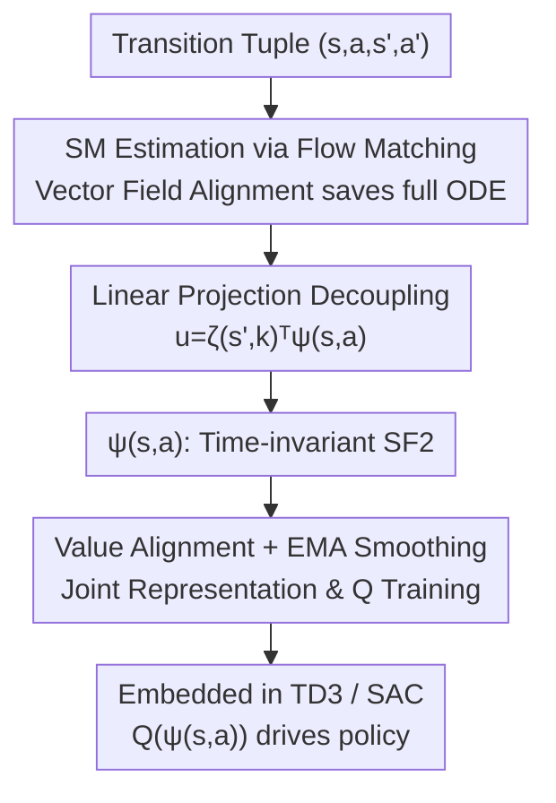

# Bridging Successor Measure and Online Policy Learning with Flow Matching-Based Representations

**Conference**: ICLR 2026  
**OpenReview**: [https://openreview.net/forum?id=jA3KmR18S7](https://openreview.net/forum?id=jA3KmR18S7)  
**Code**: https://github.com/Shiien/successor-flow-representation-implementation  
**Area**: Reinforcement Learning / Representation Learning  
**Keywords**: Successor Measure, Flow Matching, Successor Features, Online RL, Representation Learning

## TL;DR
This paper proposes Successor Flow Features (SF2), which approximates the Successor Measure (SM) using flow matching generative models. By forcing the vector field to decompose into a linear structure of "time-invariant state-action embedding $\psi(s,a)$ + time-varying projection $\zeta(s',k)$," the authors bridge SM estimation with online policy optimization. When integrated into TD3/SAC across seven DeepMind Control continuous control tasks, SF2 demonstrates superior sample efficiency and training stability compared to strong successor feature baselines.

## Background & Motivation
**Background**: The success of online deep reinforcement learning relies heavily on learning state representations that generalize across observations, provide accurate value estimates, and support long-range planning. Successor Representation (SR) is an attractive approach as it decouples the reward function from environment dynamics, characterizing the discounted future state occupancy distribution under a given policy. This serves both as a linear basis for value functions and a compact representation of dynamics. Continuous versions of SR—Successor Features (SF) and the more general Successor Measure (SM)—have recently been estimated using generative models. Notably, TDFlow uses Flow Matching (FM) to directly model SM, as FM is simulation-free and mitigates cumulative errors in long-range prediction, making it suitable for continuous high-dimensional states.

**Limitations of Prior Work**: Although SM possesses strong predictive capabilities, it is defined in an inherently infinite-dimensional distribution space and **lacks compact representations tailored for online RL**. The SF line of research is hindered by the open problem of designing feature mappings. Furthermore, using SM directly as a generative model requires multiple network forward passes and full ODE integration for each sample, incurring high computational costs that prevent direct integration with off-policy algorithms and joint value function training.

**Key Challenge**: Online RL requires both the "robust long-term prediction capability" of SM and representations that can "adapt quickly to new experience and be jointly optimized with value functions." Existing SM generative models only satisfy the former, outputting samplers rather than reusable low-dimensional features.

**Goal**: Design a framework that unifies (1) long-range prediction of SM, (2) stable and efficient training of Flow Matching, and (3) the fast adaptability required by online RL, resulting in compact state-action features that can be directly plugged into TD3/SAC.

**Key Insight**: The authors observe that if the Flow Matching vector field $u_\theta(s',k,s,a)$ is explicitly decomposed into a **linear inner product** of a "time-invariant term $\psi(s,a)$" and a "time-varying projection matrix field $\zeta(s',k)$," then the time-invariant term $\psi(s,a)$ becomes the desired compact representation. Since it is independent of time and only interacts with $\zeta$ in the final step, it can be isolated and trained alongside value functions.

**Core Idea**: Approximate the Successor Measure using Flow Matching while applying a linear decomposition of "time-invariant embedding × time-varying projection" to the vector field, allowing the time-invariant embedding $\psi(s,a)$ to serve as Successor Flow Features (SF2) for online RL.

## Method

### Overall Architecture
SF2 aims to extract compact features suitable for online RL from SM. The pipeline starts from a transition tuple $(s,a,s',a')$. First, Flow Matching is used to learn the Successor Measure $\mu^\pi(\cdot|s,a)$ while utilizing a vector field alignment objective to avoid full ODE sampling and save computation. Simultaneously, the vector field is constrained to a linear projection structure $u_\theta(s',k,s,a)=\zeta(s',k)^\top\psi(s,a)$, where $\psi(s,a)$ serves as the time-invariant, reusable Successor Flow Feature. This $\psi(s,a)$ is used to construct the state-action value $Q(\psi_\theta(s,a))$, which is trained via value alignment loss and EMA smoothing joint with representation learning. Finally, the representation is embedded into TD3 or SAC, and policy improvement is driven implicitly by $\nabla_a Q(\psi_\theta(s,a))$.

### Key Designs

**1. SM Estimation via Flow Matching: Vector Field Alignment Instead of Full ODE Sampling**

The SM satisfies a Bellman-like mixture structure—it is a mixture of the "immediate transition distribution" (weight $1-\gamma$) and the "bootstrapped future state distribution" (weight $\gamma$): $\mu^\pi(s'|s,a)=(1-\gamma)P(s'|s,a)+\gamma\,\mathbb{E}_{s''\sim P,a''\sim\pi}\mu^\pi(s'|s'',a'')$. This structure fits Flow Matching naturally, allowing interpolation between "immediate transitions" and "future state distributions" via a two-term training objective $L_{\text{flow}}(\theta)=(1-\gamma)L_P(\theta)+\gamma L_{\text{bootstrapping}}(\theta)$.

The bottleneck is the bootstrapping term, which originally required sampling full successor states $\tilde s$ using $\mu_\theta$ (requiring multi-step ODE integration and multiple forward passes). Inspired by the TD2-CFM approach in TDFlow, the authors **align the two conditional vector fields directly at the same noise level instead of generating full states**:

$$L_{\text{bootstrapping}}(\theta)\approx \mathbb{E}\big[\,\lVert u_\theta(x_k,k,s,a)-u_\theta(x_k,k,s',a')\rVert^2\,\big],\quad x_k=\text{ODE}(\epsilon,k,u_\theta(\cdot,\cdot,s',a')).$$

The intuition is that if two vector fields match in their evolutionary direction, the distributions they generate will also match. This avoids expensive ODE integration, reducing required steps to a very small number (defaulting to 1–2 denoising steps) while maintaining local flow consistency.

**2. Linear Projection Decoupling: Time-Invariant Embedding × Time-Varying Projection**

This is the critical step in converting SM into "usable features." Standard conditional generative models mix the condition, timestamp, and noisy input non-linearly, preventing the extraction of time-independent representations. The authors adopt a linear projection (Definition 3.1): the vector field is written as $u(s',k,s,a)=\zeta(s',k)^\top\psi(s,a)$, where $\psi:\,\mathbb{R}^{\dim S}\times\mathbb{R}^{\dim A}\to\mathbb{R}^d$ is **time-invariant** and only interacts with the time-varying matrix field $\zeta(s',k)$ via an inner product in the last step. This forces all temporal structure into $\zeta$, making $\psi(s,a)$ a clean, time-decoupled state-action feature, i.e., Successor Flow Feature.

This design is supported by theory: $\psi(s,a)$ satisfies the Sufficient Dimension Reduction (SDR) property, meaning $\tilde s\perp\!\!\!\perp(s,a)\mid\psi(s,a)$, which implies $\mu^\pi(\tilde s|s,a)=\mu^\pi(\tilde s|\psi(s,a))$. Thus, $\psi$ compresses all information about how state-actions relate to successor states. Furthermore, this linear form possesses universal approximation properties.

**3. Theoretical Link to SR: Semi-gradient Updates Recover SR-like Recursion**

To show that $\psi$ captures "successor" semantics, the authors perform a limit analysis as $k\to 0$. Given a conditional path $\phi_k(\epsilon,x)=kx+(1-k)\epsilon$, a semi-gradient update on $\psi$ (stopping gradients on the bootstrap target) yields:

$$\nabla_\theta L\approx 2\big[\psi(s,a)^\top\zeta(\epsilon,0)-\big((1-\gamma)(s'-\epsilon)+\gamma\,\psi(s',a')^\top\zeta(\epsilon,0)\big)\big]\nabla_\theta\psi(s,a),$$

which rearranges into a Bellman-like recursion: $\psi(s,a)\leftarrow(1-\gamma)(\zeta(\epsilon,0)^\top)^{+}(s'-\epsilon)+\gamma\,\psi(s',a')$ (where $(\cdot)^+$ is the Moore-Penrose pseudoinverse). This mirrors the Successor Representation structure defined by Dayan: the first term is a base feature capturing immediate transitions, and the second is a discounted bootstrap. The difference is that the next state $s'-\epsilon$ is perturbed by Gaussian noise and projected onto the column space of $(\zeta(\epsilon,0)^\top)^+$, essentially learning a set of state-space bases robust to perturbations.

**4. Value Alignment & EMA Smoothing: Integrating Representation into Off-policy RL**

The representation $\psi$ is used to build the value function $Q(\psi_\theta(s,a))$. Two complementary techniques are introduced: **Value Alignment**, which adds a value prediction term $L_{\text{total}}=L_{\text{flow}}+\lambda L_{\text{value}}$, ensuring the representation serves both dynamics reconstruction and value estimation; and **Generative Model Smoothing**, which maintains target networks via Exponential Moving Average (EMA) for $\psi$ and $\zeta$. The EMA-smoothed $\psi'$ is also reused in the value function's target network to provide stability.

### Loss & Training
The total objective is $L_{\text{total}}=(1-\gamma)L_P+\gamma L_{\text{bootstrapping}}+\lambda L_{\text{value}}$. During training: sample $\epsilon\sim\mathcal N(0,I)$ and $k\sim U(0,1)$; construct $s_k=k\cdot s'+\epsilon\cdot(1-k)$ and $s_{\text{target}}=s'-\epsilon$ for the transition term $L_P$; use minimal numerical integration steps for the bootstrap alignment term $L_{\text{bootstrapping}}$; and calculate $L_{\text{value}}$ using TD targets. Flow sampling defaults to Euler integration with a Number of Function Evaluations (NFE) of 2.

## Key Experimental Results

### Main Results
On 7 continuous control tasks from the DeepMind Control Suite, SF2 was integrated into TD3 and SAC. Performance was aggregated using normalized Area-Under-Curve (AUC). Comparisons were made against vanilla TD3/SAC, strong SF baselines (TD3Sim/SACSim and their Laplacian variants), and SPR.

| Setting | Metric | SF2 ($\gamma=0.99$) | Transition Variant ($\gamma=0.0$) / Baselines | Conclusion |
|--------|------|------|----------|------|
| TD3 Family | Median/IQM/Mean | Lead Overall | Lower than SF2 | Full successor version ($\gamma=0.99$) outperforms vanilla and SF baselines in most envs. |
| SAC Family | Median/IQM/Mean | Leads | Lower than SF2 | Gain exists but is smaller than in TD3. |
| $\gamma=0.99$ vs $\gamma=0.0$ | Normalized AUC | Higher | Lower | Long-term horizons (larger $\gamma$) are valuable for representation learning. |

Key Observation: Gains in TD3 are more pronounced than in SAC. The authors suggest this method is especially beneficial for algorithms struggling with exploration/representation learning. Additionally, standard deviation decreased in many scenarios, indicating that SF2 improves training stability.

### Ablation Study
Analysis on AcrobotSwingup regarding three key hyperparameters:
- **EMA Coefficient $\tau$**: TD3 peaks at $\tau=0.1$ while SAC peaks at $\tau=0.01$. Training degrades significantly as $\tau \to 1.0$, highlighting the need for stable target network updates.
- **Denoising Steps (1–4)**: Performance is comparable across steps, but time consumption grows linearly. 1–2 steps are sufficient to maintain robust performance.
- **Feature Dimension**: SAC returns are stable across dimensions, while TD3 prefers larger features but exhibits higher variance.

### Key Findings
- Denoising steps can be reduced to 1–2 without performance loss, proving that "vector field alignment" is insensitive to sampling precision and is the key to computational efficiency.
- Computational Overhead: On AcrobotSwingup, vanilla TD3 takes ~659s, while TD3+SF2 (1 step) takes ~1300s (approx. 2x). The authors argue the performance gain justifies the cost.
- The full successor version ($\gamma=0.99$) consistently outperforms the $\gamma=0.0$ variant, validating the necessity of encoding long-term horizons into representations.

## Highlights & Insights
- **Linear inner product decoupling is the masterstroke**: By writing the vector field as $\zeta(s',k)^\top\psi(s,a)$, the time-invariant $\psi$ automatically becomes a reusable feature—a generalizable idea for extracting representations from generative models used for prediction.
- **Vector field alignment replaces full sampling**: This removes the most expensive part of SM generative models (ODE integration), reducing generative SR from N steps to 1–2 denoising steps, making it viable for online RL training loops.
- **Honest Theory and Engineering**: The $k \to 0$ analysis provides design motivation without overclaiming strict equivalence to SR.

## Limitations & Future Work
- SF2 is a **preliminary step** in bridging SM with policy optimization and lacks rigorous theoretical guarantees.
- SR equivalence only holds approximately as $k \to 0$; the properties captured by the representation when $k$ is far from 0 remain an open question.
- Computational cost is ~2x over baselines.
- Evaluations are limited to seven DMControl tasks; effectiveness in pixel-based observations or sparse-reward large-scale tasks is not yet fully verified.

## Related Work & Insights
- **vs. Successor Features (SF)**: SF depends on predefined feature mappings and task weights $w$, often failing in sparse-reward tasks. SF2 models the discounted distribution directly without this dependency.
- **vs. Diffusion Spectral Representations**: The latter focuses only on one-step transitions. SF2 uses flow matching and explicitly encodes policy-dependent discounted future horizons.
- **vs. World Models / Reconstruction-based Representations**: World models often ignore the policy-dependent horizon. SF2 considers both policy and dynamics, optimizing $\psi(s,a)$ from environmental dynamics rather than just value alignment.

## Rating
- Novelty: ⭐⭐⭐⭐ 
- Experimental Thoroughness: ⭐⭐⭐ 
- Writing Quality: ⭐⭐⭐⭐ 
- Value: ⭐⭐⭐⭐

<!-- RELATED:START -->

## Related Papers

- [\[ICLR 2026\] Flow Matching Policy Gradients](flow_matching_policy_gradients.md)
- [\[ICLR 2026\] Q-Learning with Adjoint Matching](q-learning_with_adjoint_matching.md)
- [\[ICML 2026\] MoMa QL: Accelerating Diffusion/Flow Matching Policies for Offline and Offline-to-Online RL via Moment Matching](../../ICML2026/reinforcement_learning/moment_matching_q-learning.md)
- [\[ICML 2026\] Reverse Flow Matching: A Unified Framework for Online Reinforcement Learning with Diffusion and Flow Policies](../../ICML2026/reinforcement_learning/reverse_flow_matching_a_unified_framework_for_online_reinforcement_learning_with.md)
- [\[ICLR 2026\] One-Step Flow Q-Learning: Addressing the Diffusion Policy Bottleneck in Offline RL](one-step_flow_q-learning_addressing_the_diffusion_policy_bottleneck_in_offline_r.md)

<!-- RELATED:END -->
