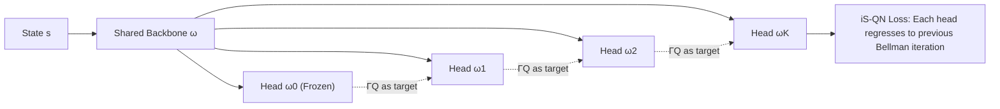

# Bridging the Performance-Gap Between Target-Free and Target-Based Reinforcement Learning

**Conference**: ICLR 2026  
**OpenReview**: [https://openreview.net/forum?id=ltcxS7JE0c](https://openreview.net/forum?id=ltcxS7JE0c)  
**Code**: [https://github.com/theovincent/iS-DQN](https://github.com/theovincent/iS-DQN)  
**Area**: reinforcement learning  
**Keywords**: target networks, value function learning, memory-efficient RL, iterated Q-learning, shared features  

## TL;DR
By using an old copy of the last linear head of the online network as the target network—while sharing all other parameters—and integrating iterated Q-learning to learn multi-step Bellman iterations in parallel, this method closes the performance gap between target-free and target-based RL with almost no additional memory overhead.

## Background & Motivation
**Background**: Since DQN, deep Q-learning has generally relied on target networks—setting the regression target $\Gamma Q_{\bar\theta}$ based on a periodically synchronized set of old parameters $\bar\theta$ to mitigate training instability caused by semi-gradient bootstrapping and function approximation (part of the deadly triad). Extensive ablation studies have proven that target networks are crucial for maintaining performance; even methods originally claiming to be "target-free" often perform better when target networks are reintroduced.

**Limitations of Prior Work**: The cost of a target network is doubling the memory occupied by the Q-network. This directly limits the scale of the online network, becoming a hard constraint in scenarios naturally requiring large networks, such as memory-constrained edge devices, high-dimensional state spaces, multi-modal inputs, and Mixture-of-Experts (MoE). Consequently, the community has split off a target-free branch, attempting to remove target networks entirely to save memory.

**Key Challenge**: Target-free methods save memory but sacrifice sample efficiency and stability (AUC generally drops by 10% after removing target networks, and up to 60% without normalization layers). Target-based methods are stable but memory-intensive. Existing work either applies various regularizations (Fourier features, MellowMax, BatchNorm) to target-free methods as a makeshift fix or uses iterated Q-learning to speed up training at the cost of requiring additional full parameter copies, which increases rather than decreases memory overhead. Neither path achieves "low memory + high sample efficiency" simultaneously.

**Goal**: To move beyond the binary choice of target-free vs. target-based by designing a unified framework that maintains the low memory footprint of target-free methods while leveraging the full benefits of target-based research (including iterated Q-learning).

**Core Idea**: **Only replicate the final linear head as the target network, while sharing all other layers with the online network**—the target network thus occupies almost no additional memory. Then, graft the **multi-head parallel Bellman iteration from iterated Q-learning** onto this shared backbone, exchanging a minimal number of linear head parameters for sample efficiency. This results in the **iterated Shared Q-Network (iS-QN)**.

## Method

### Overall Architecture
iS-QN replaces the "online network + independent target network" structure with a **single Q-network equipped with $K+1$ linear heads**. The shared parameters $\omega$ (feature extraction backbone) are reused by all heads. Let the $k$-th head's parameters be $\omega_k$, such that $\theta_k=(\omega,\omega_k)$ and the overall parameters are $\theta=(\omega,\omega_0,\dots,\omega_K)$. Each head $Q_{\theta_k}$ is trained to approximate the Bellman iteration of the previous head $\Gamma Q_{\theta_{k-1}}$, such that $Q_{\theta_K}\approx\Gamma Q_{\theta_{k-1}}\approx\cdots\approx\Gamma^K Q_{\theta_0}$. This allows the model to learn $K$ steps of Bellman updates in parallel in a single forward pass. When $K=1$, the method reduces to "Shared Features" (single target head with shared features); when $K$ independent full replicas are used, it reduces back to i-QN.

### Key Designs

**1. Shared Features + Frozen Linear Head: Exchanging one layer of memory for stability.** Traditional target networks store a full set of old parameters $\bar\theta$, doubling memory. iS-QN only maintains an old copy of the final linear head $\omega_0$ (which does not receive gradients); all other layers of the target network borrow the latest online backbone $\omega$. Thus, the regression target $\Gamma Q$ is "half-new, half-old" (real-time features, lagged readout head), with nearly zero extra memory since the linear head size is negligible relative to the backbone. Gradient analysis suggests this is not just a workaround: the cosine similarity between the iS-DQN ($K=1$) gradient and the target-based loss gradient is significantly higher than that of target-free vs. target-based, especially early in training, indicating that sharing features with a frozen head pulls learning dynamics toward the target-based side. The authors also propose **target churn** (the absolute change in regression targets before and after a batch update) as a metric: target-based methods have zero churn due to isolation, while shared features suppress target churn in iS-QN, approaching target-based stability.

**2. Grafting iterated Q-learning onto Shared Backbone: Exchanging multiple heads for sample efficiency.** Mere feature sharing only closes part of the gap; the real speedup comes from integrating iterated Q-learning. The training loss sums the regressions of each head to its predecessor:

$$\mathcal{L}^{\text{iS-QN}}_d(\theta)=\sum_{k=1}^{K}\mathcal{L}^{\text{QN}}_d(\theta_k,\theta_{k-1}),\quad \mathcal{L}^{\text{QN}}_d(\theta_k,\theta_{k-1})=\big(\lceil r+\gamma\max_{a'}Q_{\theta_{k-1}}(s',a')\rceil-Q_{\theta_k}(s,a)\big)^2$$

where $\lceil\cdot\rceil$ denotes stop-gradient. $\omega_0$ never learns; a "chain shift" $\omega_k\leftarrow\omega_{k+1}$ is executed every $T$ steps, shifting the entire Bellman iteration window one step toward the optimal Q-function. Compared to target-based methods that only advance one Bellman iteration every $T$ steps, iS-QN learns multiple steps within the window simultaneously from the same sample, significantly improving sample efficiency. Since $\mathcal{L}^{\text{QN}}$ can be replaced by any TD loss (categorical/ILQL in DQN/CQL/SAC), this design is decoupled from the underlying algorithm.

**3. Orthogonality to Regularization and beyond Iterated sharing.** iS-QN does not conflict with target-free regularization but provides additive gains: using LayerNorm (which even benefits target-based) in discrete actions and BatchNorm (SimbaV2) in continuous control. The authors also verify that the "shared linear head" core is not limited to an iterated topology—applying it to Ensemble DQN yields **Ensemble Shared Features (ES-CQL)**: using 5 pairs of linear heads (10 total), where each pair has one frozen target head and one learning online head, also outperforms target-free. This suggests "shared backbone + linear heads for targets" is a general route for memory efficiency. Note that $K$ is not "the larger the better"—if representation capacity is insufficient (e.g., CNN without normalization), too many heads can cause degradation.

## Key Experimental Results

### Main Results (AUC for various scenarios, normalized to Target-Based = 100%)

| Scenario / Algorithm | Architecture | TF (Target-Free) | iS-QN Best | Note |
|---|---|---|---|---|
| Online Discrete (15 Atari) | CNN + LN | 90% | **iS-DQN K=9 → 106%** | Outperforms target-based by 6%, params ≈ TF |
| Online Discrete (15 Atari) | CNN no Norm | 40% | **iS-DQN K=3 → 85%** | Gap reduced from 60% to 15% |
| Online Discrete (10 Atari) | IMPALA + LN | 92% | iS-DQN K=49 Matched | K can be larger with rich representations |
| Offline Discrete (10 Atari) | IMPALA + LN | 74% | **iS-CQL K=9 → 94%** | Gap reduced from 26% to 6% |
| Online Continuous (7 DMC Hard) | SimbaV2 + BN | 50%+ | **iS-SAC K=1 Matched** | Total parameters reduced by 49% |
| Offline Language (Wordle) | GPT-2 small | <100% | **iS-ILQL K=9 → 105%+** | Beats target-based, saves 88M params (33% RAM) |
| Streaming (7 Atari) | CNN + LN | 100% (Base) | **iS-Stream Q(λ) K=3 → 110%+** | Outperforms or matches in 6/7 games |

### Ablation Study

| Ablation Dimension | Setting | Finding |
|---|---|---|
| Head Count $K$ | 1 / 4 / 9 / 49 | Gap decreases as $K$ increases; but K=49 degrades on CNN (limited representation), while still beneficial on IMPALA. |
| Sharing Topology | iterated (iS) vs Ensemble (ES) | Both outperform TF-CQL, proving "sharing + linear heads" is not limited to the iterated structure. |
| Normalization | With/Without LN, BN | LN is critical for multi-head representations; BN improves sample efficiency in continuous control but hurts discrete target-based performance. |
| Loss Weighting | Uniform vs Discount 0.25 | For continuous control, giving larger weights to earlier Bellman terms is more stable; weight learning via meta-gradient is a future direction. |

### Key Findings
- iS-DQN with $K=1$ (storing only one old linear head) already consistently outperforms target-free, proving that "shared features + frozen head" is itself an effective lightweight target network.
- In multiple scenarios, iS-QN not only bridges the gap but **outperforms** target-based methods (Atari +6%, Wordle +5%), while cutting Q-network parameters by nearly half.
- Diagnostic metrics (gradient cosine similarity and target churn) explain from a learning dynamics perspective why shared features pull behavior closer to target-based methods.

## Highlights & Insights
- **Simple yet Universal**: The core change is merely "copy the last linear head + share other parameters," yet it consistently works across online/offline, discrete/continuous, CNN/IMPALA/SimbaV2/GPT-2, and Atari/DMC/Wordle/Streaming settings.
- **Unified Perspective**: Reinterprets target-free as an extreme "target-based" case where the target network is synchronized at every step, placing binary opposites into a continuous spectrum (window shift frequency)—a very elegant framework.
- **Genuine Memory Savings**: Reduces parameters by 49% on DMC and 88M parameters (33% RAM) on Wordle, providing real-world value for edge devices and Large Model RL rather than just theoretical analysis.
- **Solid Diagnostics**: The introduction of the target churn metric and gradient similarity provides quantifiable evidence for "why it works" beyond just performance scores.

## Limitations & Future Work
- The weighting scheme for multi-head losses is not yet fully principled—continuous control required manual tuning (discount 0.25). The authors suggest adaptive weights via meta-gradients as future work.
- The optimal value of $K$ depends heavily on the backbone's representation capacity and normalization layers; there is currently no mechanism for automatic $K$ selection. Excessively large $K$ leads to degradation when representations are insufficient.
- Linear head sharing assumes the target can be well-approximated by Bellman iterations using only the final linear mapping; this might be limited for targets requiring deep non-linear differences.
- High variance in streaming scenarios (no batch) makes shared parameter updates unstable with too many heads; smaller $K$ is preferred here.

## Related Work & Insights
This work stands at the intersection of **iterated Q-learning** (Vincent et al. 2025b / 2024, Schmitt et al. 2022) and the **target-free RL** lineage. The target-free branch includes streaming RL (Action Value Gradient, Stream Q(λ)), Gradient TD (requiring double computation and extra networks), and regularization-based fixes like MellowMax (Kim 2019), Fourier features (Li & Pathak 2021), BatchNorm (Bhatt 2024), and LayerNorm (Gallici 2025). This paper differentiates itself by not inventing another regularization, but by proposing a **lightweight target network construction that is orthogonal to these techniques** and directly reaps the sample efficiency benefits of iterated Q-learning. The insight for future research is that the "degree of separation" between online and target networks is a tunable design dimension; sharing the backbone while freezing a few readout heads may be a universal paradigm for balancing stability and memory.

## Rating
- Novelty: ⭐⭐⭐⭐ Combining "single-layer target networks" with iterated Q-learning provides a unified view with minimal changes. Both components stem from existing work, making this a clever integration rather than a brand-new mechanical invention.
- Experimental Thoroughness: ⭐⭐⭐⭐⭐ Covers five major scenarios, four architectures, and includes diagnostics like gradient similarity and target churn. Statistics use IQM and bootstrap confidence intervals—very solid.
- Writing Quality: ⭐⭐⭐⭐ Clear motivation, intuitive diagrams (window shifting), and well-articulated unified spectrum perspective. Some sections on multi-scenario results are a bit dense.
- Value: ⭐⭐⭐⭐ Directly addresses the memory bottleneck in RL. Saving half the parameters while often outperforming target-based models has significant practical implications for edge devices and Large Model RL.

<!-- RELATED:START -->

## Related Papers

- [\[ICLR 2026\] Q-Learning with Fine-Grained Gap-Dependent Regret](q-learning_with_fine-grained_gap-dependent_regret.md)
- [\[ICLR 2026\] On the Tension Between Optimality and Adversarial Robustness in Policy Optimization](on_the_tension_between_optimality_and_adversarial_robustness_in_policy_optimizat.md)
- [\[ICLR 2026\] A Reward-Free Viewpoint on Multi-Objective Reinforcement Learning](a_reward-free_viewpoint_on_multi-objective_reinforcement_learning.md)
- [\[ICLR 2026\] RLAC: Reinforcement Learning with Adversarial Critic for Free-Form Generation Tasks](rlac_reinforcement_learning_with_adversarial_critic_for_free-form_generation_tas.md)
- [\[ICLR 2026\] MIRACLE: Model-free Imitation and Reinforcement Learning for Adaptive Cut-Selection](miracle_model-free_imitation_and_reinforcement_learning_for_adaptive_cut-selecti.md)

<!-- RELATED:END -->
