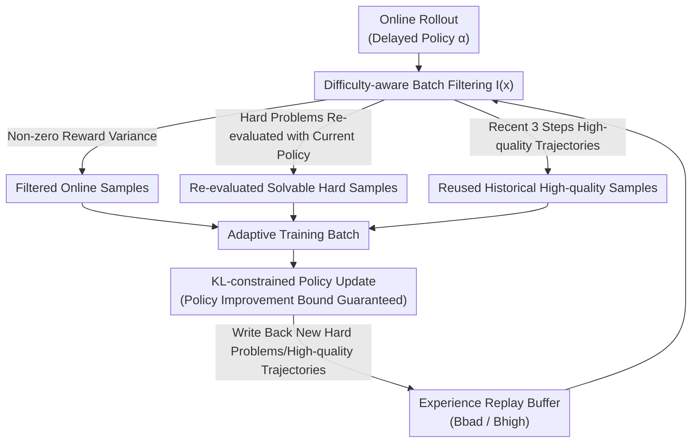

# Buffer Matters: Unleashing the Power of Off-Policy Reinforcement Learning in Large Language Model Reasoning

**Conference**: ICLR2026  
**OpenReview**: [https://openreview.net/forum?id=RduOiisl1S](https://openreview.net/forum?id=RduOiisl1S)  
**Code**: Yes (The original text provides a link "The code is available in Here")  
**Area**: LLM Reasoning / Reinforcement Learning / RLVR / Off-policy RL  
**Keywords**: Off-policy RLVR, Experience Replay, Hard Samples, GRPO, Adaptive Batch Construction

## TL;DR
Addressing two major wastes in online (on-policy) RLVR training—"inability to learn from hard samples" and "sampled data discarded after one use"—this paper proposes the off-policy framework **BAPO (Batch Adaptation Policy Optimization)**. It utilizes a "difficulty-aware experience replay + adaptive batch construction" mechanism to bring historical hard problems and high-quality trajectories back into training batches. It theoretically proves that the adapted batches still satisfy the lower bound for policy improvement. Ultimately, BAPO achieves an average 12.5% improvement over GRPO across math, planning, and visual geometry tasks, solving 40.7% of hard problems that the base model consistently failed.

## Background & Motivation
**Background**: Reinforcement Learning with Verifiable Rewards (RLVR) has become the mainstream route for enhancing LLM reasoning after pre-training. It replaces expensive and hackable neural reward models with a deterministic verification function (assigning 0/1 rewards for correct/wrong answers). Representative methods include GRPO (Group Relative Policy Optimization) and its variants like DAPO and GSPO, which have achieved notable success in math, code, and downstream reasoning.

**Limitations of Prior Work**: The authors use an experimental plot to highlight the issue: after GRPO training, the model shows almost no progress on "hard samples," particularly those with 0% accuracy in the initial rollout groups. There are two specific flaws:

- **Homogeneous rewards**: The advantage estimation in GRPO-based methods $\hat{A}_{i,t} = \frac{r_i - \mathrm{mean}(\{r_\ell\})}{\sqrt{\mathrm{std}^2(\{r_\ell\}) + \varepsilon}}$ depends entirely on the relative differences in rewards within a group. When all samples in a group are either all correct or all wrong, the variance and advantage become zero, making the gradient contribution negligible. The lower bound for policy improvement collapses, wasting extremely hard or easy samples.
- **Waste of experience**: Because policy improvement is sensitive to within-group reward variance, the number of "effective" (non-homogeneous reward) samples is much smaller than the configured batch size when the difficulty distribution is uneven. Since on-policy methods lack experience replay, each rollout group is discarded after one use, wasting a vast amount of valuable sampled data.

**Key Challenge**: An intuitive solution is to switch to off-policy training to reuse historical experience and improve sample efficiency—this is proven in traditional RL. However, **naively plugging "reused samples" into LLM training causes issues**: historical samples come from older policies at different time steps, and distribution drift introduces noise, leading to entropy collapse, training instability, and performance degradation. Even worse, blindly reusing high-accuracy historical samples can cause the model to fixate on already known high-advantage paths, suppressing exploration and converging prematurely to sub-optimal solutions.

**Goal**: Systematically decompose "how to effectively use stale off-policy experience" and integrate multiple off-policy strategies into the on-policy RLVR framework to find a path that reuses data without destroying stability.

**Key Insight**: Instead of simply mixing buffer data with online data, **reuse should be categorized by difficulty**. For historical hard problems, use the current policy to re-generate answers and pick those that "can now be solved a little" for exploration. For high-quality historical trajectories, set dynamic quality thresholds for direct reuse to fill batches. The entire adaptive batch construction is backed by KL constraints and theoretical guarantees for policy improvement bounds.

## Method

### Overall Architecture
BAPO is an off-policy RLVR post-training framework. It transforms the "sample once, use once, discard" batches of GRPO into adaptive batches mixed from "new online samples + two types of historical experience," ensuring that every training step maintains **non-homogeneous rewards** and an **appropriate difficulty distribution**.

The training objective $\mathcal{L}_\alpha(\pi_\theta)$ is composed of three parts: online sample contribution, historical buffer sample contribution, and KL regularization:

$$\mathcal{L}_\alpha(\pi_\theta) = \mathbb{E}_{(x,y)\sim\alpha}\big[\rho_\alpha(\theta)\hat{A}(x,y)\big] + \mathbb{E}_{(x,y)\sim B}\big[\rho_{\alpha_B}(\theta)\hat{A}(x,y)\big] - \beta\cdot D_{KL}(\pi_\theta\|\alpha)$$

where $\alpha=\pi_{\theta_{t-v}}$ is the rollout policy with a $v$-step delay, $B$ is the experience replay buffer, and $\rho_\alpha$, $\rho_{\alpha_B}$ are the corresponding importance sampling ratios. The core of the process is a **batch filtering function** $I(x)$: at each step, it splits candidate data into three complementary subsets—filtered online samples $X_1$, re-evaluated historical hard samples that become "solvable" $X_2$, and reused historical high-quality samples used to fill the batch $X_3$. The three are combined into a batch to update the policy, while new hard problems and high-quality trajectories are written back to the buffer to form a closed loop.

### Key Designs

**1. Difficulty-aware Batch Filtering Function: Explicitly Splitting "Which Samples Enter the Batch"**

This is the main switch of BAPO, directly addressing "homogeneous rewards" and "waste of experience." The authors define the expected reward as $\mu_{\pi,r}(x) = \mathbb{E}_{y\sim\pi(\cdot|x)}[r(x,y)]$ and construct the indicator function $I(x)$ as the sum of three conditions:

$$I(x) = \underbrace{\mathbf{1}_{\{\frac{1}{G}\le\mu_{\alpha,r}(x)\le\frac{G-1}{G}\}}}_{\text{Filter Online Samples}} + \underbrace{\mathbf{1}_{\{\mu_{\alpha_B,r}(x)\le c_1\,\wedge\,\mu_{\pi_{\theta_t},r}(x)>c_1\}}}_{\text{Solvable Hard Samples}} + \underbrace{\mathbf{1}_{\{c_2\le\mu_{\alpha_B,r}(x)\le c_3\}}}_{\text{Historical High-quality}}$$

The ingenuity lies in not simply mixing buffer and online data at fixed ratios (which fails to control difficulty), but **deciding the fate of each sample based on its current expected reward**. These three conditions generate $X_1, X_2, X_3$, ensuring the batch contains neither "all correct/wrong" zero-gradient samples nor uselessly repetitive data.

**2. Solvable Historical Hard Samples $X_2$: Bringing "Previously Impossible, Now Partially Solvable" Problems Back**

Addressing the limitation where extremely hard samples (mean group reward in $[0, c_1]$) contribute nothing: as the model evolves, these may become solvable. BAPO maintains a FIFO buffer $B_{bad}$ for hard problems. Every $m$ steps, it uses the **current policy** $\pi_{\theta_t}$ to re-sample answers for these problems, selecting those that show progress:

$$X_2 = \big\{(x, y') \mid (x,y)\in B_{bad},\, y'\sim\pi_{\theta_t}(\cdot|x),\, c_1 < \mu_{\pi_{\theta_t},r}(x) < 1\big\}$$

A sample is selected only if the re-evaluated expected reward falls in $(c_1, 1)$ (i.e., changing from "all wrong" to "partially correct"). The capacity of $B_{bad}$ is limited to the batch size, and FIFO ensures the removal of stale samples to control re-evaluation overhead. This step uses the **current policy to re-generate $y'$** (rather than reusing old answers), meaning it is active exploration driven by hard problems.

**3. Reusing Historical High-quality Samples $X_3$: Filling Batches without Introducing Stale Noise**

Addressing the limitation where $X_1$ and $X_2$ are insufficient to fill a batch, wasting compute. BAPO maintains a buffer $B_{high}$ that **only keeps the last three steps** of high-quality trajectories (limiting staleness to avoid instability) and samples randomly to fill the remaining capacity:

$$X_3 = S\big(B_{high},\, \min(|B_{high}|,\, B - |X_1| - |X_2|)\big)$$

A key technique is the **dynamic quality threshold**: to encourage the model to tackle increasingly difficult problems, $c_2$ and $c_3$ are not fixed but shift linearly with the global average performance $r_{tot}$—$c_i = r_{tot}\cdot(c_i^{high} - c_i^{low}) + c_i^{low}$. As the model strengthens, the "high quality" standard rises, pushing reused samples from easy to hard and preventing the model from converging early on low-difficulty high-advantage paths.

**4. Policy Improvement Bound with KL Constraint: Theoretically Ensuring Stable Training**

The greatest risk of off-policy reuse is training instability from distribution drift. Based on theorems by Mroueh et al., the authors prove **Theorem 3.2 (Policy Improvement Lower Bound for Adaptive Batches)**: assuming bounded rewards $0\le r\le 1$ and sufficiently small TV distances $\mathrm{TV}(\pi_{\theta_t}(\cdot|x), \alpha_i(\cdot|x))\le\delta_i$ for each subset, the expected policy improvement on filtered samples satisfies:

$$\mathbb{E}_{x\sim\rho_X}\big[I(x)(J(\pi_\theta(\cdot|x)) - J(\pi_{\theta_t}(\cdot|x)))\big] \ge \sum_{i=1}^{3} \mathcal{L}_i(\pi_\theta, \alpha_i)$$

Constants $K_1, K_2, K_3$ are finite positive values (determined by $G, c_1, c_2, c_3$), ensuring numerical stability and theoretical bounds (**Bounded Stability**). Furthermore, the trust region method constrains the update magnitude, and the strict FIFO + limited buffer size keeps batch consistency, maintaining off-policy tolerance. This theory allows BAPO to reuse stale experience without the crashes seen in naive off-policy reuse.

### Loss & Training
The optimization objective is $\mathcal{L}_\alpha(\pi_\theta)$ as defined above: online and buffer samples are weighted by their respective importance sampling ratios and advantages, minus a KL regularization term $\beta\cdot D_{KL}(\pi_\theta\|\alpha)$ against the delayed rollout policy $\alpha$. The subsets $X_1, X_2, X_3$ form an adaptive batch for policy updates. The hard problem buffer $B_{bad}$ triggers re-evaluation every $m$ steps, and the high-quality buffer $B_{high}$ only retains samples from the most recent 3 steps. The implementation is based on the Verl framework, with experiments conducted on 8 A100 (80GB) GPUs using identical parameters for fairness.

## Key Experimental Results

### Main Results
Tasks cover three reasoning categories: Math (DeepScaleR dataset, DeepSeek-R1-Distill-Qwen-1.5B / Qwen3-8B), Planning (Countdown game, Qwen2.5-Math-1.5B/7B), and Visual Geometry (Geometry3K, Qwen2.5-VL-3B/7B). Accuracy is averaged over 32 runs.

Math Benchmarks (DeepSeek-R1-Distill-Qwen-1.5B):

| Method | Type | AIME24 | AMC | MATH500 | Minerva | Olympiad | Avg ↑ | Rollouts ↓ |
|--------|------|--------|-----|---------|---------|----------|-------|------------|
| Base | - | 28.80 | 62.90 | 82.80 | 26.50 | 44.42 | 48.90 | - |
| +GRPO | on | 30.73 | 67.47 | 85.40 | 28.95 | 45.33 | 51.58 | 677k |
| +DAPO | on | 35.73 | 70.08 | 86.05 | 30.70 | 48.48 | 54.20 | 1921k |
| +GRPO(v=5) | off | 30.49 | 65.09 | 86.72 | 28.16 | 46.18 | 51.57 | 677k |
| +RePO | off | 30.42 | 64.76 | 83.75 | 28.33 | 45.44 | 50.54 | 677k |
| +Remix-GRPO | off | 33.33 | 65.06 | 84.60 | 26.10 | 43.55 | 50.53 | - |
| **+BAPO (Ours)** | off | **38.54** | **72.74** | **89.18** | 29.55 | **50.06** | **56.01** | 733k |

BAPO scores ~4.4 points higher than GRPO in math and achieves an average 12.5% gain over the baseline. Notably, while DAPO's performance is close in some metrics, it consumes about **2.5x the rollouts** (1921k vs 733k), creating a heavy computational burden. BAPO is the only off-policy method that consistently outperforms on-policy GRPO.

### Ablation Study
Ablation on Planning (Countdown) and Visual Geometry (Geometry3K):

| Configuration | CD-34 | CD-4 | Avg | Geo-3K(val) | Geo-3K(test) | Avg |
|---------------|-------|------|-----|-------------|--------------|-----|
| +GRPO | 62.94 | 35.88 | 49.41 | 36.44 | 43.12 | 39.78 |
| +DAPO | 70.56 | 45.87 | 58.22 | 40.11 | 45.18 | 42.65 |
| +BAPO w/o $X_2$ | 60.31 | 35.31 | 47.81 | 30.57 | 36.92 | 33.75 |
| +BAPO w/o $X_3$ | 64.43 | 38.75 | 51.59 | 32.22 | 39.79 | 36.01 |
| **+BAPO (Full)** | **73.00** | **47.50** | **60.25** | **40.11** | **46.33** | **43.22** |

(Based on Qwen2.5-Math-1.5B / Qwen2.5-VL-3B)

### Key Findings
- **$X_2$ (Solvable Hard Samples) has the largest contribution**: Removing it causes Visual Geometry performance to drop from 43.22 to 33.75 (nearly 10 points), falling below GRPO. This confirms that re-evaluating historical hard problems is the core engine for solving hard samples.
- **$X_3$ (High-quality Reused Samples) is also essential**: Removing it drops Geometry to 36.01 and Planning to 51.59, proving that dynamic threshold high-quality reuse is valuable for filling effective batches and stabilizing convergence.
- **Off-policy is highly sample-efficient**: BAPO achieves significantly better results than GRPO with similar rollout counts (733k vs 677k). Mechanistic analysis shows BAPO's gains come from the structure of off-policy components rather than hyperparameter tuning.
- **Solving stubborn base model problems**: BAPO successfully solved 40.7% of problems the base model consistently failed, addressing the initial observation that GRPO is ineffective for hard samples.

## Highlights & Insights
- **"Routing by Difficulty" vs "Mixing by Ratio"**: BAPO's cleverest aspect is not treating the buffer as a general mix, but using expected rewards to split samples into three roles. This allows off-policy reuse to precisely control the difficulty distribution and reward variance, avoiding the entropy collapse of naive reuse.
- **Hard problems as "Exploration Drivers"**: $X_2$ re-samples old problems with the current policy, turning "passive reuse" into "active exploration." This acts like a "difficulty curriculum" that advances naturally with model capability.
- **Theory and Engineering Synergy**: The policy improvement lower bound (Theorem 3.2), FIFO limited buffer, and dynamic thresholds work together to contain the instability usually associated with off-policy methods.
- **Sample Efficiency Perspective**: The fact that DAPO requires 2.5x more rollouts to match BAPO serves as a reminder that post-training methods should be evaluated by rollout budget as well as accuracy—a crucial factor for teams with limited compute.

## Limitations & Future Work
- **Strong Theoretical Assumptions**: The lower bound depends on TV distances $\delta_1, \delta_3$ being "sufficiently small." Whether distribution drift remains constrained in all practical training scenarios and the robustness of thresholds $c_1, c_2, c_3$ require more validation.
- **Hyperparameter and Buffer Sensitivity**: The re-evaluation period $m$, buffer capacities, and the 3-step window are empirical settings. Although BAPO works in a "minimal verification" setup, the transferability of these settings across different tasks/bases needs broader testing.
- **Limited Scope and Scale**: Experiments focused on math, planning, and visual geometry with models up to 7B/8B. Performance on code generation, open-ended reasoning, and larger models has not been demonstrated.
- **Future Directions**: Exploring automatic threshold searching and extending "hard problem re-evaluation" to multi-step tool-use or long-range reasoning tasks.

## Related Work & Insights
- **vs GRPO**: GRPO is purely on-policy and discards data immediately. BAPO adds off-policy experience replay to solve failures in hard samples and reward homogeneity, yielding a 12.5% average gain.
- **vs DAPO**: DAPO also addresses $\hat{A}=0$ via dynamic sampling and dual clipping but consumes roughly 2.5x the rollouts. BAPO achieves better effects with a GRPO-level budget.
- **vs Naive Off-policy (RePO / Remix-GRPO)**: These methods often ignore policy stability; reusing stale high-accuracy samples can suppress exploration. BAPO's FIFO constraints and re-evaluation mechanism avoid this trap.
- **vs Buffer strategies (ReLIFT / Kimi-K1.5)**: While others might use buffers for interleaved SFT or simple FIFO reuse, BAPO stands out by unifying "hard problem exploration" and "dynamic high-quality reuse" within a theoretically grounded filtering framework.

## Rating
- Novelty: ⭐⭐⭐⭐ The combination of difficulty-aware batching and hard-sample re-evaluation is quite novel in off-policy RLVR.
- Experimental Thoroughness: ⭐⭐⭐⭐ Covers various tasks and multiple baselines with targeted ablations, though scale could be larger.
- Writing Quality: ⭐⭐⭐⭐ Clear logic from pain points to mechanism to theory.
- Value: ⭐⭐⭐⭐ Significantly improves hard-sample success rates with a comparable rollout budget, highly relevant for restricted-compute settings.

<!-- RELATED:START -->

## Related Papers

- [\[ICLR 2026\] Squeeze the Soaked Sponge: Efficient Off-Policy RFT for Large Language Model](squeeze_the_soaked_sponge_efficient_off-policy_rft_for_large_language_model.md)
- [\[ICLR 2026\] Structured In-context Environment Scaling for Large Language Model Reasoning](structured_in-context_environment_scaling_for_large_language_model_reasoning.md)
- [\[ICLR 2026\] Revisiting Group Relative Policy Optimization: Insights into On-Policy and Off-Policy Training](revisiting_group_relative_policy_optimization_insights_into_on-policy_and_off-po.md)
- [\[ICLR 2026\] Toward Efficient Exploration by Large Language Model Agents](toward_efficient_exploration_by_large_language_model_agents.md)
- [\[ICML 2026\] Coupled Variational Reinforcement Learning for Language Model General Reasoning](../../ICML2026/reinforcement_learning/coupled_variational_reinforcement_learning_for_language_model_general_reasoning.md)

<!-- RELATED:END -->
