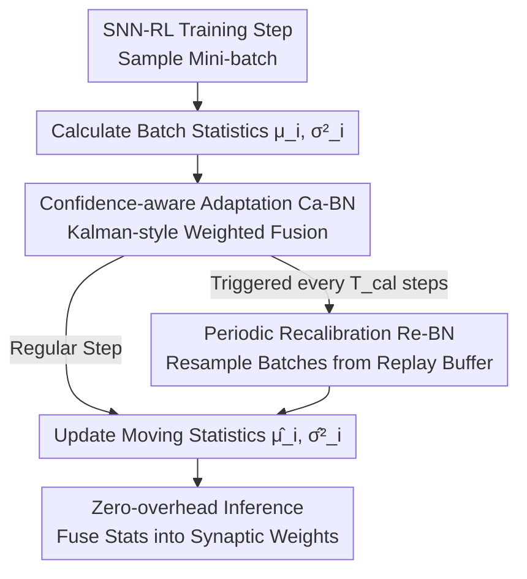

# CaRe-BN: Precise Moving Statistics for Stabilizing Spiking Neural Networks in Reinforcement Learning

**Conference**: ICLR2026  
**OpenReview**: [https://openreview.net/forum?id=AaZVrbElhC](https://openreview.net/forum?id=AaZVrbElhC)  
**Code**: https://github.com/xuzijie32/CaRe-BN  
**Area**: Reinforcement Learning / Spiking Neural Networks / Batch Normalization  
**Keywords**: Spiking Neural Networks, Online Reinforcement Learning, Batch Normalization, Moving Statistics, Confidence-aware Adaptation

## TL;DR
To address the training instability in Spiking Neural Networks (SNNs) caused by inaccurate Batch Normalization (BN) moving statistics in online Reinforcement Learning (RL), this paper proposes CaRe-BN. The method utilizes "Confidence-aware Adaptation" (Kalman-style weighting) for real-time, low-variance estimation of BN statistics, and "Periodic Recalibration" (resampling large batches from the replay buffer) for bias correction. This improves SNN agent performance on Atari/MuJoCo by up to 22.6%, even surpassing corresponding ANNs by 5.9%, with zero additional inference overhead.

## Background & Motivation
**Background**: Spiking Neural Networks (SNNs) compute via event-driven, binary spikes, making them naturally suited for low-latency, low-power inference on neuromorphic hardware. Combining SNNs with Reinforcement Learning (SNN-RL) promises agents that can learn complex control policies while operating with extreme energy efficiency on edge devices. However, SNN spikes are discrete and non-differentiable; backpropagation relies on surrogate gradients, making gradients prone to exploding or vanishing. Consequently, **Batch Normalization (BN) is not optional for SNNs but a critical component for stable training**, as it regulates activation statistics to stabilize membrane potentials and gradient flow.

**Limitations of Prior Work**: While BN works well in supervised learning, it fails in online RL. During inference, BN uses moving statistics $(\hat\mu_i, \hat\sigma_i^2)$ accumulated during training, typically via Exponential Moving Average (EMA). The issue is that online RL data distributions are **non-stationary**: the agent's policy is constantly evolving, causing activation distributions to drift. In this scenario, EMA faces a "noise-delay" dilemma—low momentum leads to stability but fails to track rapid drifts (estimation lag), while high momentum tracks faster but amplifies noise from small mini-batches. Figure 1 of the paper illustrates that estimation lags during rapid changes and becomes noisy during stable periods.

**Key Challenge**: In supervised learning, the discrepancy between mini-batch statistics (training) and moving statistics (inference) is tolerable because inaccurate moving statistics **do not directly participate in gradient updates**. However, in online RL, the agent relies on current (inference) statistics for **exploration and exploitation**. Inaccurate statistics lead to sub-optimal actions and low-quality trajectories, which are then stored in the replay buffer for training, creating a vicious cycle that slows convergence or causes divergence.

**Goal**: To design a mechanism capable of **real-time, low-variance** estimation of BN inference statistics under non-stationary distributions, ensuring SNNs receive accurate normalization throughout the RL training process. This is particularly vital for SNNs, as traditional ANN-RL algorithms (DQN/DDPG/TD3/PPO) can often train stably without BN, whereas SNNs suffer severe gradient instability and performance degradation without it.

**Core Idea**: Treat the estimation of BN moving statistics as a **filtering problem with noisy observations**. Inspired by Kalman filtering, the method adaptively weights the "previous estimate" and "current mini-batch observation" (Ca-BN) based on confidence. It then periodically corrects accumulated errors by resampling large batches from the replay buffer for precise recalibration (Re-BN), achieving accurate statistics under distribution drift without modifying the inference architecture.

## Method

### Overall Architecture
CaRe-BN addresses the inaccurate estimation of BN moving statistics in non-stationary online RL. It modifies only the **estimation method** of statistics, leaving gradient updates and inference structures untouched. It consists of two complementary mechanisms: **Ca-BN** (Confidence-aware Adaptation), which runs at **every training step** to provide online, low-variance estimates; and **Re-BN** (Recalibration), which runs **every $T_{cal}$ steps** by resampling multiple batches from the replay buffer for precise error correction. During training, these mechanisms update the BN $(\hat\mu, \hat\sigma^2)$; during inference, CaRe-BN reverts to standard BN where statistics are fused into synaptic weights for zero-overhead deployment.

### Key Designs

**1. Ca-BN Confidence-aware Adaptation: Dynamic Weighting to Bypass the Noise-Delay Dilemma**

Standard BN uses EMA with a fixed momentum $\alpha$: $\hat\mu_i \leftarrow (1-\alpha)\hat\mu_{i-1} + \alpha\mu_i$. A fixed $\alpha$ cannot handle "rapidly shifting" and "stable" distributions simultaneously. Inspired by Kalman filtering, Ca-BN treats the "previous estimate" $\hat\mu_{i|i-1}$ and "current batch observation" $\mu_i$ as two unbiased estimates of the true mean $\mu_i^*$, seeking the optimal linear combination to minimize Mean Squared Error (Theorem 1):

$$\hat\mu_i = (1-K_i^\mu)\hat\mu_{i|i-1} + K_i^\mu \mu_i,\qquad K_i^\mu = \frac{D(\mu_i^*-\hat\mu_{i|i-1})}{D(\mu_i^*-\hat\mu_{i|i-1}) + D(\mu_i^*-\mu_i)}$$

Where $D(\cdot)$ denotes generalized variance, and confidence is defined as the inverse of variance $1/D$. The intuition is straightforward: the more credible (lower variance) an estimate is, the higher its weight $K$. For mini-batch observations under Gaussian assumptions, the variances are $D(\mu_i^*-\mu_i)=\sigma_i^{*2}/N \approx \sigma_i^2/N$ and $D(\sigma_i^{*2}-\sigma_i^2)\approx 2\sigma_i^4/(N-1)$ (larger batches are more credible). Since the error of the previous estimate is unknown, the squared deviation $(\mu_i-\hat\mu_{i|i-1})^2$ is used as a noisy probe and smoothed via EMA to estimate $D_i^\mu$. Thus, when the distribution drifts rapidly, $D_i^\mu$ increases, causing $K_i^\mu$ to rise for faster tracking. When the distribution is stable, $D_i^\mu$ decreases, causing $K_i^\mu$ to fall to suppress mini-batch noise.

**2. Re-BN Periodic Recalibration: Correcting Cumulative Bias using Large-batch Resampling**

Ca-BN provides step-by-step online estimation but may still develop cumulative bias due to mini-batch noise. The most accurate approach would be to recalculate statistics across the entire dataset, but in RL, processing millions of samples per step is infeasible. Re-BN takes a middle ground: every $T_{cal}$ steps, it draws $M$ calibration batches $\{B_1,\dots,B_M\}$ from the replay buffer, calculates $\mu_j,\sigma_j^2$ for each, and aggregates them:

$$\hat\mu_i = \frac{1}{M}\sum_{j=1}^{M}\mu_j,\qquad \hat\sigma_i^2 = \frac{1}{M}\sum_{j=1}^{M}(\sigma_j^2+\mu_j^2) - \hat\mu_i^2$$

This "aligns" the statistics using a much larger effective sample size. The overhead is bounded by $\frac{M}{T_{cal}}$ times the training cost, which is negligible for $T_{cal}\gg M$. Ca-BN eliminates training-inference mismatch at high frequency, while Re-BN corrects cumulative bias at low frequency.

**3. SNN-Friendly Integration with Zero Inference Overhead**

CaRe-BN integrates into standard online RL (Algorithm 1) without modifying the gradient update process. Its engineering value lies in the fact that SNN performance gains stem purely from "more accurate statistics" rather than changes to RL mechanisms. During inference, CaRe-BN is identical to standard BN; statistics are merged into synaptic weights, preserving SNN energy efficiency. The paper also validates the "SNN-specificity": adding CaRe-BN to shallow ANNs yields almost no improvement because ANNs are already stable without normalization, confirming that CaRe-BN solves a bottleneck unique to SNNs.

### Loss & Training
CaRe-BN introduces no new loss terms, using standard objectives for RL algorithms like DQN, DDPG, TD3, or SAC. SNN agents are trained using Spatio-Temporal Backpropagation (STBP), with CaRe-BN modules inserted between layers. Each environment step involves an SNN forward pass with 5 simulation time steps, followed by a neuron state reset.

## Key Experimental Results

### Main Results
On MuJoCo continuous control (TD3 + CLIF neurons, max average return over 5 seeds), CaRe-BN is compared against various SNN-RL methods and SNN-specific BN variants. The metric is the Average Performance Gain (APG) relative to the ANN baseline:

| Method | IDP-v4 | Ant-v4 | HalfCheetah-v4 | Hopper-v4 | Walker2d-v4 | APG |
|------|--------|--------|----------------|-----------|-------------|-----|
| ANN (Baseline) | 7503 | 4770 | 10857 | 3410 | 4340 | 0.00% |
| ANN-SNN Conv. | 3859 | 3550 | 8703 | 3098 | 4235 | −21.11% |
| pop-SAN | 9351 | 4590 | 9594 | 2772 | 3307 | −6.66% |
| MDC-SAN | 9350 | 4800 | 9147 | 3446 | 3964 | +0.37% |
| ILC-SAN | 9352 | 5584 | 9222 | 3403 | 4200 | +4.64% |
| tdBN | 9346 | 4403 | 9402 | 3592 | 3464 | −2.28% |
| TEBN | 9349 | 4408 | 9452 | 3472 | 4235 | +0.69% |
| TABN | 9348 | 4382 | 9784 | 3585 | 4537 | +3.25% |
| **Ours (CaRe-BN)** | 9348 | 5373 | 9563 | 3586 | 4296 | **+5.90%** |

CaRe-BN leads across all SNN-RL methods and BN variants, surpassing the ANN baseline by +5.90%, demonstrating that "correct normalization" is more critical for SNN-RL than architectural modifications.

### Ablation Study
Max normalization performance across all environments (CLIF + TD3) (Figure 6c):

| Configuration | Performance | Description |
|------|-----------|------|
| Standard BN | 92.2% | Baseline |
| Only Ca-BN | 95.3% | Confidence-aware update alone is effective |
| Only Re-BN | 94.0% | Periodic recalibration alone is effective |
| **CaRe-BN (Full)** | **100%** | Combination yields the best results |

### Key Findings
- **Ca-BN and Re-BN are Complementary**: Ca-BN eliminates training-inference mismatch via high-frequency tracking, while Re-BN corrects cumulative bias at low frequency.
- **Accurate Statistics → Improved Exploration**: CaRe-BN reduces the Wasserstein distance between estimated and true distributions (Figure 3), leading to higher exploration returns (Figure 4). The gain is purely statistical as gradients are unchanged.
- **Lower Variance, Higher Reproducibility**: Relative variance of final policies decreased significantly (17.71% for DDPG, 21.24% for TD3), proving more stable training than the ANN baseline.
- **SNN-Specific Gain**: CaRe-BN yields no improvement for shallow ANNs, confirming it addresses SNN-specific sensitivity to normalization.

## Highlights & Insights
- **Re-formulating BN Statistics as a Kalman Filtering Problem**: This is the core innovation. Moving from a fixed-momentum "hardcoded filter" (EMA) to an adaptive weighting scheme based on confidence resolves the noise-delay dilemma.
- **"Modify Training, Keep Inference" Design Philosophy**: Since the method doesn't touch gradients or layers, the performance gain is cleanly attributable to statistical accuracy, while maintaining SNN energy efficiency for deployment.
- **Empirical Validation through Contradiction**: Proving the method is "useless" for ANNs serves as strong evidence that the authors have correctly identified the SNN-specific bottleneck.
- **Transferable Insight**: This combination of confidence-weighting and periodic recalibration could be applied to any online learning scenario with non-stationary distributions (e.g., continual learning).

## Limitations & Future Work
- **Gaussian Assumption**: The confidence formulas rely on $\mathcal{N}(\mu^*,\sigma^{*2})$. Performance might degrade if activation distributions deviate significantly (e.g., heavy-tailed or extremely sparse spikes).
- **Hyperparameter Introduction**: Re-BN introduces $T_{cal}$ and $M$. While the paper suggests settings to keep overhead negligible, a systematic sensitivity analysis of these parameters across different buffer sizes is missing.
- **Evaluation Scope**: Testing was primarily on Atari (RAM) and MuJoCo. Performance on high-dimensional pixel observations or real-world neuromorphic hardware remains to be verified.
- **Future Directions**: Exploring non-Gaussian confidence modeling, making $T_{cal}$ adaptive, or extending this to Layer Norm for non-stationary learning.

## Related Work & Insights
- **vs. SNN-specific BNs (tdBN/BNTT/TEBN/TABN)**: These assume static distributions from supervised learning; CaRe-BN specifically handles distribution drift in RL.
- **vs. SNN Structure Improvements (pop-SAN/ILC-SAN)**: These modify the actor or neuron dynamics. Ours proves that "getting normalization right" is often more effective than "changing the architecture."
- **vs. Traditional ANN-RL**: ANNs can often afford to remove BN entirely. SNNs cannot, and this paper provides the first dedicated solution for SNN-RL's dependency on BN.

## Rating
- Novelty: ⭐⭐⭐⭐⭐ First specialized BN for SNN-RL; clever use of Kalman filtering.
- Experimental Thoroughness: ⭐⭐⭐⭐ Solid coverage of algorithms and neurons; lacks high-dimensional pixel/hardware tests.
- Writing Quality: ⭐⭐⭐⭐⭐ Excellent motivation, clear theoretical derivation, and thorough mechanism analysis.
- Value: ⭐⭐⭐⭐⭐ Significant for edge/neuromorphic deployment where SNN efficiency is critical.

<!-- RELATED:START -->

## Related Papers

- [\[ICML 2026\] Learning to Approximate Uniform Facility Location via Graph Neural Networks](../../ICML2026/reinforcement_learning/learning_to_approximate_uniform_facility_location_via_graph_neural_networks.md)
- [\[ICLR 2026\] BAPO: Stabilizing Off-Policy Reinforcement Learning for LLMs via Balanced Policy Optimization with Adaptive Clipping](bapo_stabilizing_off-policy_reinforcement_learning_for_llms_via_balanced_policy_.md)
- [\[ICLR 2026\] Neural+Symbolic Approaches for Interpretable Actor-Critic Reinforcement Learning](neuralsymbolic_approaches_for_interpretable_actor-critic_reinforcement_learning.md)
- [\[ICLR 2026\] Flowing Through States: Neural ODE Regularization for Reinforcement Learning](flowing_through_states_neural_ode_regularization_for_reinforcement_learning.md)
- [\[ICLR 2026\] From Ticks to Flows: Dynamics of Neural Reinforcement Learning in Continuous Environments](from_ticks_to_flows_dynamics_of_neural_reinforcement_learning_in_continuous_envi.md)

<!-- RELATED:END -->
