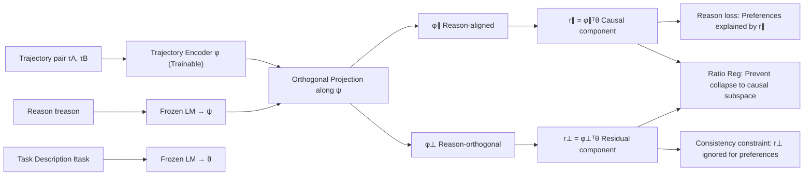

# Causally Robust Reward Learning from Reason-Augmented Preference Feedback

**Conference**: ICLR 2026  
**OpenReview**: [https://openreview.net/forum?id=wviOOX5JVn](https://openreview.net/forum?id=wviOOX5JVn)  
**Code**: [https://github.com/mj-hwang/ReCouPLe](https://github.com/mj-hwang/ReCouPLe)  
**Area**: reinforcement_learning  
**Keywords**: preference learning, reward modeling, causal confusion, natural language reasons, orthogonal projection, task transfer

## TL;DR
ReCouPLe treats a short natural language reason (e.g., "because it avoids a collision") as a projection axis in the embedding space. It decomposes trajectory representations into "reason-aligned" and "reason-orthogonal" components, ensuring preferences are explained only by the aligned component. This strips away spurious features and significantly outperforms binary preference baselines in distribution shifts and zero-shot task transfer.

## Background & Motivation
- **Background**: Preference-based Reinforcement Learning (PbRL), which uses binary comparisons of trajectories to replace manual reward shaping, has become a mainstream paradigm for RLHF and robotic reward modeling (Christiano 2017, Sadigh 2017, Bıyık 2019).
- **Limitations of Prior Work**: A single binary comparison carries at most 1 bit of information. Reward models can use any feature in the observation space that "co-occurs" with preferences to explain the labels. When disruptive features (e.g., color) are perfectly correlated with true causal features (e.g., size) in the training set, the model takes shortcuts by relying on color, leading to failure when colors change—a classic "Causal Goodhart" and reward misidentification.
- **Key Challenge**: Binary preferences are "easy to provide but under-expressive," while free-form language is "highly expressive but under-constrained." The former suffers from causal non-identifiability due to sparse information, while the latter is inherently ambiguous and requires additional modalities for anchoring.
- **Goal**: Without fine-tuning language models or collecting extra preferences, this work aims to inject the specific missing causal signal to make reward models robust to distribution shifts and capable of zero-shot transfer to semantically related new tasks.
- **Core Idea**: **[Reasons as Causal Directions]** A short reason explicitly identifies the feature the user prefers. By treating the language embedding of this reason as a projection axis, the model is forced to explain preferences only via components along this axis, pushing distractor features into the orthogonal residual where they cannot influence preference judgments.

## Method

### Overall Architecture
ReCouPLe generalizes single-task PbRL to a multi-task setting: the reward is modeled as the inner product of the trajectory representation $\phi(\tau)$ and a frozen task embedding $\theta=\mathrm{LM}(\ell_{task})$, formulated as $r(\tau,\ell_{task})=\phi(\tau)^\top\theta$, where only the trajectory encoder $\phi$ is trainable. Given a reason embedding $\psi=\mathrm{LM}(\ell_{reason})$, the framework decomposes $\phi(\tau)$ orthogonally along $\psi$ into a reason-aligned component and a reason-orthogonal component. Three losses ensure that "preferences are explained only by the aligned component, while the orthogonal component remains neutral but still carries task information."

### Key Designs

**1. Orthogonal Decomposition along Reason Axis: "Cutting" causal signals from trajectory representations.** This is the geometric core. A frozen language encoder maps the reason to vector $\psi$. The trajectory embedding is projected onto $\psi$ to obtain the parallel component $\phi_\parallel(\tau)=\frac{\phi(\tau)^\top\psi}{\|\psi\|_2^2}\psi$, while the remainder is the orthogonal component $\phi_\perp(\tau)=\phi(\tau)-\phi_\parallel(\tau)$, satisfying $\phi_\parallel^\top\phi_\perp=0$. Correspondingly, the reward is split into $r_\parallel=\phi_\parallel^\top\theta$ (causal part endorsed by the reason) and $r_\perp=\phi_\perp^\top\theta$ (residuals capturing task-relevant info like shaping rewards or priors not mentioned in the reason). Since reasons like "avoid collision" recur across tasks, the same $\psi$ direction is reused, forming the basis for task transfer.

**2. Reason loss: Forcing preferences to use "only" the causal component.** In the Bradley-Terry model, the preference probability is calculated using only $r_\parallel$, minimizing the BCE: $L_{reason}=-\mathbb{E}[y\log P_{r_\parallel}(\tau_A\succ\tau_B)+(1-y)\log(1-P_{r_\parallel}(\tau_A\succ\tau_B))]$. This restricts the "power to explain preferences" to the reason-aligned direction, explicitly preventing the model from utilizing co-occurring distractors like color.

**3. Orthogonal Consistency Constraint: Neutralizing the residual component.** Simply making $r_\parallel$ responsible isn't enough; $r_\perp$ must be prevented from carrying preference signals. **ReCouPLe-EC** (Equality Constraint) strictly requires residuals for each pair to be equal: $L_{eq}=(r_\perp(\tau_A)-r_\perp(\tau_B))^2$, suitable for scenarios where a few recurring reasons dominate. **ReCouPLe-IC** (Inequality Constraint) only requires the difference in aligned components to outweigh the difference in residuals—using $S(A\succ B)=\frac{\exp(\mathrm{diff}_{r_\parallel})}{\exp(\mathrm{diff}_{r_\parallel})+\exp(\mathrm{diff}_{r_\perp})}$ for soft competition, suitable for noisy scenarios where multiple reasons exist.

**4. Reward Ratio Regularization: Avoiding the "causal subspace collapse" shortcut.** Without constraints, the model might push all reward information into $r_\parallel$, rendering the orthogonal constraint useless. The ratio regularization $L_{ratio}=\mathrm{ReLU}\!\left(\frac{|r_\parallel|}{|r_\parallel|+|r_\perp|+\epsilon}-\alpha\right)$ keeps the causal component's magnitude below a threshold $\alpha$, ensuring the residual component consistently carries real task information. The final objective is $L_{ReCouPLe}=L_{reason}+\lambda_{ratio}L_{ratio}+\lambda_{eq}L_{eq}$ (EC) or $+\lambda_{ineq}L_{ineq}$ (IC).

## Key Experimental Results

### Main Results

ManiSkill Causal Confusion Suite (RQ1, Reward Accuracy, Mean of 3 seeds, OOD = Color Swap):

| Method | 2-task ID Pick/Place | 2-task OOD Pick/Place | 4-task OOD Pick/Push/Place/Pull |
|---|---|---|---|
| BT (Single-task) | 0.980/1.000 | 0.540/0.830 | 0.540/0.987/0.830/0.867 |
| BT-Multi | 0.953/1.000 | 0.600/0.820 | 0.707/1.000/0.840/0.907 |
| RFP (Reason-aux loss) | 0.940/1.000 | 0.620/0.800 | 0.700/0.980/0.807/0.913 |
| **ReCouPLe-EC** | 0.993/1.000 | **0.820/0.940** | **0.773**/1.000/**0.880**/0.860 |
| ReCouPLe-IC | 0.967/1.000 | 0.633/0.807 | 0.600/1.000/0.807/0.867 |

Meta-World Cross-Task Transfer (RQ2, Reward Accuracy, 3 seeds):

| Method | Push | Push-Wall | Pick-Place-Wall | New Task: Pick-Place |
|---|---|---|---|---|
| BT-Multi | 0.873 | 0.893 | 0.577 | 0.547 |
| RFP | 0.870 | 0.900 | 0.647 | 0.553 |
| ReCouPLe-EC | 0.863 | 0.843 | 0.650 | **0.663** |
| ReCouPLe-IC | 0.893 | 0.823 | 0.657 | 0.627 |

### Ablation Study

ManiSkill Mean Reward Accuracy (3 seeds):

| Variant | 2-task ID | 2-task OOD | 4-task ID | 4-task OOD |
|---|---|---|---|---|
| ReCouPLe (Full) | 0.995 | **0.872** | 1.000 | **0.878** |
| − Consistency | 0.980 | 0.726 | 0.977 | 0.745 |
| − Consistency − Ratio | 0.987 | 0.727 | 0.990 | 0.730 |

### Key Findings
- **OOD Performance**: All methods saturate on ID tasks, but binary baselines collapse after color swaps. ReCouPLe-EC achieves up to 1.5× the reward accuracy and 2× the downstream success rate of baselines on OOD/new tasks.
- **Constraint Selection**: EC (strong) is better for ManiSkill where a single causal feature dominates. IC (weak) performs better in Meta-World where reasons vary and trajectories contain different optimality noise.
- **Ablation Pillars**: Removing the consistency constraint drops OOD accuracy from 0.872 to 0.726. ID performance remains largely unaffected, proving these designs specifically target distribution shifts.
- **Compositional Transfer**: The "reason-aligned" subspaces act like additive semantic vectors (e.g., Pick-Place-Wall − (Push-Wall − Push) $\simeq$ Pick-Place), supporting zero-shot transfer.

## Highlights & Insights
- **Resolving Information Bottlenecks**: Uses "single-sentence reasons" to supplement the 1-bit preference bottleneck, treating language as a geometric projection axis rather than just an extra input.
- **Efficiency**: Frozen LMs + training only the trajectory encoder avoids the cost of fine-tuning large models and removes the need for predefined feature vectors, while inherently ensuring semantic consistency across tasks.
- **Practicality**: The EC/IC variants provide flexibility based on whether raw data contains dominant or diverse causal reasons.

## Limitations & Future Work
- **Reliance on Reason Quality**: Meta-World reasons were synthesized via ground-truth reward components. The noise and ambiguity of real-world human-provided reasons haven't been fully tested.
- **Linear Projection Limits**: While the encoder is non-linear, the reward follows a linear inner product structure. A single projection direction might not suffice for complex preferences involving multiple simultaneous causal features.
- **Scalability**: Tested on ManiSkill/Meta-World; extension to LLM-RLHF or long-horizon tasks remains to be explored.

## Related Work & Insights
- **PbRL & Causal Confusion**: Building on Tien (2023), this work directly addresses the tendency of reward models to capture spurious features. It complements active query strategies (Bıyık 2019) by changing the "feedback type" rather than the "query strategy."
- **Preference Feature Programming (PFP)**: Unlike Peng (2024) or Holk (2024) which require predefined feature vectors, this work uses free-text embeddings to remove engineering bottlenecks.
- **Insight**: Explicitly modeling "explanations" as projectable directions in the representation space and enforcing causal attribution via orthogonal decomposition could be transferred to LLM preference alignment, turning human critiques into geometric constraints.

## Rating
- Novelty: ⭐⭐⭐⭐ Formalizing reasons as projection axes for orthogonal reward decomposition is a clean and unique approach to causal confusion in PbRL.
- Experimental Thoroughness: ⭐⭐⭐⭐ Strong coverage of OOD robustness, transfer, and visual distractors, though reasons were synthesized.
- Writing Quality: ⭐⭐⭐⭐ Clear motivation, geometric illustrations, and derivation of loss functions.
- Value: ⭐⭐⭐⭐ Lightweight, LM-frozen, and interpretable; highly relevant for RLHF and robot reward modeling.

<!-- RELATED:START -->

- **Causal Confusion in RL from Preferences** (Tien et al., 2023)
- **Reward Learning from Narrated Demonstrations** (Cui et al., 2023)
- **PFP: Preference Feature Programming** (Peng et al., 2024)

<!-- RELATED:END -->

## Related Papers

- [\[ICLR 2026\] Learn to Reason Efficiently with Adaptive Length-based Reward Shaping](learn_to_reason_efficiently_with_adaptive_length-based_reward_shaping.md)
- [\[ICLR 2026\] Preference-based Policy Optimization from Sparse-reward Offline Dataset](preference-based_policy_optimization_from_sparse-reward_offline_dataset.md)
- [\[ICLR 2026\] TIPS: Turn-Level Information-Potential Reward Shaping for Search-Augmented LLMs](tips_turn-level_information-potential_reward_shaping_for_search-augmented_llms.md)
- [\[ICLR 2026\] ExGRPO: Learning to Reason from Experience](exgrpo_learning_to_reason_from_experience.md)
- [\[ICLR 2026\] Offline Preference-based Value Optimization](offline_preference-based_value_optimization.md)

<!-- RELATED:END -->
