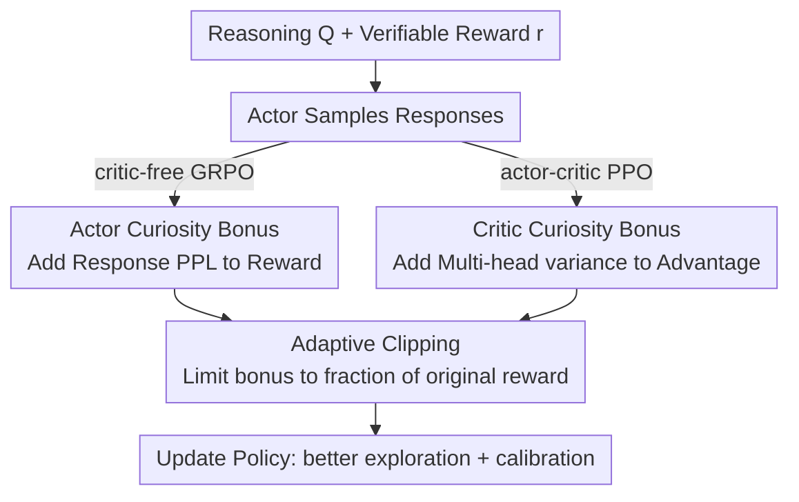

# CDE: Curiosity-Driven Exploration for Efficient Reinforcement Learning in Large Language Models

**Conference**: ICLR 2026  
**OpenReview**: [https://openreview.net/forum?id=5rXN5knHKW](https://openreview.net/forum?id=5rXN5knHKW)  
**Area**: Reinforcement Learning / LLM Reasoning  
**Keywords**: RLVR, Curiosity-driven exploration, Perplexity, Multi-head critic, Calibration

## TL;DR
To address the issues of insufficient exploration, premature convergence, and entropy collapse in RLVR (Reinforcement Learning from Verifiable Rewards) training for LLMs, CDE guides exploration using the model's own "curiosity." It utilizes the perplexity (PPL) of generated responses at the actor side and the variance of value estimates from a multi-head critic at the critic side as exploration rewards. Without training additional representation modules, CDE achieves stable improvements of approximately $+3$ points over standard GRPO/PPO on mathematical reasoning benchmarks such as AIME, while simultaneously fixing a training failure mode termed "calibration collapse."

## Background & Motivation

**Background**: RLVR is the current mainstream paradigm for enhancing LLM reasoning capabilities. It utilizes a rule-based verifier to judge the correctness of final answers and optimizes the policy directly with this verifiable reward signal. GRPO, DAPO, and PPO are representative algorithms.

**Limitations of Prior Work**: The training process of such methods is heavily biased toward "exploitation" rather than "exploration," frequently leading to **premature convergence** and **entropy collapse**—where the policy quickly collapses into a few high-reward paths and fails to explore better solutions. Furthermore, the resulting models exhibit **poor calibration**, showing equal confidence regardless of answer correctness.

**Key Challenge**: This is essentially the classic exploration-exploitation dilemma in reinforcement learning. While numerous exploration strategies exist in RL literature, they face challenges in LLMs: simple heuristics like $\epsilon$-greedy or entropy rewards merely inject randomness or encourage policy stochasticity, with questionable effectiveness in complex reasoning. More principled count-based (UCB, SimHash pseudo-counts) and prediction-based (ICM, RND) methods **rely on compressing reasoning trajectories into fixed-length embeddings**. However, "how to effectively represent a CoT reasoning path" remains an open problem. Empirical tests with SimHash show that most responses collapse into a very small number of hash grids, leading to highly concentrated count distributions and failed pseudo-counts.

**Goal**: Design an exploration mechanism that **does not rely on explicit counting, response embeddings**, or auxiliary modules, and can be directly integrated into the RLVR framework.

**Key Insight**: An LLM trained on massive reasoning corpora has already established an internal model of "what constitutes a familiar versus a novel reasoning pattern." Similar to how children learn-not by counting and summarizing external experiences, but by being driven by internal curiosity to explore new scenarios.

**Core Idea**: Utilize the model's own "curiosity signals" as exploration rewards—specifically, the actor's uncertainty about its generated content (PPL) and the critic's uncertainty about value estimation (multi-head variance). Both signals are shaped into the RLVR reward/advantage functions.

## Method

### Overall Architecture
The input to CDE is a reasoning problem with a ground truth answer, and the output is a policy updated via reinforcement learning that is more thoroughly explored and better calibrated. Its core involves adding a "curiosity bonus" to the standard RLVR reward/advantage. The bonus comes from two complementary sources: **actor curiosity** (response-level, where higher PPL indicates high surprise and higher exploration value) is added to the GRPO/PPO reward; **critic curiosity** (token-level, where larger standard deviation of multi-head critic estimates indicates sparse data coverage) is added to the PPO advantage. Both bonuses are constrained by an "adaptive clipping" formula to prevent the bonus from dominating and causing reward hacking. Theoretically, it is proven that the actor bonus punishes "confident errors," and the critic bonus is equivalent to classic pseudo-count bonuses under linear MDP assumptions.

### Key Designs

**1. Actor Curiosity: Using Response Perplexity as "Self-Surprise" Reward**

This addresses the fundamental question of where the exploration signal should originate. The actor's curiosity is defined as its uncertainty about its own actions—a response with low probability (highly "surprising") under the current policy likely falls into an under-explored region of the learned distribution. Specifically, the negative average log-probability (log-PPL) is used as a response-level bonus: $B_{\text{actor}}(q,o) = -\frac{1}{T}\sum_{t=1}^{T}\log\pi(o_t|o_{<t},q)$, where larger values indicate higher surprise and stronger exploration incentives. To maintain stability and prevent reward hacking (encouraging high-PPL but low-quality responses), **adaptive clipping** limits the bonus to a fraction of the original reward: $\hat{r}(q,o) = r(q,o) + \omega\min\big(\frac{|r(q,o)|}{\kappa},\,\alpha B_{\text{actor}}(q,o)\big)$. Three hyperparameters are used: $\omega$ is a dynamic weight with annealing (high exploration early, shifting to exploitation later); $\kappa$ is the clipping ratio, capping the bonus at $|r|/\kappa$ as a supplementary signal; and $\alpha$ is a scaling factor determining how easily the bonus reaches the clipping threshold.

**2. Calibration Effect of PPL Bonus: Punishing Confident Errors and Rewarding Novel Correctness**

This is a key byproduct of the actor bonus, addressing "calibration collapse." Responses are categorized by "Correctness $\times$ PPL level," with two critical categories: **low-PPL incorrect responses** signify the model is confident in a wrong answer (overfitting), which should be heavily penalized; **high-PPL correct responses** signify the model is unfamiliar with the answer but correct, which should be encouraged. The PPL bonus naturally achieves this: among correct responses, novel ones (higher PPL) receive larger positive rewards; among incorrect responses, confident ones (lower PPL) receive smaller bonuses and thus higher relative penalties. Theorem 3.1 formalizes this: for correct responses, higher PPL leads to a larger relative probability increase; for incorrect responses, lower PPL leads to a larger relative probability decrease. In contrast, traditional entropy rewards are sample-agnostic—entropy is calculated over the next-token distribution regardless of the sampled token, failing to penalize confident sampling of incorrect tokens. The PPL bonus incorporates information about the specific sample.

**3. Critic Curiosity: Approximating Pseudo-counts with Multi-head Critic Variance**

This addresses the limitation that actor PPL only captures "local surprise" and ignores "long-term value uncertainty." In the actor-critic framework, the critic (value function) provides a higher-level reward-to-go estimate for a prompt-response. Since estimates are learned from collected trajectories, the posterior distribution naturally reflects data coverage—concentrated (low variance) in dense regions and uncertain (high variance) in sparse regions. The authors approximate this posterior using **bootstrapping**: implementing a **multi-head critic** where $K$ value heads share an LLM backbone. Each head is trained on a sub-sampled subset of trajectories (sampling with replacement) to obtain an empirical approximation of the posterior. The standard deviation among the $K$ heads serves as the curiosity signal: $B_{\text{critic}}(q,o_{i,\le t+1}) = \text{std}\big(\{\hat{V}_j(q,o_{i,\le t+1})\,|\,1\le j\le K\}\big)$, pushing the policy toward under-explored regions with high disagreement. This bonus is added to the PPO advantage using the same clipping formula: $\hat{A}_{i,t} = \tilde{A}_{i,t} + \omega\min\big(\frac{|\tilde{A}_{i,t}|}{\kappa},\,\alpha B_{\text{critic}}\big)$, where $\tilde{A}_{i,t}$ is the advantage after replacing the single value function with the $K$-head mean. Theorem 3.2 proves that under linear MDP assumptions, the multi-head standard deviation is a consistent estimator of the classic pseudo-count bonus $\sqrt{\phi^\top\Lambda^{-1}\phi}$ used in LSVI-UCB/CFPO.

### Loss & Training
Multi-head PPO follows the standard three-stage process (actor sampling $\rightarrow$ actor update $\rightarrow$ critic update), with the multi-head variance injected into the advantage as an exploration bonus. During critic updates, each head $j$ is trained on a subset $D_j\subset D$ sampled with replacement. The subset size is controlled by $\zeta\in(0,1]$ ($|D_j|=\zeta|D|$); smaller $\zeta$ increases diversity between heads, while larger $\zeta$ improves sample efficiency. The bootstrap loss $L_\phi = \frac{1}{\zeta K|D|}\sum_{j=1}^{K}\sum_{(q,o,r)\in D_j}(\hat{V}_j(q,o)-r)^2$ is minimized. The annealing schedule for $\omega$ is critical; the authors compare No decay, Linear, Cosine, and Staircase schedules.

## Key Experimental Results

Experiments used the Verl framework with Qwen3-4B-Base and Llama-3.2-3B-Instruct, trained on DAPO-17K. Evaluations were conducted on MATH, AMC23, AIME24, and AIME25. Avg@1 is reported for MATH, while Avg@16 and Pass@16 are reported for others.

### Main Results

| Method (Qwen3-4B-Base) | AMC23 Avg@16 | AIME24 Avg@16 | AIME24 Pass@16 | AIME25 Avg@16 | Total Avg |
|--------|------|------|------|------|------|
| GRPO | 63.6 | 20.8 | 41.9 | 21.0 | 48.2 |
| GRPO + Entropy bonus | 64.3 | 21.8 | 39.4 | 21.2 | 48.5 |
| GRPO + i-MENTOR | 63.2 | 22.5 | 39.3 | 23.0 | 49.1 |
| **GRPO + PPL bonus** | **67.8** | **23.3** | **48.5** | **23.5** | **50.6** |
| PPO | 64.1 | 17.8 | 36.0 | 17.5 | 46.5 |
| **PPO + 4 Heads** | 63.9 | 21.5 | 35.5 | 21.5 | 48.5 |
| **PPO + 16 Heads** | 65.0 | 20.5 | 41.9 | 20.0 | 48.6 |

- GRPO with PPL bonus outperforms entropy bonus and the curiosity baseline i-MENTOR across the board, increasing total Avg from 48.2 to 50.6 (~$+2$ to $3$ points), with AIME24 Pass@16 jumping by ~$8$ points (41.9$\rightarrow$48.5).
- Multi-head PPO consistently outperforms vanilla PPO, with ~$2$ points total Avg gain for $K=4/16$ and ~$10$ points Pass@16 gain on AIME.
- Results are consistent on Llama-3.2-3B-Instruct: GRPO+PPL total Avg 32.3$\rightarrow$34.4, PPO+4 Heads 30.5$\rightarrow$34.2.

### Ablation Study

| Configuration | Phenomenon | Explanation |
|------|------|------|
| $K=2$ heads | Almost no gain | Too few heads; variance signal is unreliable |
| $K\ge 4$ heads | Performance plateaus after takeoff | A small number of heads captures most curiosity signals |
| $\omega$ No decay | Total Avg 48.2 (worst) | Strong continuous exploration prevents convergence |
| $\omega$ Staircase decay | Total Avg 50.6 (best) | Early strong exploration followed by a sharp drop allows coverage expansion then stable convergence |
| $\zeta=0.5$ vs $1.0$ | Similar results (48.6 vs 48.4, 16 heads) | Robust to sub-sampling ratio |

### Key Findings
- **Bonus weight decay is essential**: All decay schedules outperform no-decay, and "early strong exploration" is most critical. The Staircase schedule (high early exploration, sudden removal of bonus later) is optimal.
- **Benefits saturate after $K\ge 4$ heads**: This indicates that it does not require many heads to capture the primary curiosity signals, making computational overhead manageable.
- **Discovery of "calibration collapse" is highly original**: Standard GRPO shows lower PPL for correct responses early in training, but this gap closes as training progresses, decoupling confidence from correctness. The PPL bonus maintains this separation by suppressing "confident errors." Improved calibration further supports inference-time strategies like self-certainty BoN or DeepConf.
- **Training dynamics "lag then lead"**: CDE initially lags behind PPO/GRPO baselines in test accuracy but avoids premature exploitation of pseudo-high-reward paths. As state-action coverage expands, it eventually achieves a higher performance ceiling.

## Highlights & Insights
- **Shifting "exploration signals" from external counts to internal models**: Count-based/RND methods fail due to the collapse of fixed-length embedding representations for reasoning trajectories. CDE avoids this by using PPL and multi-head variance—intrinsic uncertainties that bypass the representation problem without auxiliary modules.
- **PPL bonus addresses exploration and calibration simultaneously**: A simple log-PPL term encourages novel correct solutions and punishes confident errors. Fixing calibration collapse is a significant byproduct supported by Theorem 3.1.
- **Elegant theoretical bridging**: Theorem 3.2 proves that multi-head variance is a consistent estimator of the classic pseudo-count bonus under linear MDPs, grounding the engineering intuition of "exploring via head disagreement" in UCB theory.
- **Transferability**: The adaptive clipping mechanism (limiting the bonus to a fraction of the original reward + annealed weight) is a versatile template applicable to any work adding intrinsic rewards to RLVR to avoid reward hacking.

## Limitations & Future Work
- Experiments are restricted to mathematical reasoning (MATH/AMC/AIME) and 3-4B scale models; generalization to code, agents, or larger models remains unverified.
- Improvements are stable (approx. $+2$ to $3$ points) but not revolutionary; multi-head critics introduce extra memory and runtime overhead (discussed in Appendix C).
- Critic curiosity is only applicable to PPO (which has a critic); critic-free methods like GRPO can only use the actor PPL bonus.
- The equivalence in Theorem 3.2 assumes a linear MDP, whereas real LLMs are non-linear; the theoretical guarantee is an approximation.

## Related Work & Insights
- **vs. Entropy bonus**: Entropy is sample-agnostic, calculated over the entire distribution. PPL bonus is sample-specific, allowing precise punishment of confident errors.
- **vs. count-based / RND / i-MENTOR**: These rely on trajectory embeddings, which tend to collapse. CDE leverages intrinsic curiosity to bypass this, consistently outperforming i-MENTOR in main results.
- **vs. standard GRPO/PPO**: By adding a clipped curiosity bonus to existing algorithms with minimal intrusion, CDE mitigates entropy collapse, premature convergence, and calibration collapse simultaneously.

## Rating
- Novelty: ⭐⭐⭐⭐⭐ Uses actor PPL + critic multi-head variance as intrinsic curiosity with theoretical pseudo-count equivalence; novel and self-consistent.
- Experimental Thoroughness: ⭐⭐⭐⭐ Two models, four benchmarks, and multi-dimensional ablations (schedules, heads, $\zeta$); however, confined to math reasoning and small models.
- Writing Quality: ⭐⭐⭐⭐⭐ Clear motivation, seamless integration of theory and intuition, and convincing narrative on calibration collapse.
- Value: ⭐⭐⭐⭐ Provides a plug-and-play solution for RLVR exploration that resists reward hacking and offers practical calibration benefits.

<!-- RELATED:START -->

## Related Papers

- [\[ICLR 2026\] Risk-Sensitive Reinforcement Learning for Alleviating Exploration Dilemmas in Large Language Models](risk-sensitive_reinforcement_learning_for_alleviating_exploration_dilemmas_in_la.md)
- [\[ICLR 2026\] Toward Efficient Exploration by Large Language Model Agents](toward_efficient_exploration_by_large_language_model_agents.md)
- [\[ICLR 2026\] On Predictability of Reinforcement Learning Dynamics for Large Language Models](on_predictability_of_reinforcement_learning_dynamics_for_large_language_models.md)
- [\[ICLR 2026\] Revolutionizing Reinforcement Learning Framework for Diffusion Large Language Models](revolutionizing_reinforcement_learning_framework_for_diffusion_large_language_mo.md)
- [\[ICLR 2026\] Using Reinforcement Learning to Train Large Language Models to Explain Human Decisions](using_reinforcement_learning_to_train_large_language_models_to_explain_human_dec.md)

<!-- RELATED:END -->
