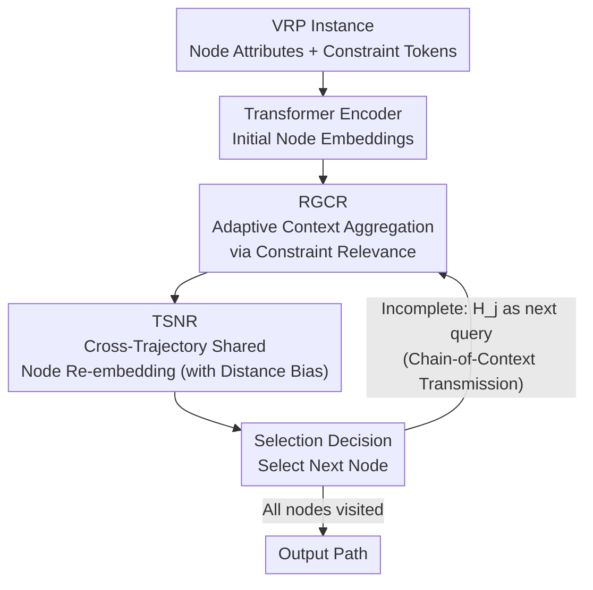

# Chain-of-Context Learning: Dynamic Constraint Understanding for Multi-Task VRPs

**Conference**: ICLR2026  
**arXiv**: [2603.01667](https://arxiv.org/abs/2603.01667)  
**Code**: To be confirmed  
**Area**: Reinforcement Learning  
**Keywords**: vehicle routing problem, multi-task learning, reinforcement-learning, constraint-aware decoding, neural combinatorial optimization

## TL;DR
Proposes Chain-of-Context Learning (CCL), which achieves step-by-step dynamic constraint-aware decoding through Relevance-Guided Context Reformulation (RGCR, adaptively aggregating constraint information to build context) and Trajectory-Shared Node Re-embedding (TSNR, updating nodes shared across trajectories to avoid redundant computation). It comprehensively outperforms existing methods on 48 VRP variants (16 in-distribution + 32 out-of-distribution).

## Background & Motivation

**Background**: The Vehicle Routing Problem (VRP) is a core task in logistics optimization. Neural solvers utilize RL + encoder-decoder architectures to generate paths autoregressively. While efficient, they are typically trained only for a single VRP variant. Multi-task VRP requires a unified framework to handle combinations of multiple constraints (capacity, backhauls, open routes, time windows, multi-depot, etc.).

**Limitations of Prior Work**: Existing multi-task VRP solvers (MTPOMO, MVMoE, CaDA, etc.) encode constraint and node information as **static embeddings**—node representations are not updated during the decoding process once encoding is finished. However, decoding is sequential; as the route progresses, the importance of different constraints changes (e.g., distance limits become more critical when returning to the depot), which static embeddings fail to reflect.

**Key Challenge**: Although the context (e.g., current time, remaining capacity) is updated at every step, the node embeddings remain static. This leads to **context-node misalignment**, inaccurate state estimation, and degraded decision quality. This violates the Markov property in MDPs, which states that "the state should contain sufficient information to make optimal decisions."

**Goal**: To allow both constraint information and node representations to update dynamically step-by-step during the decoding process of multi-task VRP, achieving precise state representation.

**Key Insight**: Explicitly integrate constraint information into the context construction of each step (RGCR), and then use the updated context to update node embeddings in turn (TSNR), forming a "Chain-of-Context"—where node embeddings at each step carry historical information.

**Core Idea**: Synchronously update context and node embeddings during the RL decoding of VRP, ensuring every decision is based on the current most accurate state rather than outdated static embeddings.

## Method

### Overall Architecture
The core problem CCL addresses is the distortion of state representation in multi-task VRP solvers during autoregressive decoding, where context changes at every step but node embeddings remain fixed after encoding. Its approach is to maintain "dynamics" throughout. It still follows the encoder-decoder paradigm: an encoder uses a Transformer to encode constraint tokens and node attributes into initial embeddings. Every decoding step involves three actions: first, aggregation of the current step's context by RGCR based on the relevance between constraints and the current node; second, updating node embeddings across trajectories using this context through TSNR; finally, making node selection decisions using the updated context and node embeddings. The updated node embeddings are then passed to the next step, forming a "Chain-of-Context." The model is jointly trained on a mixture of 16 VRP tasks (combinations of 4 constraints) and generalizes zero-shot to 32 additional variants during inference.

### Key Designs

**1. RGCR (Relevance-Guided Context Reformulation): Adaptive context aggregation based on constraint importance**

This addresses the pain point where "all constraints are treated equally in the context." In reality, capacity constraints should be prioritized when the vehicle is nearly full, while Time Window (TW) constraints are the bottleneck near closing times. Static-weighted contexts cannot capture these shifts. RGCR reconstructs the context in three steps: first, generating constraint embeddings $\mathbf{C}^k$ for each attribute via linear layers (e.g., remaining capacity/demand for B constraints, time windows/current time for TW constraints); second, calculating the dot-product relevance $s^k = \mathbf{H}_{\tau} \cdot \mathbf{C}^k$ between each constraint and the current node; finally, performing a weighted sum of these embeddings based on relevance and concatenating the original constraints. This automatically determines which constraints to attend to based on the "similarity" to the current node.

**2. TSNR (Trajectory-Shared Node Re-embedding): Efficiently updating shared node embeddings using multi-trajectory contexts**

To make node embeddings "dynamic," the most direct way is to update a separate set for each exploration trajectory, but this incurs massive computational overhead during parallel decoding. TSNR compromises by sharing a single set of node embeddings across all trajectories: it uses node embeddings as queries and concatenates node embeddings with contexts from all trajectories as keys/values. Multi-head attention then aggregates information from all trajectories to update node representations. A distance bias term $\mathbf{B}_j$ (distances between nodes and distances from the current positions of trajectories to nodes) is added to prevent the model from overfitting by over-relying on time window signals. This retains multi-trajectory information while compressing the update cost from "per-trajectory" back to "per shared set."

**3. Chain-of-Context Transmission: Allowing node embeddings to carry history across steps to capture sequential dependencies**

Previous methods used the initial (step-0) embeddings combined with the current context for decisions, losing information accumulated in intermediate steps. CCL uses the output $\mathbf{H}_j$ from TSNR at step $j$ directly as the input query for step $j+1$. Consequently, node embeddings at each step "remember" the previous decision context, linking the entire decoding sequence into a Chain-of-Context. The update frequency is controlled by probabilities $P_{tr}$ (training) and $P_{ts}$ (testing), allowing a trade-off between representation freshness and computation.

### Loss & Training
The REINFORCE algorithm is used with multi-trajectory parallel exploration (different starting points), using the negative total route length as the reward. Training involves a mixture of 16 VRP variants (combinations of B/L/O/TW constraints) sampled with equal probability. Inference generalizes zero-shot to 32 new variants including MB/MD constraints.

## Key Experimental Results

### Main Results (16 In-distribution tasks, N=50)

| Method | CVRP Gap | OVRP Gap | VRPTW Gap | OVRPTW Gap | Avg Gap |
|------|---------|---------|----------|-----------|---------|
| HGS-PyVRP | 0%* | 0%* | 0%* | 0%* | Baseline |
| MTPOMO | 1.42% | 3.19% | 2.42% | 1.56% | ~2.1% |
| CaDA | 1.29% | 2.59% | 1.75% | 1.12% | ~1.7% |
| CaDA† | 0.96% | 2.21% | 1.67% | 1.03% | ~1.5% |
| **CCL** | **0.98%** | **1.96%** | **0.98%** | **0.54%** | **~1.1%** |
| **CCL†** | **0.88%** | **1.57%** | **0.91%** | **0.51%** | **~1.0%** |

### Ablation Study

| Configuration | Avg Gap (N=50) | Description |
|------|---------------|------|
| CCL (Full) | 1.0% | All components included |
| w/o RGCR | ~1.5% | No adaptive constraint aggregation; performance drops |
| w/o TSNR | ~1.4% | No node embedding updates; degrades to static embedding |
| w/o Distance Bias | ~1.2% | No distance bias in attention |
| w/o Chain-of-Context | ~1.3% | Every step uses initial embeddings instead of previous step's |

### Key Findings
- **CCL is the best across all 16 in-distribution tasks**: The advantage is largest in tasks with time window constraints (VRPTW, OVRPTW), indicating that dynamic context is most valuable for time-sensitive constraints.
- **Leads in most of the 32 out-of-distribution tasks**: Zero-shot generalization to combinations of MB/MD constraints unseen during training proves the generalization capability of the dynamic constraint-aware mechanism.
- **RGCR and TSNR both make significant contributions**: Removing either module increases the gap by 0.3-0.5%, showing that dynamic context construction and node updates are both indispensable.
- **Reasonable computational overhead**: CCL inference takes about 5-7s (N=50). While slightly slower than CaDA (1-3s), it is significantly faster than HGS-PyVRP (10min+), and the quality gap (~1% gap) is much smaller than other neural methods.

## Highlights & Insights
- **Core Insight on Context-Node Alignment**: Defining the misalignment between "static node embeddings + dynamic context" as a defect in MDP state representation provides a general improvement for RL in combinatorial optimization—any scenario with autoregressive decoding and environment state changes can benefit from this dynamic update.
- **Efficiency via Trajectory-Shared Node Embeddings**: Using shared embeddings + attention aggregation in multi-trajectory parallel exploration avoids the $O(N)$ overhead of per-trajectory updates, representing a practical engineering optimization.
- **Distance Bias to Prevent Overfitting**: The discovery that models might over-rely on time window information without distance bias, and that a simple Euclidean distance bias can alleviate this, is a trick potentially useful for other constrained combinatorial problems.

## Limitations & Future Work
- **Tested only on the VRP family**: While VRP has many variants, combinatorial optimization extends beyond VRP. The applicability of CCL to other problems like TSP, JSP, or BPP remains unverified.
- **Limited number of training constraints**: Trained only on 4 constraint types (B/L/O/TW) combinations and generalized to 2 new ones. Larger-scale constraint spaces (e.g., dynamic demands, stochastic travel times) need verification.
- **~1% gap remaining vs. LKH/HGS**: Although 100x+ faster in inference, absolute quality is still behind traditional solvers. Scenarios requiring extreme precision might still need additional search enhancement.
- **TSNR update frequency requires tuning**: $P_{tr}$ and $P_{ts}$ are hyperparameters whose optimal values may vary based on problem scale and constraint types.

## Related Work & Insights
- **vs CaDA**: CaDA also handles multi-task VRP but uses static node embeddings. CCL consistently outperforms CaDA through dynamic updates, especially on complex constraints like time windows.
- **vs MTPOMO**: CCL inherits the multi-trajectory exploration from MTPOMO but adds constraint-aware context construction and cross-trajectory shared node updates.
- **vs Traditional Attention Model**: The original AM (Kool et al., 2019) uses static encoding. CCL's TSNR can be viewed as an enhancement to the AM decoder—ensuring node embeddings are no longer "encoded once and used forever."

## Rating
- Novelty: ⭐⭐⭐⭐ Context-node dynamic alignment is a clear and important contribution; RGCR+TSNR design is sound.
- Experimental Thoroughness: ⭐⭐⭐⭐⭐ 48 VRP variants (16 in-dist + 32 OOD), multiple scales, complete ablation.
- Writing Quality: ⭐⭐⭐⭐ Problem definition is clear, with a direct mapping between three challenges and three solutions.
- Value: ⭐⭐⭐⭐ Provides general inspiration for the decoding process in RL for combinatorial optimization.

<!-- RELATED:START -->

## Related Papers

- [\[CVPR 2026\] TaskForce: Cooperative Multi-agent Reinforcement Learning for Multi-task Optimization](../../CVPR2026/reinforcement_learning/taskforce_cooperative_multi-agent_reinforcement_learning_for_multi-task_optimiza.md)
- [\[ICLR 2026\] MergeMix: A Unified Augmentation Paradigm for Visual and Multi-Modal Understanding](mergemix_a_unified_augmentation_paradigm_for_visual_and_multi-modal_understandin.md)
- [\[ICLR 2026\] Efficient Offline Reinforcement Learning via Peer-Influenced Constraint](efficient_offline_reinforcement_learning_via_peer-influenced_constraint.md)
- [\[ICLR 2026\] Scalable In-Context Q-Learning](scalable_in-context_q-learning.md)
- [\[ICLR 2026\] Context and Diversity Matter: The Emergence of In-Context Learning in World Models](context_and_diversity_matter_the_emergence_of_in-context_learning_in_world_model.md)

<!-- RELATED:END -->
