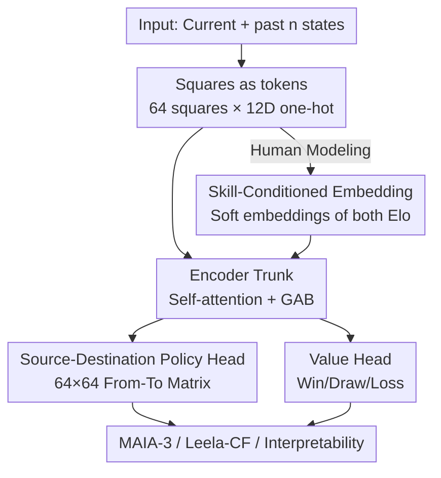

# Chessformer: A Unified Architecture for Chess Modeling

**Conference**: ICLR2026  
**OpenReview**: [https://openreview.net/forum?id=2ltBRzEHyd](https://openreview.net/forum?id=2ltBRzEHyd)  
**Code**: https://github.com/CSSLab/maia3  
**Area**: Reinforcement Learning / Game Modeling / Representation Learning  
**Keywords**: Chess, Transformer Architecture, Positional Encoding, Human Behavior Modeling, Mechanistic Interpretability

## TL;DR
By treating the 64 board squares as tokens and adding a "Geometric Attention Bias" (GAB) dynamically generated per position to the self-attention mechanism, Chessformer utilizes a unified architecture to simultaneously push "engine strength," "human move prediction," and "interpretability"—three long-separated objectives—to SOTA. The 79M-parameter MAIA-3 improves human move matching to 57.1% with less than a quarter of the size of its competitors, while the version integrated into Leela Chess Zero gained 100+ Elo and defeated Stockfish in multiple top-tier engine tournaments.

## Background & Motivation
**Background**: Chess is a classic testing ground for AI, but its three core tasks have long relied on entirely different architectures. For engine strength, researchers use alpha-beta search engines (Deep Blue, Stockfish), self-play policy-value networks + MCTS (AlphaZero, Leela Chess Zero), or distill strong oracles into Transformers. For human move simulation, methods evolved from MAIA's convolutional stacks to MAIA-2's skill-aware attention, and then to ALLIE, which models the move sequence as a language autoregressively. Interpretability research forms another branch, performing linear probing and circuit analysis on AlphaZero/Leela.

**Limitations of Prior Work**: These architectures are not only incompatible but often fail to align with the geometric structure of chess itself. A typical example is Ruoss et al. (2024): it tokenizes the 64 squares but applies 1D Rotary Positional Encoding (RoPE), forcing a linear order onto a 2D board. This results in maximum attention decay between two corners on the same main diagonal, despite their critical tactical relationship for long-range pieces like Bishops and Queens. Position is paramount in chess, yet existing encodings conflict with board geometry.

**Key Challenge**: "Positional relationships" in chess are not simple Euclidean distances; they change drastically with the game state. The movement relationship of a piece is only meaningful when it remains on the board; the connection between distant squares is naturally weaker in closed positions (fixed pawn chains). Static positional encodings (absolute bias, relative bias, RoPE) used in NLP/CV cannot natively represent this "state-deforming" geometry, forcing chess strength, human-likeness, and interpretability to use disjointed methods.

**Goal**: Can a **single architecture** simultaneously support engine strength, human modeling, and interpretability?

**Key Insight**: The authors bet on "aligning architecture with domain structure." By designing tokenization, positional encoding, and output heads according to the true geometry of chess, all three objectives can improve together rather than compromising each other.

**Core Idea**: Direct integration of domain geometry into an encoder-style Transformer using a "squares-as-tokens" representation + a dynamically generated Geometric Attention Bias (GAB) + a "Source-Destination" structured attention policy head. This allows a single model family to become stronger, more human-like, and more interpretable.

## Method

### Overall Architecture
Chessformer is an **encoder-only transformer**. The input is a sequence of board states (current + $n$ past states, default $n=7$), where each board's 64 squares are encoded into 12-dimensional one-hot vectors (indicating the piece type, flipped to the perspective of the player to move). Thus, one board state consists of 64 tokens, which are fed into the trunk after concatenating history along the feature dimension. Every self-attention layer in the trunk is augmented with **GAB (Geometric Attention Bias)**—a set of positional biases dynamically generated from the compressed board state and added to the dot-product logits. The 64 output tokens from the trunk connect to two heads: a **value head** (predicting Win/Draw/Loss via mean pooling) and a **Source-Destination policy head** (calculating a $64\times64$ "from-square to to-square" matrix via attention).

The same trunk is applied to three goals: ① Human move prediction (**MAIA-3**, adding soft embeddings of both players' skill levels to the tokens); ② Engine strength (**Leela-CF**, distilling supervised signals from Leela Chess Zero’s self-play oracle); ③ Interpretability (training transcoders on activations to perform square-level attribution via the "squares-as-tokens" design).

### Key Designs

**1. Squares as Tokens: Aligning Board Representation with 2D Geometry**

Addressing the mismatch between prior tokenization and board geometry, Chessformer adopts the most natural visual representation: treating the 64 squares as 64 tokens. Consequently, tokens possess fixed 2D positional relationships determined by the domain, which can be effectively captured by positional encodings. Each square is represented as a 12-dimensional vector (6 piece types × 2 colors), flipped to the mover's perspective. History is incorporated by concatenating the current and $n$ past positions along the depth dimension. This approach has the added benefit of allowing each token to "specialize" in its corresponding square, rather than forcing a single token to carry information for the entire board as in linearized representations.

**2. Geometric Attention Bias (GAB): State-Dependent Positional Encoding**

This is the core of the paper. Since self-attention is permutation-invariant, positional information must be injected via encoding; however, chess relationships vary with the board state, making static encodings (absolute/relative bias, RoPE) insufficient. GAB generates biases for each attention head dynamically from the **compressed board state**: tokens undergo a $d_1$-dimensional linear projection, followed by a $d_2$-dimensional projection + GELU + LayerNorm to obtain a compressed representation. This is further projected to $h\cdot d_3$ dimensions ($h$ being the number of heads), reshaped to $h\times d_3$, and finally passed through a **model-wide shared** linear projection to produce $h\times 4096$, reshaped to $h\times 64\times 64$. These are **added to the dot-product logits** before softmax.

**3. Source-Destination Attention Policy Head: Aligning Output with Action Space**

Chess moves naturally follow a binary "from-square to to-square" structure. Chessformer proposes a policy head based on self-attention: it takes the 64 tokens from the trunk, projects a set of query vectors for "origin squares" and key vectors for "target squares," and performs scaled dot-product to produce a $64\times64$ matrix. This matrix enumerates all possible "from-any-square to-any-square" moves (with special handling for pawn promotions). This from-to format fits the action space perfectly, eliminates the need for a massive 1968-class output layer without loss of performance, and significantly enhances interpretability by allowing each move logit to be attributed to specific origin and destination squares.

**4. Skill-Conditioned Soft Embeddings: Human Modeling on a Unified Architecture**

To simulate human moves (MAIA-3), "skill level" must be provided. The authors prepend two 128-dimensional soft embeddings to each board state, corresponding to the Elo of both players. Specifically, an embedding for rating $k$ is linearly interpolated from two learnable embeddings: a weak embedding $e_{weak}$ (offset 0) and an engine-strength embedding $e_{strong}$ (offset 5000), where $e_k = \gamma e_{weak} + (1-\gamma) e_{strong}$ with $\gamma = \frac{5000-k}{5000}$. Concatenating these into the input allows the same architecture to fork between human modeling and engine distillation depending on the supervision signal.

### Loss & Training
The two heads are trained jointly: the value head predicts three match outcomes (Win/Draw/Loss), and the policy head predicts moves (actual moves in human data, or move distributions from MCTS playouts in engine distillation). Human modeling utilizes Lichess blitz games (2023.01–2025.07), re-sampled for skill balance. Engine strength skips the expensive self-play generation and instead performs **supervised distillation** on a fixed dataset of self-play games from Leela (2024.04 RL). The authors found that the quality of the oracle is far more critical than the architecture that produced it.

## Key Experimental Results

### Main Results
Human move prediction (ALLIE test set, 884,049 positions, move matching accuracy): MAIA-3 achieves new SOTA with significantly fewer parameters.

| Model | Accuracy (%) | Params | History | Search |
|-------|--------------|--------|---------|--------|
| **MAIA-3-79M** | **57.1** | 79M | ✓ | ✗ |
| MAIA-3-23M | 56.6 | 23M | ✓ | ✗ |
| MAIA-3-5M | 55.4 | 5M | ✓ | ✗ |
| ALLIE-Adaptive-Search | 55.9 | 355M | ✓ | ✓ |
| ALLIE-Policy | 55.7 | 355M | ✓ | ✗ |
| MAIA-2 | 52.0 | 23M | ✗ | ✗ |
| GPT-3.5 | 53.7 | 175B | ✓ | ✗ |

Engine strength (No-search setting, relative Elo + 10,000 endgame puzzles):

| Agent | Elo | Puzzles (%) | FLOPs |
|-------|-----|-------------|-------|
| Leela-CF-policy (Ours) | 2374 ± 37 | 93.5 | 7.6B |
| **Leela-CF-value (Ours)** | **2466 ± 36** | **97.2** | 152B |
| AC-9M | 2044 | 86.2 | 14.2B |
| AC-136M | 2257 | 92.7 | 215B |
| AC-270M | 2299 | 94.2 | 427B |
| Leela-CNN-value | 2168 | 92.5 | 249B |

Leela-CF-value is the overall strongest. When integrated into the full Leela engine, Chessformer configurations brought a **100+ Elo** gain and **defeated Stockfish** to win titles in major tournaments like TCEC Cup 11.

### Ablation Study

| Configuration | Change vs. absolute | Description |
|---------------|---------------------|-------------|
| GAB (Full) | Strongest baseline | Dynamic geometric bias |
| relative bias | Intermediate | Monotonically worse than GAB |
| absolute bias | Weakest | Static absolute bias |

GAB allows the architecture to transition from a "specialist" to a "generalist." Analysis of attention structures (Table 3) shows GAB and dot-product attention are complementary:

| Avg Correlation | GAB | dot-product |
|-----------------|-----|-------------|
| Between positions | 0.770 | 0.230 |
| Within position across queries | 0.005 | 0.816 |

### Key Findings
- **GAB is the key driver of universal capability**: Replacing it with static encodings causes consistent declines across strength, puzzles, and policy/value accuracy.
- **Geometry vs. Semantics**: GAB is stable across positions (0.770) but varies wildly for different query squares within the same position (0.005), indicating it encodes square-anchored geometry. Dot-product is the opposite, encoding global semantics.
- **History Length $n$**: Performance improves significantly from $n=0$ to $n=7$, while gains from $n=7$ to $n=31$ are negligible.
- **Puzzle accuracy is saturating**: Leela-CF-value reached 97.2%, suggesting a need for harder benchmarks.

## Highlights & Insights
- **Architecture alignment with domain geometry simplifies multi-tasking**: Aligning tokenization, positional encoding, and output heads with chess structure allows strength, human-likeness, and interpretability to improve simultaneously, contradicting the assumption that human compatibility must sacrifice performance.
- **GAB upgrades positional encoding from "table lookup" to "dynamic template mixing"**: The $h\times64\times64$ bias scales with the board state while maintaining an additive structure to leverage FlashAttention, a concept applicable to any domain where positional relationships are state-dependent.
- **Source-Destination head provides "free" interpretability**: Using a $64\times64$ from-to matrix instead of a 1968-class output layer preserves performance while enabling transcoder-based feature attribution to specific squares involved in tactics like forks or pins.

## Limitations & Future Work
- **Domain specificity**: GAB is currently designed for chess; its benefits likely depend on domains where geometric relationships are central.
- **Preliminary Interpretability**: The results primarily show the division of labor between GAB and dot-product; deeper mechanistic analysis on how they support planning or evaluation is needed.
- **Distillation limits**: Engine strength relies on supervised distillation from a fixed Leela oracle rather than end-to-end RL, capping its ceiling by the quality of the static dataset.

## Related Work & Insights
- **vs. ALLIE**: ALLIE models chess moves as language using a 355M-parameter decoder-only Transformer. Chessformer (79M) outperforms it without search, proving that aligning with board geometry is more efficient than forcing chess into a linguistic paradigm.
- **vs. Ruoss et al. (2024)**: While both use square-based tokens, the earlier work applied 1D RoPE to a linearized board, compressing 2D geometry incorrectly. Chessformer’s GAB preserves 2D structure, resulting in an $+83$ Elo gain.
- **vs. AlphaZero / Leela**: Instead of repeating expensive self-play, Chessformer distills existing strong oracles, showing a paradigm for extracting more performance from the same oracle signal through better architecture.

## Rating
- Novelty: ⭐⭐⭐⭐⭐ GAB's dynamic mixing of positional templates and the unified multi-task success is highly innovative.
- Experimental Thoroughness: ⭐⭐⭐⭐⭐ Comprehensive coverage across human prediction, engine strength (TCEC titles), interpretability and ablations.
- Writing Quality: ⭐⭐⭐⭐⭐ The narrative of "aligning with domain geometry" is consistent and clear.
- Value: ⭐⭐⭐⭐⭐ Provides a reusable recipe for designing domain-aligned architectures in structured decision-making.

<!-- RELATED:START -->

## Related Papers

- [\[ICLR 2026\] RM-R1: Reward Modeling as Reasoning](rm-r1_reward_modeling_as_reasoning.md)
- [\[ICLR 2026\] RESCHED: Rethinking Flexible Job Shop Scheduling from a Transformer-based Architecture with Simplified States](resched_rethinking_flexible_job_shop_scheduling_from_a_transformer-based_archite.md)
- [\[ICLR 2026\] The Markovian Thinker: Architecture-Agnostic Linear Scaling of Reasoning](the_markovian_thinker_architecture-agnostic_linear_scaling_of_reasoning.md)
- [\[ICLR 2026\] MergeMix: A Unified Augmentation Paradigm for Visual and Multi-Modal Understanding](mergemix_a_unified_augmentation_paradigm_for_visual_and_multi-modal_understandin.md)
- [\[ICML 2026\] How Reasoning Evolves from Post-Training Data: An Empirical Study Using Chess](../../ICML2026/reinforcement_learning/how_reasoning_evolves_from_post-training_data_an_empirical_study_using_chess.md)

<!-- RELATED:END -->
