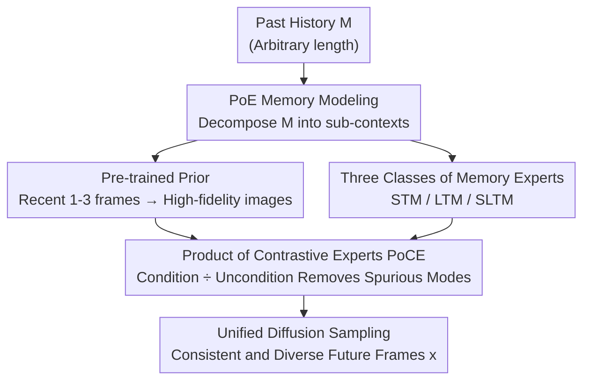

# Composition of Memory Experts for Diffusion World Models

**Conference**: ICLR2026  
**OpenReview**: [https://openreview.net/forum?id=sUEdpZCHdp](https://openreview.net/forum?id=sUEdpZCHdp)  
**Code**: TBD  
**Area**: Reinforcement Learning / World Models  
**Keywords**: World Models, Diffusion Models, Memory Mechanism, Product of Experts, Test-time Fine-tuning

## TL;DR
Addressing the structural contradiction where "longer context improves world model accuracy but explodes computational cost," this paper shifts the memory burden from a single backbone to three independent diffusion experts (short-term, long-term, and spatial long-term). These are fused during sampling via a "Product of Contrastive Experts" (PoCE), maintaining temporal and spatial consistency over 500+ frames at a cost significantly lower than scaling attention.

## Background & Motivation
**Background**: World Models learn the distribution of environmental observations to implicitly encode environmental rules and dynamics, enabling agents to "imagine" the future and evaluate candidate trajectories before acting—a core capability for planning and decision-making in reinforcement learning. Recently, diffusion-based world models have made significant progress in generating high-quality future frames, particularly for navigation and interaction tasks requiring long-term prediction.

**Limitations of Prior Work**: Imagined rollouts are only useful when they remain consistent with past observations—a previously visited room should not have its furnishings changed when revisited. Maintaining this cross-temporal consistency is extremely difficult. The issue stems from structural trade-offs at the architectural level: Transformers produce high-fidelity rollouts but are limited by quadratic attention and training instability for long contexts; RNNs and State Space Models (SSMs) scale elegantly with context length but compress history into fixed-size latent states, leading to the loss of details over time.

**Key Challenge**: Each architecture wins in one regime and loses in another—there is no "silver bullet." Simply increasing context length is unsustainable as training becomes unstable and expensive, and inference costs quickly exceed practical budgets. The fundamental contradiction lies in **forcing a single architecture to handle memory requirements across all time scales**.

**Goal**: Ours aims to decouple "future-past consistency" from any single architecture, assigning different memory roles to a group of specialized experts and merging them without retraining.

**Key Insight**: The authors draw inspiration from human cognition, where fast but capacity-limited Short-Term Memory (STM) and slow but persistent Long-Term Memory (LTM) differ in mechanism and purpose. This division of labor allows for efficient coordination. Furthermore, diffusion models offer a natural advantage: they allow heterogeneous experts to be combined during inference according to the "Product of Experts" (PoE) principle without retraining.

**Core Idea**: Replace "single backbone with stacked context" with "Composition of Experts + Product of Contrastive Experts" to solve the memory consistency problem in world models. An additional channel is introduced to **store long-term memory directly into external diffusion expert weights** (via lightweight test-time fine-tuning), making history reuse a constant-time operation.

## Method

### Overall Architecture
The method is named **CoME (Composition of Memory Experts)**. It addresses the following: given an arbitrarily long history $M$, model the conditional distribution $p(x\mid M)$ such that generated future video segments $x \in \mathbb{R}^{T\times 3\times H\times W}$ ($T$ is fixed by design) are both faithful to recent frames and consistent with history from hundreds of frames ago. The history $M$ is decomposed into several (potentially overlapping) subsets $\{c_i\}$, each assigned to a **diffusion expert specialized for a specific memory role**. These experts are then fused into a unified generative distribution using PoE during sampling.

Specifically, the system involves four collaborating diffusion models: a **Pre-trained Prior** for high-fidelity immediate frames (image-to-video, conditioned on 1–3 recent frames $c$), a **Short-Term Memory (STM) expert** (conditioned on a sliding window $c_{ST}$ of 10–100 frames), a **Long-Term Memory (LTM) expert** (storing 100–1000 frames of history $c_{LT}$ into weights $\psi$ via test-time fine-tuning), and a **Spatial Long-Term Memory (SLTM) expert** (conditioned on spatial signals $S$ like camera poses or point clouds extracted from history). Rather than direct multiplication, each expert is transformed into a "Contrastive Expert"—combining its conditional version with an unconditional version to remove redundant or spurious modes—before the final product. The resulting unified distribution $p_{\text{CoME}}(x\mid c, c_{ST}, c_{LT}, S)$ is sampled to produce future frames that are both consistent and diverse.

### Key Designs

**1. PoE Memory Modeling: Formulating Memory as Probabilistic Fusion**

To address the failure of single architectures to handle all time scales, this paper reformulates memory modeling as a **Product of Experts (PoE)** problem. Assuming history $M$ can be decomposed into subsets $\{c_i\}_{i=1}^K$ such that their union is $M$, and each diffusion expert $p_i(x)$ is trained to predict future frames conditioned on $c_i$, the target distribution is:
$$p(x\mid M) = p(x\mid c_1,\dots,c_K) \propto \prod_{i=1}^{K} p_i(x).$$
The geometric implication of PoE is that the product amplifies regions where all experts agree on high likelihood and suppresses others, acting as content-addressable retrieval. Diffusion models are ideal here because they support **composition at inference time** (combining the predicted scores $\nabla_{x_t}\log p$ of each model) without retraining.

**2. Product of Contrastive Experts (PoCE): Removing Spurious Modes**

Naive PoE suffers from a fatal flaw: when multiple experts share modes that are "inconsistent with the past," the product **over-sharpens** these common regions, collapsing consistency and reducing diversity. Ours introduces **Product of Contrastive Experts**: instead of using $p_i(x)$ directly, each conditional expert $p_i(x)$ is combined with its unconditional baseline $\overline{p_i}(x)$:
$$\tilde p_i(x) \propto p_i(x)^{\alpha_i}\,\overline{p_i}(x)^{\,1-\alpha_i},\qquad \alpha_i>1.$$
A key theoretical distinction made is that while "annealing" $p_i(x)^\alpha$ reduces variance and narrows kernels in Gaussian cases, contrastive composition (as shown in Proposition 1) only modifies the mixture weights while **keeping the kernels themselves unchanged**. This suppresses spurious modes without damaging the local geometry, provided the conditional expert has higher magnitude on valid modes than the baseline.

**3. Three Heterogeneous Memory Experts**

Three complementary experts are instantiated alongside the pre-trained prior:

- **STM (Short-Term Memory)**: A diffusion model attending to a recent sliding window $c_{ST}$ (10–100 frames), capturing local dynamics. Its baseline is the unconditional $p_\phi(x\mid\varnothing)$.
- **LTM (Long-Term Memory)**: The most innovative design in this paper. Instead of lengthening the context, LTM "writes" long-term history $c_{LT}$ (100–1000 frames) **directly into the diffusion model weights** $\psi$ via test-time fine-tuning. This turns history reuse into a one-time "memorization" update with subsequent constant-time overhead. By fine-tuning only a set of **LoRA adapters**, ours provides implicit regularization to avoid overfitting to history while preserving pre-trained generalization.
- **SLTM (Spatial Long-Term Memory)**: While LTM acts as associative memory, it can fail in visually ambiguous environments (e.g., loops). SLTM extends context $M$ with auxiliary spatial signals $S=\text{Enc}_\lambda(M)$ (poses, point clouds) to define a spatial prior $p_\lambda(x\mid S)$, disambiguating drift through "where things were seen."

The final distribution is the product of all four after contrastive transformation:
$$p_{\text{CoME}} \propto \big[\overline{p_\theta}^{1-\alpha_0}p_\theta^{\alpha_0}\big]\big[\overline{p_\phi}^{1-\alpha_1}p_\phi^{\alpha_1}\big]\big[\overline{p_\psi}^{1-\alpha_2}p_{\psi(c_{LT})}^{\alpha_2}\big]\big[\overline{p_\lambda}^{1-\alpha_3}p_\lambda^{\alpha_3}\big].$$

### Mechanism
In a streaming evaluation on Memory Maze, the model performs 25 gradient updates on the **most recent 50 frames** to memorize that history into weights, then predicts subsequent frames. With only STM, consistency improves incrementally; with LTM added, the effect is **compounding**—as new observations are "written" into weights, consistency continues to rise. In recall tests on RE10K, CoME accurately "retrieves" original frames when traversing back through previously visited states, whereas memoryless baselines generate contradictory frames.

### Loss & Training
Experts are trained with the standard DDPM objective. LTM/SLTM "memorization" is performed via test-time fine-tuning using the same diffusion loss on LoRA adapters (typically 2–3 gradient steps per frame). Fusion occurs during sampling via score combination, requiring no joint retraining.

## Key Experimental Results

### Main Results
Reconstruction quality on Memory Maze (30k trajectories, 1k frames each):

| Configuration | LPIPS ↓ | SSIM ↑ | PSNR ↑ |
|------|---------|--------|--------|
| Base (Pre-trained Prior) | 0.209 | 0.771 | 19.16 |
| + STM | 0.156 | 0.820 | 21.29 |
| + LTM | 0.171 | 0.805 | 19.98 |
| + SLTM | 0.150 | 0.833 | 20.65 |
| + STM+LTM | 0.114 | 0.862 | 22.32 |
| **CoME (All)** | **0.097** | **0.892** | **23.07** |
| Sliding (Attention baseline) | 0.183 | 0.753 | 19.02 |
| SSM (Mamba-style) | 0.158 | 0.828 | 20.62 |
| Full (Full attention baseline)| 0.113 | 0.859 | 22.78 |

Ours outperforms all dedicated architecture baselines, including full attention. Notably, full attention requires ~60× the compute of STM for training and is often unstable. For navigation planning (RECON benchmark):

| Method | ATE ↓ | RPE ↓ |
|------|-------|-------|
| GNM | 1.87 | 0.73 |
| NOMAD | 1.93 | 0.52 |
| NWM | 1.13 | 0.35 |
| **CoME** | **0.96** | **0.28** |

### Ablation Study
Impact of contrastive experts on LPIPS (Memory Maze):

| Configuration | w/o Contrastive | w/ Contrastive |
|------|---------|---------|
| Base | 0.203 | 0.200 |
| STM | 0.175 | 0.156 |
| LTM | 0.188 | 0.171 |
| SLTM | 0.178 | 0.150 |
| STM+LTM | 0.170 | 0.114 |
| All | 0.192 | **0.097** |

### Key Findings
- **Contrastive composition is critical**: Without contrastive terms, stacking experts (All: 0.192) barely improves over Base (0.200). Contrastive terms allow experts to provide stable, additive gains.
- **LoRA as Implicit Regularization**: Increasing LoRA rank improves performance, while full fine-tuning overfits on short contexts. LoRA balances adaptation and the preservation of universal priors.
- **Non-saturation of Context**: LPIPS continues to decrease as LTM context grows from 50 to 500 frames, confirming the scalability of weight-based long-term memory.
- **Cost**: Online LoRA (rank 64) memorization incurs ~4× sampling overhead, which reduces to ~2× at rank 16.

## Highlights & Insights
- **Memory into weights, not context**: LTM uses test-time LoRA fine-tuning to shift history from linear/quadratic attention overhead to constant-time reuse via weights—a clever way to bypass the attention "wall."
- **Theoretical validity of PoCE**: The "condition ÷ uncondition" contrastive approach (akin to classifier-free guidance) is proven to modify mixture weights without narrowing kernel shapes, explaining why it eliminates spurious modes without losing diversity.
- **Memory-as-Experts Paradigm**: Decoupling memory into plug-and-play diffusion experts allows for the training-free combination of different pre-trained models, providing a modular and scalable template for world model memory.

## Limitations & Future Work
- **Temporal Dependency**: LTM currently stores "what" exists but doesn't explicitly model temporal dependencies between distant frames.
- **Inference Overhead**: Multiple gradient updates + parallel experts result in a 2–4× sampling time increase, which remains a burden for real-time RL.
- **Hyperparameter Sensitivity**: The contrastive coefficients $\alpha_i$ require manual tuning; there is no adaptive selection scheme yet.
- **Dependency on External Modules**: SLTM relies on SLAM/SfM for spatial labels, making it dependent on the quality of these external estimators.

## Related Work & Insights
- **vs SlowFast (Hong et al. 2025)**: While SlowFast uses LoRA for fast adaptation in a meta-learning framework, CoME performs test-time fine-tuning and sampling-stage composition without joint retraining.
- **vs Explicit Retrieval (Xiao et al. 2025)**: Unlike methods that explicitly retrieve and inject past frames into the context window (leading to storage and retrieval growth), CoME compresses long-term information into weights.
- **vs SSM World Models**: SSMs compress history with loss of fidelity; CoME (0.097 LPIPS) significantly outperforms SSM baselines (0.158), proving that distributed experts exceed single-backbone compression.

## Rating
- Novelty: ⭐⭐⭐⭐⭐ Weight-based LTM + PoCE provides a new paradigm for memory.
- Experimental Thoroughness: ⭐⭐⭐⭐ Strong validation across synthetic and real datasets; however, lacks comparisons with some recent memory-based world models.
- Writing Quality: ⭐⭐⭐⭐ Clear motivation and solid theoretical reasoning.
- Value: ⭐⭐⭐⭐⭐ Provides a scalable, modular solution for long-term consistency in world models, directly benefiting RL planning.

<!-- RELATED:START -->

## Related Papers

- [\[ICML 2026\] Flow-Equivariant World Models: Memory for Partially Observed Dynamic Environments](../../ICML2026/reinforcement_learning/flow_equivariant_world_models_memory_for_partially_observed_dynamic_environments.md)
- [\[ICLR 2026\] Recurrent Action Transformer with Memory](recurrent_action_transformer_with_memory.md)
- [\[ICLR 2026\] Learning Massively Multitask World Models for Continuous Control](learning_massively_multitask_world_models_for_continuous_control.md)
- [\[ICLR 2026\] BranchGRPO: Stable and Efficient GRPO with Structured Branching in Diffusion Models](branchgrpo_stable_and_efficient_grpo_with_structured_branching_in_diffusion_mode.md)
- [\[ICLR 2026\] From Observations to Events: Event-Aware World Models for Reinforcement Learning](from_observations_to_events_event-aware_world_models_for_reinforcement_learning.md)

<!-- RELATED:END -->
